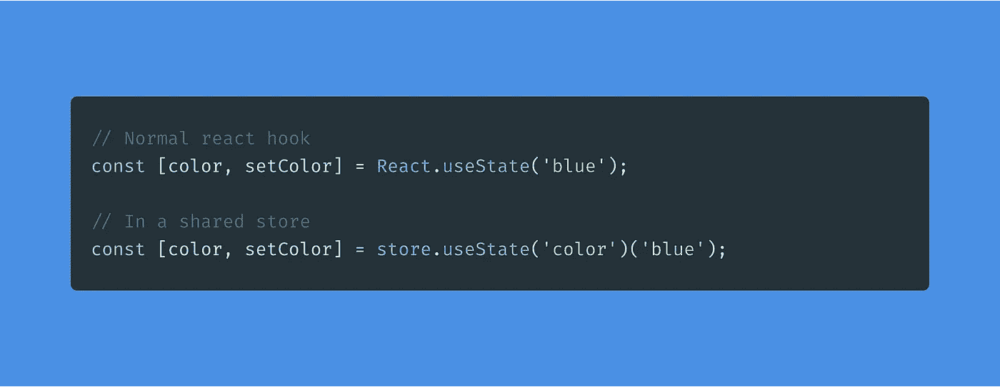

# 介绍 StateLake:您会喜欢以这种方式管理状态

> 原文：<https://betterprogramming.pub/introducing-statelake-youll-love-managing-states-this-way-bdeb93d82f94>

## 一个很小的 React 库，用于 hooks 风格的状态管理和共享存储



传统挂钩与连接到共享存储的挂钩

钩子很棒，对吧？本文旨在介绍一个新的库，它使您能够管理小型和大型项目中的状态，使用的语法类似于普通的 React 挂钩，但它与共享存储进行交互。

## TL；速度三角形定位法(dead reckoning)

这个图书馆叫做[国家湖](https://www.npmjs.com/package/statelake)。它可以让你将普通挂钩连接到大型商店的特定部分。用`npm install statelake`安装。然后，写下这样的内容:

```
// Create a new store
const store = new StateLake({myState: ""});// Connect to store (inside a React component)
const [state, setState] = store.useState("myState")("Hello!");/**
 * Now use "state" and "setState" like you normally would :)
 * Whenever you use setState in one component, all other components
 * with the same hook will also get updated immediately :)
 */
```

(我建议您也看一下本文中的代码！)

这里是 [npm](https://www.npmjs.com/package/statelake) ，这里是 [GitHub](https://github.com/mariusbrataas/StateLake) 。

## 仅供参考

我假设你以前接触过国家管理的问题。如果您还没有，这里有一个指针:一个*状态*是一个信息容器，用于在屏幕上呈现内容。当状态变大时(即包含大量数据或不同的字段)，或者当多个地方需要相同的信息时，管理这些数据的问题就变得很明显。

# 为什么使用这个库？

很高兴你问了！有许多状态管理库可以解决与这个库相同的问题。区别在于你使用这些库的方式。

我爱 Redux。很长一段时间以来，我一直在大量使用它，它为我提供了很好的服务。然而，我发现维护减速器、行动和与商店的联系比生产更乏味。如果你正在使用 TypeScript(像我一样)，你也必须手工完成大部分的打字工作。

有了 StateLake，你只需要用一个接口(描述对象形状的 TypeScript 东西)初始化你的存储，你将在每一个端点拥有相同的类型，不管你是初始化存储，设置状态，还是从 React 组件订阅它。在这个过程中，您还将获得 IntelliSense 的帮助。

简而言之:您将创建一个共享存储，它类似于其他类似的库，但是它对开发人员来说几乎没有任何开销，并且执行速度几乎和钩子一样快。

# (乐趣从这里开始):如何使用这个库

## 关于 TypeScript 的快速注释

Typescript 非常棒，如果您还没有使用它，我强烈建议您尝试一下。与 TypeScript 相比，许多开发人员更喜欢 JavaScript，因为 JavaScript 通常需要更少的代码来编写，但根据我的经验，在使用 TypeScript 进行开发和调试时，您会节省更多的时间，因为当您添加强类型时，IntelliSense (autosuggest)会变得过于强大。

## 现在，到代码！

对于那些还不会说 TypeScript 的人来说:*接口*描述了一个对象的形状。`Person`描述一个对象，属性为`firstName`和`lastName`；而`Person[]`意味着我们想要一系列类似`Person`的物体。

就是这样！商店可以在任何地方使用，多个挂钩可以连接到同一个位置。

[这里有一个小例子的沙盒。我鼓励你尝试一下`useState`功能。这些将只允许与我们的存储中的路径相对应的值，并将自动建议这样的值。](https://codesandbox.io/s/simple-statelake-example-s5qb5)

如果你想要更多，我建议你看看[这个更广泛的演示](https://0ptc5.csb.app/)或者[它附带的 CodeSandbox](https://codesandbox.io/s/statelake-example-0ptc5?file=/src/App.tsx) 。