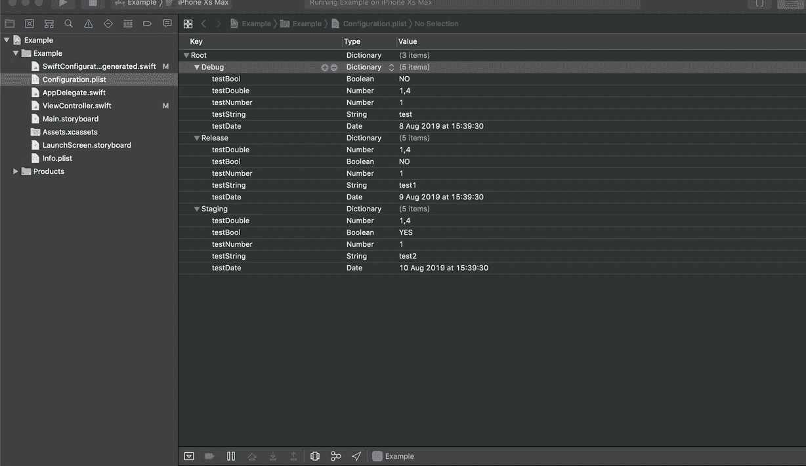
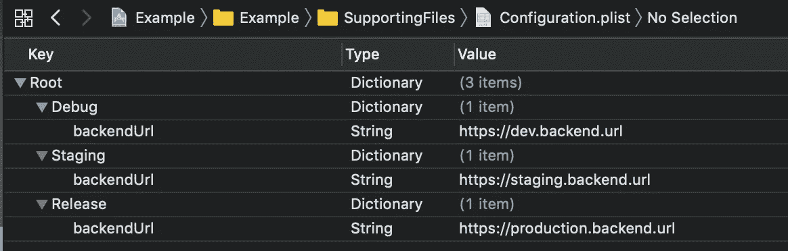
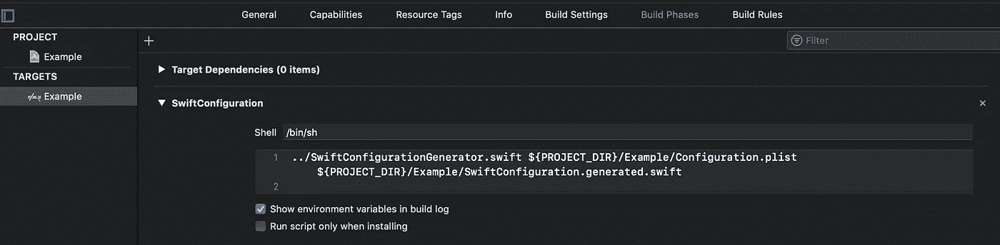

# SwiftConfiguration 简介

> 原文：<https://betterprogramming.pub/introducing-swiftconfiguration-c3cba2002965>

## iOS 项目中配置文件的编译时验证和包装类生成

由[格伦·卡斯滕斯-彼得斯](https://unsplash.com/@glenncarstenspeters?utm_source=unsplash&utm_medium=referral&utm_content=creditCopyText)在 [Unsplash](https://unsplash.com/?utm_source=unsplash&utm_medium=referral&utm_content=creditCopyText) 上拍摄的照片

# TL；速度三角形定位法(dead reckoning)

我创建了一个开源工具，可以帮助你管理 iOS 项目中的多种配置。该工具部分自动化了设置配置的过程，并在配置文件上生成一个安全的 Swift 包装类。[查看 GitHub repo](https://github.com/pgorzelany/SwiftConfiguration#swiftconfiguration) 。

快速配置包装类生成

# 问题是

在我的[上一篇文章中，](https://medium.com/@piotr.gorzelany/managing-configuration-dependent-variables-in-ios-projects-b68bfb0f9689)我描述了一种在 iOS 项目中处理配置变量的方法。对我来说，这是在应用程序中设置和使用配置变量的最直接的方式之一。只是总结一下我的想法，解释一下作为一个 TL 的过程；DR，下面是在 Xcode 中设置多个配置的步骤:

*   为每个环境添加项目级配置
*   修改`Info.plist`文件以包含一个在运行时将解析为活动配置名称的字段
*   使用`Info.plist file`中的活动配置在运行时从配置文件中读取属性

这个设置很有效，我自己在几个项目中也使用过。但是随着时间的推移(并且引入了 bug)，我开始看到这种方法的缺点。由于该解决方案依赖于通过字符串 API 读取配置文件，因此在获取变量时会引入一整类错误:

*   如果我们在配置文件名中输入错误，应用程序将会崩溃
*   如果配置文件格式不正确，应用程序将会崩溃
*   如果我们在属性名称中输入错误，应用程序将会崩溃
*   如果我们将属性转换为错误的类型，应用程序将会崩溃
*   如果我们尝试获取文件中未定义的属性，应用程序将会崩溃

由于 Swift 是一种非常强调安全性和防止运行时崩溃的语言，我开始考虑如何使用它来改善配置文件的情况。我想我可以写一个脚本来验证配置文件并生成一个 Swift 包装类，我可以用它来安全地获取变量。[我就是这么做的](https://github.com/pgorzelany/SwiftConfiguration)。

# 解决方案

`SwiftConfiguration`是一个构建阶段脚本，用于:

*   部分自动化多个配置的设置
*   在编译时验证配置文件的错误，这样我们就可以确保应用程序在获取配置变量时不会在运行时崩溃
*   生成一个 Swift 包装类，我们可以使用它通过自动完成安全地获取配置变量

所有这些都发生在编译时，在运行时没有额外的开销。包装类提供了对配置变量的安全访问，并消除了与变量名中的拼写错误或缺少变量相关的一整类错误。它还解析配置变量的类型，因此您可以确保不会将它们转换为不同的类型。

# 项目设置

在使用该脚本之前，您必须采取一些额外的项目设置步骤。首先，您需要定义将要使用的配置。

你可以通过点击 Xcode 中的项目>信息标签来完成(见下面的截图)。

项目配置

然后，您必须创建一个包含不同配置的所有变量的`configuration.plist`文件。配置的名称必须与您先前在项目设置中定义的名称相匹配(如下例所示)。

Configuration.plist 文件示例

接下来，将 GitHub repo 中的`SwiftConfigurationGenerator.swift`文件复制到您的项目结构中。在构建阶段添加新的运行脚本:

构建阶段设置

这将在`${PROJECT_DIR}/Example/Configuration.plist (input)`获取配置文件，验证配置文件，并在`${PROJECT_DIR}/Example/ConfigurationProvider.generated.swift (output)`为该文件生成一个类型安全包装。

不要忘记将生成的文件添加到您的项目源代码中，以便您可以在代码中使用它。

# **它是如何工作的？**

我在我的上一篇文章中描述了我对配置文件的看法。这种方法有效，但是不太安全，因为我依赖 stringy API 从文件中获取配置变量。它也很难使用，因为没有自动完成功能。这就是`SwiftConfiguration`缓解问题的作用:

*   它修改了`Info.plist`文件以注入一个属性(`$CONFIGURATION`)，该属性将在运行时被解析为当前的配置名
*   它解析配置文件并将其转换成自定义数据结构
*   它验证缺少变量的配置。例如，如果您在开发配置中定义了一个`backend_url`，那么您也应该在其他配置中定义它，以便安全地使用它。该脚本确保所有变量都定义良好。如果有问题，你会得到一个编译时错误或警告。
*   在配置文件通过验证后，脚本生成一个 Swift 包装类，您可以使用它通过 autocomplete 获取变量。您不必担心名称输入错误、文件中缺少变量或错误的类型转换。

# 摘要

我希望这个脚本能够帮助 iOS 开发人员更容易地管理他们的配置变量，并为他们的应用程序增加另一个安全层。愿它为你服务！