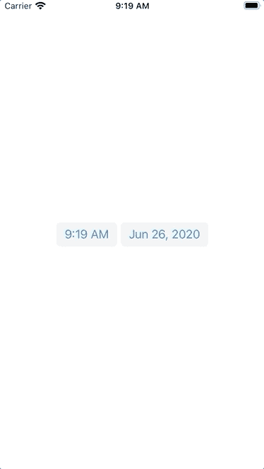
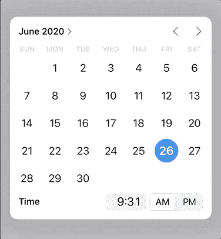

# 介绍 Swift 的新型现代日期选择器

> 原文：<https://betterprogramming.pub/introducing-swifts-new-modern-date-picker-37bb5e0a106>

## 一个早就应该刷新的 UI 组件刚刚得到了一个


[伊莱扎·戴蒙德](https://unsplash.com/@eliza28diamonds?utm_source=medium&utm_medium=referral)在 [Unsplash](https://unsplash.com?utm_source=medium&utm_medium=referral) 拍摄的照片。

正如在 WWDC 2020 大会上透露的那样，苹果已经对日期和时间选择器进行了 Airbnb 式的升级。由于这个日期选择器没有新的名字，我们就称它为现代日期选择器吧。

> *“显示日历日期并提供编辑日期值的控件。”—* [*苹果的文档*](https://developer.apple.com/documentation/appkit/views_and_controls/date_picker)

# 先决条件

要学习本教程，您需要了解以下方面的一些基本知识:

*   迅速发生的
*   至少 Xcode 12+

*注意:这只支持 iOS 14+。*

# 现代日期选择器

为了让您更好地了解这种转换，最后看一下传统的日期选择器。现在看看现代的日期选择器，只有一行代码:

```
datePicker.preferredDatePickerStyle = .compact
```



我想知道在选择完日期和时间后，如何退出弹出窗口。我希望看到一个“完成”按钮出现。目前，轻按日历外的任何位置都会关闭日历，从而反映您的选择。

浏览月份和年份也是一个非常简单的过程:



如果您希望日历显示在屏幕上，而不是弹出窗口，您可以考虑使用`inline`:

```
datePicker.preferredDatePickerStyle = .inline
```

