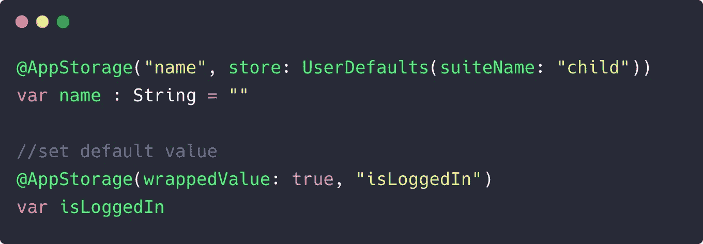

# 介绍 SwiftUI 的新@AppStorage、@StateObject 和@SceneStorage 属性包装器

> 原文：<https://betterprogramming.pub/introducing-swiftuis-new-appstorage-stateobject-and-scenestorage-property-wrappers-db0df895bd3b>

## iOS 14 带来了全新的属性包装器，用于在 SwiftUI 中持久化数据


丹尼·米勒在 [Unsplash](https://unsplash.com?utm_source=medium&utm_medium=referral) 上拍摄的照片。

SwiftUI 在 WWDC 2020 期间获得了一些很棒的新增强。其中突出的是对 SwiftUI 属性包装器库的添加。属性包装器在 SwiftUI 应用程序中大量用于更新和观察视图，是 SwiftUI 数据管理的重要组成部分。

iOS 14 为我们提供了三种新的数据持久性属性包装器:

*   `@AppStorage`
*   `@StateObject`
*   `@SceneStorage`

在接下来的几节中，我们将在新的 Xcode 12(在撰写本文时处于测试阶段)中逐一介绍它们。

# SwiftUI @AppStorage

一个`AppStorage`属性包装器用于读写`UserDefaults`的值。每次`AppStorage`属性包装器的值改变时，SwiftUI 视图就会失效并重新绘制。

它的行为与`@State`属性包装器相同，除了它用于以一种方便的方式在`UserDefaults`键和 SwiftUI 视图之间进行通信。以下代码展示了在 iOS 14 之前，我们如何将`UserDefaults`与`State`属性包装器一起使用:

新的`@AppStorage`属性包装器在一行中完成了这一任务:

```
@AppStorage("name") var name: String = "hey"
```

`AppStorage`还允许您对`UserDefaults`使用不同于`standard`的`suiteName`。

此外，我们还可以通过使用`wrappedValue`参数直接在`@AppStorage`中设置`UserDefaults`键的默认值。

以下是上述每种情况的语法:



注意在第二种情况下，`@AppStorage`类型是如何从设置为布尔值的`wrappedValue`中隐式确定的。

在`TextField`中使用`AppStorage`似乎很有吸引力——尤其是因为存储和更新登录凭证是一个常见的用例。但是这样做的话，你的`UserDefaults`将会在每次用户输入或删除文本域的内容时更新，这可能并不理想。

使用`@AppStorage`的一个更好的场景是在基于计数器的应用程序中跨应用程序会话保存值。或者甚至在新的 SwiftUI `TextEditor`中构建一个方便的记事本应用程序。

```
@AppStorage("text") var text: String = ""

var body: some View {
        Text($text)
} 
```

# SwiftUI @StateObject

`StateObjects`被引入以填充`@EnvironmentObject`和`@ObservedObject`之间的空隙。

虽然`EnvironmentObject`属性包装器用作应用程序中所有 SwiftUI 视图可用的共享数据，但`ObservedObject`通常用于插入符合`ObservableObject`协议的数据源类。

`@ObservedObject`一个 SwiftUI 中的 set 也可以与其他视图共享，这可能会无意中导致棘手的问题。例如，如果您试图更新一个已经初始化了`ObservedObject`的 SwiftUI 视图(可能通过改变状态),那么模型将被重新创建:

```
@ObservedObject var model = MyViewModel()
```

尽管您可以去掉上面的默认值`MyViewModel()`并将模型作为参数传递给`init`，但是当您与其他子视图共享`ObservedObject`时，您将失去确定事实来源的能力。

iOS 14 中的 SwiftUI 带来了一个新的`@StateObject`属性包装器，它不会在状态变化时重新初始化。

所以现在，你可以像这样愉快地用`@StateObject`替换`@ObservedObject`:

```
@StateObject var model = MyViewModel
```

# SwiftUI @SceneStorage

新的`SceneStorage`属性在具有多窗口支持的应用程序中的状态恢复中非常方便——通常构建在 iPadOS 和 macOS 上。

与`AppStorage`不同，它不在`UserDefaults`中保存数据。相反，它只是一个状态属性，对于应用程序中的每个场景都是唯一的。

```
@SceneStorage("isLoggedIn") **var** isLoggedIn = false
```

# 结论

在本文中，我们看到了 iOS 14 的 SwiftUI 中引入的三个新的属性包装器。它们都以不同的方式帮助实现状态持久化。虽然`StateObjects`只为视图初始化一次，但是`SceneStorage`属性对于每个场景是唯一的。最后，`AppStorage`是一个状态属性包装器，用于观察`UserDefaults`并导致视图在更新时重绘。