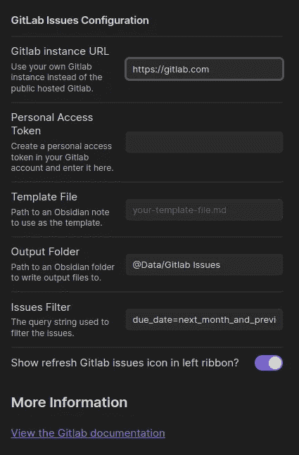

# 介绍黑曜石的 Gitlab 问题插件

> 原文：<https://betterprogramming.pub/introducing-the-gitlab-issues-plugin-for-obsidian-baa0d4f0f094>

## 自动将 Gitlab 中的问题整合到您的黑曜石笔记库中


照片由 [Raphael Wild](https://unsplash.com/es/@veloradio?utm_source=medium&utm_medium=referral) 在 [Unsplash](https://unsplash.com?utm_source=medium&utm_medium=referral) 上拍摄

如果你还没有听说过[黑曜石](https://obsidian.md/)，这是一个个人知识库系统，它在 Markdown 格式的纯文本文件上工作。

对我来说至关重要的是，它是一个安装在本地的应用程序，可以处理你的*本地*文件，这些文件是*纯文本*格式的。

这意味着没有专有的文档格式要处理，我没有被任何在线云提供商所束缚，并且最终如果 Obsidian 从地图上消失了，我所有的重要数据仍然可以在我的本地纯文本文件中访问。如果我要把我所有的笔记都放进任何一个应用程序，这些对我来说都是至关重要的因素。

Obsidian 适用于所有平台——Windows、Mac、Linux、Android 和 iOS。

[Gitlab](https://gitlab.com) 是一个提供源代码服务的服务，比如 Git 和 Mercurial，用于托管代码和相关的工件。它在 Gitlab.com[以云服务的形式免费提供](https://gitlab.com)，但也可以作为大型组织的私有内部解决方案进行安装。

当我开始在黑曜石中管理我的所有任务时，我开始需要黑曜石的 Gitlab 问题插件。一旦我按照我想要的方式配置了它，我真的很高兴，但还缺少一样东西——我工作的所有软件应用程序都有第二个任务源，所有这些任务都在 Gitlab 中。

因此，作为一名有能力的程序员，我做了其他人会做的事情，并提出了自己的解决方案，通过 Gitlab API 将 Gitlab 问题导入到我的 Obsidian vault 中。

我很高兴地宣布，昨天，插件被批准，现在可以在官方的黑曜石社区插件数据库。这意味着你可以直接从黑曜石设置区安装它。

# 插件是如何工作的？

插件的前提非常简单。它将在 [Gitlab API 中查询问题](https://docs.gitlab.com/ee/api/issues.html#list-issues)，并为返回的每个问题创建 Obsidian 注释文件。如果 API 不再返回一个问题，则移除黑曜石注释。

这意味着笔记本身应该被认为是只读的。您所做的任何编辑都将丢失。然而，这些问题的主要知识来源是在 Gitlab 上，并且必须留在 Gitlab 上，所以笔记的这种短暂性质是有意的，而不是偶然的。

要开始，只需浏览到黑曜石设置的社区插件部分，并浏览“黑曜石 Gitlab 问题”。安装插件。

然后，您需要在 Gitlab 上创建一个具有`API`特权的 Gitlab 令牌。不要与任何人分享这个。

回到 Obsidian，浏览插件设置界面，如下所示:



Gitlab 发布插件设置屏幕。

在个人访问令牌字段中输入 API 令牌，选择一个输出文件夹，然后就可以开始了。

如果您启用了功能区图标，那么点击它将立即载入您在 Gitlab 中等待的任何问题。否则，问题会在您启动 Obsidian 30 秒后加载，然后每隔 15 分钟加载一次。

默认情况下会加载下个月到期的问题，但这可以使用 [Gitlab Issues API](https://docs.gitlab.com/ee/api/issues.html#list-issues) 提供的任何过滤器设置进行配置。

# 如何使用你的黑曜石金库的发行票据？

所以现在你有了一组笔记，每一个都代表一个 Gitlab 问题。你可以用任何你喜欢的方式使用和展示这些，黑曜石的选择非常多。

我建议快速开始的方法是使用优秀的[数据视图插件](https://github.com/blacksmithgu/obsidian-dataview)来创建即将到来的问题列表，嵌入到你的金库中你喜欢的任何地方。例如:

```
dataview  
TABLE WITHOUT ID file.link AS "Task", dueDate AS "Due Date" from "@Data/Gitlab Issues"  
SORT dueDate
```

如果您随后关闭 Gitlab 上的某个问题或将其到期日期更改为更远，该问题将从您的保管库中移除，并且`DataView`列表将不再显示该问题。

一旦你有了这个设置和工作，你就可以随心所欲地摆弄东西了。

这个插件仍然很新，但是已经过很好的测试。如果您遇到问题或有任何其他问题，请在这里留下评论或在托管源代码的 [GitHub 库](https://github.com/benr77/obsidian-gitlab-issues)上创建问题。