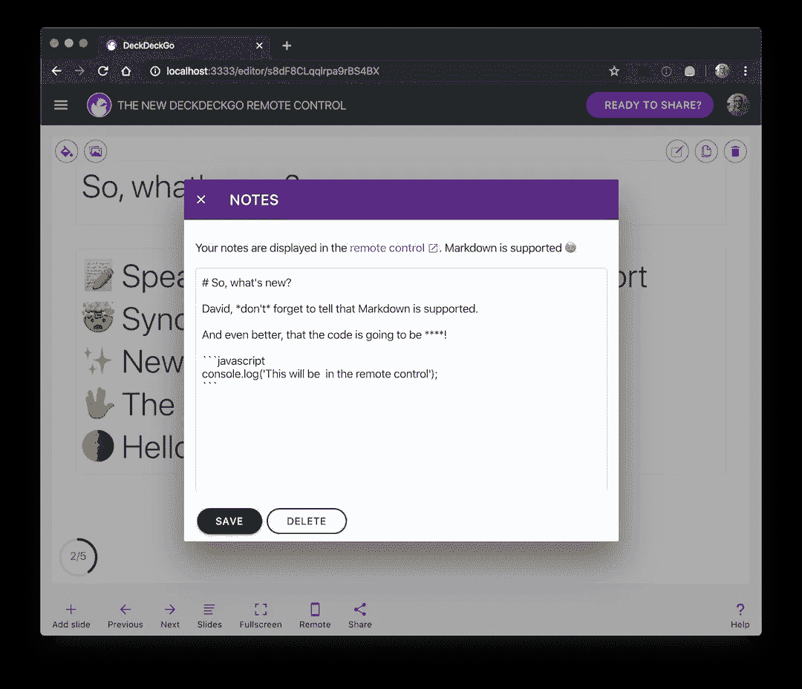
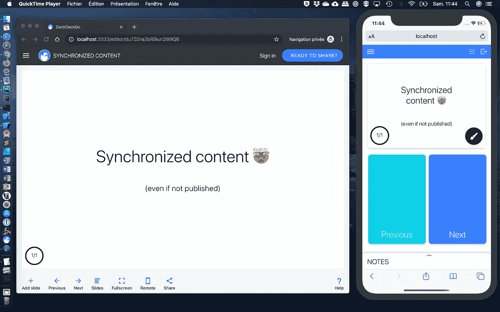
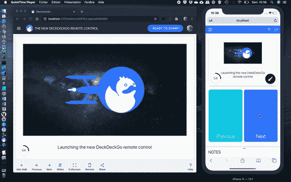
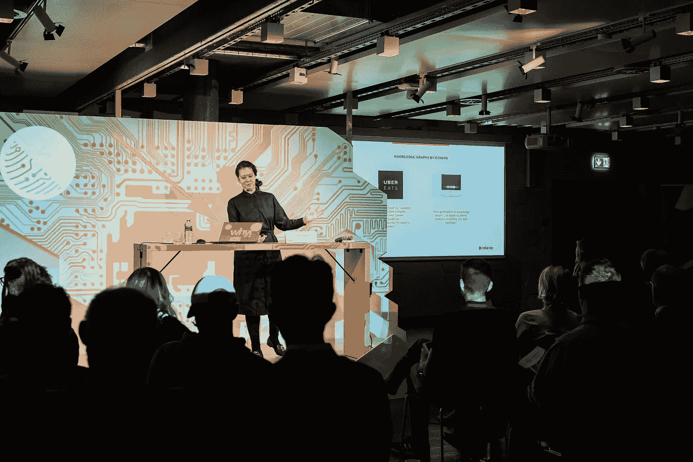
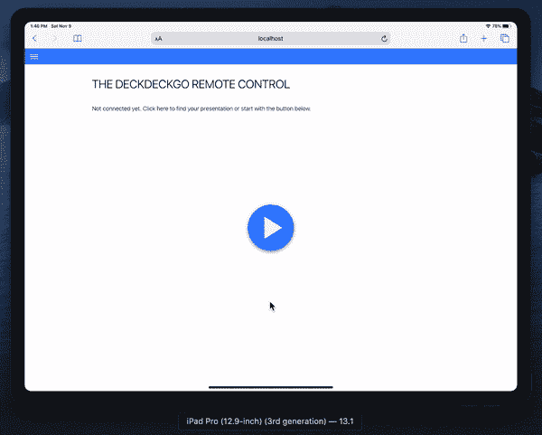
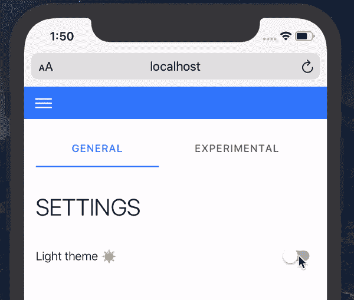

# 介绍用于演示的新型遥控器

> 原文：<https://betterprogramming.pub/introducing-the-new-remote-control-for-your-presentations-97b86367070e>

## 介绍使用 web 开源编辑器 DeckDeckGo 开发的新演示遥控器

由 [Cerqueira](https://unsplash.com/@shotbycerqueira?utm_source=unsplash&utm_medium=referral&utm_content=creditCopyText) 在 [Unsplash](https://unsplash.com/?utm_source=unsplash&utm_medium=referral&utm_content=creditCopyText) 上拍摄的背景照片

一个多月前，我们[推出了](https://medium.com/better-programming/introducing-deckdeckgo-the-web-open-source-editor-for-presentations-ac0f51fad711)我们的 web 开源演示编辑器: [DeckDeckGo](https://deckdeckgo.com)

这远远超出了我们的预期——很快就有 3000 人试用了我们的编辑器，我们收到了很多积极的反馈。这真是一个意想不到的开始，也是一次温暖人心的经历。谢谢你们所做的一切。

在这次发布之后，我们在 10 月份改进了我们的平台(感谢我们的社区和许多拉取请求)。对我们来说，这绝对是一个非常美好的 2019 年 Hacktoberfest 季节。

终于到了问我们自己的时候了:现在，下一步是什么？

我们很快发现了两个实施起来很有趣的新点子——对我们的用户来说独特而有用。但是你知道吗？这些不是我们今天要发表的。我们认为，在追求这些之前，我们应该首先解决用户最需要的功能之一——演讲者注释——并改善一个长期以来已知的弱点，至少在我看来，这就是我们控制器的 UX。

这就是我们今天很高兴推出全新[遥控器](https://deckdeckgo.app)的原因。

我们全新遥控器的演示

# 有什么新鲜事吗？

玩笑开够了——以下是我们遥控器的主要新功能。

## 支持降价的演讲者注释

通过我们的 [Slack](https://join.slack.com/t/deckdeckgo/shared_invite/enQtNzM0NjMwOTc3NTI0LTBlNmFhODNhYmRkMWUxZmU4ZTQ2MDJiNjlmYWZiODNjMDU5OGRjYThlZmZjMTc5YmQ3MzUzMDlhMzk0ZDgzMDY) 频道、 [GitHub、](https://github.com/deckgo/deckdeckgo/projects/4)或 messages，能够在 web 编辑器中为幻灯片添加演讲者注释通常是最受欢迎的功能。

幸运的是，它已经在我们的核心中实现了，甚至可以在开发工具包中获得；因此，就 UX 而言，最大的挑战只是整合。此外，在实现该特性时，我们认为如果 Markdown 也能得到支持，那将会非常方便。

在我们的 web 开源编辑器中使用 Markdown 编辑您的演讲者注释

## 同步内容

自从我实现了我们的遥控器的第一个版本，我们就一直认为在演示和控制器之间同步内容会非常酷。猜猜看，我们成功了！

值得注意的是，演示文稿不必为了同步而发布到互联网上。至于连接和命令，它是通过 WebRTC 执行的，因此，即使您在本地运行演示文稿，它也能工作。

**注意:**这个新解决方案是一个突破性的变化。它会在我们的 web 编辑器中自动推出，但是如果您已经发布了一套资料，您只需再次发布即可升级。

同步内容

## 新的用户体验

尽管所有功能(滑动幻灯片、在演示文稿上绘图、播放视频、显示笔记等。)都是在遥控器中实现的，我从来没有被它的 UX 完全说服过。我对它还算满意，但几个月来，我脑子里一直有一个想法，我需要改进它的行为。

触发滑动幻灯片和播放视频的动作太小，尤其是在演讲中使用。这就是为什么这些是重新设计的主要关注点，现在占据了遥控器一半的屏幕大小。

此外，演讲者的笔记显示得并不巧妙。这就是为什么我们将它们移动到一个新的可以通过向上滑动手势打开的 sheet 组件。

新的用户体验

## 平板电脑的响应式设计

10 月初，我参加了在伯尔尼举行的 [DINAcon](https://dinacon.ch) 2019 会议。

演讲者在时尚的薄桌子后面的闪亮舞台上展示他们的主题，我猜，这是为了分散注意力。但是他们仍然使用笔记本电脑来查看他们的谈话和笔记。

[Katariina Kari](https://twitter.com/katsi111) 在 DINACon 2019 上谈论“知识图表”并快速浏览她的笔记本电脑(来源 [Flickr](https://www.flickr.com/photos/140845441@N04/48947571397/in/album-72157711466719708)

我突然想到:为什么不在平板电脑而不是笔记本电脑上显示一个独立的仪表盘呢？我开始思考这个问题，想象发表演讲就像在企业号舰桥上，所有的命令让它飞起来。

如果你读了这几行，我猜你现在知道为什么封面照片有点受“星际迷航”的启发了

此外，在用户体验方面，我们新版本的遥控器引入了新的响应式设计，旨在实现这一愿景，并提供所有必要的信息和命令，以支持您使用平板设备或任何浏览器在横向模式下进行通话。

灵感来自美国企业号舰桥

## 你好，黑暗，我的老朋友

正如我们已经为开发者做的文档一样，我们也推出了明暗主题切换器🌓

在明暗主题之间切换

# 现在就开始

一张图胜过千言万语——试试看。

1.  打开手机或桌子上的[遥控器](https://deckdeckgo.app)。
2.  在另一个设备上开始一个[演示](https://beta.deckdeckgo.io/daviddalbusco/introducing-the-new-deckdeckgo-remotecontrol/)。
3.  玩得开心。

到无限和更远的地方。