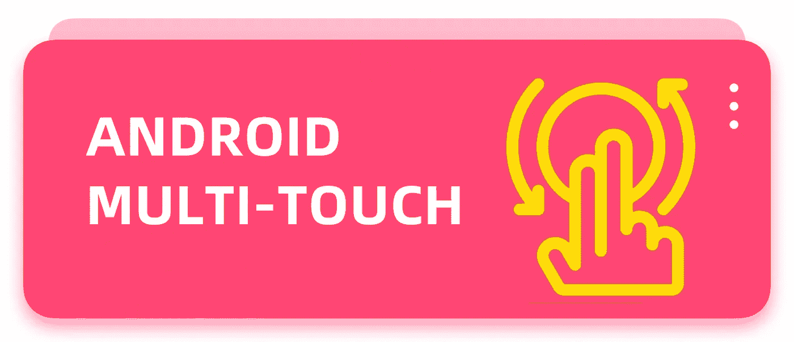
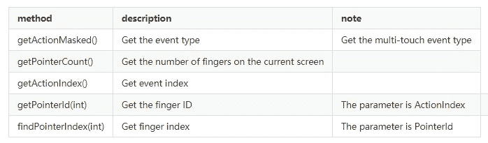

# Android 多点触控简介

> 原文：<https://betterprogramming.pub/introduction-to-android-multi-touch-bdae5f8002f4>

## 在应用中添加手势控制



多指触摸是指监控多个手指的触摸事件。我们可以覆盖`View`中的`onTouchEvent`方法，或者使用`setOnTouchListener`方法来处理触摸事件。

首先，我们来看看如何确定多指触摸的事件类型。

# MotionEvent 中的事件类型

一般来说，我们通过判断`MotionEvent`的动作来判断输入事件的类型，从而做出相应的处理。
在不考虑多个手指的情况下，我们一般只关注以下事件类型:

*   `MotionEvent.ACTION_DOWN`
    用食指轻点屏幕
*   `MotionEvent.ACTION_UP`
    最后一根手指离开屏幕
*   `MotionEvent.ACTION_MOVE`
    一根手指正在屏幕上划动
*   `MotionEvent.ACTION_CANCEL`
    事件被阻止

所以对于多指触摸，除了上面提到的常见事件类型，我们还需要注意另外两种事件类型:

*   `MotionEvent.ACTION_POINTER_DOWN`
    一个手指已经存在于屏幕前轻点
*   `MotionEvent.ACTION_POINTER_UP`
    当屏幕上的一个手指抬起时，屏幕上还有其他手指

需要注意的是，以上两种类型不能像以前一样使用`MotionEvent#getAction`方法获得，需要使用`getActionMasked`。

所以在处理多指触摸的时候，我们的`onTouch`方法一般可以这样写:

当多个手指同时触摸屏幕时，我们需要跟踪不同的手指。这里还涉及到其他几个概念。

# 手指跟踪

在`MotionEvent`中有几种方法可以跟踪不同的手指。



# 动作索引(事件索引)

`ActionIndex`可以通过`getActionIndex`方法直接获得，可以粗略理解为描述当前事件发生的手指数。比如我们在监测手指抬起的时候，可能想知道哪根手指抬起来了，那么就可以通过`ActionIndex`来判断。

另外，对于同一个手指，`ActionIndex`的值可能会随着手指的按下和抬起而变化，所以我们不能用它来识别一个手指。
看来`ActionIndex`的唯一目的就是得到`PointerId`。

特别要注意的是，这个方法只对`ACTION_POINTER_DOWN`和`ACTION_POINTER_UP`事件有效。`ACTION_MOVE`事件无法准确获取值。需要结合其他事件综合判断。

# 指针 Id(指针 ID)

通过`getPointerId(int)`方法获得`PointerId`，参数为`ActionIndex`。

我们可以通过`PointerId`来识别一个手指。对于同一个手指，`PointerId`从按压到抬起的整个过程都是固定的。

还要注意，该值可以重复使用，例如，当手指抬起后再次按下时，`id`为 0 的手指的`id`也可以为 0。

# 指针指数

`PointerIndex`通过`findPointerIndex(int)`获得，参数为`PointerId`。

该值用于获取事件的更多内容。

如果我们想得到事件的点击点位置，当我们通过`getX()` / `getY()`方法得到坐标时，只能得到第一个手指的位置，但是这两个方法提供了一个重载:

```
float getX(int pointerIndex);
float getY(int pointerIndex);
```

# 使用

通过上面的介绍，我们已经大致了解了多点触控的一些关键点，现在就让我们来实际应用一下。

这里我做一个`DrawView`用于绘制手指运动轨迹，它可以同时跟踪多个手指的运动轨迹。效果如下:


上图是四指同时滑动时的效果。

# 分析

为了达到这种效果，有两个主要问题需要考虑:

首先是如何准确的跟踪手指的滑动轨迹，因为如上所述，`ACTION_MOVE`无法获得`ActionIndex`。但上帝关上门的时候，一定会打开一扇窗。我们可以通过`PointerId`追踪。先监听`ACTION_DOWN`和`ACTION_POINTER_DOWN`两个事件，在这里得到新手指的`PointerId`，遍历`ACTION_MOVE`事件中的所有手指，然后比较`PointerId`可以是要么。

第二，因为`MotionEvent`会把多个连续的滑动轨迹打包成一个`MotionEvent`，所以我们需要用`getHistoricalX`来得到这个滑动的历史轨迹。方法签名如下:

```
float getHistoricalX(int pointerIndex, int pos);
```

第一个参数`pointerIndex`，很容易解决。第一个问题已经提到了，主要是第二个参数。

因为`HistoricalX`是一个列表，我们需要通过索引逐个读取，第二个 pos 参数就是索引，但前提是我们知道列表的长度。这个只需要一个`for`循环就可以解决。

`MotionEvent`提供了一种获取该列表长度的方法:

```
int getHistorySize();
```

但是这个提供了这个方法，没有其他重载，所以你这次无法通过`pointerIndex`得到某个手指滑动的历史轨迹列表的长度！

不过经过我的测试，无论哪根手指滑动，都可以通过`getHistorySize`方法得到历史轨迹的长度，然后调用`getHistoricalX`方法得到历史轨迹的坐标。

虽然不知道为什么这样设计，但是确实解决了这个问题。

# 完成

我们首先定义一个内部类作为绘图元数据:

上面的`DrawPath`对应的是手指滑动的生命周期，也就是中间经历的从下往上的轨迹。

然后定义一个`DrawPath`和变量的列表，比如画笔、轨迹颜色数组等。：

初始化它:

现在让我们覆盖`onTouchEvent`方法:

上面有评论，就不赘述了。

然后重写`onDraw`方法。虽然这是一个用于绘制轨迹的控件，但在`onDraw`方法中没有多少代码:

这样就实现了一个支持多指画图的简单控件，我们还可以给它添加一些撤销上一步等方法。这里就不说了。

`DrawView`的完整代码已经放在 GitHub 上了。

欢迎你来[看看](https://github.com/0xZhangKe/Collection/blob/master/DrawView/DrawView.java)。