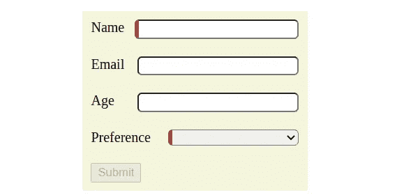
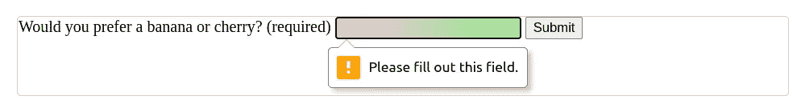
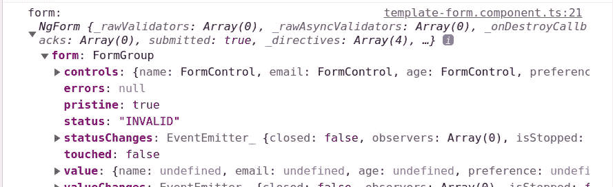
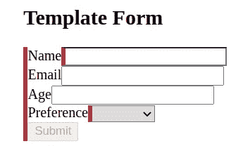

# 角度模板驱动的表单简介

> 原文：<https://betterprogramming.pub/introduction-to-angular-template-driven-forms-cd3a1b10380a>

## [有角度的](https://medium.com/@lorenzozar/list/angular-5496c492a185)

## 通过逐步构建一个简单的表单来探索角度模板驱动的表单

Angular 提供了两种通过表单处理用户输入的主要方法:反应式和模板驱动式。这两种方法都建立在通用表单 API 之上。



这是您将构建的表单。够基本的了。

在这篇文章中，我将按照模板驱动的方法构建一个表单。

你可以在[角反馈形式介绍](/intro-to-angular-reactive-forms-fc5cd636ce1f)中使用反馈方法找到相同的形式。

# 模板驱动方法概述

> 根据[文档](https://angular.io/guide/forms-overview#choosing-an-approach)，
> 
> 模板驱动的表单"*依靠模板中的指令来创建和操作底层对象模型。[…].*
> 
> *它们很容易添加到应用程序中，但它们的扩展性不如反应式表单。*
> 
> *如果您有非常基本的表单需求和逻辑，可以在模板中单独管理，模板驱动的表单可能是一个很好的选择*。

在构建表单时，我将大致按照[构建一个模板驱动的表单](https://angular.io/guide/forms#building-a-template-driven-form)。然而，我将简化一些方面，并省去大部分造型。

# FormsModule &两条指令

首先，我们需要记住导入 [FormsModule](https://angular.io/api/forms/FormsModule) ，因为它“导出模板驱动表单所需的提供者和指令”

因此，我们在`app.module.ts`中导入 FormsModule。

```
import { [FormsModule](https://angular.io/api/forms/FormsModule) } from '@angular/forms';
```

并在`@NgModule.`的进口中申报

```
imports: [BrowserModule, FormsModule],
```

这很重要，因为`NgModel`和`NgForm`指令都是从`FormsModule`导出的，我们稍后会看到。

其次，在使用模板驱动的表单时，我们需要记住两条指令:

1.  `NgModel`允许双向数据绑定。“模板驱动的表单使用[双向数据绑定](https://angular.io/guide/architecture-components#data-binding)在模板发生变化时更新组件中的数据模型，反之亦然”。
2.  `NgForm`跟踪“汇总表单值和验证状态”。一旦您导入`[FormsModule](https://angular.io/api/forms/FormsModule)`，默认情况下，该指令将在所有`<form>`标签上生效。

我们将从使用`NgModel`构建一个收集用户输入的元素开始。

# 构建表单元素

理论上，我们可以从类或者模板开始。

然而，“在模板驱动的表单中，表单模型是隐式的，而不是显式的。指令`NgModel`为给定的表单元素创建并管理一个`FormControl`实例

在模板驱动的表单中，从模板开始更自然，我将遵循这种方法。

# 通用表单元素

角度形状中的一般形状元素可能如下所示:

角度模板驱动表单中的通用表单元素

这几乎是普通的 HTML，除了第 7 行`[(ngModel)]="email"`引入了上面提到的第一个指令`ngModel`，以添加双向数据绑定。

`ngModel`指令通过双向数据绑定将输入控件绑定到相应的`email`属性，以更新组件中的数据模型。

注意标签的`for`属性和输入的`id`属性不会影响元素，但是，将标签链接到控件会提高[可访问性](https://www.a11yproject.com/checklist/#forms)。

由于我们没有名为`email`的属性，我们需要在`template-form.component.ts`中创建它。

```
import { Component, OnInit } from '@angular/core';@Component({...})
export class TemplateFormComponent { email: string | undefined;}
```

一旦属性就位，当通过输入元素在模板中或者以编程方式在组件类中进行更改时，`email`的值就会更新。

附注:如果在`form`元素之外使用双向数据绑定，那么`name`属性是不必要的，但是对于模板驱动的表单，即在`form`标记之内，它是必要的。

## 是否意味着我们的元素不是一种形式？

嗯，是也不是。

如果您有一个非常简单的“表单”，比如说一个输入字段来收集用户的电子邮件，就是这样！你可以添加一个按钮来触发一个点击事件，就此打住，开心就好！

您还可以使用相同的模式添加更多的元素。它会工作得很好！

然而，由于这些元素是相互独立的，我们并没有真正的形式。它是一堆行为类似于表单的元素。

因此，您可能最终需要检查每个元素的有效性，比如说是必需的，以激活提交按钮。

让我们朝着这个方向更进一步。

# 从一种元素到一种形式

从上面的通用元素开始，我们可以创建以下形式:

角度模板驱动的表单

大多数元素类似于我们上面看到的通用构建块。

它们被包装在一个常规的 HTML `form`实体中。然而，由于我们在`app.module.ts`中导入了`FormsModule`，`form`在幕后创建了一个新的`NgForm`实例。

目前，我们不关心这个。但是请注意带有事件监听器的`form`标签。

```
<form (ngSubmit)="onSubmit()">
```

现在，表单监听“ngSubmit”事件。“ngSubmit”事件由类型为`submit`的按钮触发。

在`template-form.component.ts`中，我们需要为每个表单元素添加一个属性:

我们还可以创建一个对象来模拟表单的形状，这样就更好了。参见[将输入控件绑定到数据属性](https://angular.io/guide/forms#bind-input-controls-to-data-properties)获取示例。

# Angular 阻止本机 DOM 验证

值得一提的是，在使用模板驱动的方法时，Angular 会将`novalidate`属性添加到表单标签中。

> 来自[文档](https://angular.io/api/forms/NgForm#native-dom-validation-ui):“为了防止原生 DOM 表单验证 UI 干扰 Angular 的表单验证，每当`FormModule`或`ReactiveFormModule`被导入到应用中时，Angular 自动在任何`<form>`上添加`novalidate`属性”。

因此，如果您尝试上面的代码，您会发现即使没有填写必填字段也可以提交表单。在[角无功形式介绍](/intro-to-angular-reactive-forms-fc5cd636ce1f)中，我们看到了使用无功方法的相同行为。

然而，这有两个原因:

*   默认情况下，浏览器的本机表单验证被禁用`novalidate`
*   提交按钮触发 ngSubmit”事件。然而，我们并不要求提交的表单是有效的。

## ngNativeValidate:浏览器的本机验证

顺便提一下，您可能想尝试一下浏览器的原生表单验证。

您可以通过向表单标签添加`ngNativeValidate`属性来启用本地验证。

```
<form (ngSubmit)="onSubmit()" ngNativeValidate>
```

`ngNativeValidate`属性启用浏览器的原生表单验证，您可以在下面看到一个例子。



由 [MDN](https://developer.mozilla.org/en-US/docs/Learn/Forms/Form_validation#the_required_attribute) 进行的浏览器本机验证

在 [MDN](https://developer.mozilla.org/en-US/docs/Learn/Forms/Form_validation#the_required_attribute) 的例子中，input 元素有一个`required`属性，当用户在输入没有值的情况下点击提交按钮时，该属性触发浏览器的本地验证。

您可能不喜欢它，但它是一个简单的工作验证和错误消息。

## 回到我们的状态

我们仍然在处理一堆独立的元素。

如果我们提交表单，我们很容易得到底层元素的值，但不是它们的属性，也不是表单的整体状态。

如果那些要素都是奴才，你更愿意和老板谈，对吗？


照片由[艾莉森·王](https://unsplash.com/@alison_wang?utm_source=medium&utm_medium=referral)在 [Unsplash](https://unsplash.com?utm_source=medium&utm_medium=referral) 上拍摄

# 使用模板参考

所以，所有这些奴才的老板就是形态元素。我们想解决这个问题。

记住，因为我们导入了`FormsModule`，`form`在幕后创建了一个新的`NgForm`实例。

为了访问`NgForm`实例和表单状态，我们需要使用一个[模板引用变量](https://angular.io/guide/template-reference-variables)，稍后我们会看到。

多亏了模板引用变量，我们将可以访问表单的值和状态，“以及像`dirty`和`touched`这样的用户交互属性。”

几个例子:

*   如果表单中的任何元素无效，表单本身也将无效
*   如果表单中的任何元素已经被`touched`，表单将产生`touched`

在我们的例子中，`f`是模板引用变量。换句话说，`f`代表我们在模板中创建的表单。

```
#f="ngForm"
```

由于模板变量，我们可以在模板的另一部分使用表单中的数据，或者我们可以将它传递给类。

我们将遵循后者。因此，表单标签变成了

```
<form (ngSubmit)="onSubmit(f)" #f="ngForm">
```

这样，我们在提交时将表单的值和状态传递给类。

使用 ngForm 的角度模板驱动表单

我们需要更改`onSubmit`方法来接收表单。所以，这个类变成了:

记住 Angular 将`novalidate`属性添加到模板中的表单标签。

因此，即使没有填写必填字段，也可以提交表单。

但是这一次是不同的，因为我们可能想要建立在`FormsModule`带来的确认之上！

让我们看看日志:



表单的状态无效

表单的状态无效，因为某些必需的控件无效。

如果表单状态无效，禁用按钮的一个简单方法是将按钮的状态绑定到按钮的`disabled`属性。

```
<button 
  type="submit" 
  [disabled]="f.status === 'INVALID'"
>
  Submit
</button>
```

值得一提的是，既然我们使用了`ngModel`，

“NgModel 指令[…]跟踪该控件的状态。
它告诉你用户是否:

*   触动了控制器，
*   如果值改变了，
*   或者值是否变得无效。

Angular 在控制元素上设置特殊的 CSS 类，以反映状态[…]"，angular.io。

# 特殊的 CSS 类？

Angular 根据用户与表单的交互向表单标签添加和移除类！因此，正如文件中所报告的，

*   如果控件已被访问:`ng-touched`，否则`ng-untouched`
*   如果控件的值已经改变:`ng-dirty`，否则`ng-pristine`
*   如果控件的值有效:`ng-valid`否则`ng-invalid`

让我们举个简单的例子。

让我们将下面的类添加到`template-form.component.css`中:

```
// template-form.component.css.ng-invalid {
  border-left: 5px solid #a94442; /* red */
}
```

在我们的模板中，我们需要名称和首选项。

因此，在开始时，Angular 会将`ng-invalid`类添加到这两个类中，我们会看到左边的边框是红色的。



Angular 添加了 ng-invalid 类

可以看到，整个表单的左边界也是红色的！这是有意义的，因为在这一点上，整个表单是无效的。

正如在[文档](http://The control has been visited.	ng-touched	ng-untouched The control's value has changed.	ng-dirty	ng-pristine The control's value is valid.	ng-valid	ng-invalid)中一样，我们可以添加`:not(form)` [CSS 伪类](https://developer.mozilla.org/en-US/docs/Web/CSS/:not)来选择任何不是表单的元素。

```
// template-form.component.css.ng-invalid:not(form) {
  border-left: 5px solid #a94442; /* red */
}
```

然而，关键是我们现在将表单作为一个整体来处理，Angular 通过提供默认类来支持它，这些默认类可以简化我们的常见验证工作。

添加一些基本的 CSS，我们得到:


最后形状

请随意查看 GitHub 上的[代码。如果你想改进 CSS，请随意投稿！](https://github.com/lorenzojkrl/formication/tree/main/src/app/components/template-form)

# 快速小结

Angular 提供了两种主要的构建表单的方法:反应式和模板驱动式。在这篇文章中，我们探索了模板驱动的方法。

这两种方法都建立在通用表单 API 之上。

1.  在`app.module.ts`中导入表单模块
2.  使用`[(ngModel)]=’property’`获得双向数据绑定
3.  `*<form>*` 标签导入`FormsModule`后默认实现`NgForm`
4.  默认情况下，Angular 阻止浏览器的本机表单验证
5.  使用模板引用`#f='ngForm'`来访问`NgForm`实例

请随意查看 GitHub 上的[代码，或者阅读](https://github.com/lorenzojkrl/formication/tree/main/src/app/components/template-form)[角度反应形式介绍](/intro-to-angular-reactive-forms-fc5cd636ce1f)中的反应方法。