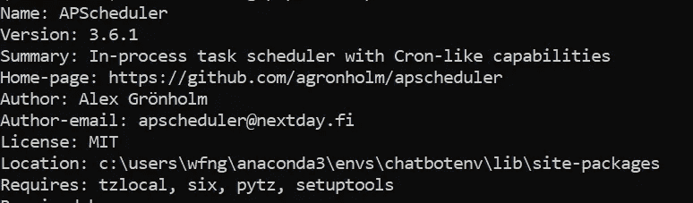
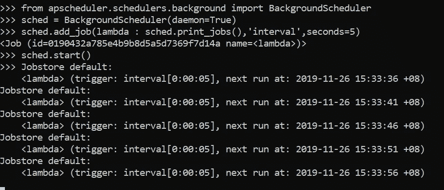
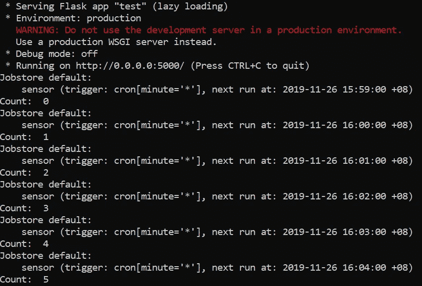
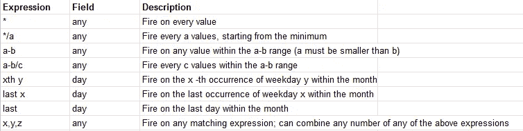

# APScheduler 简介

> 原文：<https://betterprogramming.pub/introduction-to-apscheduler-86337f3bb4a6>

## 具有类似 Cron 功能的进程内任务调度程序


照片由[努尔·尤尼斯](https://unsplash.com/@nooryounis?utm_source=unsplash&utm_medium=referral&utm_content=creditCopyText)在 [Unsplash](https://unsplash.com/s/photos/clock?utm_source=unsplash&utm_medium=referral&utm_content=creditCopyText) 上拍摄

本教程重点介绍如何通过一个流行的 Python 库 APScheduler 来执行任务调度。来自[官方文档](https://apscheduler.readthedocs.io/en/stable/):

> 高级 Python 调度器(APScheduler)是一个 Python 库，允许您调度 Python 代码稍后执行，可以只执行一次，也可以定期执行。你可以随心所欲地添加新工作或删除旧工作。如果您将作业存储在数据库中，它们也将在排定程序重新启动后继续存在并保持其状态。当调度程序重新启动时，它将运行它在脱机时应该运行的所有作业。

APScheduler 的主要优势之一是它可以跨不同平台使用，或者作为 cron 守护进程或 Windows 任务调度程序的替代。此外，在撰写本文时，它也在积极开发中。

APScheduler 提供了三种基本的调度系统:

*   Cron 风格的调度(具有可选的开始/结束时间)
*   基于间隔的执行(以均匀的间隔运行作业，可选择开始/结束时间)
*   一次性延迟执行(在设定的日期/时间运行一次作业)

我们将尝试在 Flask 服务器中创建一个简单的任务调度器作业。本教程分为五个部分:

1.  设置
2.  基本 API
3.  与烧瓶整合
4.  触发配置
5.  结论

如果您只想检查这四行代码，请跳转到基本 API 部分。

# 1.设置

安装过程非常简单明了。默认情况下，你应该有这个库，因为`apscheduler`是作为一个内置包出现的。让我们测试一下，如果软件包没有安装，就安装它。激活您的虚拟环境，并运行以下命令:

```
pip show apscheduler
```

如果系统中已经安装了`apscheduler`，您应该会看到下面的输出。



作者图片

如果没有输出，不要惊慌——这仅仅意味着软件包没有安装。我们可以通过运行以下命令轻松安装它:

```
pip install apscheduler
```

让我们继续下一节，我将解释基本概念和一些可用的 API。

# 2.基本 API

APScheduler 有四个主要组件，为了简洁起见，我在本教程中只解释其中的两个:

*   调度程序
*   引发

Scheduler 是用来添加或删除作业的主要组件。大多数用例只需要一个调度器。这些模块内置了不同类型的调度程序，具体取决于编程环境。

该列表如下:

*   当调度程序是你的进程中唯一运行的东西时使用
*   `[BackgroundScheduler](https://apscheduler.readthedocs.io/en/stable/modules/schedulers/background.html#apscheduler.schedulers.background.BackgroundScheduler)`:当您没有使用下面的任何框架，并且希望调度程序在您的应用程序中后台运行时使用
*   `[AsyncIOScheduler](https://apscheduler.readthedocs.io/en/stable/modules/schedulers/asyncio.html#apscheduler.schedulers.asyncio.AsyncIOScheduler)`:如果您的应用程序使用 asyncio 模块，请使用
*   `[GeventScheduler](https://apscheduler.readthedocs.io/en/stable/modules/schedulers/gevent.html#apscheduler.schedulers.gevent.GeventScheduler)`:如果您的应用程序使用 gevent，则使用
*   `[TornadoScheduler](https://apscheduler.readthedocs.io/en/stable/modules/schedulers/tornado.html#apscheduler.schedulers.tornado.TornadoScheduler)`:如果你正在构建一个 Tornado 应用程序，就使用它
*   `[TwistedScheduler](https://apscheduler.readthedocs.io/en/stable/modules/schedulers/twisted.html#apscheduler.schedulers.twisted.TwistedScheduler)`:如果您正在构建一个扭曲的应用程序，请使用它
*   `QtScheduler`:在构建 Qt 应用程序时使用

在本教程中，我将使用`BackgroundScheduler`**——因为我希望任务在 Flask 服务器中作为后台进程运行。**

**接下来是触发器组件，它包含调度逻辑。每次向调度程序添加作业时，都需要指定触发器来确定作业下次运行的时间。APScheduler 有三个内置触发器:**

*   **`[date](https://apscheduler.readthedocs.io/en/stable/modules/triggers/date.html#module-apscheduler.triggers.date)`:当您想在某个时间点只运行一次作业时使用**
*   **`[interval](https://apscheduler.readthedocs.io/en/stable/modules/triggers/interval.html#module-apscheduler.triggers.interval)`:当您想要以固定的时间间隔运行作业时使用**
*   **`[cron](https://apscheduler.readthedocs.io/en/stable/modules/triggers/cron.html#module-apscheduler.triggers.cron)`:当您希望在一天的特定时间定期运行作业时使用**

**稍后我将使用`interval` 和`cron` 触发器来演示它们之间的区别。让我们探索如何用三行代码创建我们自己的任务调度作业。**

## **第 1 行:导入**

**我们需要根据我们打算使用的调度程序导入必要的组件。在这种情况下，我将导入`BackgroundScheduler`。**

```
from apscheduler.schedulers.background import BackgroundScheduler
```

## **第 2 行:调度程序**

**创建一个`BackgroundScheduler`、**、**并将守护进程参数设置为`True`。这允许我们在退出 Flask 应用程序时杀死线程。**

```
sched = BackgroundScheduler(daemon=True)
```

## **第 3 行:添加一个作业**

**我们将使用`add_job`函数向调度程序添加一个任务。有三个主要参数可以配置。**

*   ****函数**:调度程序要调用的函数的名称。你也可以传递一个匿名函数**
*   ****触发器**:您正在使用的触发器**
*   ****参数**:触发的配置。不同的触发器有自己的参数。**

**让我们看一下下面的代码行，它每五秒钟显示一次调度程序中的可用作业。**

```
sched.add_job(lambda : sched.print_jobs(),'interval',seconds=5)
```

## **第 4 行:启动调度程序**

**完成配置后，您可以使用以下代码行启动调度程序:**

```
sched.start()
```

**就是这样。如果您在 Python shell 中运行代码，您应该能够看到以下输出:**

****

**作者图片**

**如果您对`KeyboardInterrupt`使用 Ctrl-C，调度程序将继续照常运行，直到您使用 Ctrl-Z 退出 Python Shell 或运行`shutdown` 函数**

```
sched.shutdown()
```

**让我们进入下一节，讨论如何将它与 Flask 服务器集成。**

# **3.与烧瓶整合**

**你可以很容易地将日程表整合到烧瓶中，没有任何问题。让我们通过创建一个名为`test.py`的新 Python 文件来尝试一下。**

## **导入**

**添加以下导入。**

```
from flask import Flask
from apscheduler.schedulers.background import BackgroundScheduler
```

## **工作职能**

**这次我们将使用一个实际的函数，而不是匿名函数。创建一个名为`sensor`，的新函数，并在其中编写以下代码。count 变量只是用于演示目的，以确定到目前为止我们已经调度了多少个作业。**

```
count = 0def sensor():
    global count
    sched.print_jobs()
    print('Count: ' , count)
    count += 1
```

## **调度程序**

**我们将像上面的步骤一样定义调度器，除了我们使用 cron 触发器而不是 interval。**

**我们将设置 minute 参数，改为每分钟触发一次作业。在这种情况下，使用星号标记。如果您将它指定为`5`，这意味着它将在五分钟标记期间每小时被调用一次。**

```
sched = BackgroundScheduler(daemon=True)
sched.add_job(sensor,'cron',minute='*')
sched.start()
```

**如果你添加一个带参数的函数，你可以通过`args`参数传递参数。它接受列表或元组。假设我们之前的函数有两个参数。您可以如下调用`add_job`函数:**

```
sched.add_job(sensor, args=['param1', param2], 'cron', minute='*')
```

## **瓶**

**剩下的任务是定义运行 Flask 服务器所需的函数。**

```
app = Flask(__name__)if __name__ == "__main__":
    app.run('0.0.0.0',port=5000)
```

**打开终端，将目录移动到`test.py` 文件的位置。运行以下命令:**

```
python test.py
```

**只需等待几分钟，您应该会在终端中看到以下输出。**

****

**作者图片**

**您可以轻松修改传感器功能来执行您喜欢的任务。例子包括:**

*   **自动从数据库中提取数据**
*   **每天在服务器上运行分析**
*   **设定训练和更新模型的具体时间**

**只需几行代码就可以执行很多用例。**

# **4.触发示例**

**本节将提供几个例子来展示如何根据需要配置触发器。**

## **间隔**

**可以配置的一些最有用的参数如下:**

*   **`weeks` —等待的周数**
*   **`days` —等待的天数**
*   **`hours` —等待的小时数**
*   **`minutes` —等待的分钟数**
*   **`seconds` —等待的秒数**
*   **`start_date` —区间计算的起点**
*   **`end_date` —触发的最晚可能日期/时间**

**您可以使用以下代码将其设置为每两小时运行一次:**

```
sched.add_job(job_function, 'interval', hours=2)
```

**您可以添加开始和结束参数，以确保任务只在开始和结束时间戳之间运行。**

```
sched.add_job(job_function, 'interval', hours=2, start_date='2019-11-11 09:00:00', end_date='2019-12-25 11:00:00')
```

## **时间单位**

**`cron` 触发器要复杂得多，因为它允许配置一些额外的参数。**

*   **`year` —四位数年份**
*   **`month` —月份(1–12)**
*   **`day` —一个月中的某一天(1–31)**
*   **`week` —国际标准化组织周(1–53)**
*   **`day_of_week` —工作日的编号或名称(0-6 或`mon`、`tue`、`wed`、`thu`、`fri`、`sat`、`sun`)。第一个工作日总是星期一。**
*   **`hour` —小时(0–23)**
*   **`minute` —分钟(0–59)**
*   **`second` —秒(0–59)**
*   **`start_date` —触发的最早可能日期/时间(含)**
*   **`end_date` —触发的最晚可能日期/时间(含)**

**与`interval` 触发器不同，该参数末尾没有`s`，同时接受`int` 或`string` 作为输入。对于`string`输入，允许以下可用的[表达式](https://apscheduler.readthedocs.io/en/stable/modules/triggers/cron.html#expression-types)用于从年到秒的字段。**

****

**作者图片**

**计划在二月、三月、四月、十一月和十二月的第三个星期五的凌晨 2 点、3 点、4 点和 5 点运行任务；**

```
sched.add_job(job_function, 'cron', month='2-4,11-12', day='3rd fri', hour='2-5')
```

**计划在每月的最后一个星期日运行任务:**

```
sched.add_job(job_function, 'cron', day='last sun')
```

**计划每小时运行任务:**

```
sched.add_job(job_function, 'cron', hour='*')
```

## **组合触发器**

**如果存在您想要组合触发器的情况，您可以根据您的使用情况通过`AndTrigger` 和`OrTrigger`、来实现。**

**计划每三小时运行一次任务(仅适用于星期一和星期二):**

```
from apscheduler.triggers.combining import AndTrigger
from apscheduler.triggers.interval import IntervalTrigger
from apscheduler.triggers.cron import CronTrigger

trigger = AndTrigger([IntervalTrigger(hours=3),
                      CronTrigger(day_of_week='mon,tue')])
scheduler.add_job(job_function, trigger)
```

**计划在每周六上午 10 点以及每周二上午 3 点、4 点和 5 点运行任务**

```
from apscheduler.triggers.combining import OrTrigger
from apscheduler.triggers.cron import CronTriggertrigger = OrTrigger([CronTrigger(day_of_week='sat', hour=10),
                     CronTrigger(day_of_week='tue', hour='3-5')])
scheduler.add_job(job_function, trigger)
```

# **5.结论**

**让我们回顾一下今天所学的内容。首先，我们从安装 APScheduler 模块开始。**

**然后，我们详细探讨了模块中的基本组件，即调度器和触发器。我们还测试了如何在 Python Shell 中仅用四行代码运行调度程序。**

**下一步是将它集成到一个简单的 Flask 服务器中。我们使用了一个实际的函数，而不是匿名函数。**

**之后，我们学习了一些配置触发器组件参数的例子。我们也可以使用`AndTrigger` 和`OrTrigger`来组合`cron` 触发器和`interval` 触发器。**

**感谢阅读，希望你喜欢这篇教程。下篇再见！**

# **参考**

1.  **[https://github.com/agronholm/apscheduler](https://github.com/agronholm/apscheduler)**
2.  **[https://github . com/agronholm/apscheduler/tree/master/examples](https://github.com/agronholm/apscheduler/tree/master/examples)**
3.  **[https://apscheduler.readthedocs.io/en/stable/userguide.html](https://apscheduler.readthedocs.io/en/stable/userguide.html)**