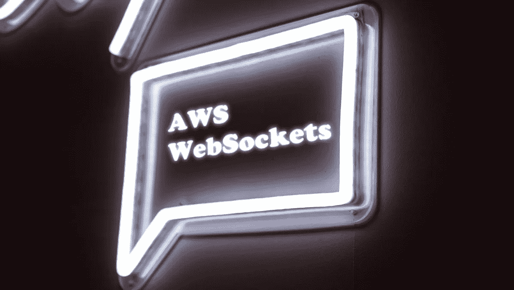
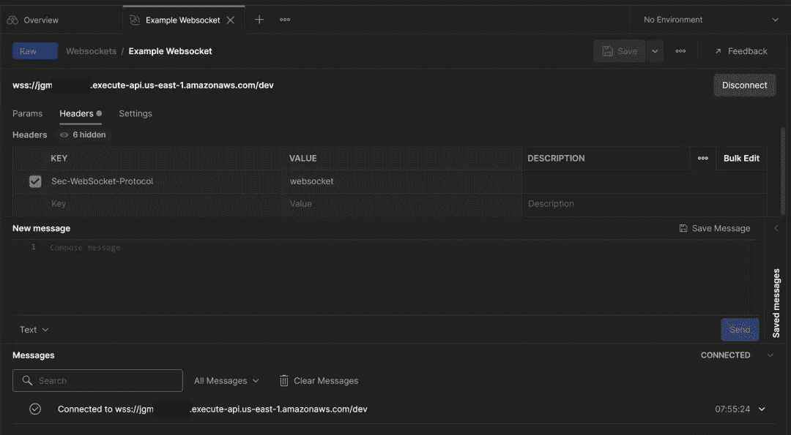
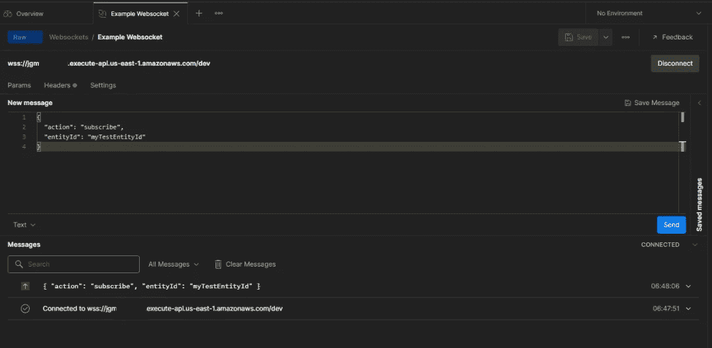
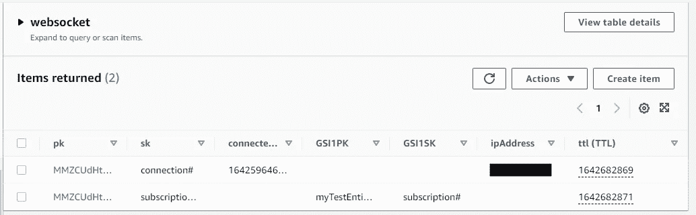
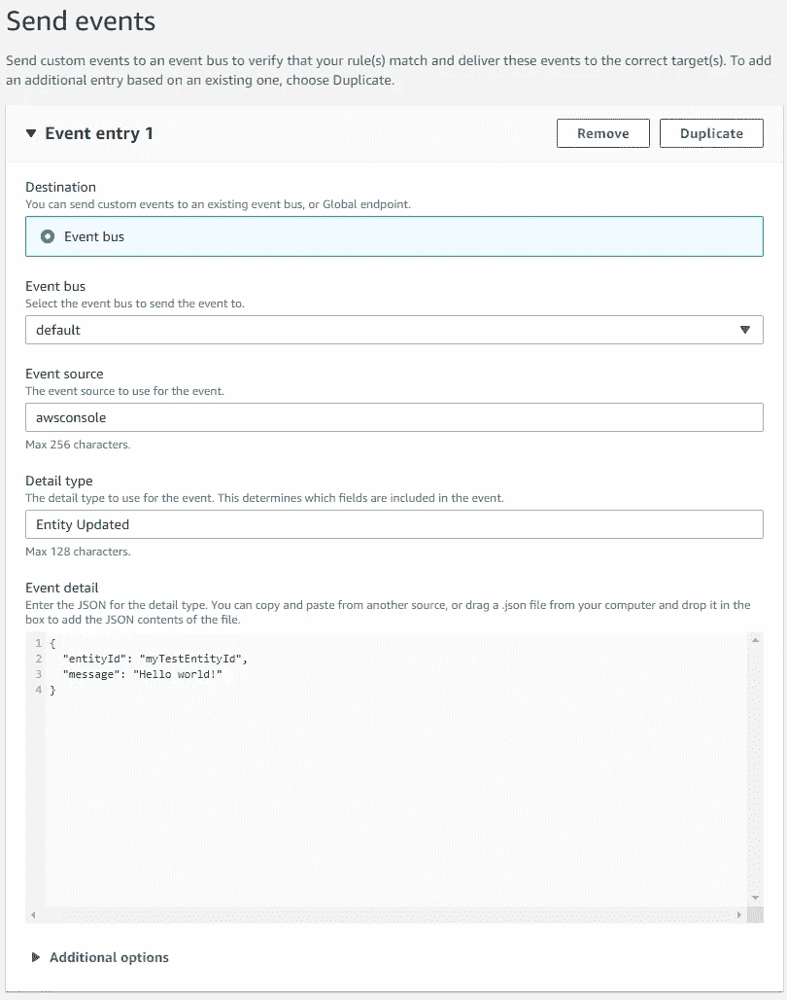
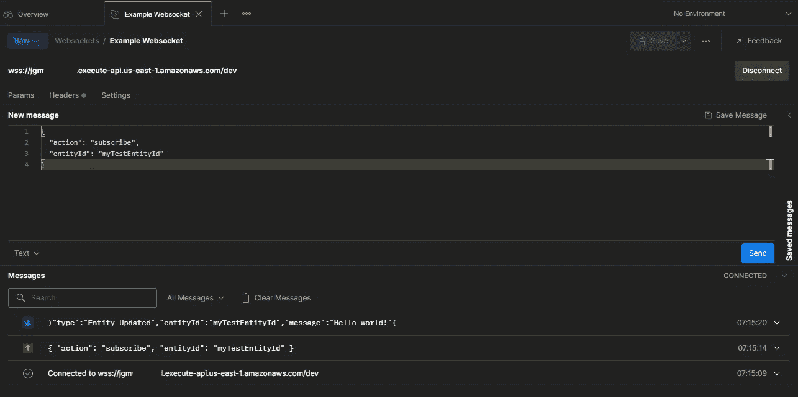

# AWS Websockets 简介

> 原文：<https://betterprogramming.pub/introduction-to-aws-websockets-8b336a92c379>

## Websockets 是完美的异步流程的关键。了解如何从 AWS 中的推送通知开始

[梁杰森](https://unsplash.com/@ninjason?utm_source=unsplash&utm_medium=referral&utm_content=creditCopyText)在 [Unsplash](https://unsplash.com/s/photos/chat?utm_source=unsplash&utm_medium=referral&utm_content=creditCopyText) 上的照片

你知道那种感觉吗？当你去一个社交媒体网站，发布一些令人兴奋的东西，然后坐在那里等待通知，因为人们喜欢并评论你的帖子？

这是最好的。

它一次又一次给你即时的满足感。它会在你的系统中注入少量的多巴胺。简直让人上瘾。

这一切都有可能，因为有了*网络插座*。

# 什么是 WebSocket？

最简单地说，WebSocket 是客户端和服务器之间的直接通信线路。让我们将 Twitter 作为我们的社交媒体用例。WebSocket 连接是移动应用程序(或网站)和 Twitter 服务器之间的双向通信。

当有人喜欢你的帖子或转发你的帖子时，你希望立刻得到通知。因此，服务器使用它与你的直线将通知推送到你的手机上。事情一发生，你就知道发生了什么。

它们有必要吗？从技术上来说不是。但是它们能提升用户体验，给消费者带来快乐吗？绝对的。

# 从 AWS WebSockets 开始

在 AWS 中，WebSocket 是一个 [API 网关 v2 资源](https://docs.aws.amazon.com/apigateway/latest/developerguide/apigateway-websocket-api.html)。它支持客户端和服务器之间的双向通信，并允许您设置自定义路由。

今天我们要看一个用 SAM 模板编写的 WebSocket 的[例子。我选择了一个](https://github.com/allenheltondev/serverless-websockets/tree/part-one) [SAM 模板](https://docs.aws.amazon.com/serverless-application-model/latest/developerguide/sam-specification.html),因为不需要第三方服务，直接在 AWS 中部署一个无服务器应用程序是非常容易的。

首先，导航到[示例报告](https://github.com/allenheltondev/serverless-websockets/tree/part-one)并遵循部署命令。如果您的计算机上已经安装了 AWS CLI 和 SAM CLI，您应该在不到 5 分钟的时间内启动并运行！

# WebSocket 路由

像任何 API 一样，WebSocket 具有触发功能的路由。至少，WebSocket API 必须有两条路线:

*   *$connect* —当从客户端到服务器建立新的直线/连接时会发生什么
*   *$disconnect* —当客户端和服务器之间的直接线路/连接断开时会发生什么

在我们的例子中，我们有在每个端点执行的 lambda 函数。我们保存重要的连接信息，如`connectionId`、`ipAddress`和`connectedAt`时间，以获得关于谁在建立连接的一点元数据。这遵循了基本的[Api Gateway->Lambda->DynamoDb](https://serverlessland.com/patterns/apigw-lambda-dynamodb)模式，这是所有无服务器开发的基础构建块。

在我们刚刚部署的示例 WebSocket API 中有两个额外的路由。

*   *订阅* —订阅在特定实体更新时接收推送通知
*   *取消订阅* —取消订阅特定实体的推送通知

在互联网上可以找到的大多数 WebSocket 例子都是用于[广播通知](https://www.freecodecamp.org/news/real-time-applications-using-websockets-with-aws-api-gateway-and-lambda-a5bb493e9452/)的。这些向每个当前连接发送通知。在一个更真实的用例中，当用户或他们正在处理的实体被修改时，用户会希望获得更新。

因此，我们的示例提供了一种方法，在逐个连接的基础上，将 WebSocket 推送通知精简到特定的实体。

# 测试连接

为了测试您的 WebSocket，您可以从 SAM 部署中获取`WebsocketUri`输出，并在 [Postman](https://www.postman.com) 中连接到它。Postman 是一个为围绕 API 的一切而设计的应用程序，包括连接到 WebSockets。

如果你在做无服务器开发，并且没有积极使用像 Postman 这样的工具，我强烈推荐你。我已经写了[几篇博文](https://www.readysetcloud.io/tags/postman)关于它如何改善开发者体验和[加强你的部署管道](/dynamic-test-generation-with-open-api-spec-3-0-10dacd7866c2)。

要在 Postman 中连接到新的 WebSocket，请执行以下步骤:

1.  打开[桌面应用](https://www.postman.com/downloads/)
2.  选择新建-> WebSocket 请求
3.  在地址字段中输入 SAM 部署输出的路由
4.  点击`Headers`选项卡，添加值为`websocket`的`Sec-WebSocket-Protocol`标题
5.  点击**连接**

*连接到我们在 Postman* 中的 WebSocket

当我们想要订阅或取消订阅更新时，我们必须添加一个有效负载来描述要采用的路径。使用我们构建的 API，`action`属性描述了要走的路线。若要添加订阅，请以此格式发送消息:

同样，`action`属性告诉 API 采用哪条路线，而`entityId`属性是我们传递给示例项目中部署的 *subscribe* lambda 函数的参数。

现在我们已经连接到 WebSocket，将这条消息添加到 Postman 并点击*发送*按钮。它将到达端点并保存订阅。

*为实体更新添加订阅*

通过连接和订阅，我们已经准备好测试我们的推送通知了！

# 发送推送通知

我们要做的第一件事是查看 [DynamoDB](https://aws.amazon.com/dynamodb) 并验证我们的连接和订阅是否已保存。如果您导航到 DynamoDB 控制台中的 [websocket 表，您会看到有两个条目:一个*连接*条目和一个*订阅*条目。](https://console.aws.amazon.com/dynamodbv2/home#item-explorer?initialTagKey=&table=websocket)

*dynamo db 中的 WebSocket 连接和订阅*

现在我们已经确认了我们的连接和订阅，我们可以跳到 [EventBridge 控制台](https://console.aws.amazon.com/events/home#/eventbuses)来手动添加消息。

在我们推入 AWS 的示例项目中，推送通知由 EventBridge 事件触发。该事件被添加到 SQS 队列中，该队列由 lambda 弹出。lambda 函数查找事件中提供的`entityId`的所有订阅，并向所有订阅者发送推送通知。

要手动发送事件，请单击 EventBridge 控制台中的*发送事件*按钮，并添加以下详细信息，如屏幕截图所示

*EventBridge 事件详情*

一旦你点击*发送*按钮，通知过程将被触发，一个推送将被发送到你在 Postman 中的连接。

如果我们翻到 Postman，我们可以看到我们的 *Hello world* 消息已经收到！

*推送通知成功了！*

在真实的场景中，实体`myTestEntityId`的所有订阅者都会收到与我们相同的消息。超级爽！

# 后续步骤

在今天的演练中，我们学习了组成 WebSocket 的各个部分，并快速了解了订阅和通知。

在接下来的几周里，我将在 WebSocket 系列中创建一些帖子，描述添加认证、自定义域以及通过[异步 API 规范](https://www.asyncapi.com/)定义事件的方法。

您可以随意使用这些代码。它还没有完全准备好投入生产，它需要错误处理状态和重试机制，但它已经快实现了。它旨在说明 AWS WebSocket API 附带的所有活动部分。

WebSockets 有许多值得探索的地方，我将在这里带您一起探索，继续我的 [async 2022](/and-the-2022-word-of-the-year-for-programmers-is-3605dc1bd698) 之旅。