# Bash 初学者入门

> 原文：<https://betterprogramming.pub/introduction-to-bash-for-beginners-9632af4176ac>

## Bash 是基于 UNIX 系统的自动化发电站

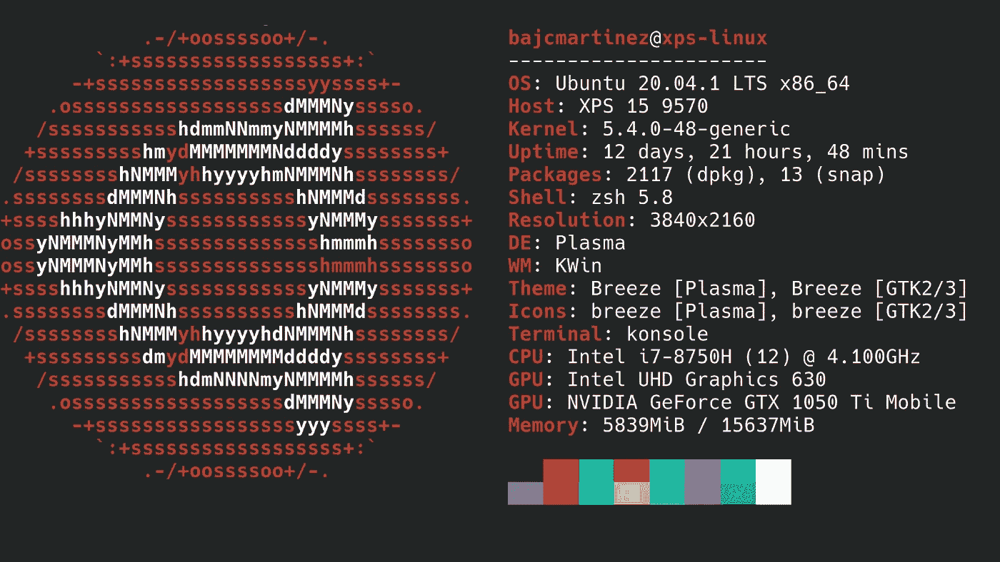

这位作家的电脑的新 fetch

Bash 是“Bourne-Again Shell”的首字母缩写。它是基于 UNIX 和 Linux 的操作系统的默认命令行解释器。在基于 UNIX 和 Linux 的操作系统中，终端窗口由 shell 和 Bash 组成。

Bash 是这些系统的发电站，其中包括 Linux 发行版以及 MacOS 等。学习 Bash 对于执行自动化非常有用。我是一个总是安装新操作系统的人——每次手动设置我所有的配置和程序都很痛苦。现在，多亏了我创建的几个 Bash 命令，我可以完全自动化这个过程。

使用 Bash，我可以安装软件，从网上下载配置，为我的桌面设置配置，等等。

Bash 功能强大，有很多特性。今天，我将介绍一些命令和语句，它们将帮助您自动执行许多操作。

# Bash Shell 脚本指南

对于 Bash shell 脚本，我们需要使用 shell 和文本编辑器。shell 脚本文件的扩展名是. sh。要创建新的脚本文件，请创建一个文本文件，并将其保存为。sh 文件扩展名。我使用 Ubuntu 20.04 来演示和创建 Bash 脚本文件。gedit 是 Ubuntu 和许多基于 Linux 的操作系统的默认文本编辑器。

让我们创建一个新文件 myscript.sh。

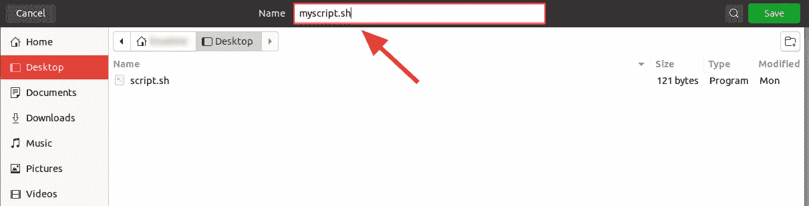

创建 myscript.sh 文件

要执行 Bash 脚本文件，首先我们需要更改文件的权限并使其可执行。使用`chmod +x`命令改变许可。为了使 Bash 脚本文件可执行，您必须打开终端，导航到存储文件的文件夹或目录，并执行以下命令:

```
chmod +x filename
```

现在让我们执行这个:

```
chmod +x myscript.sh command.
```

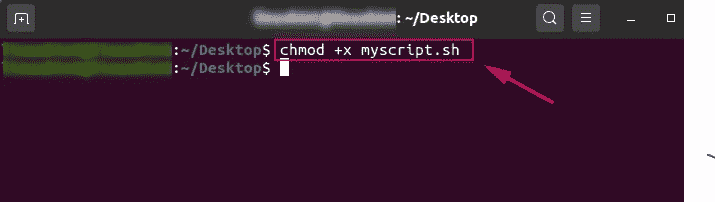

授予文件执行权限

Bash 脚本文件可以通过两种方式执行:

1.  Bash 文件名
2.  。/文件名

要执行 Bash 文件，导航到保存 Bash 文件的文件夹或目录。在第一种执行方式中，只需在终端上写下`bash`和文件名，然后点击回车。将执行 Bash 脚本文件。

对于第二种方法，在终端上写下`./filename`并按回车键。在整个教程中，我们将使用这个方法来执行 Bash 文件。

在 Bash 脚本编写的基础指南中，我们将介绍以下内容:

*   `Echo`命令
*   Bash 脚本文件中的注释
*   `ls`命令
*   变量声明和用法
*   条件语句
*   Bash 中的循环

# 回声命令

echo 命令是 Bash 脚本中最基本的命令。它主要用于打印 linux 终端的文本或输出。无论您写什么，echo 命令都会将文本或数据打印在终端上。让我们打开 myscript.sh 文件，使用 echo 命令在终端上打印一些文本。

```
#!/bin/bashecho "Hello everyone."
echo "We are executing the echo command"
```

输出:输出显示在终端上。

`echo`命令只是在终端上打印出文本。

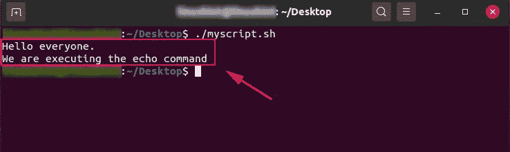

回声样本输出

# Bash 脚本文件中的注释

注释是计算机程序的重要组成部分。它们是不可执行的行。注释增强了代码的可读性，帮助我们理解它的目的。在 Bash 脚本文件中，我们可以添加单行注释和多行注释。单行注释以`#`开头，多行注释以单引号`‘`开头，`:`用于添加注释行。

让我们看一个 bash 脚本中注释的例子:

```
#!/bin/bash# using the echo command
# This is the single line comment
echo "Hello everyone. This is the example of single line comment"
: '
This is the multi line comments
lets print another echo command
'
echo "Bash is intresting"
```

# ls 命令

`ls`命令是您应该知道的非常基本的 shell 命令。`ls`命令列出了文件系统中的文件和目录信息。通过各种选项，可以使用 ls 命令。让我们在 myscript.sh 文件中编写 ls 命令并执行它。也可以直接在终端上执行`ls`命令。

```
#!/bin/bash# using the ls command
ls
```

输出:

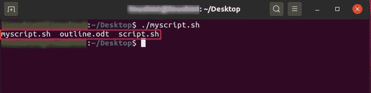

ls 样本输出

# 变量声明和用法

声明变量是为了存储数据。变量是任何编程语言的重要方面。我们可以在变量中存储一些值或信息，以备后用。Bash 中变量的声明和使用非常简单。变量只是通过写变量名来声明。当访问或使用变量名时，我们用变量写`$`符号。

让我们声明变量并在 Bash 脚本文件中使用它们:

```
#!/bin/bash#declaring a variable
VAR="Welcome to the bash scripting"
#using the variable
echo $VAR#declaring the num1 variable
num1=10
#declaring the num2 variable
num2=20
#calculating the sum and storing it in num3 variable
num3=$(($num1+$num2))
#printing the sum
echo "The sum is:$num3"
```

输出:

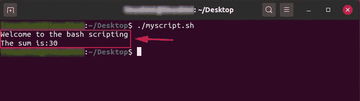

Vars 样本输出

# 条件语句

Bash 中的条件语句用于决策。在条件语句中，一个特定的条件被求值。如果条件为真，则执行某个代码块。否则，执行第二个代码块。

就像在其他编程语言中一样，Bash 中的`if`语句用于评估条件。我们可以通过使用`OR`和`AND`操作符来评估`if`块中的一个或多个条件。在 Bash 中，`if`块以`if`关键字开始，以`fi`关键字结束。如果某个条件为假，则执行`else`块。

让我们来看看 Bash 中条件语句的执行。我们已经声明了一个变量，我们正在评估变量值，并根据变量值做出决定。`–lt`用于进行“小于”比较。为了便于比较，我们用`-gt`表示大于，用`-eq`表示等于。

```
#!/bin/bash#declaring a variable
VAR=7
if [ $VAR -lt 10 ];
then
	echo "The number is less than 10"
else
	echo "The number is equal or greater than 10"
fi
```

输出显示`“The number is less than 10”`是因为变量的值是 7，小于 10。在这个例子中，执行了`if`条件。

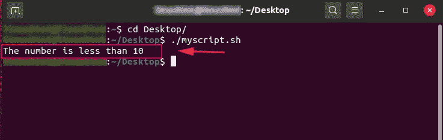

条件样本输出

类似地，我们可以使用`if`块中的`OR`和`AND`条件来评估多个条件。双管符号(`||`用于指定`OR`逻辑，`&&`用于定义`and`操作符逻辑。

让我们看一个 Bash 中的`OR`逻辑的例子:

```
#!/bin/bash#declaring a variable
VAR=7
#using OR operator in if condition
if [[ ( $VAR -gt 5 ) || ( $VAR -eq 7 ) ]]
then
	echo "The number is greater than 5 or equal to 7"
else
	echo "The number is not greater than 5 nor equal to 7"
fi
```

输出:

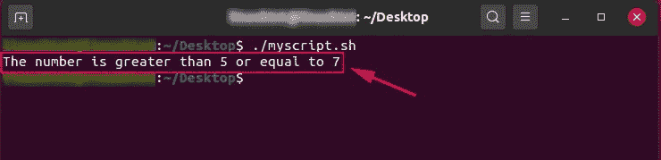

有条件或样本输出

现在让我们在 if 条件中实现`AND`操作符。在`AND`运算符中，两个条件都应该为真。

```
#!/bin/bash#declaring a variable
VAR=7
#using OR operator in if condition
if [[ ( $VAR -gt 5 ) && ( $VAR -lt 10 ) ]]
then
	echo "Both the conditions satisfy"
else
	echo "Both the conditions do not satisfy"
fi
```

输出:


条件与示例输出

## Bash 中的 Else if 语句

e `lse if`条件或语句用于评估多个条件。为了在 Bash 中定义`else if`条件，我们使用了`elif`关键字。

让我们看一个 Bash 中的`else if`语句的例子。我们将从`user`获取输入。`read`关键字用于获取用户的输入:

```
#!/bin/bashecho "Enter a number"
read num
#declaring if condition
if [ $num -gt 10 ];
then
	echo "The number is greater than 10"
elif [ $num -eq 10 ];
then
	echo "The number is 10."
elif [ $num -lt 10 ];
then
	echo "The number is less than 10"else
	echo "Invalid number"
fi
```

输出:

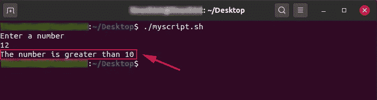

带有 ELSE 示例输出的条件

这就是 Bash 中条件语句的工作方式。

# Bash 中的循环

Bash 中的循环用于重复执行同一个代码块。`while`循环和`for`循环是 Bash 中最常用的循环。

我们将在本节中查看`while`循环和`for`循环的示例。

# Bash 中的 While 循环

`while`循环用于重复执行代码。它评估条件，并继续执行，直到测试条件为假。

Bash 中 while 循环的语法如下:

```
while [ test_condition ]
do
	statements or commands
done
```

如果`test_condition`为真，则执行`do`块。

让我们来看一个`while`循环的例子。循环继续执行，直到变量值小于 10。在`do`块中，我们在每次迭代时将变量的值增加 1:

```
#!/bin/bash#declaring a variable
VAR=1
while [ $VAR -le 10 ]
do
       echo "The vale is: $VAR"
       #Incrementing the variable by 1
       (( VAR++ ))
done
```

输出:

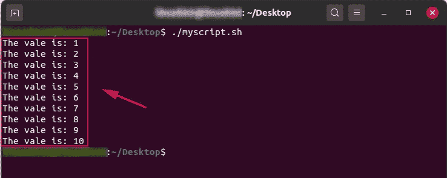

While 循环样本输出

当条件变为假时，循环终止。

# Bash 中的 For 循环

`for`循环也用于执行一个任务或者重复执行同一个代码块。`for`循环的语法如下:

```
for (( i=i; i>10; i++))
do
done
```

这里的`i`是一个变量。

让我们来看一个`for`循环的例子。在给定的例子中，我们递增变量的值，并在每次迭代中打印出来:

```
#!/bin/bash#declaring the for loop
for (( i=0; i<10; i++ ))
do
  #printing the value of variable
  echo -n "$i "
doneecho "\n"
```

输出:

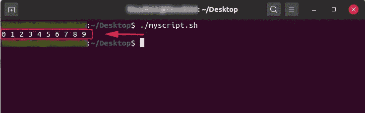

对于循环样本输出

# 结论

Bash 是基于 UNIX 和 Linux 的操作系统的默认解释器。Bash 执行我们写在终端窗口上的命令。命令可以在 bash 中编写和保存。sh)文件，也可以从该文件执行。

在以后的文章中，我们将更详细地探讨可以用来与终端交互的操作和命令。