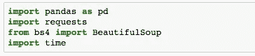
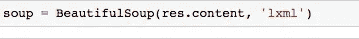
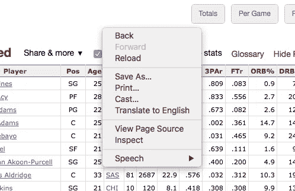
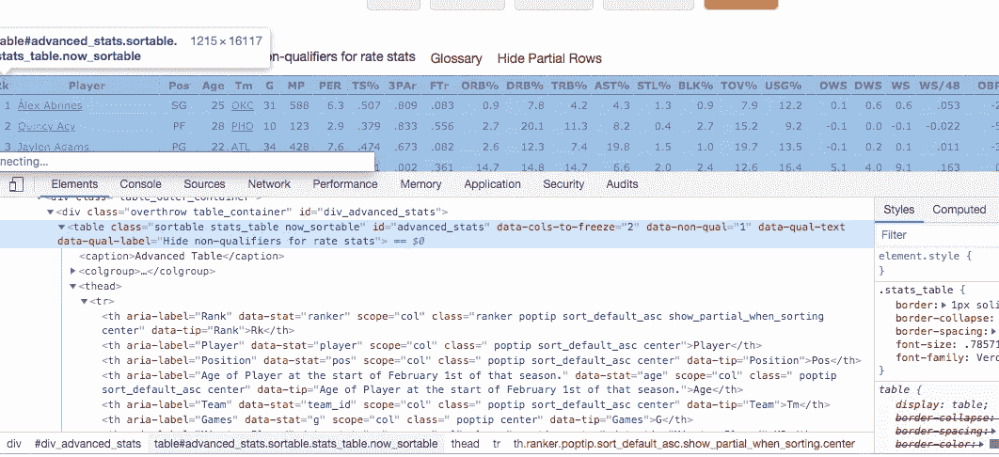
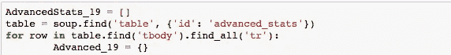
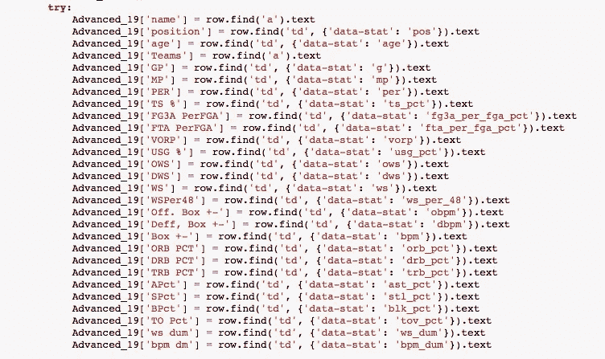
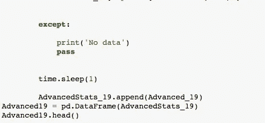
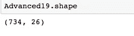
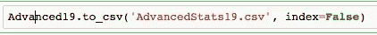

# Python 中的美汤介绍

> 原文：<https://betterprogramming.pub/introduction-to-beautifulsoup-in-python-5ea1c68dc58d>

## 为那些希望从网页中提取数据的人提供的资源

由[艾拉·奥尔森](https://unsplash.com/@ellaolsson?utm_source=medium&utm_medium=referral)在 [Unsplash](https://unsplash.com?utm_source=medium&utm_medium=referral) 上拍摄的照片

在当今的技术环境下，数据非常重要。收集数据是为了研究趋势和分析信息，否则将需要更长的时间来收集。

然而，收集这些数据是棘手的部分。很多时候，数据并没有交给你，你需要出去收集这些数据。

幸运的是，我们有[漂亮的汤](https://www.crummy.com/software/BeautifulSoup/bs4/doc/)，一个 Python 编程语言的库，它允许我们有能力抓取网页数据。有了这些数据，我们可以放入易于查看的列，并进一步评估趋势。

我个人参与的许多项目都需要我使用漂亮的 Soup 库，我的目标是为那些想做同样事情的人创建一个有用的资源。

# 入门指南

首先，我们需要将库导入到笔记本中。这将允许我们从网页上抓取数据。

我们要添加的第一个导入是[熊猫](https://pandas.pydata.org/)，我们将把它作为`pd`导入。

我们将使用的第二个导入是[请求](https://2.python-requests.org/en/master/)，我们可以将它作为`req`导入。Requests 用于从外部 URL 获取 HTML 数据。

在我的情况下，我还导入了时间库，我习惯在再次刮之前暂停一秒钟。这通常在您需要访问多个页面时使用。

我们可能需要这样做的原因是，抓取太快可能会导致你被标记为黑客。黑客试图用请求淹没系统的服务器，最终导致服务器崩溃。

检查网站的条款和条件页面也是一个很好的做法。这是因为条款和条件页可能有关于你可以刮的信息。

现在我们已经有了导入并检查了是否能够抓取我们想要的网页，我们可以检查状态代码了。

第一件事是将所需的 URL 传递到请求库中以获取内容。这允许我们确定网页是否允许我们抓取想要的网页。我将用篮球参考网站作为我的例子。

我们要找的代码是`200`。200 代码表示可以抓取想要的网页。状态代码类似于您在地址栏中输入不存在的 URL 时收到的 404 错误，这意味着未找到*页面*。

通常情况下，以 4 开头的错误意味着您这边有错误。以 5 开头的错误通常意味着服务器出现了错误，您无能为力。

既然我们已经有了`200`状态代码并获得了抓取权限，我们可以用`‘lxml’`解析库将请求的内容放入漂亮的 Soup 中。

现在，我们需要转到我们的网页，右键单击页面上的任意位置，然后单击 *inspect* 。

然后，这将返回页面上的 HTML 内容。

从上面我们可以看到，当我们高亮显示 HTML 标签表格时，它会高亮显示网页上的整个表格。这是完美的，因为这是我们希望收集的数据。

为了抓取我们想要的内容，我们需要找到一些独特的东西来标识特定的表。为此，我们使用`table = soup.find`来查找特定的 HTML 标签。

dictionary 方法在我们正在寻找的`‘table’`中找到特定的 HTML 标签。正如你在下面看到的，我使用了高级统计的 ID，它是如何显示在网页上的。

接下来，我们创建一个空列表。空列表将从循环 HTML 中所有内容的`for`循环中出来。

在一个`for`循环中，我们创建了一个字典，用来自`for`循环的所有信息填充字典，并使用 append 方法将其添加到一个列表中。

当我们查看表格时，我们需要确定每一列中需要哪些属性。同样，我们需要在 HTML 标记中找到特定的信息，以明确返回列中的内容。

我们还可以索引特定的项目，以便更好地识别我们希望提取的内容。

另一个有用的技术是`.all`技术。`.Find_all`方法获取该行中所有单元格的列表。我们可以用它来确定我们正在寻找的 HTML 标签。

返回每一列的全部代码都封装在一个`try`中，除了告诉 Python 如果我们没有抓取任何数据就继续运行。

正如我上面提到的，我使用了 *sleep 1* ，告诉 Python 在每次刮擦后休眠一秒钟。

在这里，我将列表添加到字典中，并使用名称*数据帧*。为了进行健全性检查，我还要求输入前五行数据，以确保所有数据都是有序的。

我们还可以查看形状，以了解新数据框中有多少列和多少行。

此时，我们使用 panda 的`.to_csv`将数据帧转换成 CSV 格式。

希望这篇文章对那些希望从网页中提取数据的人有所帮助。我决定写这篇文章，因为美丽的汤是我的顶点的巨大部分。

我觉得这是一项非常有价值的技能，可以用来返回一个 CSV，您可以在其中进一步研究您的数据。