# 二分搜索法树简介

> 原文：<https://betterprogramming.pub/introduction-to-binary-search-trees-dde166368210>

## 了解如何在 C#中向二叉查找树添加节点

照片由[维克多·詹布拉诺](https://unsplash.com/@tanrenzu?utm_source=unsplash&utm_medium=referral&utm_content=creditCopyText)在 [Unsplash](https://unsplash.com/search/photos/tree?utm_source=unsplash&utm_medium=referral&utm_content=creditCopyText) 上拍摄

我叫亚历克西斯，是计算机科学和数学专业的一名大四学生。我对算法和图形很着迷，今天我想通过一个二叉查找树的例子来编码。

*注:我不是一个完美的程序员。我知道我会犯错误，会错过使代码更好的显而易见的方法，但是现在，我只想向您展示一个简单、易于理解的二叉查找树工作模型。*

二叉查找树是这样一种图，其中每个节点只能有两个子节点，一个右节点和一个左节点。左侧节点总是小于其父节点，右侧节点总是大于其父节点。总是有一个节点开始树，它被称为“根”节点。这是一个二叉查找树的例子:

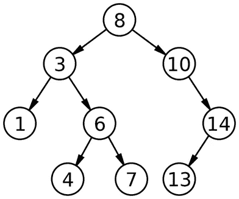

来自[https://en.wikipedia.org/wiki/Binary_search_tree](https://en.wikipedia.org/wiki/Binary_search_tree)

在二叉查找树中添加、删除和查找节点有特定的算法，但我们将在后面介绍这些算法。

这个项目我用的是 Visual Studio。所以我首先点击“创建一个新项目”并选择“控制台应用程序(。NET Core)”作为项目的类型。我将我的命名为“BinarySearchTreeExample ”,但是您可以随意命名它！然后点击创建和 PRESTO！！您有一个类似如下的空白 Visual Studio 项目:

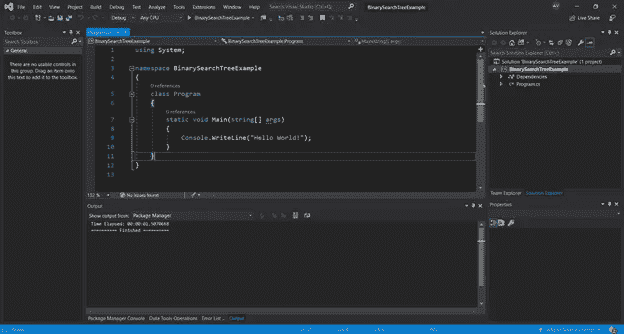

我要做的第一件事就是右键单击右侧的项目(请原谅我糟糕的突出显示):

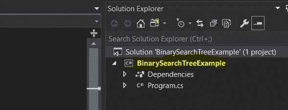

将鼠标悬停在“添加”上，然后单击“课程…”。我把我的类命名为“Node ”,但是你可以随意命名。您应该会得到一个类似如下的新文件:

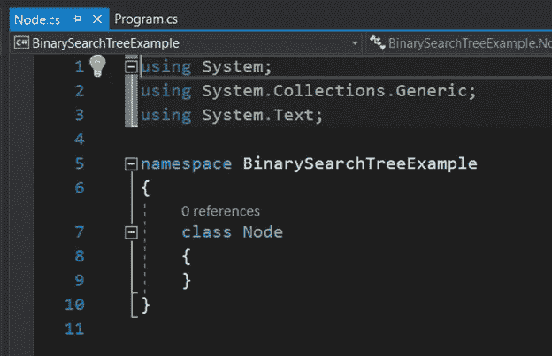

如果你回头看看这篇文章开头的二叉查找树的图片，你会注意到在每个圆圈或“节点”上都有一个数字。我们将把这个数字称为我们的`label`。因此，我在`Node`类中创建了一个公共字段来存储我们的`label`:

您还会注意到每个`Node`的左边和右边各有一个分支。我们可以通过创建代表这些节点的两个变量来添加这些边:

厉害！现在让我们创建一个构造函数。当我们想要创建一个新的节点来添加到我们的图中时，我们就调用构造函数。

当我们创建一个新节点时，我们将传入我们想要给它的值，所以占位符`data`就在这里发挥作用了。您还会注意到，我将 left 和 right 设置为`null`，这实质上意味着它们是“空的”。我们马上将左边和右边的子节点设置为`null`,因为这些节点在被添加到图中之前不能有子节点，而且现在它们不是图的一部分。他们刚刚被创造出来。

好吧！我们有了制作节点的基础。让我们回到`Program.cs`，开始初始化树。

我在`Program.cs`做的第一件事就是删除`Console.WriteLine(“Hello World!”);`，因为我们的程序不再需要它了。

接下来，重要的是要注意，我们不需要为图中的所有节点设置变量，因为只要我们有办法到达树的根节点，父节点和子节点之间的连接就应该能够让我们到达树中的所有其他节点。因此，我首先创建一个变量来保存我们树中的根节点:

不要担心`root`下面的绿色曲线，它很快就会消失。

我们需要能够对我们的树做的下一件事是添加新的节点。所以，我返回到`Node.cs`添加一个函数，允许我向树中添加新的节点。

为了将节点连接到树，我们需要能够看到树。所以我们必须为根节点传入一个引用:

我想做的第一件事是确保根节点不是空的，因为如果我们试图比较新节点的值和根节点的值，但是根节点是空的，我们会得到一个错误。一个非常简单的`if`语句检查了这一点。我添加了一个`Console.WriteLine()`，这样如果我的程序失败了，我就可以通过查看控制台来了解原因:

*有趣的 Visual Studio hack:如果你输入字母“CW”并按 tab 键两次，它会为你填写语法，你只需填写括号之间的部分！*

接下来我要检查的是重复值。如果你允许重复值，二分搜索法树会变得更加复杂，所以为了这个程序的目的，我们不允许这样做。

现在我们需要知道向树中添加节点的算法。假设我有这棵树:

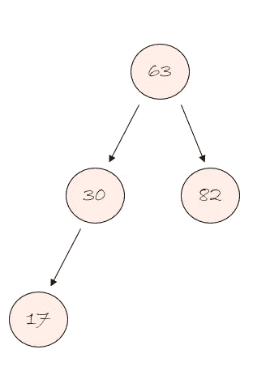

我想给它加上节点 23。我们将从顶部节点开始，并决定它是属于它的左边还是右边。

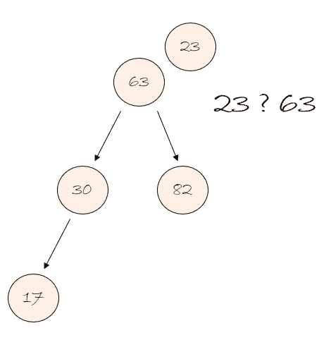

由于 23 小于 63，所以属于左派。

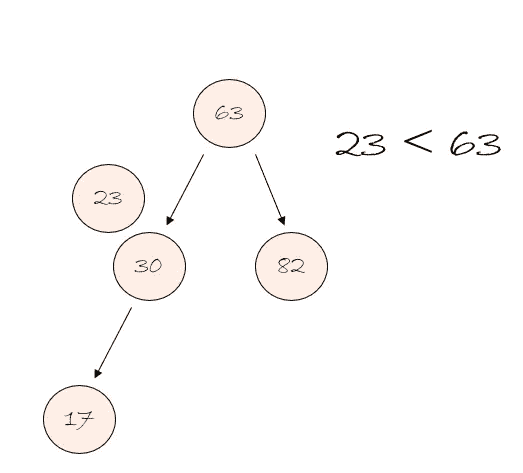

此时，我们可以忽略树的某些部分。我们知道我们永远也不会碰到 63 或 82，因为从我们所在的地方没有指向它们的箭头。我们唯一的选择就是去箭头所指的地方，也就是向下。所以，我们可以忽略这两个节点，假装我们有一个新的树。

新的树看起来像这样:

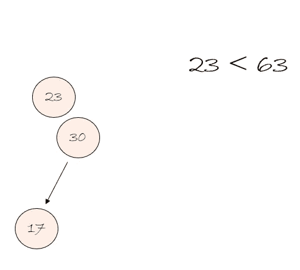

现在，我们可以比较 23 和 30。

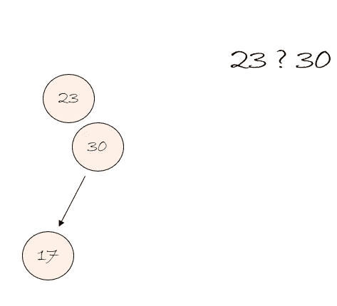

因为 23 小于 30，所以我们向左走。

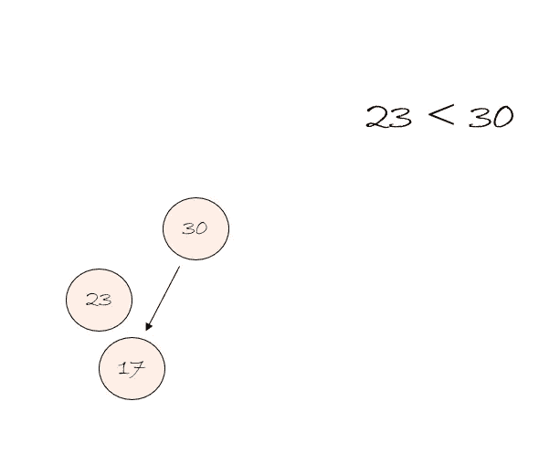

现在我们可以重复忽略不可达节点的过程。

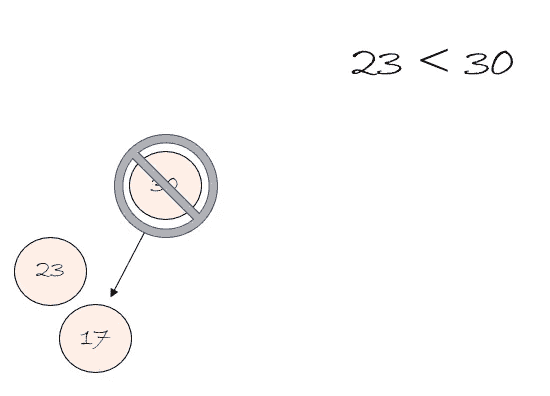

新树只是一个节点:

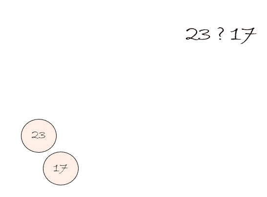

现在，我们必须决定它是属于 17 的左边还是右边。既然 23 大于 17，就属于右。所以，我们把它移到下面，但是没有什么可以比较。所以，我们不是比较，而是成为 17 右边的节点。

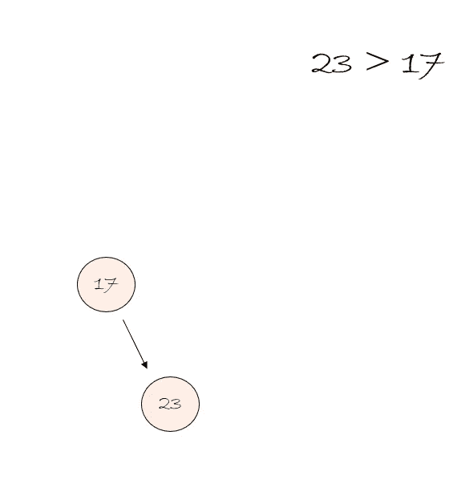

现在，这棵树看起来像这样:

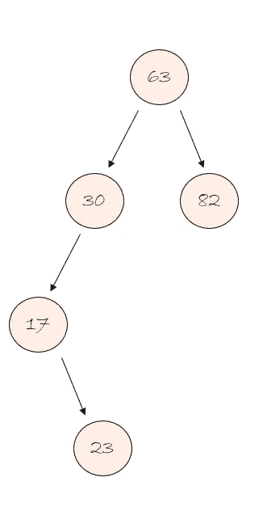

为了在我们的代码中实现这一点，我们进入了我们的`AddNode`函数。在代码的这一点上，我们已经有一个新的节点位于图表的顶部。我们的第一步是决定新节点需要向左还是向右。我们通过将其与我们所在的节点进行比较来决定。所以，我们可以从添加那些 if/else 语句的外壳开始。

下一步是确保有一个节点可以与之进行比较。所以，让我们把它加进去:

如果没有什么可以比较，那么我们知道它属于那个地方！所以，让我们加上那部分:

关键字`this`是 C#引用我们正在查看的当前对象的方式。因此，在上面的例子中，节点 23 将通过使用`this`关键字到达。

现在，这是棘手的部分。如果我们有新的节点与之比较，我们需要重复整个过程，但我们不能只是重新编写，因为我们不知道我们需要重复这个过程多少次。那么，我们能做什么…

我们知道，如果我们有可以比较的东西，我们可以忽略已经经过的树的其余部分。这有点像有了一个新的根节点。那么，如果我们再次调用这个函数并传入一个新的根节点会怎么样呢？那叫递归！所以，让我们加上那部分:

让我们通过返回到`Program.cs`并添加一个调用它的方法来测试它！

我知道我要随机地给这棵树添加数字，所以我要初始化一个新的随机变量。在 C#中，这样做的方法是这样的:

我要写一个`for`循环。`for`循环本质上是告诉计算机重复某件事情一定的次数。现在我想这样做五次，所以我的 for 循环看起来像这样:

有趣的 Visual Studio hack:如果你输入“for”并按 tab 键两次，它会为你填写所有内容，你只需改变你希望它重复的次数

从这里，我可以添加新的节点。首先要做的是，我需要创建一个随机数，并将其添加到树中。

我现在只调用了我的变量 x，我让它在 0 到 100 之间选择一个随机数。

接下来我们要做的是创建一个值为“x”的节点:

接下来，我们可以使用我们编写的函数将 n 添加到图形中。

然而，我们有一个问题。注意`root`是如何被设置为`null`的，并且我们将它传递给我们的函数？这是一个问题，因为在我们的`AddNode`函数中，我们说过如果`root`等于`null`，什么都不做。这段代码执行五次就什么也不做了！因此，我们需要添加一种方法来检查`root`是否是`null`，如果是，那么我们只需将`root`设置为我们创建的第一个节点。看起来像这样:

现在我们的代码应该工作了！让我们按下这个播放按钮来试试:

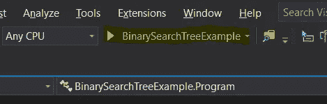

这是我得到的输出。你的会有所不同，因为我们使用了随机数:

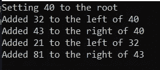

这意味着我们试图将 40、32、43、21 和 81 添加到我们的树中。阅读这个输出并不能使图形非常容易地可视化，但是我们可以把它画出来看看是否有效！

我们从一个空图开始，然后尝试添加 40，它被设置为树的根:

然后我们试着加上 32，它小于 40，所以它向左:

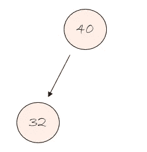

不错！我们输出的第二行是正确的，我们在 40 的左边加了 32。接下来，我们将尝试添加 43。43 大于 40，所以它向右移动:

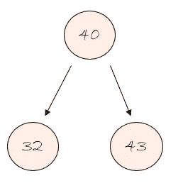

这意味着我们的第三行输出是正确的！接下来是 21，小于 40，所以我们向左。21 小于 32，所以我们也要去它的左边:

最后我们尝试加 81。81 大于 40，所以我们向右走。81 也大于 43，所以我们要把自己加到 43 的右边:

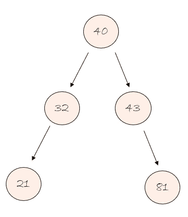

这意味着最后一行输出是正确的！完美！

下次我们将看到如何从二叉查找树中删除项目。

感谢阅读！！