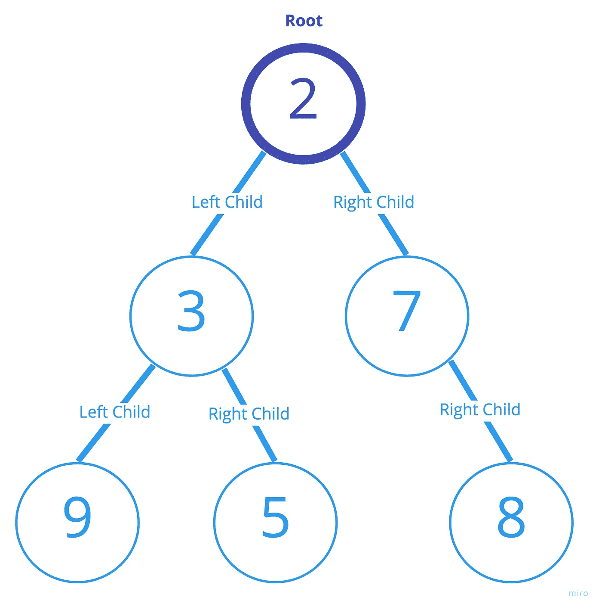

# 二叉树简介

> 原文：<https://betterprogramming.pub/introduction-to-binary-trees-deaabd5832bd>

## *和 C 中的其他树形数据结构*

照片由[大卫·维格](https://unsplash.com/@davidvig?utm_source=unsplash&utm_medium=referral&utm_content=creditCopyText)在 [Unsplash](https://unsplash.com/search/photos/tree?utm_source=unsplash&utm_medium=referral&utm_content=creditCopyText) 上拍摄

在计算机科学中，*二叉树*是由链接在一起的节点构成的层次数据结构。第一个节点称为根节点，每个节点最多可以有两个子节点，一个左节点和一个右节点。

单独来看，它们的用途似乎有限，但是当作为二分搜索法树或二进制堆实现时，它们提供了快速排序和搜索数据的方法。它们也是一个很好的学习机会，因为在 C 中用来实现它们的大多数函数都涉及到递归、指针交换和其他高级但有趣的编程概念。让我们看看如何用 c 实现它们。

# 二叉树:术语

正如我们在引言中提到的，二叉树由一个根节点和子节点定义，每个节点最多有两个子节点。在继续之前，我们需要知道几个关键词。

*   *高度—* 节点的高度是将该节点与叶子分开的最大边数(见叶子)。
*   *深度—* 节点的深度是将该节点与根节点分开的边的数量。
*   *大小—* 一棵树的大小是它包含的节点数。
*   *平衡—* 节点的平衡因子是其左侧子树的高度与其右侧子树的高度之差。
*   *叶子—* 叶子是一个没有任何子节点的节点，换句话说，是一个结束节点。

# **二叉树的基本操作**

现在我们已经掌握了二叉树的术语，让我们看看如何操作它们。

对于我们的例子，我们将使用这个结构定义:

注意，我们在`bt_t`中输入了`struct binary_tree`。这样我们在使用这个结构时就可以使用名字`bt_t`,而且更短。

每个节点只包含一个 int，一个指向当前节点父节点的指针，一个指向左边子节点的指针，和一个指向右边子节点的指针。下面是添加几个节点后二叉树的简单表示:

## 确定树的高度

下面是一个返回节点高度的简单函数:

我们来分析一下这个函数。返回类型是`size_t`，类似于`unsigned integer`，因为高度不能低于零。传递给它的参数是一棵`bt_t`树的`pointer`。

我们首先声明两个变量:一个用于左子树的高度，一个用于右子树的高度。然后我们有了`base case`，它将停止递归。如果`tree`指向`NULL`，则返回零。

然后我们用*三元运算符*求出我们的两个高度(左右子树)。如果当前节点树有一个左子节点，那么`height_l`的值等于 1 加上对左子节点上的函数的递归调用的返回值。如果不是，则该值被设置为零。

我们对右边的子树重复相同的操作，并将其分配给`height_r`。最后，用另一个三元运算符，我们确定哪个高度最大，我们返回它。

递归部分可能会让大多数人迷惑，但是它背后的思想很简单。我们遍历树，直到我们到达树叶，每次增加一个高度，并将该值返回到我们的高度变量，或者在左边或者在右边。

为了这篇文章的目的，我们不会演示我们可以在二叉树上做的每一个操作。但是，节点高度的计算是一个简单且非常有代表性的算法。

## 不同类型的遍历

由于二叉树不像数组或链表那样是线性的，我们可以用很多方式遍历它们(循环遍历每个节点)——前序、按序和后序。

但是首先，我们为什么要遍历二叉树呢？如果我们想对树的每个节点进行操作，我们需要遍历它。

让我们构建三个类似的遍历二叉树的函数。它们都有一个指向树的指针和一个指向接受 int 的函数的指针(就像我们的 struct 中的`n`元素一样)。

我们可以注意到，在所有情况下，我们在`tree`节点的`n`元素上调用函数指针`func`，并且我们在左右子树上递归。该函数将在递归的每个阶段执行，直到我们到达基本情况:到达树的末端(一片叶子)。

例如，我们的`func`参数可以是一个指向打印整数的函数的指针。使用上面的函数，我们将看到为树的每个节点打印的`n`元素。

在这三种情况下，操作顺序都不同:

*   对于*前序遍历*，我们先访问根节点，然后是左子树，再是右子树。
*   对于*的有序遍历*，我们访问左边的子树，然后是根节点，然后是右边的子树。
*   对于*后序遍历*，我们先访问左边的子树，然后是右边的，最后是根节点。

换句话说，pre、In、post 只是根节点在遍历顺序中的位置。

# 其他类型的树

二叉树很容易理解，与其他有趣的树状结构相比，它可能不是特权数据结构。

## 二分搜索法树

这种数据结构与二叉树相同，只是它的排序遵循以下规则:

*   每个节点的左子节点的值必须小于节点本身的值。
*   每个节点的右子节点必须具有比节点本身更大的值。
*   每个节点的左右子树也必须遵循这些规则。

这种结构允许更快的搜索和插入/删除，因为每个值在树中都有一个唯一的位置。二叉查找树上这些操作的平均时间复杂度是 O(log(n))。

## AVL 树

这些树以发明家阿德尔森-维尔斯基和兰迪斯的名字命名，是平衡的二分搜索法树。这意味着每个节点的左右子树之差的绝对值必须是 1 或 0。

换句话说，左子树的叶子不能比右子树的叶子多一层或少一层。通过确保树的高度保持平衡，我们避免了增加树中搜索操作的时间复杂度。

## 堆二叉树

这种数据结构类似于二分搜索法树，但是节点的顺序不同，树是完整的。一个完整的树是一个所有级别都被填充的树，除了最后一级。这使得堆树非常适合将它们存储到数组中。

有两种有序堆:最小和最大。在最大堆中，最大值必须是根的值，并且每个节点的每个子节点的值必须小于该节点的值。这意味着值是从顶层到底层排序的。在 min 堆中，情况正好相反。在堆树上搜索、插入和删除的时间和复杂度平均为 O(n ),这是相当快的。

# 结论

当我们学习如何编程时，了解二叉树是掌握数据结构的重要一步。它们可以通过多种方式实现，并具有多种有趣的属性。用 C 编程语言实现它们可能很有挑战性，但也很有价值，绝对值得！

## 来源

 [## 二叉树的高度、大小和深度是多少？

### 回答(第 1 题，共 4 题):树有三个重要的属性:高度、深度和水平，以及边缘和路径…

www.quora.com](https://www.quora.com/What-is-the-height-size-and-depth-of-a-binary-tree)  [## 二叉查找树极客书店

### 二叉查找树是一种基于节点的二叉树数据结构，它具有以下特性:a 的左子树…

www.geeksforgeeks.org](https://www.geeksforgeeks.org/binary-search-tree-data-structure/)  [## 数据结构和算法树

### 数据结构和算法树-学习数据结构和算法使用 C，C++和 Java 在简单和容易…

www.tutorialspoint.com](https://www.tutorialspoint.com/data_structures_algorithms/tree_data_structure.htm)  [## AVL 树|集合 1(插入)- GeeksforGeeks

### AVL 树是一种自平衡二叉查找树(BST ),其中左右子树的高度差…

www.geeksforgeeks.org](https://www.geeksforgeeks.org/avl-tree-set-1-insertion/)  [## 二进制堆- GeeksforGeeks

### 二进制堆是具有以下属性的二叉树。1)这是一个完整的树(所有级别都完全填满了…

www.geeksforgeeks.org](https://www.geeksforgeeks.org/binary-heap/)