# Byobu 简介:窗口管理器和终端多路复用器

> 原文：<https://betterprogramming.pub/introduction-to-byobu-a-window-manager-and-terminal-multiplexer-d8ef0cc278d9>

## 关于如何使用 byobu 的完整指南

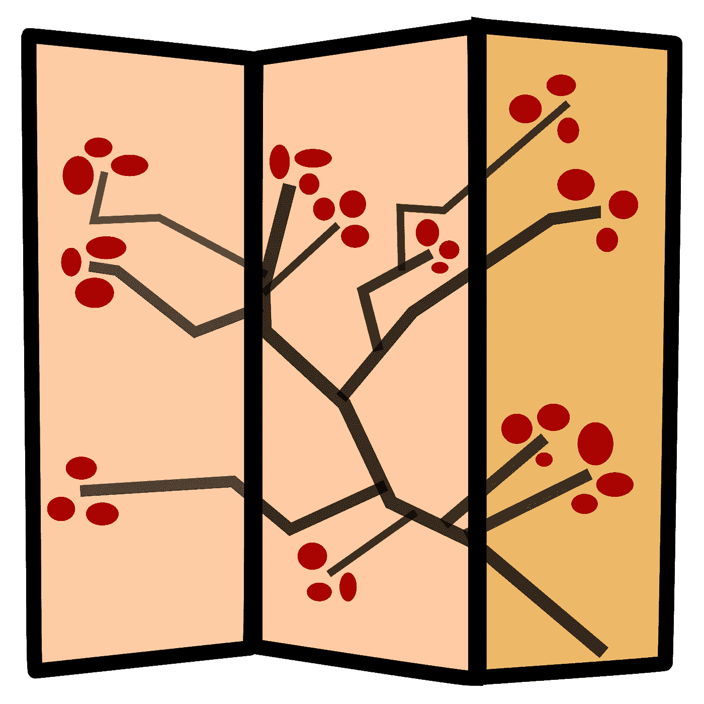

达斯汀克尔兰，CC BY-SA 3.0<[https://creativecommons.org/licenses/by-sa/3.0](https://creativecommons.org/licenses/by-sa/3.0)>，通过维基共享

Byobu ( [读作](https://drive.google.com/file/d/1nJ2kDVZmGdSlCIjYW7E5pwfwnJSqREWa/view?usp=sharing))是一个日语术语，指的是装饰性的多面板屏风，可以作为折叠的房间隔断。Byobu 也是一个开源软件项目，是一个基于文本的窗口管理器和终端复用器。一个终端复用器(简称`tmux`)同时管理多个终端会话。

[GNU Screen](https://en.wikipedia.org/wiki/GNU_Screen) 是一个终端复用器，用在类 Unix 操作系统上。 [Tmux](https://en.wikipedia.org/wiki/Tmux) 是另一个终端复用器，包含了 GNU 屏幕的大部分特性。Byobu 是 GNU Screen 或 tmux 的增强版，用于 Linux 操作系统。Byobu 具有以下功能:

*   它支持状态通知。
*   它将状态保存在远程服务器上。
*   它管理终端窗口。

让我们安装`byobu`并探索这些特性。

# Intall Byobu

在 macOS 上，`byobu`可以安装`brew`:

```
% brew install byobu
```

安装输出建议在配置文件中设置`BYOBU_PREFIX`:

```
export BYOBU_PREFIX=/usr/local
```

在终端窗口中，键入以下命令，特定窗口将启动一个`byobu`会话。

```
% byobu
```

键入以下命令，任何新打开的终端窗口都会自动启动一个`byobu`会话。

```
% byobu-enableThe Byobu window manager will be launched automatically at each text login.To disable this behavior later, just run:
  byobu-disable
```

根据输出规定，自动`byobu`会话可通过`byobu-disable`禁用。

本文的其余部分不使用自动的`byobu`会话。

# 状态通知

这是一个普通的终端窗口:

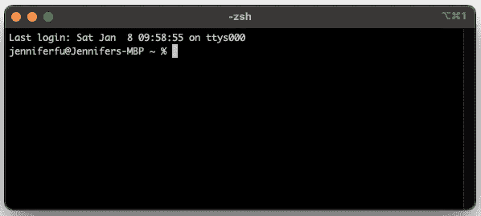

作者图片

一旦`byobu`开启，就会有一些变化:

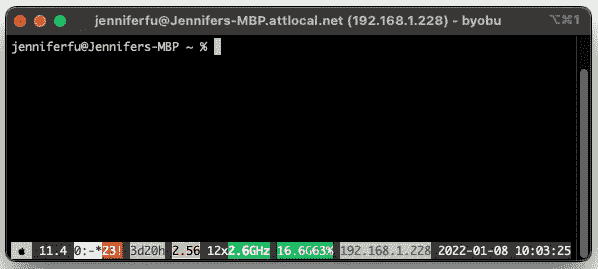

作者图片

1.  终端窗口的标题提供了有关用户和系统 IP 地址的更多信息。
2.  终端窗口的底部显示了许多彩色的状态信息。

*   徽标—操作系统的徽标，这是一个 Apple 徽标。
*   arch——系统架构，也就是`macOS 11.4`。
*   窗口(windows )-每个打开的窗口都有编号，当前活动窗口突出显示并由星号指示。
*   apport——如果有未决的崩溃报告，则显示的符号是`23!`。
*   正常运行时间——自上次启动以来系统的总正常运行时间，即`3d20h`。
*   load_average —过去 1 分钟的系统平均负载，表示使用了`2.56` CPU 资源。
*   cpu_count —系统上 cpu 或核心的数量，为`12`。由于使用了`12`个 CPU 中的`2.56` 个，所以系统大约使用了`21%`个。
*   cpu_freq —每个 cpu 的当前频率，为`2.6GHz`。
*   内存—系统中可用的总内存(`16.6G`)和已用的百分比(`63%`)。
*   ip_address —可以配置为显示 IPv6 地址的系统(`192.168.1.228`)的 IPv4 地址。
*   日期—系统日期，即`2022–01–08`。
*   时间—系统时间，即`10:03:25`。

3.通过`Shift-F5`可以切换状态信息。


*   `whoami` —拥有屏幕会话的用户的名称。

4.底部的状态会以合理的时间间隔自动刷新。点击`F5`重新加载配置文件并刷新状态。

# 远程服务器状态已保存

Byobu 处理 ssh 会话的方式不同于普通的终端窗口。让我们比较一下不同之处。

## 正常终端窗口

我们有一个安装了 [Create React App](/an-in-depth-guide-for-create-react-app-5-cra-5-b94b03c233f2) 的远程服务器。我们使用普通的终端窗口 ssh 到服务器，并执行`npm start`。远程桌面显示 Create React App 在`localhost://3000`运行。

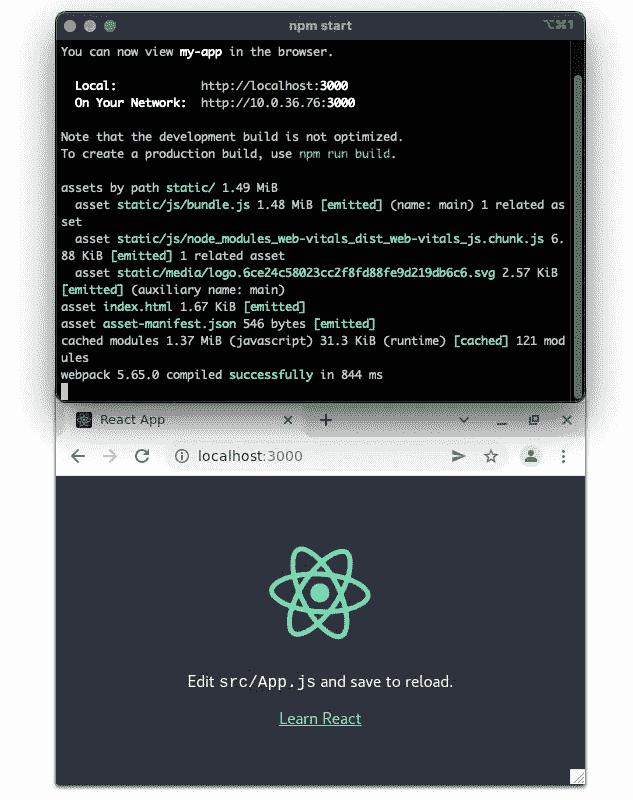

作者图片

我们对`kill -9 <ssh process id>`执行一个命令，远程进程和 ssh 会话一起退出。

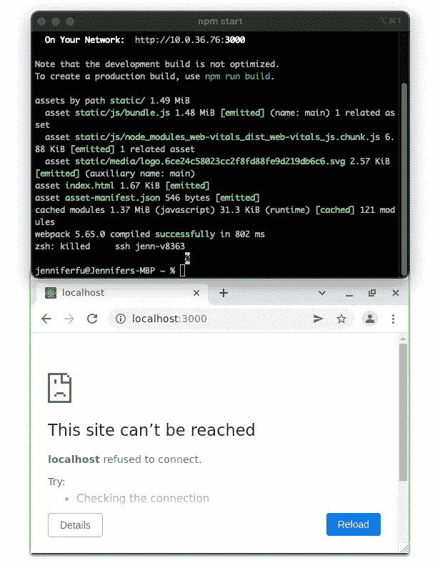

作者图片

## Byobu 终端窗口

我们使用一个`byobu`终端窗口运行相同的用例。执行`npm start`，远程桌面显示在`localhost://3000`运行 Create React App。

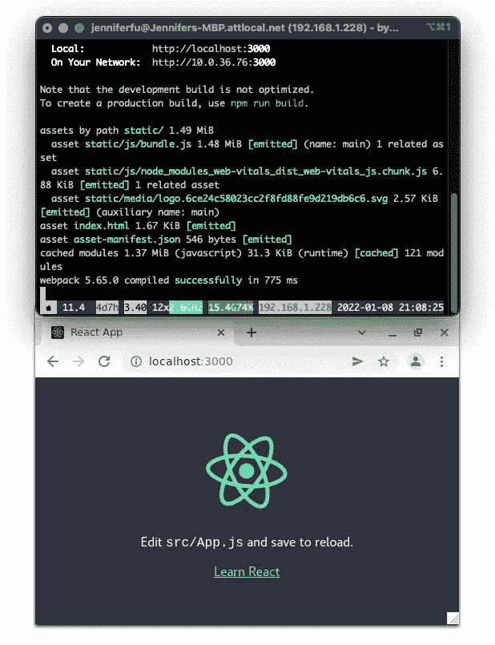

作者图片

我们对`kill -9 <ssh process id>`执行一个命令，远程桌面显示进程继续运行，尽管 ssh 会话已经退出。

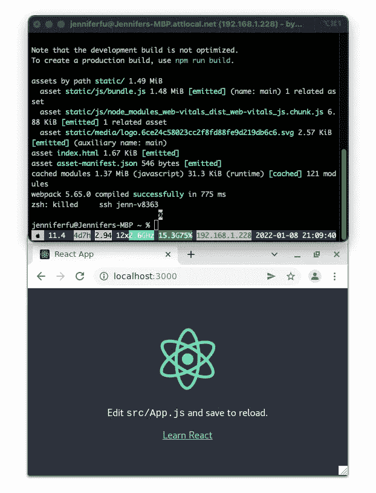

作者图片

一般来说，我们可以使用 byobu 来连接、断开、重新连接，甚至让其他用户访问它。无论 byobu 终端窗口是否存在，会话都将继续保持活动状态。

# 管理终端窗口

Byobu 是一个基于文本的窗口管理器和终端复用器。它管理多个窗口和多个会话。

点击`Shift-F1`，我们看到 byobu 的用法:

我们添加第 45 行来显示如何退出当前窗口、会话或`byobu`本身。

可能有多种方法来完成同一件事。例如，第 7 行和第 8 行显示了在窗口间移动焦点的不同方式。

由于平台上的键绑定冲突，某些组合键可能无法在特定平台上工作。例如，我们不能在 macOS 上使用`Ctrl-6`退出。

## 普通终端窗口上的选项卡

我们可以在普通的终端窗口上创建标签。点击`Cmd-t`可以生成新的标签页。标签共存于一个终端窗口中，但是我们一次只能查看一个标签。

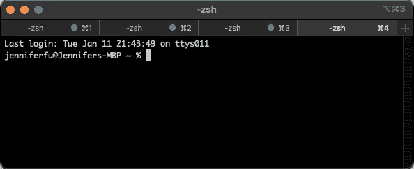

作者图片

## 创建新的 byobu 窗口

对于`byobu`终端窗口，点击`F2`会启动一个新窗口，类似于终端窗口的标签页。Byobu 窗口共存于 byobu 终端窗口上，但我们一次只能查看一个选项卡。

点击`F2` 3 次，我们就有了 4 个 byobu 窗口(包括原来的)。它们被命名为`0`、`1`、`2`和`3`。最后一个(编号为`3`)处于活动状态。

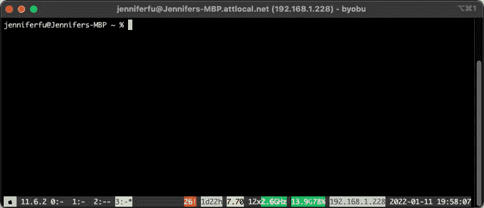

作者图片

通过点击`F3`或`F4`，我们可以在不同的窗口上来回移动焦点。

通过点击`F8`，我们可以重命名当前窗口。我们将窗口`2`重命名为`second`，将窗口`3`重命名为`third`。现在 4 个窗口被命名为`0`、`1`、`second`和`third`。

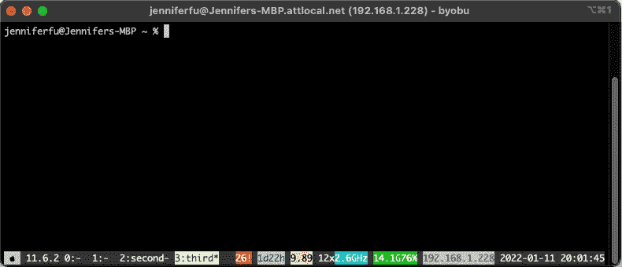

作者图片

## 创建新的 byobu 会话

启动另一个终端窗口，并将其转换为 byobu 终端窗口(键入`byobu`)。新的终端窗口镜像上一个 byobu 终端窗口。我们在一个终端窗口中输入，它会显示在两个终端窗口中。

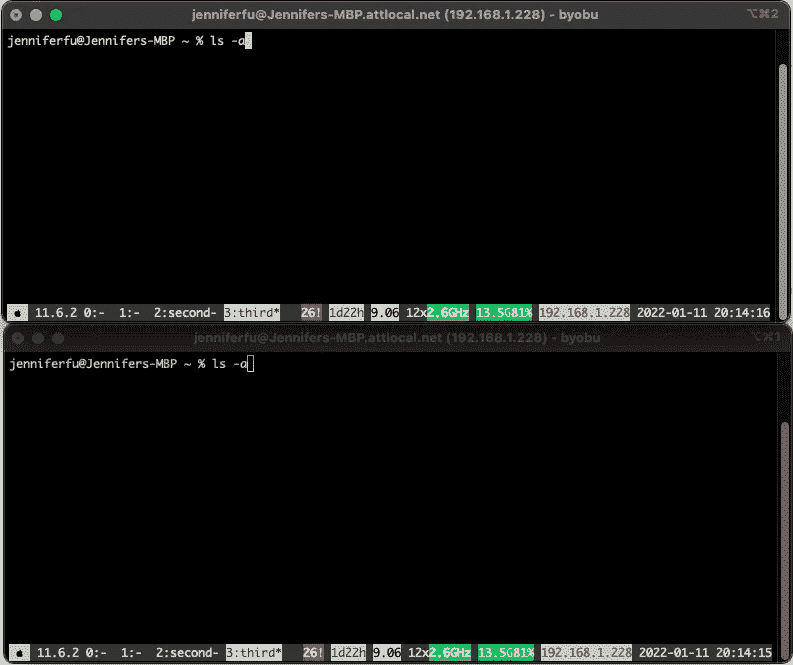

作者图片

这是因为两个终端窗口共享同一个会话。如果每个终端窗口都需要有一个单独的会话呢？

我们可以创建一个新会话。byobu 菜单上说`Ctrl-Shift-F2`可以用，但是在 macOS 上不能用。

相反，我们可以使用命令来实现它。`byobu new`创建一个未命名的会话。`byobu new -s <session-name>`创建命名会话。

键入`byobu new -s newSession`创建第二个 byobu 终端窗口。而现在，两个 byobu 终端窗口是独立的。

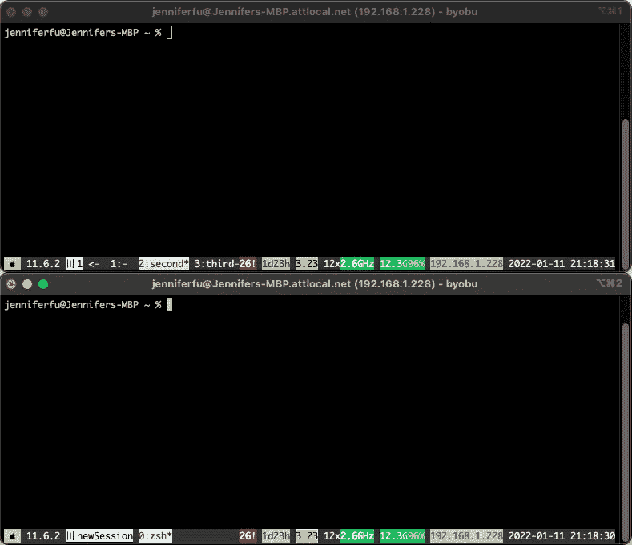

作者图片

此外，我们会看到一个新的会话状态通知。

会话—每个 byobu 会话显示一个会话名称，如果未命名，则显示一个会话编号。

当我们有多个 byobu 会话时，键入`byobu`会询问附加到哪个会话。我们有 4 个选择:

1.  连接到会话的现有 tmux，`1`，它有 4 个窗口。
2.  附加到会话的现有 tmux，`newSession`，它有一个窗口。
3.  创建新的 byobu 会话。
4.  运行一个没有 byobu 的 shell。

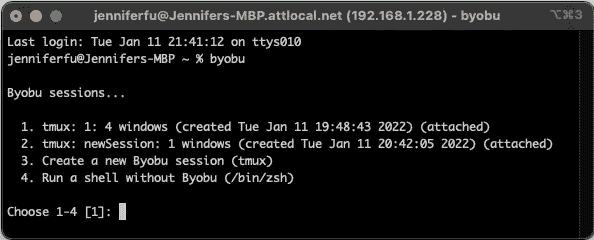

作者图片

这些选项也可以通过命令`byobu-select-session`调用。

## 创建拆分 byobu 窗口

到目前为止，我们一次查看一个`byobu`窗口，类似于终端窗口的标签。其中一个很酷的功能是创建多个可以同时查看的拆分 byobu 窗口。

点击`Shift-F2` 2 次，我们得到 3 个水平分割的 byobu 窗口。

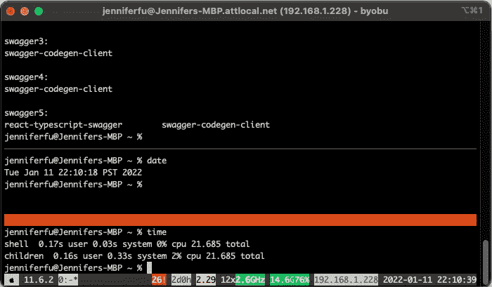

作者图片

我们可以使用`Shift-Left` / `Shift-Right` / `Shift-Up` / `Shift-Down`在拆分中移动焦点。在每个活动窗口中，我们可以执行工作。我们能同时看到这些窗户真是太好了。

在我们尝试使用`Ctrl-F2`来创建垂直分割之前，它工作得非常完美。它在 macOS 上不工作。此外，调整窗口大小有点粗糙。我们希望有鼠标支持分裂`byobu`窗口。

我们做什么呢

创建文件`~/.byobu/.tmux.conf`，解决了我们所有的问题。

第 1 行设置键绑定前缀到反勾号(```)。

第 2 行启用鼠标支持。

第 3 行设置终端颜色。

链接 4 绑定键``r`来刷新配置文件。

链接 5 绑定键``-`以创建垂直分割。

链接 6 绑定键``|`以创建水平分割。

有了这个神奇的配置，我们可以自由地创建拆分，并使用鼠标来选择和调整拆分的大小。

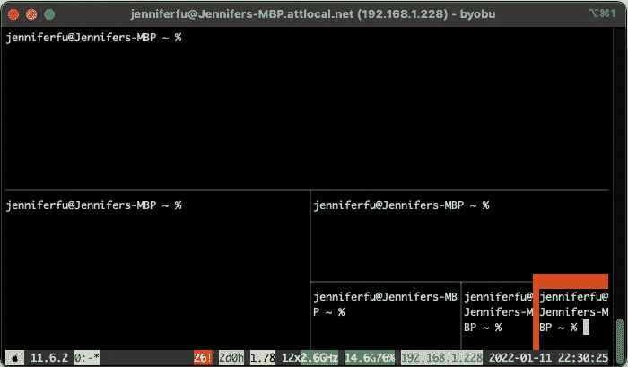

作者图片

`Shift-F11`放大分割，同样的命令缩小分割。

还有什么？

我们可以合并分割窗口吗？

是的，最简单的方法就是退出不想要的窗口(`Ctrl-d`)。

# 结论

我们展示了`byobu`，一个基于文本的窗口管理器和终端多路复用器的很酷的特性。它帮助我们保持远程桌面会话，即使在 ssh 会话存在之后。此外，窗口分割呈现了当前工作的多个部分的全局视图，这在当今的微服务云环境中很有帮助。

你可以去 byobu 官方网站查看更多细节。

感谢阅读。我希望这有所帮助。如果你有兴趣，可以看看[我的其他媒体文章](https://jenniferfubook.medium.com/jennifer-fus-web-development-publications-1a887e4454af)。

*注:感谢 Urian Chang 和 Marc Mercer 对 byobu 命令和配置的贡献。*