# CSS 的 Chrome DevTools 简介

> 原文：<https://betterprogramming.pub/introduction-to-chrome-devtools-for-css-8d0f90ac860b>

## 让我们看看 DevTools 的五个广泛用途

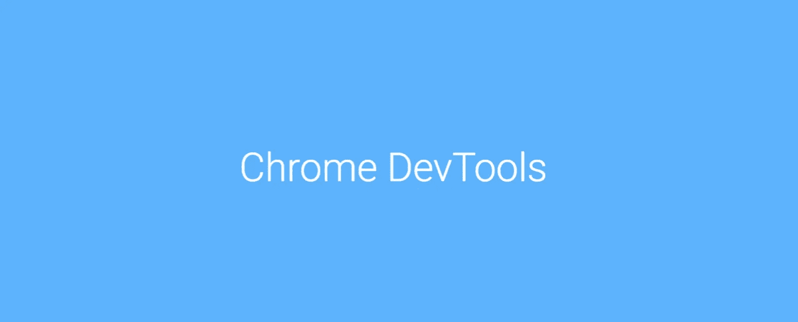

在本指南中，我将涵盖使用 Chrome DevTools 的五大领域:

1.  在*样式*和*源*选项卡中查看 CSS。
2.  在*样式*和*计算*选项卡中编辑和过滤。
3.  模拟移动视口。
4.  在 *Coverage* 选项卡下查看未使用的 CSS。
5.  查看打印页面。

如果你以前没有使用过 Chrome [DevTools](https://developers.google.com/web/tools/chrome-devtools) ，它很容易上手，你会发现它是 web 开发的无价工具。

特别是对于 CSS，我使用它来:

*   调试我的 CSS，因为我可以查看元素上应用的样式，并在运行中编辑它们。
*   检查我喜欢的网页上的 CSS。

# 设置

我在 Chrome 浏览器中打开 HTML 文件(从我笔记本电脑上的一个文件夹或访问一个网页)。

我没有在浏览器菜单中打开 Devtools，而是使用键盘快捷键`Command+Option+C (Mac)` 来打开 DevTools。这将打开一个面板，显示*元素*和*样式*选项卡。

我做的第一件事是调整 dock-side，使它更容易在 element 选项卡中查看页面和内容。我喜欢有更多的屏幕空间来查看应用于页面的样式。

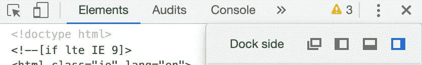

# 查看 CSS

## 选择元素

我将单击 Inspector 工具，它是一个正方形中的箭头，激活它并点击页面上我感兴趣的元素。

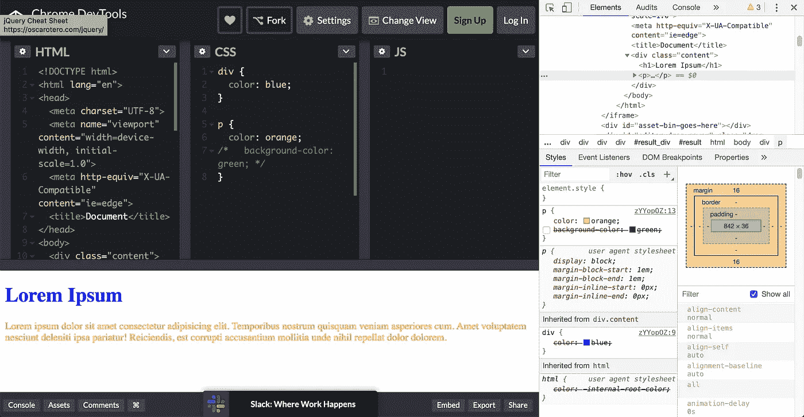

在这种情况下，我使用检查工具在网页上选择一个段落。

在*元素*选项卡中，选中的段落被高亮显示，并且*样式*选项卡显示应用于它的样式。

## **在样式选项卡中查看样式**

在*样式*选项卡中，删除线样式或者被其他样式规则覆盖(例如从父样式继承的`color: blue`)或者在 CSS 中被注释掉(例如`background color: green`)。

也有默认样式应用于元素。我从*用户代理样式表*中看到一个样式规则，这是浏览器应用的默认样式。

## 在源选项卡下查看样式表

要查看完整的 CSS 样式表，我可以单击样式规则旁边的链接。这将打开文件的样式，并突出显示可以找到样式规则的位置。

现在，文件没有显示我们为了可读性而添加的元素的间距。我们可以点击显示屏末端的图标`{}`，它会“美化”文件。这也适用于缩小的样式表，使它们可读。

缩小的样式表是删除了间距、缩进、换行符和注释以最小化文件大小的样式表。

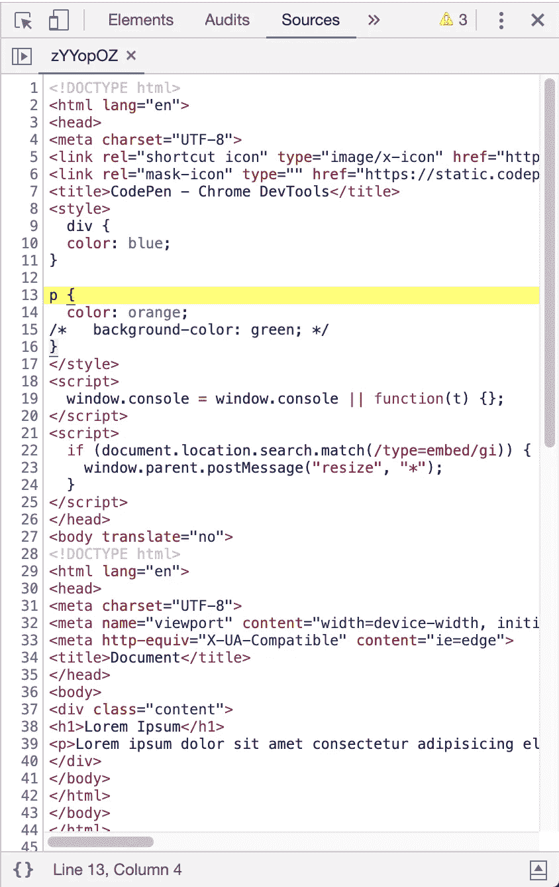

# 样式选项卡

## 过滤器

让我们仔细看看*样式*选项卡。

*样式*选项卡具有过滤功能。如果我想查看应用于所选元素的边距属性，我可以通过关键字“margin”进行过滤。

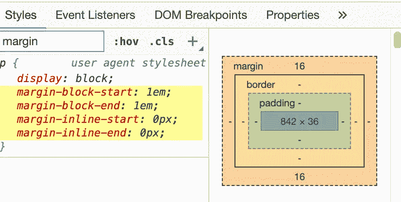

## 查看伪类

我可以点击`:hov`来查看和编辑一个元素的不同状态，包括`:active`、`:focus,`、`:focus-within`、`:hover`、 `:visited`。

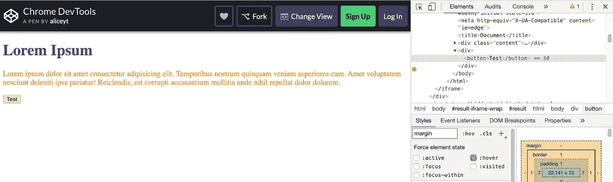

## 添加类、样式规则和声明

我可以通过点击`.cls`来添加新的类。

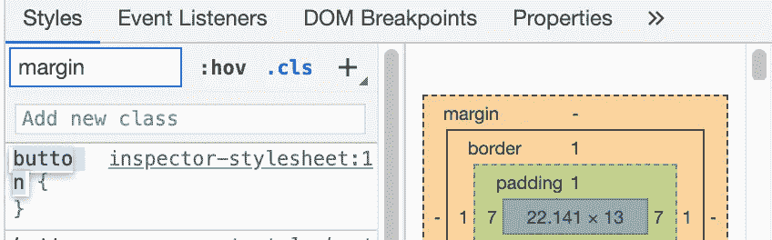

点击后。cls

我可以通过以下方式添加样式规则:

*   点击样式选项卡顶部的`+`图标，或
*   将光标悬停在样式规则之间，并在出现`+`图标时点击它。

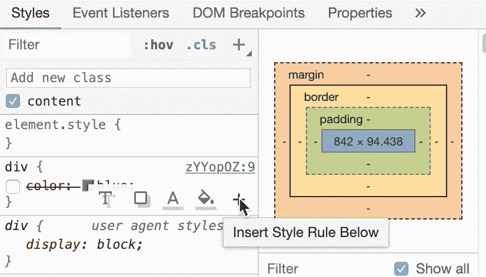

在样式规则之间徘徊之后

我也可以通过直接在样式规则中输入新的样式来添加声明(例如`color: pink`)到现有的样式规则中。

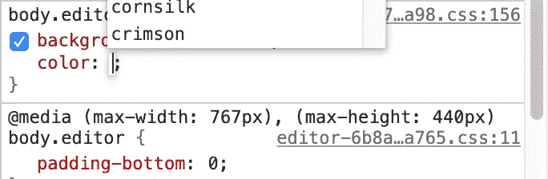

向样式规则添加声明

如果我想添加`background-color`、`color`、`box-shadow`或`text-shadow`，我可以将鼠标悬停在样式规则上方并选择代表属性的图标。

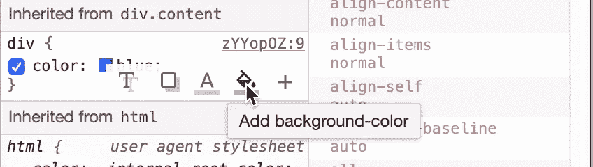

## 移除样式

当我想要移除样式时，我会取消选择它们。可以删除样式，但不能删除样式规则。

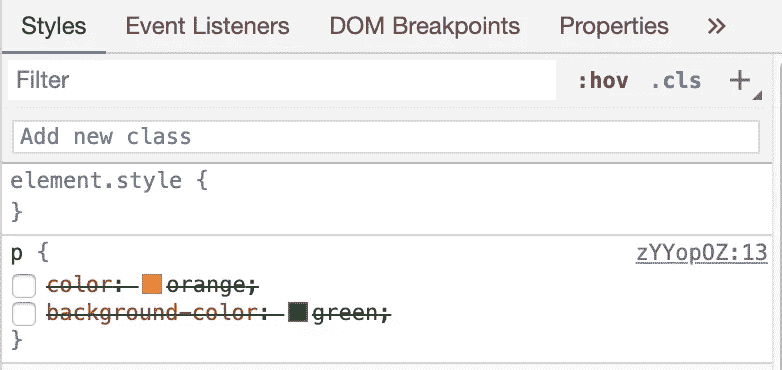

所有样式都是可编辑的，除了灰显的样式。

## 撤消更改

为了撤销任何编辑，我使用键盘快捷键`Cmd + Z`。

由于这些编辑是临时的，为了撤销所有的更改，我只需使用`Cmd + R`(在 Mac 上)刷新页面。

## 在计算选项卡中查看和调整值

如果有足够的空间，默认情况下打开的*计算的*选项卡显示盒模型交互图。

计算页签:框模式 **l** 交互图

我可以用 Inspector 工具单击一个元素，然后双击值来更改它。添加的值的单位是 px。

下图显示了我将左填充的值从 0 更改为 100。

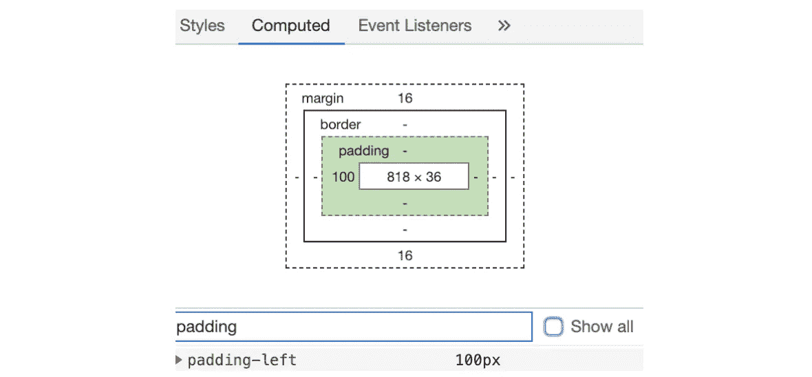

应用填充过滤器以显示左填充的实际值。

## 查看应用于元素的实际值

在盒子模型图下面是一个属性列表——继承的(当选择“显示全部”时)和声明的。

此列表仅显示应用于所选元素的样式，并显示绝对值。例如，当我使用百分比作为长度单位时，计算选项卡将以像素为单位进行转换。

在这里，我可以区分元素上声明的值和从其父元素继承的值，因为 Chrome 将继承的属性显示为轻微褪色。

## 过滤器

就像*样式*选项卡一样，我可以过滤我感兴趣查看的属性。

# 模拟移动视口

为了通过媒体查询检查我用于不同视窗的样式，我可以使用 Chrome 的*设备模式*。

这可以通过在 DevTools 面板上选择切换设备工具栏，然后在网页上选择要模拟的设备来打开。

如果我想要检查的设备不在默认列表中，我可以通过点击*编辑*来添加它。

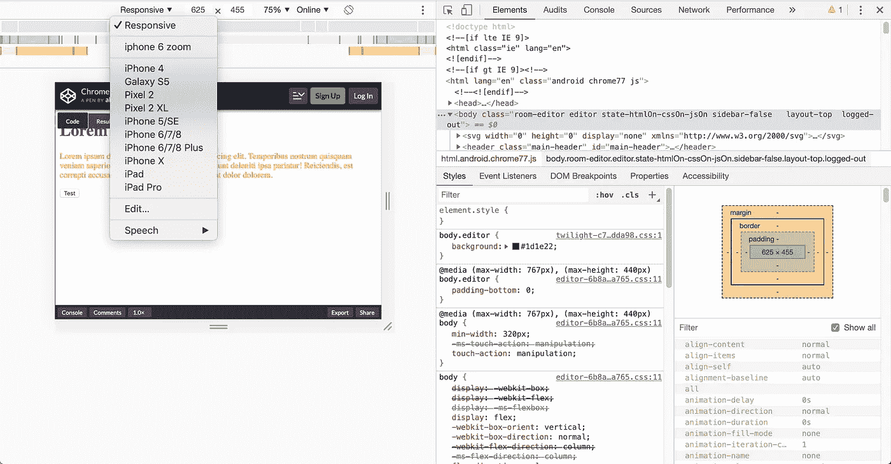

我还可以使用旋转功能从纵向视图切换到横向视图。

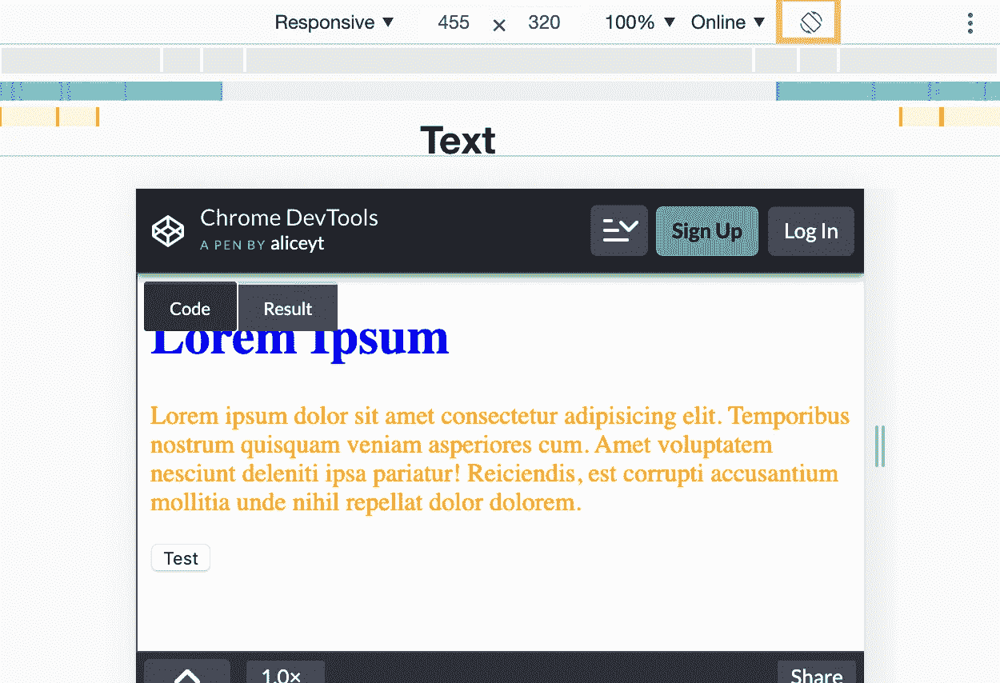

我刚刚注意到旋转按钮旁边的这个节流菜单，并了解到它可以模拟某人在不同数据速度下可能会如何体验网页。这是我可能会在未来的项目中探索的事情。

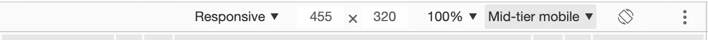

# 未使用的 CSS

我不经常使用 *Coverage* 选项卡，但是值得一提的是，我可以用它来检查我没有使用的 CSS(和其他代码)的百分比。

要查看它:

*   点击操作(`…`)图标。
*   点击*运行命令*。

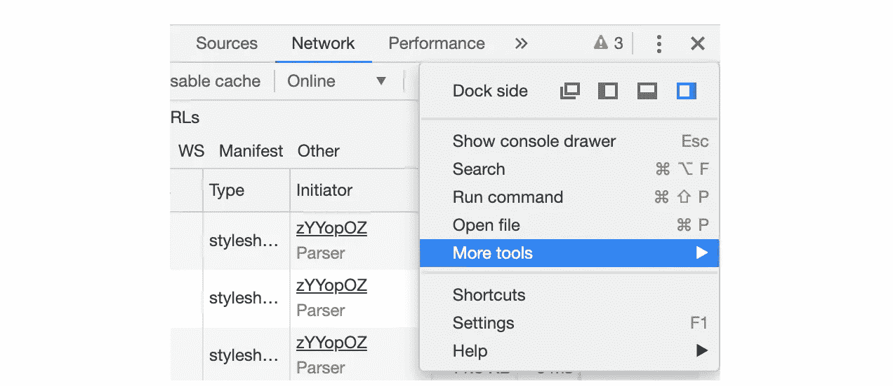

运行命令

*   键入`coverage`，选择*显示覆盖范围*命令，然后按*回车*运行命令。
*   点击*记录*按钮捕捉覆盖范围。

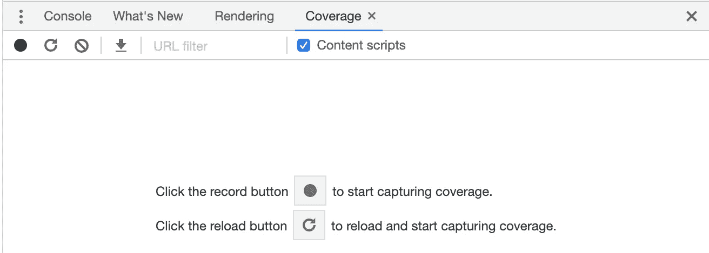

覆盖范围标签

在 *Coverage* 选项卡中会出现一个表格，显示被分析的资源，以及每个资源中使用了多少代码。点击其中一个 URL 可以查看已用代码和未用代码的明细。

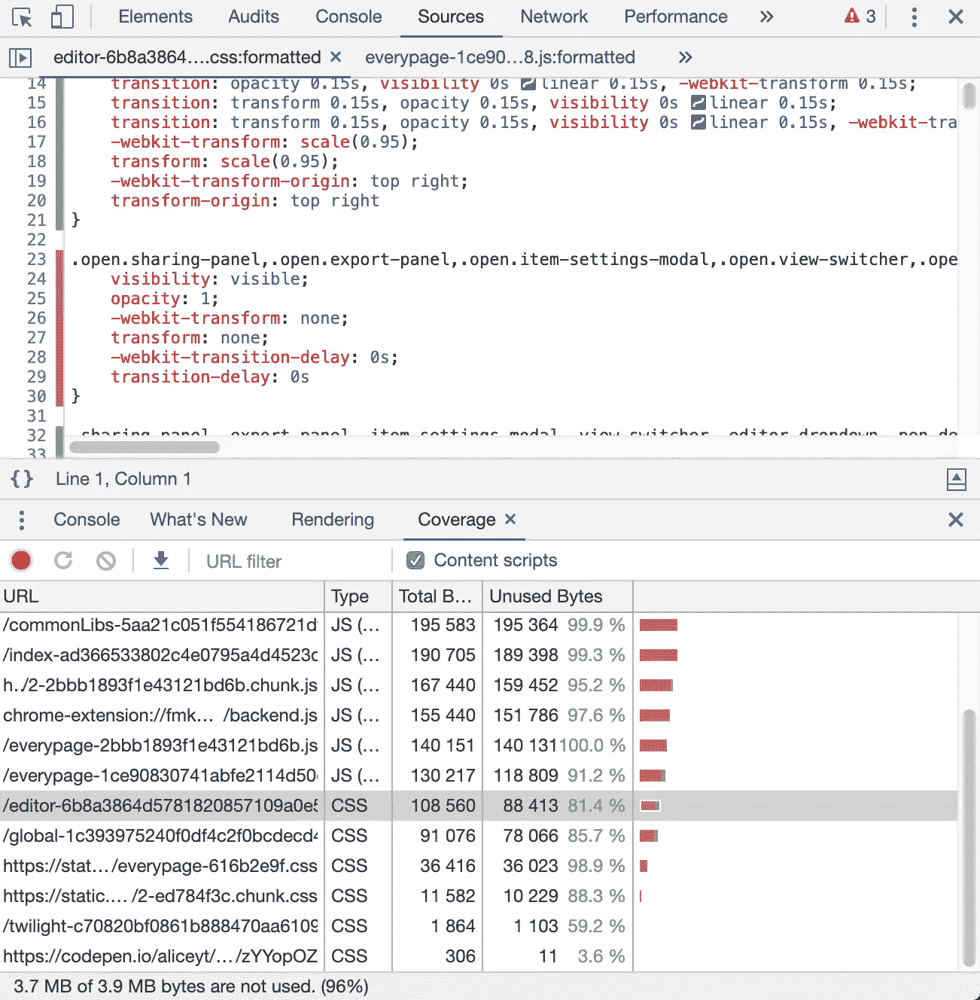

# 查看打印页面

我没有使用的一个功能是在打印模式下查看页面:

*   点击操作(`…`)图标。
*   键入`Rendering`并选择`Show Rendering`。
*   在*仿真 CSS 媒体*下拉菜单中选择*打印*。

如果我想要网页的打印视图，我使用浏览器上的打印功能。

# 结论

现在，您已经了解了查看和编辑 CSS 的基本工具，您可以在下一个项目中使用它们来调试 CSS，或者检查网页上引起您注意的元素。

关于 DevTools 的使用还有更多要学习的，你可以查看它的官方文档。

# 资源

*   [Chrome 开发工具](https://developers.google.com/web/tools/chrome-devtools)
*   [用我在本文中使用的代码打开](https://codepen.io/aliceyt/pen/zYYopOZ)