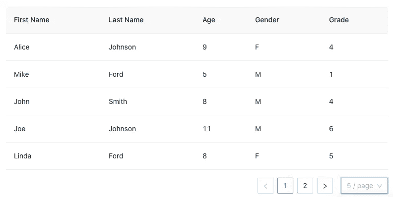
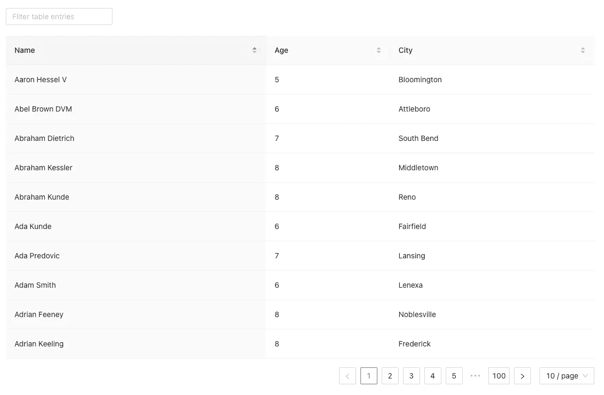
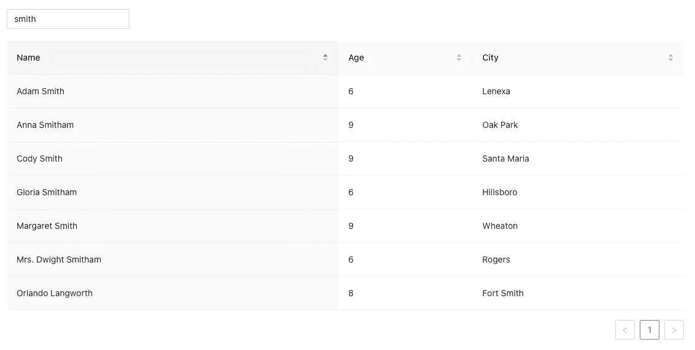

# TypeScript 中客户端和服务器端分页介绍

> 原文：<https://betterprogramming.pub/introduction-to-client-side-and-server-side-pagination-in-typescript-9edae72f94a0>

## 在您的 web 应用程序界面中轻松管理大型数据集


照片由[安娜斯塔西娅·杰尼娜](https://unsplash.com/@disguise_truth?utm_source=medium&utm_medium=referral)在 [Unsplash](https://unsplash.com?utm_source=medium&utm_medium=referral) 上拍摄

分页是一种常见的 Web UI 技术，它将大型数据集分成多个页面，一次显示一个页面。通常情况下，分页发生在[表](https://en.wikipedia.org/wiki/Table_(information))中，它是数据在行和列中的一种排列。然而，分页不限于表；其他组件也可能发生这种情况。

分页可以在客户端或服务器端处理。在本文中，我们将介绍分页服务，并提供客户端分页和服务器端分页的示例。

# 页码

分页是用有限的屏幕空间显示更多数据的 UI 表示。下面是由 [Ant 表](/an-introduction-to-ant-tables-for-javascript-developers-c420754c9fe7)显示的分页表。该表有两页，示例显示了第一页。在内部，它使用 HTML `table`组件，用分页页脚显示页面信息。



作者图片

一个表格可以被设计成看起来不像表格，或者它可以被构造成没有`table`组件。以下 UI 来自亚马逊搜索结果，由`div`组件组成。它显示了共 13 页的第一页。


作者截图来自亚马逊

对于分页的表/组件，它需要以下信息:

*   页面大小
*   页面索引
*   总菌数

这是一个显示分页信息的 UI。


作者图片

假设有 1885 行，页面大小为 20。`1885 / 20`的上限是 95。因此，它以 95 页结束，其中每页有 20 行，除了最后一页有 5 行。当前页码是 3，它显示了第 41–60 行，总共有`1885`行。

有时，总计数是不可用的，但是您仍然可以进行上一页、下一页或任何特定页面的操作。


作者图片

分页是一种显示多页中的一页的服务。分页表通常需要以下操作:

*   获取数据:获取全部或部分数据集进行显示。
*   设置页面数据:将提取的数据加载到表中。
*   设置加载指示:显示加载指示，如旋转图标，在数据可用之前填充空白。
*   转到下一页:响应用户操作转到下一页，除非它是最后一页。
*   转到上一页:响应用户操作转到上一页，除非它是第一页。
*   转到特定页面:响应用户操作转到特定页面。
*   集合排序:为表定义排序的列名和顺序(升序、降序或无顺序)。排序可以是单列排序，也可以是多列排序。
*   设置过滤器:定义表格的过滤标准。筛选可以应用于特定列，也可以应用于所有列(全局筛选)。对每次击键进行过滤的成本可能很高。[去抖和节流](/lodash-create-react-apps-built-in-library-for-debounce-and-throttle-with-hooks-3418087f44d8)通常用于控制过滤功能被调用的速率。这样就避免了一些不必要的调用，提高了性能。
*   页面自动刷新:显示表格后，数据可能会变得陈旧。自动刷新基于服务器推送或客户端轮询。更新的数据可以直接上传到表格，或者表格显示陈旧数据指示。

[Ant 设计系统](/understanding-the-ant-design-system-a-ui-design-for-enterprises-39afdb188b06)是企业级 UI 设计语言和 React UI 库的开源代码，其中 Ant table 为我们实现了分页服务。我们可以简单地调用服务来完成客户端分页或服务器端分页。

# 建立工作环境

我们使用 [Create React App](/10-fun-facts-about-create-react-app-eb7124aa3785) 来探索分页。

```
npx create-react-app react-ant-table --template typescript
cd react-ant-table
```

安装包:

第 1 行安装 Ant 设计系统。

第 2 行安装了 React 的类型定义。

第 3 行安装了`[faker](https://github.com/Marak/faker.js)`，这个库为我们的例子生成人名和城市名。

第 4 行安装了`faker`的类型定义。

第 5 行安装了`[fetch-mock](/setting-up-mocks-for-react-development-storybook-and-testing-8f5cedb66257)`，一个模拟后端调用的库。

这里是`package.json`中附加的`[dependencies/devDependencies](/package-jsons-dependencies-in-depth-a1f0637a3129)`:

# 客户端分页

客户端分页向服务器发出一个查询来获取所有数据。客户端将所有数据保存在内存中，并通过页面索引显示其中的一部分。客户端分页总是有总数据计数。

## 数据源

我们为一个表构建一个数据源，这个表由 1000 条孩子信息记录组成。每份记录都有孩子的名字、年龄和居住的城市。下面是在 Create React 应用程序环境中创建的`src/dataSource.tsx`:

第 4–9 行为每条记录定义了`DataType`。`key`是蚂蚁表的推荐属性。

第 11–30 行定义了 3 列，包括排序器 UI(上下箭头)和排序算法(第 15、21 和 27 行)。

第 32–43 行定义了一个创建 1000 个孩子记录的服务。它使用`faker`生成随机的孩子名字(第 37 行)和城市名字(第 39 行)。年龄是为 5 到 9 之间的数字随机生成的(第 38 行)。

第 46 行调用`getData()`将`allData`中的记录存储在服务器上。

第 48 行模拟一个 HTTP `GET`方法，在一次调用中返回`allData`。

## 分页代码

我们调用数据源来获取客户端分页的所有数据。该表使用 Ant table 的排序 UI 和功能，但是过滤 UI 和功能是专有实现的。下面是修改后的`src/App.tsx`:

第 11–13 行调用模拟服务。

第 15–20 行调用端点`'/v2/kids'`，以获取所有的孩子记录，并将它们保存在`kidList`(第 18 行)。

第 22–30 行通过`filterString`(第 23 行)过滤表格的所有列(第 27 行)，忽略字母大小写。结果保存到`displayList`。

第 34–47 行构建了一个用于过滤的输入字段(第 44 行)。

第 48 行用`displayList`和`columns`定义构建客户端分页表。默认页面大小为 10。

分页就像一行代码(第 48 行)一样简单，我们有分页表。它显示了 100 页，每页有 10 条记录。如果适用，我们可以转到上一页或下一页，或者选择特定的页面。


作者图片

分页表可以排序。以下是将`name`按升序排序后的第一页。



作者图片

在`'smith'`上过滤后，还剩 7 条记录(1 页)。



作者图片

## 用例

客户端分页适合少量数据。由于所有内容都已经预加载，所以后续的页面加载很快。当所有数据都可用时，可以在客户端执行排序和过滤。

客户端分页要求浏览器支持并启用 Javascript，但对于大多数情况来说，这应该不是什么大事。但是，当数据量很大时，提取所有数据会导致很大的页面负载。加载一大块数据需要更长时间，更糟糕的是，它可能会使后端服务崩溃或导致浏览器崩溃。

对于以下用例，应该考虑客户端分页:

*   数据量相对较小。
*   所有数据的初始页面加载相当快。
*   客户端的排序和过滤相当快。
*   用户可能会查看所有页面。
*   分页主要是为了表示的目的。

# 服务器端分页

服务器端分页请求在导航时单独加载每个页面。服务器需要支持分页，然后客户端能够请求具有指定页面大小、页面索引以及可能的排序顺序和过滤标准的数据集。服务器用适当的子集数据和总计数进行响应。

## 数据源

我们为一个表构建一个数据源，这个表有 1000 条相同的 kid 信息记录，尽管每次运行随机生成的数据可能不同。下面是在 Create React 应用程序环境中创建的`src/dataSource.tsx`:

第 4–9 行为每条记录定义了`DataType`。

第 11–14 行定义了服务器响应的`ResponseType`，包括`total`数据计数，以及部分数据`list`。

第 16–18 行定义了`DataTypeIndex`来启用带有属性值的数组索引。

第 20–39 行定义了 3 列，包括排序器 UI(上下箭头)(第 15、21 和 27 行)，没有排序算法。

第 41–52 行定义了一个创建 1000 个孩子记录的服务。

第 54 行调用`getData()`将记录存储在服务器的`allData`中。

第 57–101 行模拟了一个 HTTP `POST`方法，根据客户端提供的`pageIndex`(第 62 行)、`pageSize`(第 63 行)、过滤字符串(第 67 行的`query`)和排序定义(第 76–87 行的`sortBy`和`sortOrder`)，检索服务器过滤(第 66–72 行)、排序(第 75–88 行)的当前页面(第 92 行的数据子集)。

现在，服务器数据源承担了过滤、排序和分页的重任。

## 显示分页数据

对于服务器端分页，客户端代码负责提供`pageSize`、`pageIndex`、`sortBy`、`sortOrder`、`query`等选项。当服务器数据源用当前页面响应时，客户端 UI 需要正确地解释它。下面的代码使用 Ant table 的排序和过滤 UI，没有实现排序算法。下面是修改后的`src/App.tsx`:

第 14–16 行调用模拟服务。

第 18–32 行调用端点`'/v2/kids'`，以检索当前页面的 kid 记录，并将它们保存在`kidList`(第 30 行)。`pageSize`、`pageIndex`、`sortBy`、`sortOrder`和`query`作为`POST`方法的体选项发送。

第 36–49 行构建了一个用于过滤的输入字段(第 46 行)。

第 50–59 行显示带有`kidList.list`(第 51 行)和`columns`定义(第 52 行)以及分页设置(第 53 行)的当前页面。第 54–58 行设置分页选项。

从用户的角度来看，服务器端分页 UI 看起来与客户端分页相同。它显示了 100 页，每页有 10 条记录。如果适用，我们可以转到上一页或下一页，或者选择特定的页面。排序和过滤也以同样的方式工作。

然而，有一个微妙的区别。初始页面加载速度更快，数据块更小，而后续页面加载需要新的读取。

## 用例

服务器端分页适合大型数据集。每页较少的负载提供了稳定性和可伸缩性。后续页面的额外加载时间可以通过预取接下来的几个页面来抵消，这也称为混合服务器和客户端分页。由于获取数据的频率更高，服务器端分页对并发更改的适应能力更强。一如既往，服务器的计算能力比浏览器更强。它们以更有效的方式处理排序和过滤。

如果服务器端分页处理巨大的数据集，总的数据计数可能不可用。正如我们所见，谷歌搜索结果没有一个固定的总数。用户必须继续前进，直到到达终点。

对于以下用例，应该考虑服务器端分页:

*   数据量大。
*   排序和过滤操作非常耗时。
*   用户可能只会查看初始页面。
*   后端支持服务器端分页。
*   需要更强的适应并发变化的能力。

# 结论

我们已经浏览了分页服务，并演示了客户端分页和服务器端分页的例子。选择主要取决于数据大小。

客户端分页适用于少量数据，主要用于表示目的。服务器端分页处理大量数据，并提供稳定性和可伸缩性。

感谢阅读。我希望这有所帮助。如果你有兴趣，可以看看[我的其他媒体文章](https://jenniferfubook.medium.com/jennifer-fus-web-development-publications-1a887e4454af)。