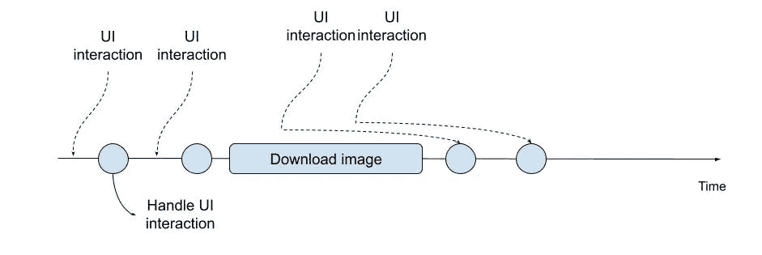
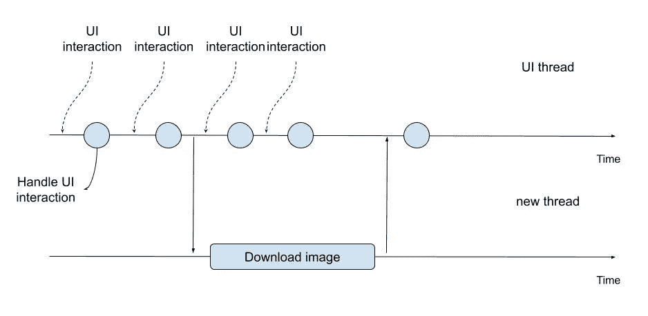
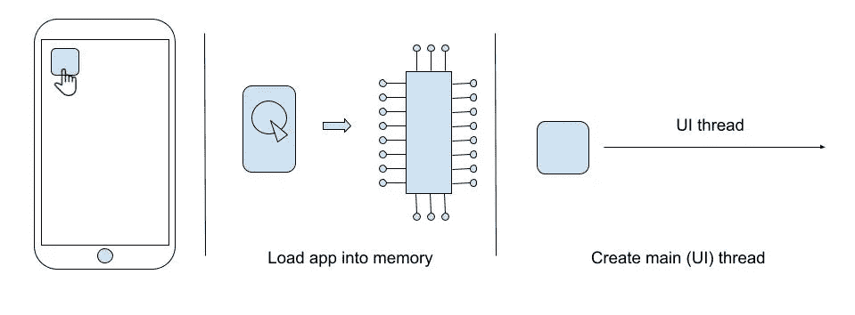
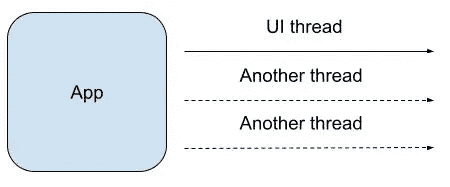
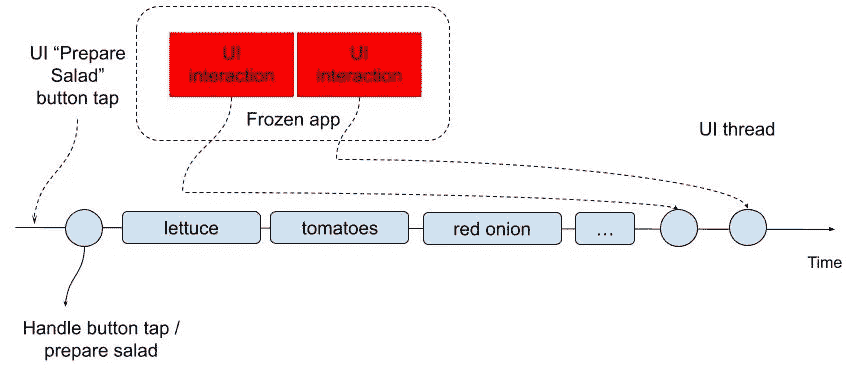
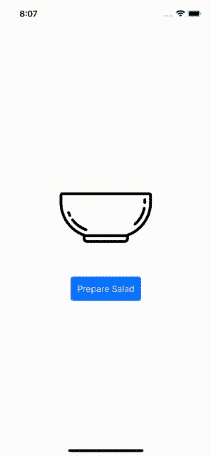
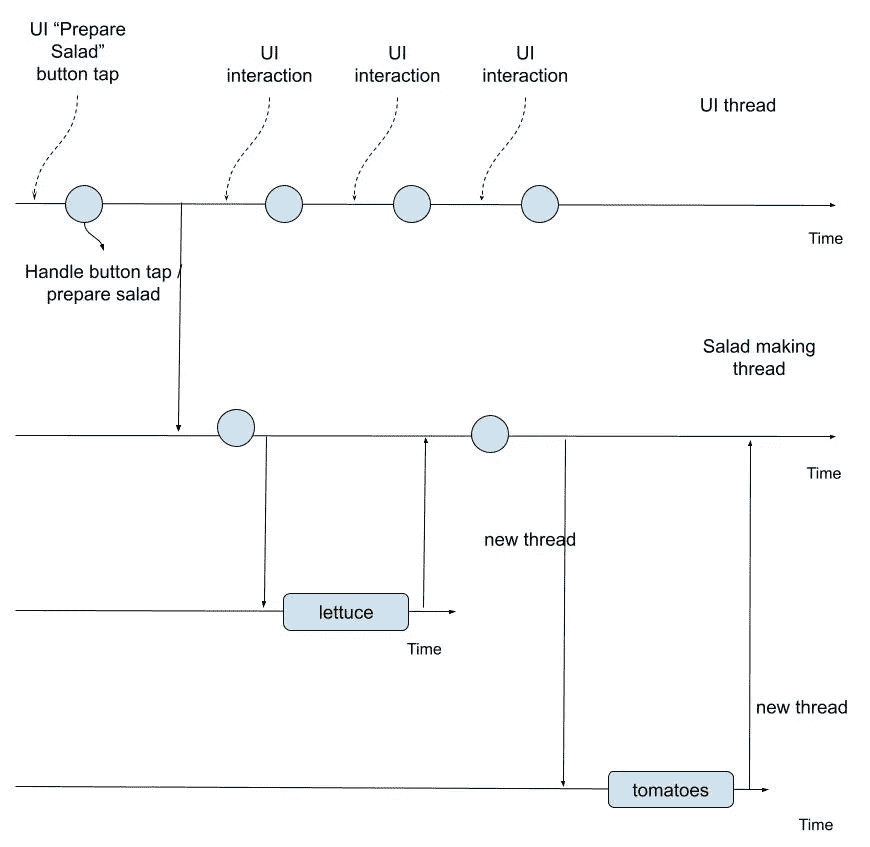
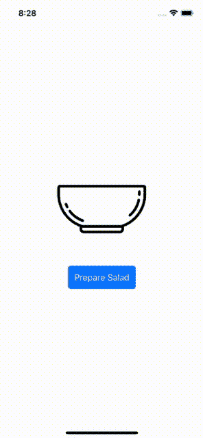

# 带异步和等待的并发 Swift 简介

> 原文：<https://betterprogramming.pub/introduction-to-concurrency-swift-with-async-and-await-1d3b03226585>

## 并发

## 了解如何使用 Swift 并发功能


尼古拉斯·霍伊泽在 [Unsplash](https://unsplash.com?utm_source=medium&utm_medium=referral) 上拍摄的照片

你的 app 有没有遭遇用户界面时不时被冻结的情况？你的应用程序会因为没有响应而被系统杀死吗？

出现上述情况的应用程序可能是因为您的应用程序在负责响应用户界面交互的同一进程中执行了繁重和/或长时间的任务。

例如，您可以从 web 服务器获取图像，这可能需要几秒钟的时间。当你的应用程序的进程等待接收图像时，它不会响应用户的交互。



那么，在执行繁重或长时间的任务时，如何防止应用程序的用户界面冻结甚至崩溃呢？

答案是将任务从负责响应用户界面的应用程序流程部分转移到一个新的部分。应用程序进程的一部分被称为线程。

线程允许你同时执行多段代码——这是并发的。



委派任务并继续执行自己的任务，直到委派的任务返回结果，这种行为称为异步执行任务。

在任务执行之前，我们不会等待阻塞。当等待任务被执行时，我们才继续自己的任务，这被称为**同步**。

Apple 提供了多种方式在 iOS 平台上同时执行任务:

*   中央车站调度
*   操作和操作队列

最近，Swift 开始提供一种新的并发执行方式——通过使用 [async 和 await](https://docs.swift.org/swift-book/LanguageGuide/Concurrency.html) 关键字。

在这篇文章中，我将通过一个制作沙拉的应用程序示例，向您展示如何使用 Swift 并发特性并发执行任务。在此之前，我将更详细地解释一下进程和线程这两个词的含义。

对于这篇文章，我假设你至少对 iOS 和 Swift 开发有基本的了解。

示例应用程序使用 SwiftUI，但不要求具备 SwiftUI 知识。

# 什么是进程和线程？

假设用户在主屏幕上。用户点击你的应用。这会告诉 iOS 启动您的应用程序。在这种情况下，iOS 将为您的应用程序创建一个新进程，并创建一个线程。



进程是程序的一个实例——在这种情况下，是您的应用程序。在 iOS 中，你只能运行一个应用实例。对于每个进程或实例，操作系统将把你的程序从磁盘加载到内存中。



iOS 中的每个 app 进程都是用一个线程启动的。这被称为**主线程**或 **UI 线程**。您的应用程序或程序可以访问其他线程。线程共享相同的内存空间。

线程是一系列指令。你的程序向线程发送指令。这些被排队并执行先来先服务，或者更普遍地被称为先进先出(FIFO)。

# 如何用 async 和 await 同时执行任务

在本节中，我们将实际使用 Swift 的 async 和 await。我们将从现有的应用程序开始。这个应用程序为我们创造了一个沙拉碗。沙拉准备顺序如下:

1.  生菜；莴苣
2.  番茄
3.  红洋葱
4.  甜玉米
5.  葵花籽油金枪鱼

在准备沙拉的时候，应用程序会冻结，因为制作沙拉的工作是在主线程(也称为 UI 线程)上完成的。我们将使用 Swift 并发功能(异步和等待)修复应用程序冻结问题。

以下是本部分将采取的步骤:

1.  下载入门包
2.  使用 async 和 await 将沙拉准备从 UI 线程中移走
3.  不点菜准备沙拉

我们开始吧！

对于本文，我使用了 Swift 5.5.2 和 Xcode 13.2.1。

## 1.下载入门包

让我们从下载入门包开始。打开终端应用程序并执行以下命令:

```
cd $HOME
curl [https://github.com/anuragajwani/swift-concurrency-salad-maker/archive/starter.zip](https://github.com/anuragajwani/swift-concurrency-salad-maker/archive/starter.zip) -o salad_maker.zip -L -s
unzip -q salad_maker.zip
cd swift-concurrency-salad-maker-starter
open -a Xcode SaladMaker.xcodeproj
```

在模拟器上运行应用程序。点击“准备沙拉”按钮。你会注意到应用程序在开始做沙拉时会冻结。让我们在下一节中研究为什么会出现这种情况，并解决它。


## 2.使用 async 和 await 将沙拉准备从 UI 线程中移走

在这一节中，我们将把沙拉制作过程从同步改为异步。我们将只查看一个文件。在 Xcode 内打开`SaladMaker.swift`。

```
**class** SaladMaker {
    **func** make(onIngrdientPrepped: **@escaping** (Ingredient) -> ()) {
        Ingredient.allCases.forEach { (ingredient) **in
            self**.prepareIngredient(ingredient)
            onIngrdientPrepped(ingredient)
        }
    } **private** **func** prepareIngredient(_ ingredient: Ingredient) {
        **let** randomTime = UInt32.random(in: 1...5)
        sleep(randomTime) // chop, cut, etc...
    }
}
```

当前的代码将成分按顺序排列并“准备”它们。但是它在主线程上同步完成。从而阻止用户界面响应用户交互。



让我们将`SaladMaker`类改为使用 async 和 await 来异步准备沙拉。然而，我们将同步准备每种成分，因为准备的顺序很重要。将`SaladMaker`改为:

```
**class** SaladMaker {
    **func** make(onIngrdientPrepped: **@escaping** (Ingredient) -> ()) {
        Task(priority: .userInitiated) {
            **for** ingredient **in** Ingredient.allCases {
                **await** prepareIngredient(ingredient)
                onIngrdientPrepped(ingredient)
            }
        }
    } **private** **func** prepareIngredient(_ ingredient: Ingredient) **async** {
        **return** **await** withCheckedContinuation({ continuation **in** // using DispatchQueue here instead of Task due to unexpected behaviourDispatchQueue.global(qos: .userInitiated).async {
                **let** randomTime = UInt32.random(in: 1...5)
                sleep(randomTime)
                continuation.resume()
            }
        })
    }
}
```

在上面的代码中，我们已经从同步准备每种成分转移到异步准备它们。在模拟器上运行应用程序。



你会注意到应用程序不再冻结。让我们分解解决方案，看看上面的代码是如何实现的。



注意上面的 main/UI 线程现在是如何清晰地响应用户交互的。

让我们从探索`prepareIngredient`功能变化开始:

```
**private** **func** prepareIngredient(_ ingredient: Ingredient) **async** {
    **return** **await** withCheckedContinuation({ continuation **in** // using DispatchQueue here instead of Task due to unexpected behaviour
        DispatchQueue.global(qos: .userInitiated).async {
            **let** randomTime = UInt32.random(in: 1...5)
            sleep(randomTime)
            continuation.resume()
        }
    })
}
```

注意，函数在函数返回类型语句之前声明了`async`。这告诉 Swift 编译器该函数异步执行。

以前`prepareIngredient`功能代码是同步的。

为了将同步代码转移到异步代码，我们使用了`[withCheckedContinuation](https://developer.apple.com/documentation/swift/3814988-withcheckedcontinuation)`函数。

[Swift 有内置功能](https://developer.apple.com/documentation/swift/checkedcontinuation)比如这个功能，以弥补同步和异步功能之间的差距。该函数将检查`[continuation.resume()](https://developer.apple.com/documentation/swift/checkedcontinuation/3814760-resume)`是否被调用过一次。

此时，每种配料都是异步准备的。但是，我们希望按照顺序并在前一个配料完成后准备配料。那么，我们如何才能做到这一点呢？

通过在调用异步`prepareIngredient`函数之前使用关键字`await`:

```
**await** prepareIngredient(ingredient)
```

我们按顺序一个接一个地循环检查配料，直到它准备好。

然后我们通知`make`函数调用者该配料的准备状态(`onIngrdientPrepped`关闭):

```
**for** ingredient **in** Ingredient.allCases {
    **await** prepareIngredient(ingredient)
    onIngrdientPrepped(ingredient)
}
```

注意`make`功能是同步功能。我们不能只在同步函数中调用异步函数。我们不能在`make`内调用`prepareIngredient`。

为了允许在同步函数中调用异步函数，我们可以使用`[Task](https://developer.apple.com/documentation/swift/task)`。该任务允许我们在其中运行异步代码。

## 3.不点菜准备沙拉

如果做沙拉的顺序不重要呢？如果沙拉顾客不想要花哨的展示，只想在旅途中吃沙拉，该怎么办？

假设每种配料需要 1 秒钟的准备时间。有 5 种配料，所以准备沙拉需要 5 秒钟。如果我们不在乎沙拉的顺序，那么我们可以同时准备所有的配料。因此，我们有可能在 1 秒钟内完成沙拉(基于可用的系统资源)。

那么，我们如何并行(或同时)快速地准备沙拉配料呢？有两种方法:

1.  `[async let](https://docs.swift.org/swift-book/LanguageGuide/Concurrency.html#ID641)`
2.  `[TaskGroup](https://developer.apple.com/documentation/swift/taskgroup/)`

让我们从[异步 let](https://docs.swift.org/swift-book/LanguageGuide/Concurrency.html#ID641) 开始。

这种机制允许我们并行准备所有的配料。代码将在第一次调用`await`时暂停。

当所有的异步 let 在`await`之前完成时，代码将继续执行。

将`make`功能体更改如下:

```
**func** make(onIngrdientPrepped: **@escaping** (Ingredient) -> ()) {
    Task(priority: .userInitiated) {
        **async** **let** lettuce = prepareIngredient(.lettuce)
        **async** **let** tomatoes = prepareIngredient(.tomatoes)
        **async** **let** redOnion = prepareIngredient(.redOnion)
        **async** **let** sweetcorn = prepareIngredient(.sweetcorn)
        **async** **let** tuna = prepareIngredient(.tuna)
        **let** ingredients = **await** [lettuce, tomatoes, redOnion, sweetcorn, tuna]
        ingredients.forEach(onIngrdientPrepped)
    }
}
```

和下面的`prepareIngredient`功能:

```
**private** **func** prepareIngredient(_ ingredient: Ingredient) **async** -> Ingredient {
    **return** **await** withCheckedContinuation({ continuation **in** // using DispatchQueue here instead of Task due to unexpected behaviour
        DispatchQueue.global(qos: .userInitiated).async {
            **let** randomTime = UInt32.random(in: 1...5)
            sleep(randomTime)
            continuation.resume(returning: ingredient)
        }
    })
}
```

注意我们如何通过使用关键字`async let`来存储异步引用。

然而，我们不能将它们直接存储在一个数组中。该选项目前在 Swift 中不可用，因此我们必须将每个异步字母存储为一个单独变量。

此外，我们需要让`prepareIngredient`返回一个结果，以便能够存储异步 let 引用。

对`async let`还有另一个警告。在上面的解决方案中，我们只通知`SaladMaker.make`调用者所有的配料都准备好了，而不是它们准备好了。


那么，我们如何并行运行所有的异步函数，并在每种成分都准备好时更新调用者呢？

通过使用[任务组](https://developer.apple.com/documentation/swift/taskgroup/)。让我们将`SaladMaker`函数体修改如下:

```
**func** make(onIngrdientPrepped: **@escaping** (Ingredient) -> ()) {
    Task(priority: .userInitiated) {
        **await** withTaskGroup(of: Ingredient.**self**, body: { group **in
            for** ingredient **in** Ingredient.allCases {
                group.addTask(priority: .userInitiated) {
                   **await** **self**.prepareIngredient(ingredient)
                }
            } **for** **await** ingredientPrepped **in** group {
                onIngrdientPrepped(ingredientPrepped)
            }
        })
    }
}
```

TaskGroup 允许我们并行运行多个异步功能:

```
**for** ingredient **in** Ingredient.allCases {
    group.addTask(priority: .userInitiated) {
        **await** **self**.prepareIngredient(ingredient)
    }
}
```

此外， [TaskGroup](https://developer.apple.com/documentation/swift/taskgroup/) 会在结果出来时通知我们:

```
**for** **await** ingredientPrepped **in** group {
    onIngrdientPrepped(ingredientPrepped)
}
```

运行应用程序，在配料准备好后立即查看用户界面更新:



就是这样！现在，您已经掌握了 Swift 并发性的基础知识！

# 摘要

在这篇文章中，我们了解到:

*   什么是并发
*   什么是进程和线程
*   如何在 Swift 中执行异步任务
*   如何将同步代码转换成 Swift 异步代码
*   如何使用 Swift 并发并行执行任务

# 最后的想法

你可以在下面的 Github repo 中找到这篇文章的源代码:

[](https://github.com/anuragajwani/swift-concurrency-salad-maker) [## GitHub-anuragajwani/Swift-Concurrency-salad-maker:Swift 博客文章中的并发性介绍

### 此时您不能执行该操作。您已使用另一个标签页或窗口登录。您已在另一个选项卡中注销，或者…

github.com](https://github.com/anuragajwani/swift-concurrency-salad-maker) 

Swift 的 async 和 await 简化了异步代码的读写。

我还没有介绍过 [Swift concurrency](https://docs.swift.org/swift-book/LanguageGuide/Concurrency.html) 相对于生成并发代码的其他解决方案的优势([大中央调度](https://anuragajwani.medium.com/introduction-to-concurrency-in-ios-using-grand-central-dispatch-gcd-8280b57a91ec)和[操作和操作队列](https://anuragajwani.medium.com/introduction-to-operation-and-operationqueues-in-ios-and-swift-3c32525c7c1e))。这超出了本文的范围。然而，我将在以后的文章中介绍解决方案之间的差异。

这篇文章只打算介绍并发性的基础知识。并发是一个非常复杂的话题。以后我会继续就这个话题发帖。敬请关注更多内容。

```
**Want to Connect With the Author?**Connect with me on [Twitter](https://twitter.com/anuragajwani?source=post_page---------------------------)
```