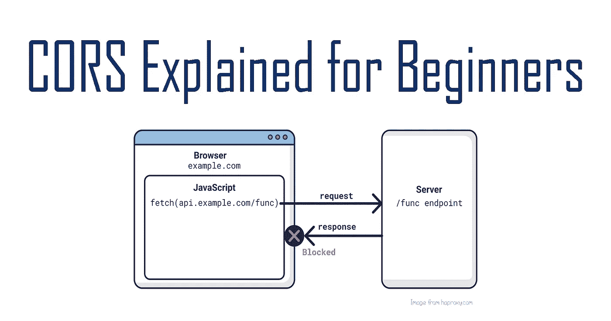
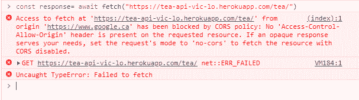
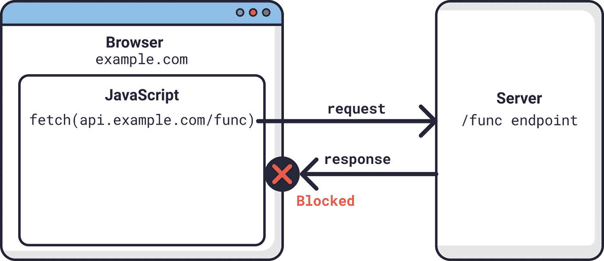
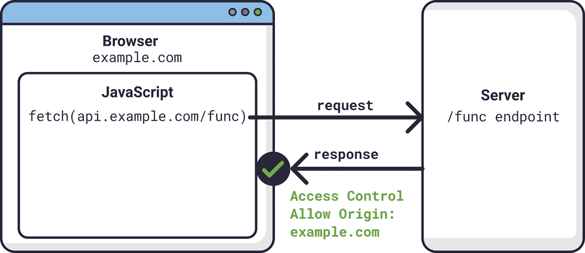

# 跨来源资源共享介绍(CORS)

> 原文：<https://betterprogramming.pub/introduction-to-cross-origin-resource-sharing-cors-b5dc1d7de47a>

## CORS 为初学者解释道



照片来自[haproxy.com](http://haproxy.com/)。

在 web 开发中，web 应用程序将其前端服务与后端服务分离是很常见的。因此，从后端访问资源需要掌握跨源资源共享(CORS)。这是开发人员理解 web 基础设施的重要部分。

在本文中，我们将讨论 CORS，为什么我们需要它，以及我们如何实现它。我们还将看看相关的概念，如同源策略。

# 首先，一个实验

如果你在一个网站上(例如 Google ),然后在你的浏览器检查器上，试着像这样发送一个请求给一个 API:

```
const response = await fetch("https://tea-api-vic-lo.herokuapp.com/tea);
```

你认为会发生什么？

控制台将返回以下错误消息:



为什么会这样呢？答案是因为同源政策。

# 同源政策

浏览器遵循一个安全策略。它被称为同源策略，基本上是说只有来自相同域、主机和端口的资源才能相互交互。

例如，`example.com`可以从位于[example.com](http://example.com/)的服务器中检索数据，因为它们共享同一个域。它的任何子域也将是可访问的(即`example.com/page1`或`example.com/page1/page2`)。

然而，由于这个安全策略，`example.com`将无法访问来自`api.example.com`或`google.ca`等域的资源。



照片来自[haproxy.com](http://haproxy.com/)。

# 同源政策的重要性

您可能已经猜到，这个策略是出于安全目的而制定的。想象一下，如果没有这种限制。恶意站点可以简单地从任何站点获取任何数据，从而导致跨站点请求伪造(CSRF)攻击。

另一方面，这个策略可能过于严格，因为一些 web 应用程序可能需要从几个不同的服务器获取资源。这就是 CORS 的用武之地。

# CORS 是什么？

顾名思义，它使网站能够从不共享其域、主机或端口的服务器访问资源。白名单网站通常在`Access-Control-Allow-Origin`请求头中传递，这将告诉服务器可以向该网站发送和共享其数据。

例如，如果我们将`Access-Control-Allow-Origin`设置为`example.com`，就意味着这个网站现在可以访问`api.example.com`。



照片来自[haproxy.com](http://haproxy.com/)。

# 一个例子

我的 [Tea 应用](https://victoria-lo.github.io/Hashtag-TEA/)，它从我的 [Tea API](https://tea-api-vic-lo.herokuapp.com/) 中获取数据，需要加入白名单，以便允许应用访问 API 的数据。让我们实现一个 CORS 中间件来实现这一点。

## 步骤 1:安装 cors

让我们首先安装名为 [cors](https://www.npmjs.com/package/cors) 的 npm 包:

```
npm install cors
```

## 第二步:导入

在`server.js`文件中，我们导入`cors`:

```
const cors = require("cors");
```

## 第三步:白名单

然后在 app 初始化的`const app = express()`行下面，添加:

```
app.use(cors({ origin: /(.*\.)?victoria-lo.github\.io.*/ }));
```

这一行基本上告诉 API，任何带有`victoria-lo.github.io`的域都被列入了同源策略的白名单。因此，我托管在`victoria-lo.github.io/Hashtag-TEA`的应用程序被允许从我的 API 获取和加载数据，这是在一个完全不同的域(`tea-api-vic-lo.herokuapp.com/`)。

# 结论

这就是 CORS 的精髓所在！感谢阅读。请在下面的评论中留下你的赞并分享你的想法。我希望这是一个有益的阅读。在下一节中，您可以随意阅读我们今天讨论的更多内容。

干杯！

# 请参见

*   [关于跨站请求伪造](https://owasp.org/www-community/attacks/csrf)
*   [npm cors 文件](https://www.npmjs.com/package/cors)
*   [MDN 文档中关于 CORS 的更多信息](https://developer.mozilla.org/en-US/docs/Web/HTTP/CORS)