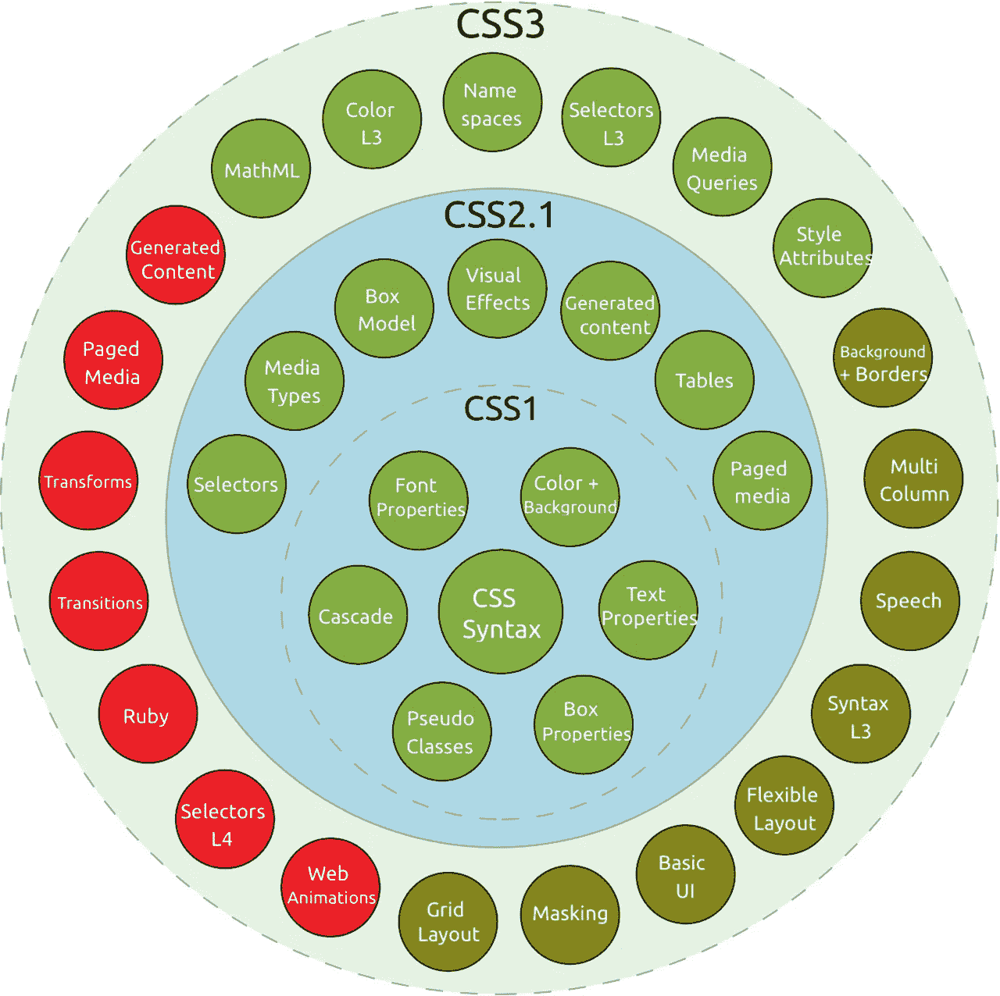
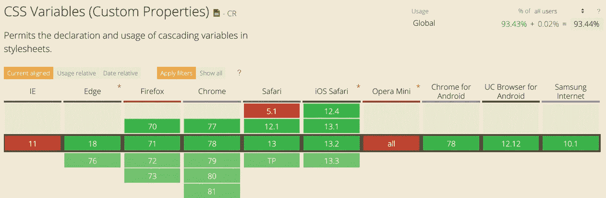

# CSS 自定义属性介绍

> 原文：<https://betterprogramming.pub/introduction-to-css-custom-properties-66b9474d3012>

## 我们应该使用 *CSS 自定义属性*而不是预处理程序吗？嗯，看情况

[斯蒂夫·约翰森](https://unsplash.com/@steve_j?utm_source=unsplash&utm_medium=referral&utm_content=creditCopyText)在 [Unsplash](https://unsplash.com/s/photos/palette?utm_source=unsplash&utm_medium=referral&utm_content=creditCopyText) 上拍照

# 简短的历史课

自 1994 年提出并于 1996 年在网络的摇篮 CERN 首次发布以来，级联样式表(CSS)从简单样式的静态描述发展成为现代网页设计的基石。

甚至追溯到 1996 年，样式表的概念并不是一个新的想法。自从[标准通用标记语言(SGML)](https://en.wikipedia.org/wiki/Standard_Generalized_Markup_Language) 以来，它们就以某种形式存在了，但是它们没有被用于 web。与今天相比，功能集非常有限:

*   颜色；色彩；色调
*   字体属性和字体
*   文本属性(例如，单词/字母间距)
*   边缘相关属性(例如，边距、填充、边框)
*   对齐

它真正的第一个继任者 CSS 2.1 在 2004 年成为 W3C 候选推荐标准。又过了七年，它终于在 2011 年成为 W3C 推荐标准，尽管之前它是通过浏览器的方式使用和实现的。尽管 CSS 2 已经存在，但 2.1 版本对其进行了改进，删除了支持不佳或被社区拒绝的功能，并加入了浏览器已经实现的功能。

从 1999 年开始，下一个版本 CSS 3 被开发出来。为了更好地理解和分离 CSS 规范，它引入了模块的概念。它的一些模块仍在工作草案中，但它们已经被广泛使用，如果没有它们，网络将不再一样。

*   [三级选择器](http://www.w3.org/TR/css3-selectors/)(如属性选择器:`[attr^=val]`)
*   [柔性框布局(flexbox)](https://developer.mozilla.org/en-US/docs/Web/CSS/CSS_Flexible_Box_Layout)
*   [媒体查询](http://www.w3.org/TR/css3-mediaqueries/)
*   [改进的背景和边框](http://www.w3.org/TR/css3-background/)
*   [更多颜色系统](http://www.w3.org/TR/css3-color)(例如，rgba、hsl、hsla、渐变)
*   …以及更多

# 需要更灵活的解决方案

CSS 的目的是用来描述网页内容的表现，而不是作为一种编程语言。动态特性非常有限。重用样式和创建基本选择器通常意味着复制粘贴，或者改变父子关系，这会损害[选择器的特异性](https://developer.mozilla.org/en-US/docs/Web/CSS/Specificity)。不支持基类或变量意味着改变可能会影响整个 CSS 文件，如果需求改变，很容易遗漏一些东西。

为了弥补这些缺点，CSS 预处理器被创造出来，最著名的是[萨斯/SCSS](https://sass-lang.com/) 、 [LESS](http://lesscss.org/) 、[手写笔](http://stylus-lang.com/)和 [PostCSS](https://postcss.org/) 。

所有这些预处理程序都试图通过提供新功能来提高 CSS 开发人员的 UX，这些新功能有时采用类似 CSS 的语法(例如，SCSS、Less、PostCSS)，有时采用“改进的”语法(例如，Sass、Stylus)。通过将 CSS 转换成完整的编程语言，许多动态和方便的功能变得可用，使它更具可读性和更易于维护:

*   变量
*   嵌套选择器
*   函数/混合/继承
*   颜色操作(例如，变暗、变亮、色调改变)
*   逻辑运算符(if-else)，循环
*   进口
*   …以及更多

但是预处理程序最大的缺点就在它的名字上:它需要经过 *pre* 处理才能交付给客户机。这意味着我们需要某种资产管道，或者至少是构建环境中的特定任务，来处理 CSS。这些不能在运行时动态改变，并且不知道 DOM 的结构，导致了词汇范围的变量和相当静态的 CSS。此外，CSS 预处理程序也没有标准，它们彼此之间也不(完全)兼容。

我们项目中更多的齿轮需要维护，可能会损坏。

一个更好的方法是直接与客户端兼容的更动态的 CSS，因此不需要额外的步骤。

# 自定义 CSS 属性

2015 年，模块*级联变量的 CSS 自定义属性模块级别 1* 成为 W3C 候选推荐。该模块引入了所有 CSS 属性都可以接受的级联变量。与预处理器相比，该特性集似乎过于简单，但它们仍然能够完成预处理器的许多功能。它们不是为了复制预处理器的某些功能，而是为了实现以前不可能实现的工作流——即使有预处理器的帮助。

## 申报

变量的一般语法是`--*`。它们必须在 CSS 选择器中定义，并且具有与任何其他属性相同的级联语义。

我们可以使用 CSS 支持的每一个属性值，比如颜色、大小、`url(...)`、`inherit` / `unset` / `initial-value`等等。

## 使用

对变量的访问由`var(...)`功能授予:

## 计算

还支持`[calc(...)](https://developer.mozilla.org/en-US/docs/Web/CSS/calc)`函数及其所有运算符(`+`、`-`、`*`、`/`):

## 范围

如前所述，定制属性的作用域是默认继承和级联的，就像标准的 CSS 属性一样，而不是像预处理变量一样在词汇上有作用域。

为了在全局范围内创建一个对所有后代都可用的变量，可以使用`:root`伪类:

通过作用域，我们还可以构建易于修改的规则集:

随着`.monochrome`变得更加[特定](https://developer.mozilla.org/en-US/docs/Web/CSS/Specificity)，我们可以修改一个锚点并得到单色调色板。

## 媒体查询

当然，范围/继承也可以用于媒体查询，使响应设计变得容易:

但是要注意一个限制——变量*不能用于媒体查询中的值:*

乍一看，这似乎很奇怪，但很容易解释。媒体查询不是选择器，也不会通过层叠来继承任何属性。

## 默认值

默认值是受支持的，并且是修改某些选择器的好方法:

我们甚至不需要事先声明`--color`。只要有一个带有合理默认值的工作的`.my-class`,并且有机会通过在另一个选择器中重新分配属性来修改它。

由于 CSS 的级联性质，我们还可以使用默认值实现主题化，并通过 HTML 激活特定的值，甚至在客户端也是如此:

## 内嵌 CSS

变量也可以内联设置，这是从外部修改样式的好方法:

在 HTML 中，我们可以用`style`属性覆盖`--color`:

## 动态更新

一个很大的区别(与预处理器相比)是对值变化的处理。预处理程序需要在处理过程中计算所有值；该值将是静态的。这就是为什么在使用后重新赋值没有效果:

*CSS 自定义属性* cascade 值发生变化，所有相关的属性都会即时更新:

结合内联样式，我们可以动态地重新分配和重新计算 CSS 属性。

## Java Script 语言

`window`-对象提供函数`[getComputedStyle(element [, pseudoElt])](https://developer.mozilla.org/en-US/docs/Web/API/Window/getComputedStyle)`，该函数返回当前计算的元素样式。

改变变量就像设置一个*标准*属性:

# 最佳实践

## 值>变量

更改变量的值比创建另一个变量更好:

我们应该改变已经存在的变量，而不是引入另一个变量:

如果我们不需要在一个地方声明所有变量，只在`.my-class`中使用，我们可以进一步缩短 CSS:

## 变量应该是“可变的”

不是所有的事情都是可变的。不要陷入过早的优化，让每一个属性都成为在`:root`中定义的变量，以防将来你可能想要改变它。

变量的良好候选是实际上正在变化的属性，或者是由于外部约束，如媒体查询，或者是内部需求，如伪类(例如，悬停状态)，或者是主题化组件。

## 关注点分离

有了自定义属性，我们最终可以将内容的设计与实际的布局逻辑分离开来:

媒体查询不应再改变任何标准的 CSS 属性。应该只更改自定义属性的值。

这样，我们可以在文档的顶部声明所有的变量，以及它们的修改媒体查询。默认值和属性如何改变的逻辑是文件中首先可见的东西。实际的设计没有逻辑，可以很容易地阅读，没有任何复杂性或隐藏的惊喜。

## 范围界定和命名

像所有编程语言一样，我们必须考虑我们想要什么范围，以及我们实际上需要什么。过大的范围会污染变量空间并产生副作用，但过小的范围会限制变量的可重用性。并非所有东西都需要在`:root`中，但是我们需要在级联选择器树中找到一个变量的最佳位置来实现它的目的。

由于级联性质，实际范围可能与我们想象的不同。为了不意外地通过重用名称覆盖任何属性，我们应该坚持命名约定。用大写的*命名全局作用域的变量，或者至少用大写的首字母命名，可以清楚地知道如何使用它们。*

*全局范围的变量也应该被视为静态值。如果我们需要改变一个全局值，我们可以在一个更窄的范围内把它重新赋值给另一个变量。*

# *警告*

*每一个闪亮的新玩具都有一些缺点。 *CSS 自定义属性*也不例外。*

## *浏览器支持*

*具有讽刺意味的是，唯一不支持 CSS 的相关浏览器是第一个支持 CSS 的商业浏览器:Internet Explorer。*

*取决于目标受众，这可能是一个交易破坏者，但是如果我们仍然想要支持 Internet Explorer，有多个 JavaScript polyfill 选项可用( [1](https://jhildenbiddle.github.io/css-vars-ponyfill/#/) 、 [2](https://github.com/nuxodin/ie11CustomProperties) )。*

*除了 IE11，浏览器支持都很优秀:*

**

*[https://caniuse.com/#feat=css-variables](https://caniuse.com/#feat=css-variables)—2019–12–23*

## *缺失功能*

*与预处理程序相比，CSS 自定义属性缺少多个功能。以下是最重要的缺失特征(在我看来):*

***嵌套选择器**:通过更好地可视化组件的树形结构，嵌套选择器可以极大地提高可读性。可悲的是，CSS 自定义属性仍然是 CSS，不支持嵌套选择器。*

***Mixins** :一组可以在另一个选择器中重用的 CSS 声明。*

***函数**:预处理器中包含了字符串操作的助手，支持变量列表，可以循环等等。*

***导入**:能够用预处理程序将 CSS 分成多个文件，但仍然只有一个优化的输出文件，这将改善任何项目的结构。有了 CSS 自定义属性，我们也可以把 CSS 拆分成多个文件但是需要用`<link>`标签分别加载，这不如单个文件好，至少没有 HTTP/2。*

# *结论*

*我们应该使用 CSS 自定义属性而不是 CSS 预处理程序吗？嗯，看情况。*

*能够放弃 CSS 的资产管道是很棒的！可能损坏的东西越来越少，但是我们错过了一些很棒的功能。另一方面，我们获得了强大的客户端动态样式，这是用预处理器无法实现的，并且它将与 CSS 的未来添加兼容。*

*我不建议用自定义属性替换任何现有的预处理样式，因为我们可以这样做，但是，可以考虑在一个新项目中尝试一下。混合两种 CSS 处理方式可能会产生新的问题，应该避免，或者至少相应地分开。*

*例如，我们的一个项目使用定制的 SASS 管道，通过编译带有修改变量的源 SASS 文件来创建与项目相关的主题，从而动态地修改多个引导版本。如果我们必须用 CSS 自定义属性重做项目，我们仍然会使用 SASS 进行引导，但会尝试对任何新开发的组件使用 CSS 自定义属性。*

*不是 CSS 自定义属性 vs. CSS 预处理程序。明智地选择你的工具。两者都有不完全一致的存在理由。因此，在不同的方面使用这两者可能是一个可行的解决方案。*

**

# *TL；速度三角形定位法(dead reckoning)*

*   *CSS 自定义属性是用实际的动态运行时样式替换或扩充编译时资产管道的好方法。*
*   *预处理器可能有更多的特性，但也有缺点，比如维护一个资产管道，它可能随时改变或中断。*
*   *只对实际的动态样式使用 CSS 自定义属性，并从将它们重构为变量中获益良多。仅仅通过添加一个内联样式就可以在客户端与我们的样式进行交互，这带来了许多新的可能性。*
*   *对于静态样式，使用静态 CSS，甚至可以预处理。*

# *资源*

*   *[https://caniuse.com/#feat=css-variables](https://caniuse.com/#feat=css-variables)*
*   *【https://developer.mozilla.org/en-US/docs/Web/CSS/-*】【T2 *
*   *【https://www.w3.org/TR/css-variables-1/ *