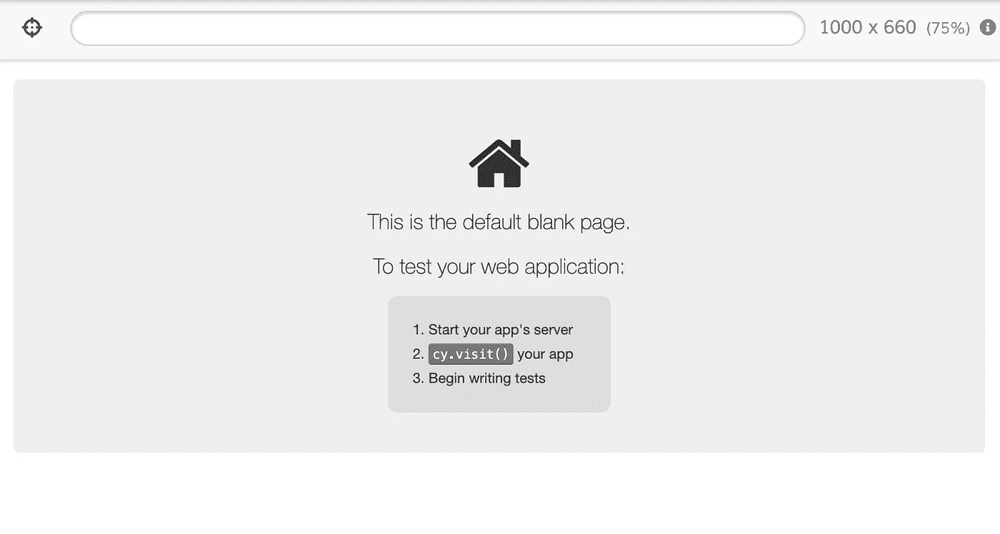
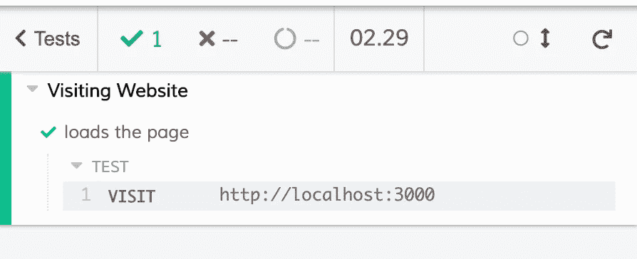
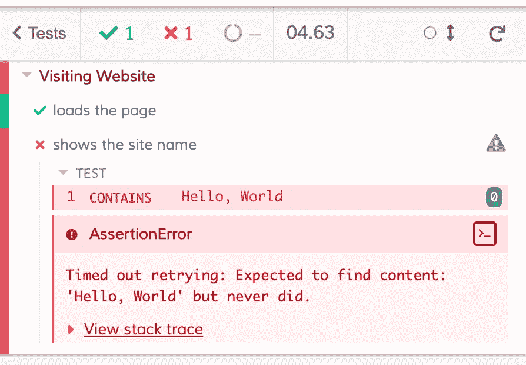

# Cypress 和前端测试简介

> 原文：<https://betterprogramming.pub/introduction-to-cypress-and-frontend-testing-aa01a680809c>

## 快速和肮脏的前端测试和 Cypress 概述


克里斯里德在 [Unsplash](https://unsplash.com?utm_source=medium&utm_medium=referral) 上的照片。

如果你是一个刚开始申请工作的新开发人员，你可能已经注意到一些测试知识是许多招聘信息中的常见要求。但是，即使这不是你想要的特定工作的要求，知道如何测试你的申请也是一项很好的技能，可以让你从其他候选人中脱颖而出。

幸运的是，如果您在 JavaScript 环境中开发，您将能够使用 [Cypress](https://www.cypress.io/) 轻松测试您的应用程序。Cypress 可以用于各种测试，包括端到端、集成和单元测试。如果你还不知道这些是什么，不要担心。我会先检查那些条款！

# 测试类型

测试有很多种，但为了节省时间，我将简要介绍一下我注意到的在面试和招聘中最常出现的三种测试:

*   端到端测试:从头到尾测试应用程序流，模拟用户与网站的交互。
*   单元测试:将应用程序的组件组合在一起进行测试，一次一个，通常有一个输出。
*   集成测试:通常在单元测试之后执行，这种类型的测试将之前的单元组合起来，作为一个组进行测试。

这些测试中的每一种都用于验证您的应用程序是否如预期的那样运行，所有这三种测试都可以用 Cypress 轻松创建。关于测试类型的更多详细信息，我推荐查看本文。

# Cypress 入门

现在是有趣的部分！安装 Cypress 很简单，我更喜欢使用 npm。只需导航到项目的前端，并在终端中运行以下代码:

```
$ npm install cypress --save-dev
```

如果你想使用不同的方法，你可以在官方文档中找到关于那个[的更多信息。](https://docs.cypress.io/guides/getting-started/installing-cypress.html#System-requirements)

接下来，你会想要打开柏树。如果您已经使用 npm 安装了 Cypress，您可以运行以下代码行来打开它:

```
$ npx cypress open
```

如果你使用另一种方法安装 Cypress，你可以在文档中查看打开 Cypress [的不同方法。](https://docs.cypress.io/guides/getting-started/installing-cypress.html#Opening-Cypress)

# 写作测试

现在您已经安装并打开了 Cypress，您可以开始编写您的第一个测试了。


Cypress 应该会在安装时自动创建一个`cypress`文件夹。在`cypress`里面，你应该会找到另一个标签为`integration`的文件夹。在这个文件夹中导航并创建一个名为`project_spec.js`的文件。这个文件将保存您的第一个测试。

既然您已经创建了测试文件，它应该会出现在 Cypress 测试运行器中。如果你点击这个文件，它应该会自动启动一个新的测试窗口:



此时，您的文件中不会有任何测试，所以它不会做太多。让我们解决这个问题！对于您的第一个测试，我将向您展示如何访问您的网页:

首先，注意测试被包装在两个函数中:一个`describe`函数和一个`it`函数。`it`函数创建一个单独的测试。`describe`功能将相关测试组合在一起。

接下来，实际的“测试”部分在第 3 行。大多数 Cypress 测试遵循相同的格式:`cy.action`。在这一行，我们只是简单地*访问*我们的网站，所以命令自然是`cy.visit`。关于 Cypress 命令的完整列表，[查看它们的文档](https://docs.cypress.io/api/commands/)。

如果您将我的代码复制并粘贴到您的测试文件中，您将会看到 Cypress 测试运行器以粗体显示了带有下拉箭头的`describe`函数的文本，并在其中列出了该函数中的所有测试。



每个测试都可能通过或失败，Cypress 测试运行程序为发生的每个失败提供了充分的反馈。您还会注意到，测试运行程序记录了通过和失败的次数，以及运行所有测试所花费的时间。

我将再看一个测试示例——确保正确的信息显示在页面上:

对于这个 Cypress 测试，我们检查我们的页面是否包含一个字符串，所以我将使用`cy.contains`。该命令接受一个字符串参数，并在页面上查找该元素。如果找到该元素，它将返回该元素。



哎呀！结果我们的页面不包含文本`Hello, World`，我们的测试失败了。幸运的是，Cypress 用红色突出显示了失败的测试，并详细解释了测试失败的原因。即使这个测试失败了，Cypress 将继续运行文件中的其余测试。

# 结论

这就是我对前端测试和 Cypress 的快速而粗略的概述。关于 Cypress 和前端测试还有很多要说的，但希望这给了你一个开始测试的好起点。

感谢阅读！