# 深度学习介绍(第二部分)

> 原文：<https://betterprogramming.pub/introduction-to-deep-learning-part-ii-f37f2794715a>

## 进入图像分类

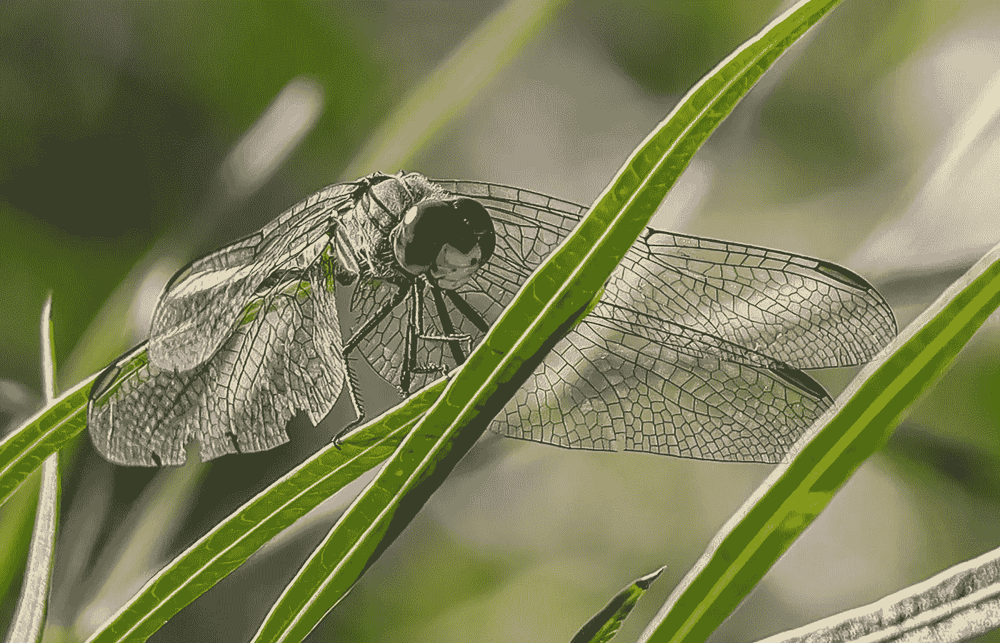

达斯汀·休姆斯在 [Unsplash](https://unsplash.com/s/photos/dragonfly?utm_source=unsplash&utm_medium=referral&utm_content=creditCopyText) 拍摄的照片

在这篇博文中，我将提供一个深度学习用例之一的例子——图像分类。

在描述我的图像分类项目之前，我将给出一些生物学背景，并介绍卷积神经网络(CNN)。在下一篇文章中，我将提供一个关于幕后运行的数学方程的更深入的解释。

在 [*深度学习介绍(第一部分)*](https://medium.com/@gilorgal2010/deep-learning-101-cf9f935f9b56) 中，我解释了深度学习(DL)是机器学习(ML)的子集，而 ML 是人工智能(AI)的子集。

还有，我描述了神经网络(NN)的历史，什么是深度学习，基本的构建模块(感知机)，以及使算法脱颖而出的过程——反向传播。

# 介绍

在这个项目中，我创建了一个模型，可以区分蜻蜓和豆娘的图像。为什么我选择将昆虫而不是热狗分类？

在成为一名数据科学家之前，我研究生物学，用飞虫做实验。我所在的实验室进行实验的生物之一是蓝尾豆娘。

就在那时，我了解到从生物学的角度来看，蜻蜓和豆娘是非常不同的，就像狗和猫一样不同。

# 分类学

简而言之就是分类学。与命名每一种生物有关的科学分支叫做分类学。分类学家根据相似性和它们最后的共同祖先对生物进行分类。

任何一组生物体的最后共同祖先是最近的个体，生物体被描述为该个体的直接后代。

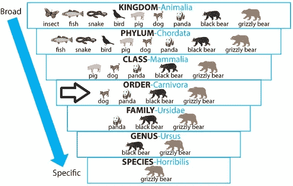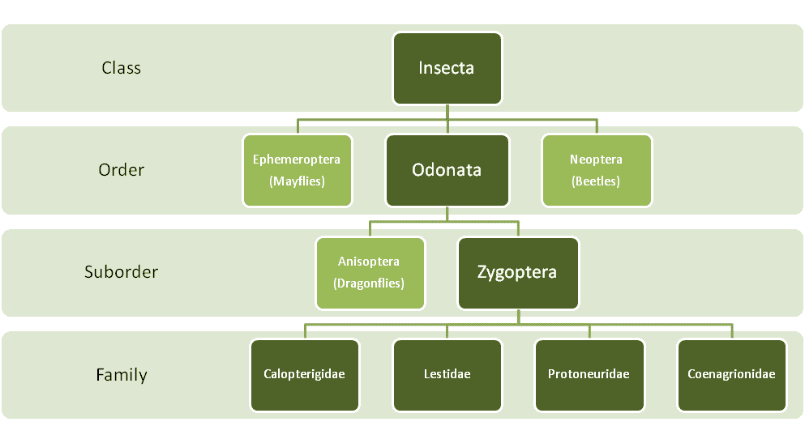

图 1——在左边，灰熊的科学分类显示了不同群体的不同命名惯例。右边是豆娘的科学分类(颧翅目)。来源: [UW 机场](http://bioweb.uwlax.edu/bio203/2010/bush_clai/index.htm)。

当我们沿着科学分类的阶梯往下走，这些生物共享一个更近的共同祖先，因此，共享更多的特征，看起来更相似。

例如，尽管各门之间存在显著差异，但*节肢动物*(昆虫、蜘蛛等)。)和*脊索动物*(哺乳动物、鱼类等)。)同属*界，Animalia (* 动物)*。意味着他们有共同的祖先和特征。*

同样，黑熊和灰熊也是动物，它们有着所有动物都有的特征。然而，它们也属于同一个属，*熊科*，这意味着它们拥有熊所独有的额外特征。

蜻蜓和豆娘是蜻蜓目*的一部分。区分它们的关键特征是它们头部和翅膀的形状。*

在蜻蜓中，复眼占据头部的整个前侧，而在豆娘中，眼睛之间有明显的区别。此外，当不飞行时，豆娘会折叠翅膀，而龙不会。

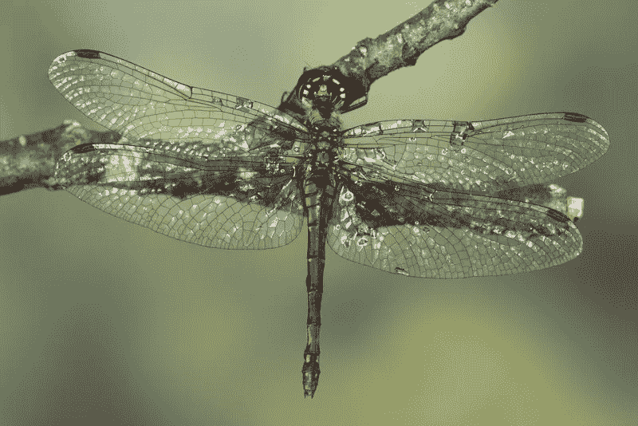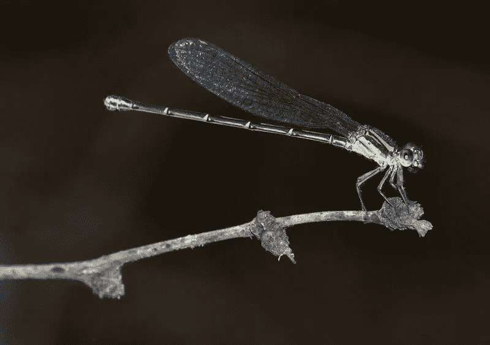

图 2-蜻蜓(左)，豆娘(右)。来源:[神经科医生](https://sites.google.com/view/fgvc6/competitions?authuser=0)。

# 盘旋

通常，计算机将图像作为一个张量处理，即图像高度乘以图像宽度再乘以颜色通道的大小，给出 0-255 之间的像素值。

在图像处理中，卷积是将称为核矩阵的较小矩阵与核矩阵大小的图像部分相乘，并用乘法之和替换矩阵的中心元素的过程。

我可以将内核矩阵描述为执行不同任务的可调过滤器，例如锐化、模糊、识别等。如果你想了解更多，请访问维基百科上的这个页面。

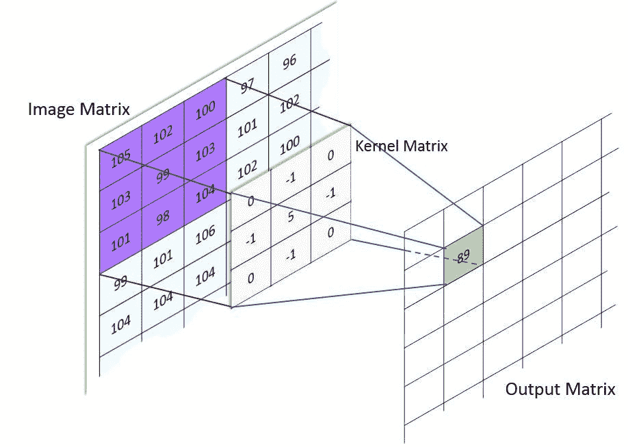

图 3 —使用 3×3 核矩阵的图像卷积。来源: [MachineLearningGuru](http://machinelearninguru.com/computer_vision/basics/convolution/image_convolution_1.html) 。

# 池层

池层是帮助减少维度的中间层。

池层从每个卷积窗口中挑选最佳值，这有助于防止过度拟合，并在保留重要信息的同时减少参数的数量。

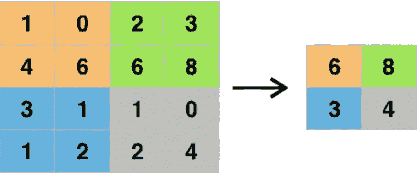

图 4 —合并示例。来源:[深度 AI](https://deepai.org/machine-learning-glossary-and-terms/max-pooling) 。

# 脱落层

漏失层是神经网络中使用的一种正则化技术。这一层随机忽略神经元，阻止它们对下游神经元的激活做出贡献。

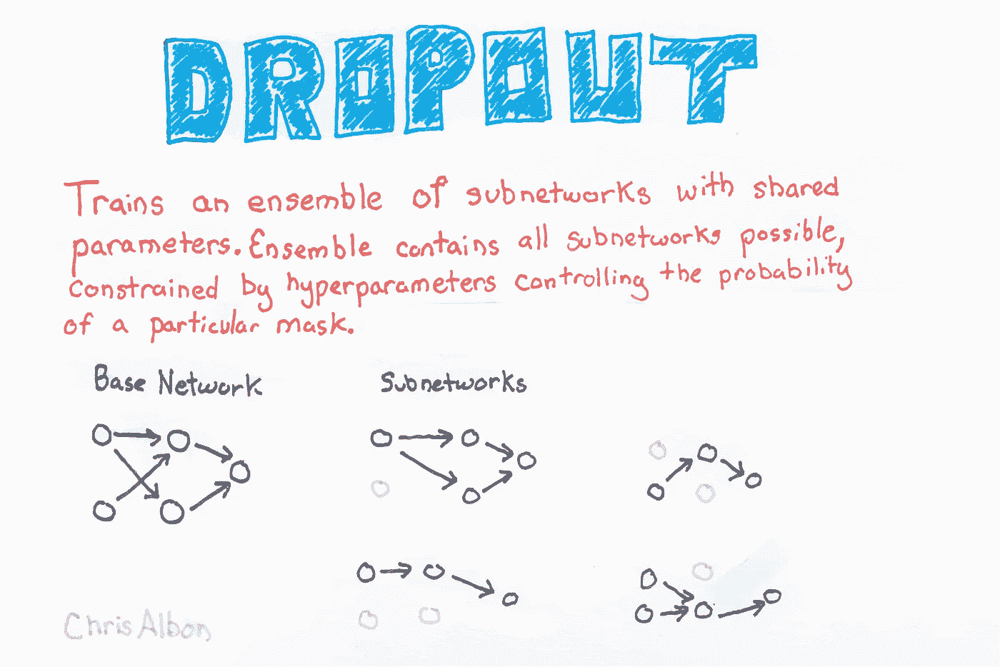

图 5 —辍学示例。来源:[克里斯·阿尔邦](https://chrisalbon.com/deep_learning/keras/adding_dropout/)。

# 林奈机器人—图像分类

目标:创建一个深度学习神经网络，它可以准确地分类一个图像是否包含蜻蜓或豆娘。

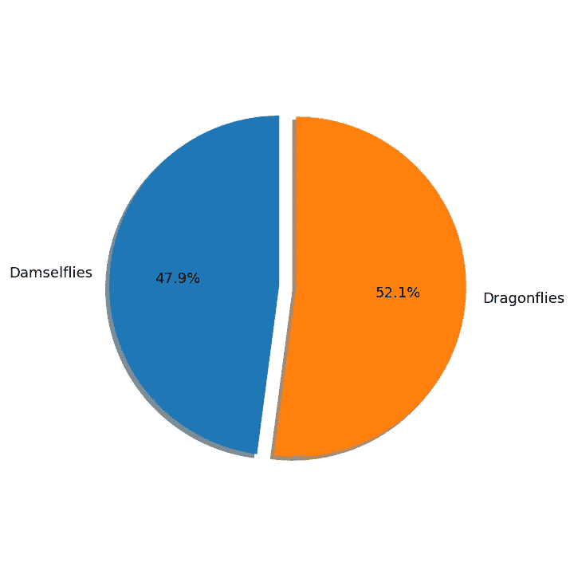

图 6 描述每只动物图像数量的饼图。

原始数据集分别包含 8462 和 9197 幅豆娘和蜻蜓的彩色图像。图像大小随最大值而变化。尺寸为 800 像素，总重量为 3.48 GB。

必须克服在本地机器上工作的限制，我通过将图像调整为 256 x 256 像素、灰度、归一化像素值(除以 255)和放大图像来处理图像。

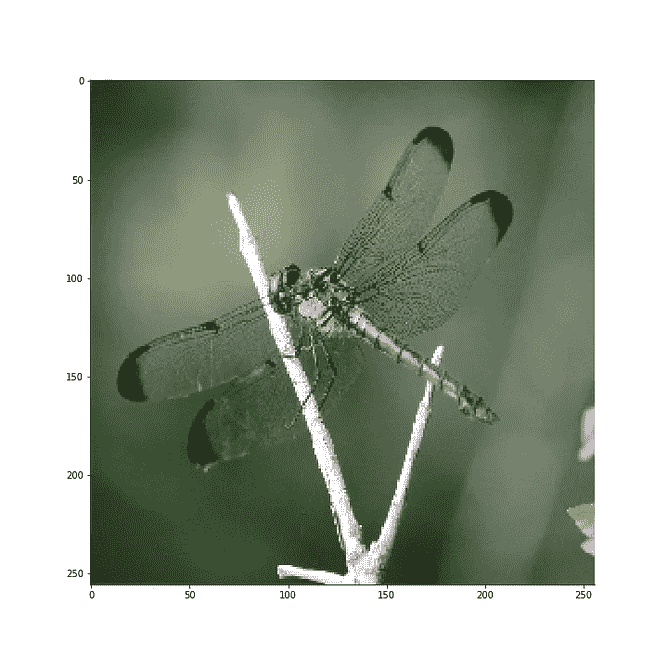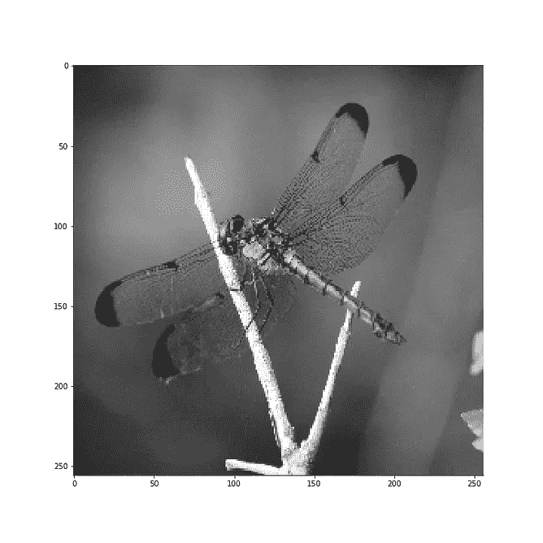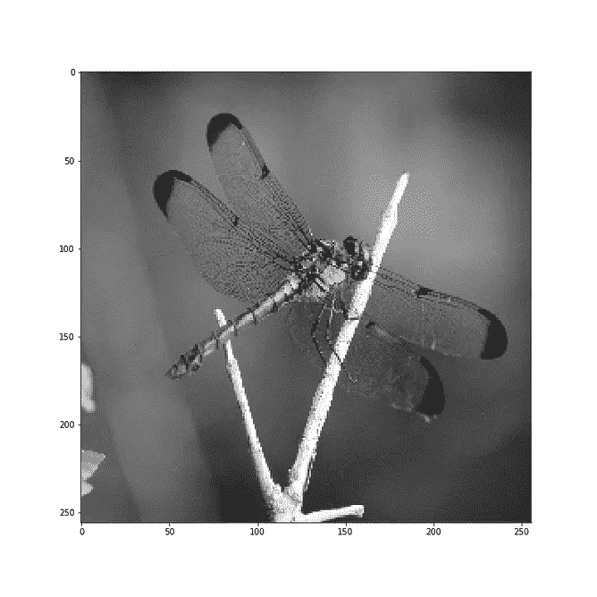

图 7-增强的蜻蜓图像。从左到右—调整大小、灰度和镜像。

图 8 —图像处理代码的一部分。

# 创建训练集和测试集

图 9-豆娘(豆娘)和蜻蜓(龙)图像的总数。

经过处理，我总共有 35318 个图像(452 MB): 16924 个豆娘和 18394 个蜻蜓图像。

训练集由 12694 个豆娘和 13797 个蜻蜓图像组成，测试集包括剩余的 8827‬图像。此外，5%的训练图像用于在整个训练过程中进行验证。

最终，我将数据保存在四个 [NumPy](https://numpy.org/) 文件中；豆娘训练套装，豆娘测试套装，蜻蜓训练套装，蜻蜓测试套装。

# 训练模型

尽管有计算上的限制，我还是试图遵循 [VGG16](https://neurohive.io/en/popular-networks/vgg16/) 的基本 CNN 结构，两个卷积层后跟一个池层。

此外，我在每个基本 CNN 结构后添加了一个 dropout 层，以减少过度拟合。此外，在卷积层之后，我添加了两个 128 神经元密集层和额外的下降层。

图 10 —模型架构

由于我无法为所有 26491 张图片分配内存，我一次分批训练 4000 张图片。每批图像由 2000 张豆娘和蜻蜓照片组成，其中 5%用于验证目的。

我在一组图像上重复了十个时期的训练模型的过程，保存模型权重，清除缓存，并加载一个新的图像集合六次(总共 24000 张照片)。

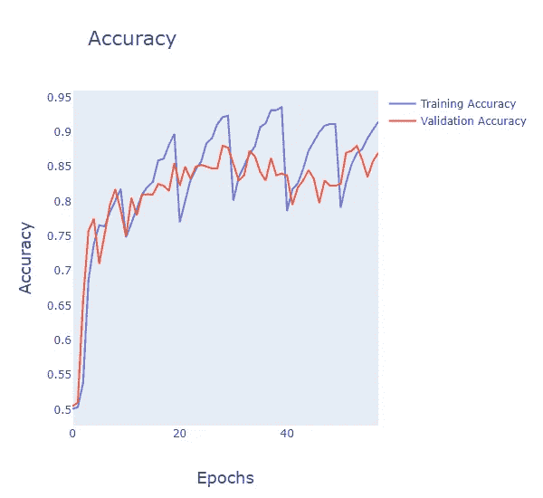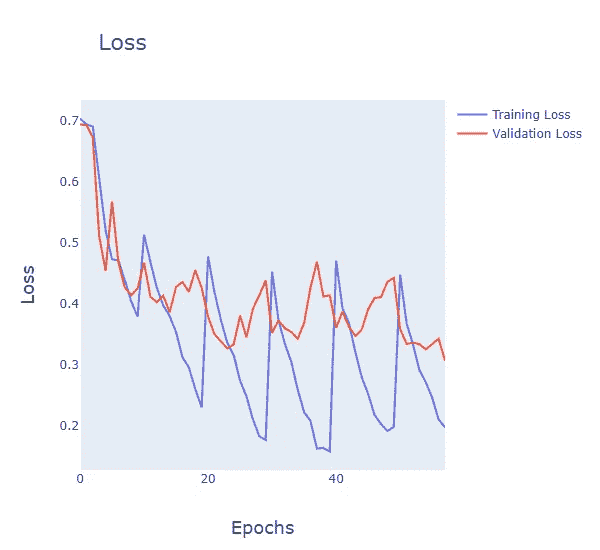

图 11——在对训练集和验证集进行模型训练的过程中，精确度和损失的变化。

# 结果

图 12-显示测试结果的混淆矩阵。

在 24000 幅图像上训练模型后，模型测试精度提高到 85.7%(比二元决策的随机猜测好 35.7%)。

鉴于图像质量参差不齐，我对这个结果很满意。数据集中的一些图像是模糊的，没有聚焦在动物上，或者包含多个动物，这影响了训练过程。

不过，总的来说，这个模型很好地学会了概括。在图 13 的右边，一张包含交配蜻蜓的照片被模型错误地归类为豆娘。

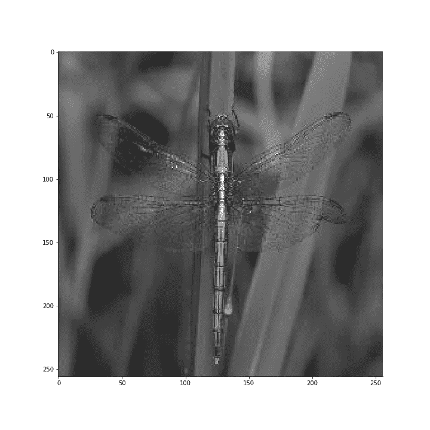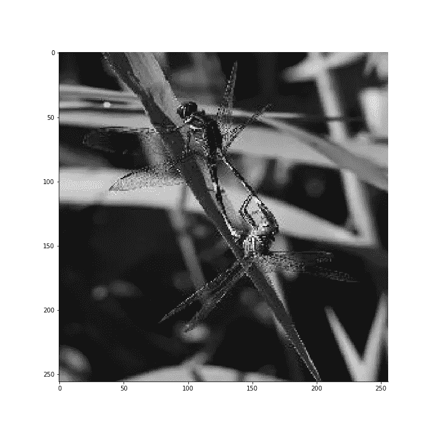

图 13 —从左到右，正确分类的蜻蜓和错误分类的蜻蜓。

## 模型所看到的

出于对模型在每个卷积中看到什么的好奇，我创建了一个额外的模型来返回神经元激活图。

接下来的四个图像代表了前四个卷积层看到的内容。正如所料，在更深入的激活层中，网络更多地关注动物，而不是背景。

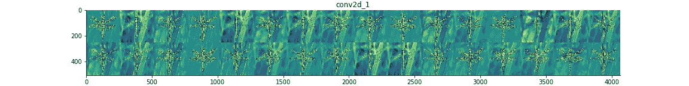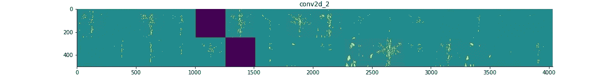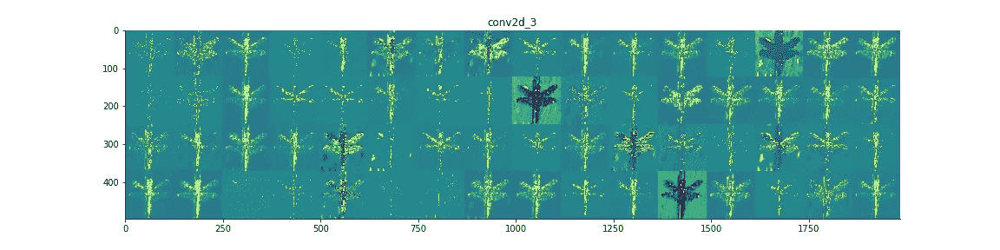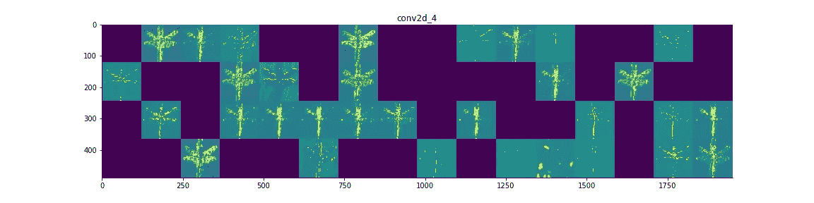

# 摘要

总之，尽管时间有限，但这是一个成功的实验，最终，我想训练一个模型来区分不同种类的龙/豆娘。

然而，需要实现几个变化。我挑战自己硬编码图像增强功能，并从头开始训练图像分类模型。

接下来的步骤包括引入迁移学习来更准确地预测类别，并使用 [Keras](http://keras.io/preprocessing/image/) ' `ImageDataGenerator`类别来扩充数据。对于完整的代码，这个项目在 [GitHub](https://github.com/Gal-Gilor/The_Linnaeus_Bot) 上公开。

# 额外资源

 [## 主页— Keras 文档

### Keras 是一个高级神经网络 API，用 Python 编写，能够运行在 TensorFlow、CNTK 或…

keras.io](https://keras.io/)  [## 基于 Keras 的深度学习模型中的辍学正则化

machinelearningmastery.com](https://machinelearningmastery.com/dropout-regularization-deep-learning-models-keras/)  [## MathWorks——MATLAB 和 Simulink 的制造者

### MathWorks 开发、销售和支持 MATLAB 和 Simulink 产品。

www.mathworks.com](https://www.mathworks.com/)