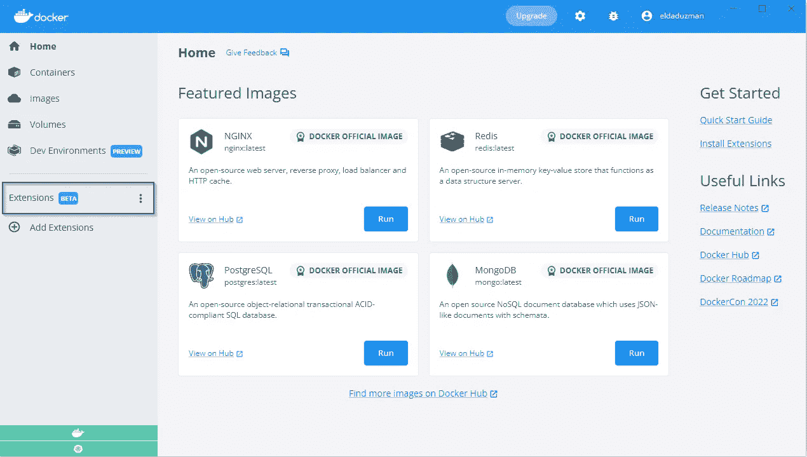
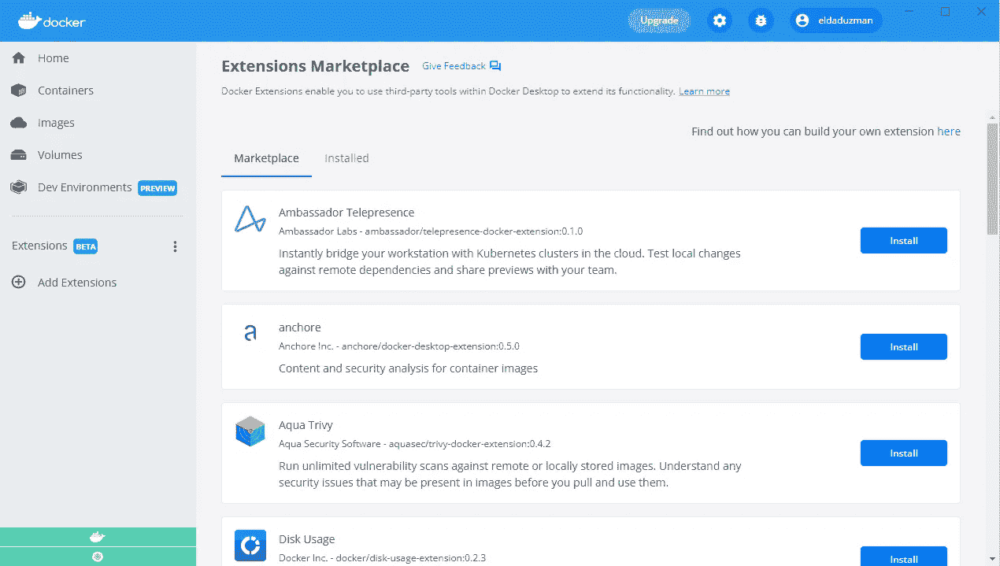
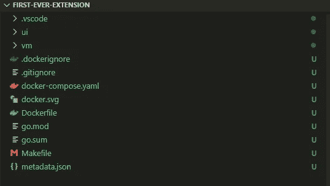
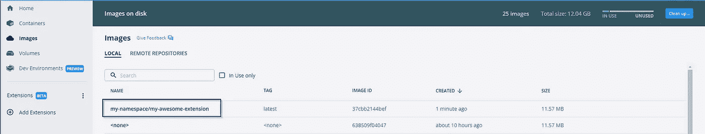
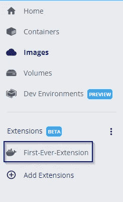
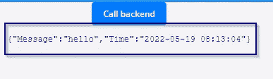

# Docker 扩展简介

> 原文：<https://betterprogramming.pub/introduction-to-docker-extensions-b95a582a6ecc>

## 让你的 docker 环境超级牛逼！


[伊恩·泰勒](https://unsplash.com/@carrier_lost)在 [unsplash](http://unsplash.com) 拍照

Docker 在上一个 dockerCon 中引入了 docker-extensions。

它目前是一个测试功能，看起来它可以给 docker 生态系统带来令人难以置信的启示，并增强开发人员的体验和提高生产力。

让我们来探索这个有前途的新特性。

# 前提

首先，你必须安装 docker-desktop 的 4.8 以上版本。只需遵循此处的安装指南。

# Docker 扩展概述

一旦你安装了 docker-desktop，你就可以看一下仪表盘了:



如您所见，在屏幕左侧有一个扩展部分。大家点一下吧:)。



我们已经到达了 docker 的扩展市场，在那里我们可以搜索由令人敬畏的开源社区提供的扩展。

这里有几个例子:

1.  网真——由大使实验室开发。允许开发人员直接连接到远程 Kubernetes 集群并与之交互。
2.  jrog—使用 JFrogs Xray 对您的 docker 映像运行漏洞检查
3.  日志浏览器—查看所有容器中的日志，以便于故障排除。
4.  OpenShift —与 Rad Hat 的 OpenShift 编排工具轻松集成。

还有更多！

# 构建自己的扩展！

是的，您也可以构建自己的扩展。

我们开始吧！

## 步骤 0:前提条件

*   如上所述，您必须拥有 docker-desktop 4.8 或更高版本
*   Golang — go 将用于创建与 dockers 守护进程交互的后端部分
*   nodejs——将使用 react 来创建 UI 元素
*   Make — make 用于在 Windows 计算机上运行配置和安装插件。你可以用 mingw-make

## 步骤 1:安装 docker 扩展 CLI

*   从[此链接](https://github.com/docker/extensions-sdk/releases)下载 docker 扩展 CLI
*   提取 tar 文件；它包含一个可执行文件
*   将可执行文件移动到`${user_dir}\.docker\cli-plugins`(如果文件夹不存在，您需要创建它)

## 步骤 2:初始化扩展项目

安装 docker 扩展 CLI 后，我们可以用它来初始化项目。

```
docker extension init first-ever-extension
```

这将获取所有 Golang 和 NodeJS 的前提条件和模板。

它将提示几个关于扩展属性的问题，所有这些都是可以更改的。

要有耐心；这需要时间！

以下是输出结果:

现在，让我们看看创建的文件夹，`first-ever-extension`。为了方便，我用 VS 代码打开了它:



*   `ui` =包含用 reactjs 编写的 UI 组件的文件夹
*   包含用 golang 编写的后端组件的文件夹
*   `docker.svg` =扩展区域中呈现的图像
*   `Makefile` =标准制定定义
*   `metadata` =关于扩展包的详细信息

注意:这个文件夹很重！超过 265 MB。

## 步骤 3:编辑代码

首先，我们来看看后端主函数:

后端基于 echo 包。它监听`hello` get 请求并返回一个 JSON 响应`{“‘message”: ”hello”}`。

让我们用`{“‘message”: ”hello”, “time”:${currenttime}}`来代替:

所以，我们导入了 Go 的`time`包，然后我们用它将当前时间添加到响应中。

## 步骤 4:构建扩展

我们将使用 make(或 mingw-make)来构建扩展:

```
mingw32-make build-extension
```

再次强调，要有耐心。也是需要时间的！

完成后，转到 docker-desktop 并导航到图像区域。
您可以根据创建日期对表格进行排序，您可以在顶部找到您的扩展图像。



## 步骤 5:安装扩展

让我们使用 docker 扩展 CLI 工具，通过以下命令将扩展安装到 docker-desktop 中:

```
docker extension install my-namespace/my-awesome-extension
```

在这种情况下，我们将其命名为图像名。

当您看到确认信息时，点击“y”并回车继续。

```
Extensions can install binaries, invoke commands and access files on your machine. 
Are you sure you want to continue? [y/N] y
Installing new extension "my-namespace/my-awesome-extension"
Installing service in Desktop VM...
Setting additional compose attributes
VM service started
Installing Desktop extension UI for tab "First-Ever-Extension"...
Extension UI tab "First-Ever-Extension" added.
Extension "first-ever-extension" installed successfully
```

## 第六步:使用扩展



很好。我们的分机安装好了！让我们单击我们的扩展小部件并使用它:


这是我们启动扩展时得到的标准 GUI。现在，让我们点击“呼叫后端”按钮。



不错！它给了我们当前的 UTC 时间:)

## 第七步:进行更新

请记住，扩展仍然是测试版的功能，所以事情不会总是那么顺利。

让我们转到位于`ui`目录中的`app.js`文件。代码如下所示:

我们看到它有一个“呼叫后端”按钮。

当它被点击时，它调用`get`函数，该函数向后端发送“hello”请求，然后用来自后端的响应中的字符串化 JSON 设置状态。

让我们添加一个新按钮，在我的 docker 守护进程上打印图像的数量。

该模块将提供两个按钮:一个使用 docker 客户端从守护进程获取图像列表，另一个向后端发送“hello”请求并返回 stringified JSON。

现在我们需要重建图像:

```
mingw32-make build-extension
```

然后重新安装该映像

```
docker extension install my-namespace/my-awesome-extension
```

以下是输出结果:

```
Extensions can install binaries, invoke commands and access files on your machine. 
Are you sure you want to continue? [y/N] y
Installing new extension "my-namespace/my-awesome-extension"
Installing service in Desktop VM...
Setting additional compose attributes
VM service started
Installing Desktop extension UI for tab "First-Ever-Extension"...
Extension UI tab "First-Ever-Extension" added.
Extension "first-ever-extension" installed successfully
```

最后的结果是:

漂亮！

# 最后一个音符

这个新特性将有助于将许多 devops 工作，特别是 devsecops 考虑事项，转移到左边。

它可以提高开发人员的生产力，并帮助快速交付高质量的软件产品。

我个人很好奇这会把我们引向何方。