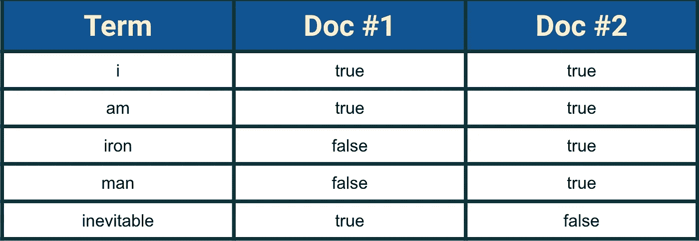
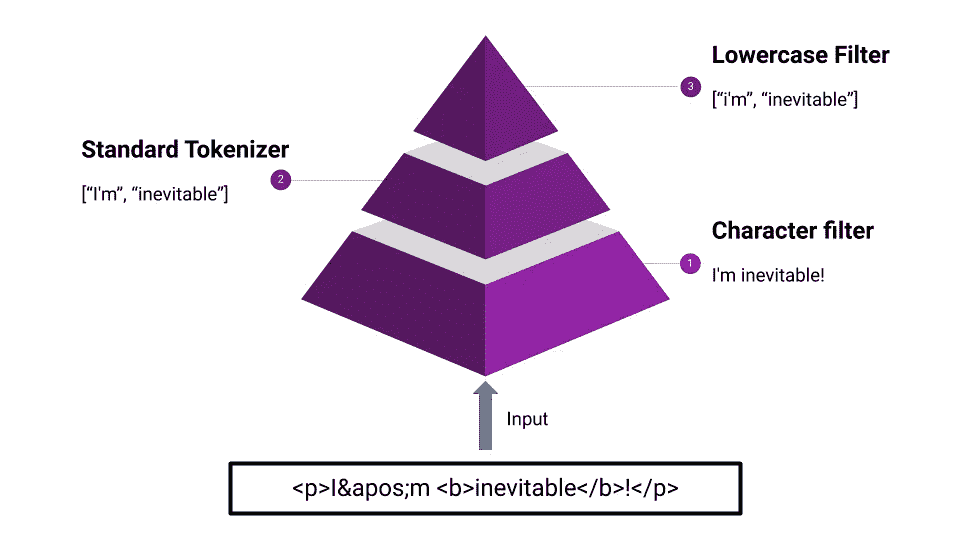

# 使用 Node.js 的 Elasticsearch 简介—第 1 部分

> 原文：<https://betterprogramming.pub/introduction-to-elasticsearch-using-node-js-part-1-164311327557>

## 弹性搜索背后的理论


这是[系列](https://medium.com/@pankaj.panigrahi/list-of-node-js-articles-ededa6dd304b)的第十篇文章，它将帮助您掌握 Node.js 背后的不同概念，并使您能够创建生产就绪的应用程序。

这篇文章期望读者了解巴别塔。如果你需要知道如何设置，请阅读这篇[文章](https://medium.com/@pankaj.panigrahi/using-babel-and-other-dependencies-in-node-js-18f74973c1f0)。

# **什么是弹性搜索？**

Elasticsearch 是一个开源的、可广泛分发的、非常可扩展的搜索引擎。Elasticsearch 的查询速度明显更快，这有助于我们在大量数据中搜索文本。使用 Elasticsearch 的一个关键原因是，它从开发人员那里抽象出搜索和索引机制的所有复杂性，同时给开发人员足够的工具来定制任何需要的东西。

传统的 SQL 数据库管理系统并不是真正为全文搜索而设计的。因此，人们使用 Elasticsearch 的主要原因之一是在几毫秒内搜索文本。

但这不是你用 Elasticsearch 能做的全部。以下是人们使用 Elasticsearch 搜索的一些常见内容:

1.自动完成和即时搜索

2.模糊搜索

3.使用 Kibana 进行分析和可视化

4.聚合分布式日志数据

5.应用性能管理(APM)

在本课程中，我们不会深入研究 Elasticsearch，因为我们将更多地关注集成部分。但是我们将介绍一些弹性搜索的基础知识，以便我们理解如何使用它。

这也意味着文章会很长，充满了无聊的文字。

实在没办法:(。这就是为什么我决定把这篇文章分成两部分。一个只有理论一个有烟火:)

但是我保证，一旦你看完这篇文章，你就会对 ElasticSearch 有一个清晰的概念。

推荐通读教程[elastic search 参考](https://www.elastic.co/guide/en/elasticsearch/reference/current/index.html)和[elastic search 解答](https://www.udemy.com/elasticsearch-complete-guide/)对 ES (Elasticsearch)有一个完整的了解。此后，我将把弹性研究称为 ES。).

首先，让我们看看 ES 是如何存储数据的，关键组件是什么:

# ***集群***

集群是一个或多个节点(服务器)的集合，它们共同保存所有数据，并提供跨所有节点的联合索引和搜索功能。集群中的一个节点是主节点，负责集群范围的管理和配置操作。可以查询集群中的任何节点，包括主节点。但是节点也会将查询转发给包含被查询数据的节点。

# 结节

节点是一台服务器，它是群集的一部分，存储数据，并参与群集的索引和搜索功能。可以通过集群名称将节点配置为加入特定的集群。默认情况下，每个节点都被设置为加入名为 *elasticsearch* 的集群。

# 索引

索引是具有相似特征的文档的集合。例如，可以有一个客户数据索引，一个产品目录索引，还有一个订单数据索引。索引由名称(必须全部小写)标识，当对其中的文档执行索引、搜索、更新和删除操作时，该名称用于引用索引。

# 文件

文档是可以被索引的基本信息单元。例如，您可以为单个客户创建一个文档，为单个产品创建另一个文档，为单个订单创建另一个文档。这个文档是用 [JSON](http://json.org/) (JavaScript 对象符号)表示的，这是一种无处不在的互联网数据交换格式。

在一个索引/类型中，您可以存储任意多的文档。请注意没有限制。

# 碎片和复制品

索引可能会存储大量数据，这可能会超出单个节点的硬件限制。例如，占用 1TB 磁盘空间的十亿个文档的单个索引可能不适合单个节点的磁盘。

为了解决这个问题，ES 提供了将索引细分为多个片段的能力。当您创建一个索引时，您可以简单地定义您想要的碎片数量。每个碎片本身都是一个功能齐全的独立“索引”，可以托管在集群中的任何节点上。分片很重要，有两个主要原因:

*   它允许您水平分割/缩放内容量。
*   它允许您跨分片(可能在多个节点上)分布和并行化操作，从而提高性能/吞吐量。

在随时可能出现故障的环境中，强烈建议拥有故障转移机制，以防某个碎片/节点以某种方式离线。ES 允许您将索引碎片的一个或多个副本制作成所谓的*副本碎片*，或简称为*副本*。

# 绘图

映射定义了特定类型文档的字段——数据类型(如字符串和整数)以及字段在 es 中的索引和存储方式。这类似于关系数据库中定义的模式。

# 分析者

分析器在索引过程中用于将短语或表达式分解成术语。在索引中定义的分析器——无论是内置的还是自定义的——只是一个包含三个较低级别的构建块的包:字符过滤器、标记化器和标记过滤器。

在所有这些中，映射和分析器是开发人员通常使用的最重要的项目。我们将在几分钟后看到这些技术的实际应用。

# 倒排索引

Elasticsearch 将分析器生成的所有令牌存储在一个称为倒排索引的数据结构中。它以一种结构存储文本，这种结构允许非常高效和快速的全文搜索。当执行全文搜索时，我们实际上是在查询一个倒排索引，而不是我们在索引文档时定义的 JSON 文档。

以包含以下文本的两个文档为例:

*医生 1 号:我是不可避免的。*

医生 2:我是，我是钢铁侠。

倒排索引由出现在索引所覆盖的任何文档中的所有唯一术语组成。它存储每个术语出现的文档列表。因此，本质上，倒排索引是术语和包含这些术语的文档之间的映射。对于以上两个文档，我们的倒排索引将如下所示:



倒排索引

实际的倒排索引会存储更多的信息，比如每个术语在每个文档中的出现频率、术语在文档中的位置等。

# 详细映射

字段是 ES 中最小的数据单位。每个字段都有一个定义的类型，包含一个数据片段，如布尔、字符串或数组表达式。对于不同的目的，以不同的方式索引相同的字段通常是有用的。例如，`string`字段可以被索引为用于全文搜索的`text`字段，以及用于排序或聚合的`keyword`字段。

在使用之前，不需要定义字段和映射类型。多亏了动态映射，新的字段名将通过索引文档自动添加。新字段既可以添加到顶级映射类型，也可以添加到内部对象和`[nested](https://www.elastic.co/guide/en/elasticsearch/reference/current/nested.html)`字段。我们还可以为我们的索引创建自定义映射，如下所示:

当我们实现自己的索引时，我们将看到更高级的用法。

# 分析器的剖析

Analyzer 有三个较低级别的构建块:字符过滤器、令牌化器和令牌过滤器。

**字符过滤器:**字符过滤器接收作为字符流的原始文本，并可以通过添加、删除或改变字符来转换该流。例如，`html_strip`字符过滤器从文本中去除所有的 HTML 标签。

**记号赋予器:**记号赋予器接收字符流，将其分解成单个记号(通常是单个单词)并输出记号流。例如，`whitespace`记号赋予器在看到任何空白时会将文本分解成记号。我真的推荐浏览一些[常见的记号赋予器。](https://www.elastic.co/guide/en/elasticsearch/reference/current/analysis-tokenizers.html)

**令牌过滤器**:令牌过滤器接收令牌流，并可以添加、删除或更改令牌。例如，`[lowercase](https://www.elastic.co/guide/en/elasticsearch/reference/current/analysis-lowercase-tokenfilter.html)`令牌过滤器将所有的令牌转换成小写字母，`[stop](https://www.elastic.co/guide/en/elasticsearch/reference/current/analysis-stop-tokenfilter.html)`令牌过滤器从令牌流中删除常用词(*停用词*)如`the`，而`[synonym](https://www.elastic.co/guide/en/elasticsearch/reference/current/analysis-synonym-tokenfilter.html)`令牌过滤器将同义词引入令牌流。

请注意，分析器可以有零个或多个字符过滤器和标记过滤器，但它必须只有一个**标记器。**

让我们举一个定制分析器的例子，我们可以使用`standard`标记器、`html_strip`字符过滤器和`lowercase`标记过滤器来构建它。标准的记号赋予器将文本划分为单词边界上的术语(不仅仅是空白)。它删除了大多数标点符号。

我们可以通过使用 ES 提供的以下 API 来检查我们的定制分析器是如何工作的。不要担心，在下一篇文章中，您将看到如何使用这个 API。

它将返回两个令牌:`i'm`和`inevitable`。让我们想象一下这是如何发生的:



现在我们已经按照我们想要的搜索和检索方式存储了数据，但是我们该如何做呢？

# 查询 DSL

Elasticsearch 提供了基于 JSON 的全查询 DSL(领域特定语言)来定义查询。最常见最简单的查询子句之一是`match`。在本文中，我们将使用`match`查询来获取我们的结果。但是你可以在这里阅读更多关于查询 DSL [的内容](https://www.elastic.co/guide/en/elasticsearch/reference/current/query-dsl.html)。

我们可以通过以下方式使用匹配查询:

```
GET /my-index/_search
{
  "query":{
    "match":{
      "field_name" : "search text"
    }
  }
}
```

唷！

我觉得这么多理论，足够我们弄脏手了。所以做好飞行的准备吧！


[在下一篇文章](https://medium.com/@pankaj.panigrahi/introduction-to-elasticsearch-using-node-js-part-2-4c804427bc94)中，我们将创建我们的索引，设置显式映射，创建自定义分析器，将文档上传到我们的索引，并在 node.js 中创建一个 rest API，它将使用查询 DSL 来访问 ES 实例。接下来会有很多激动人心的事情。:)