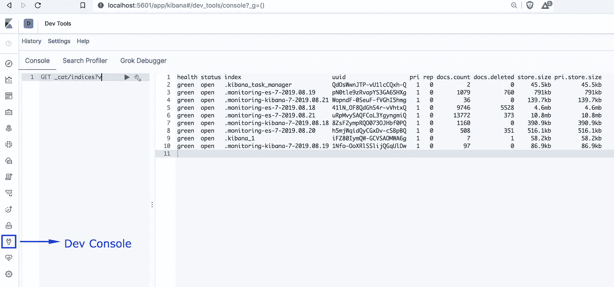
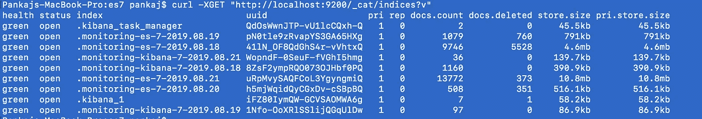
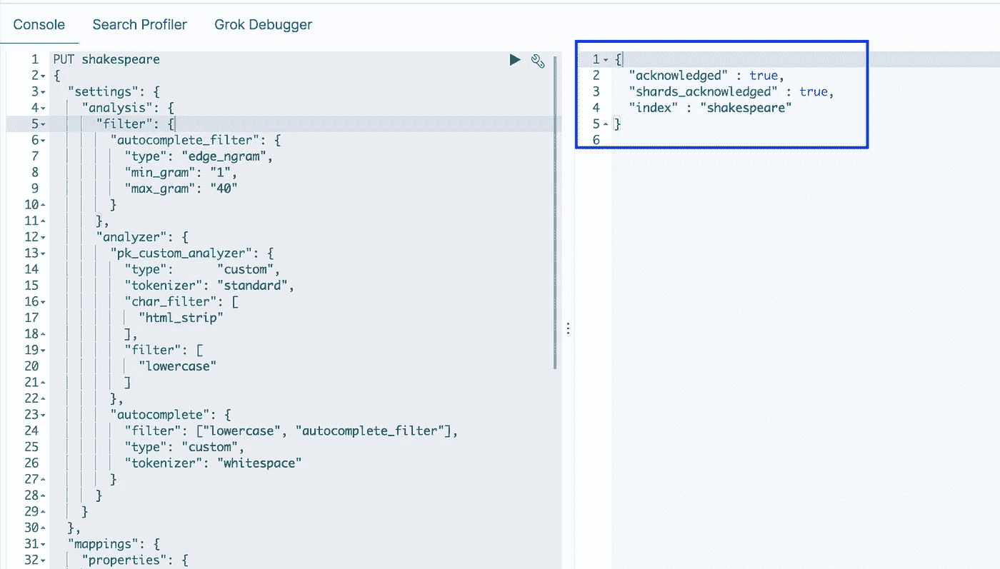
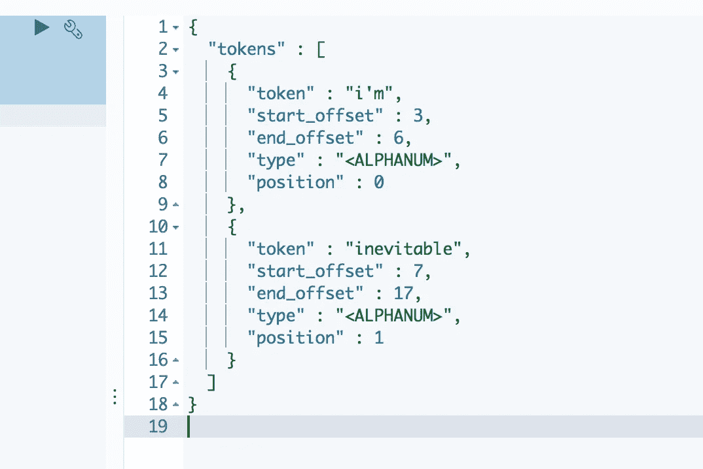
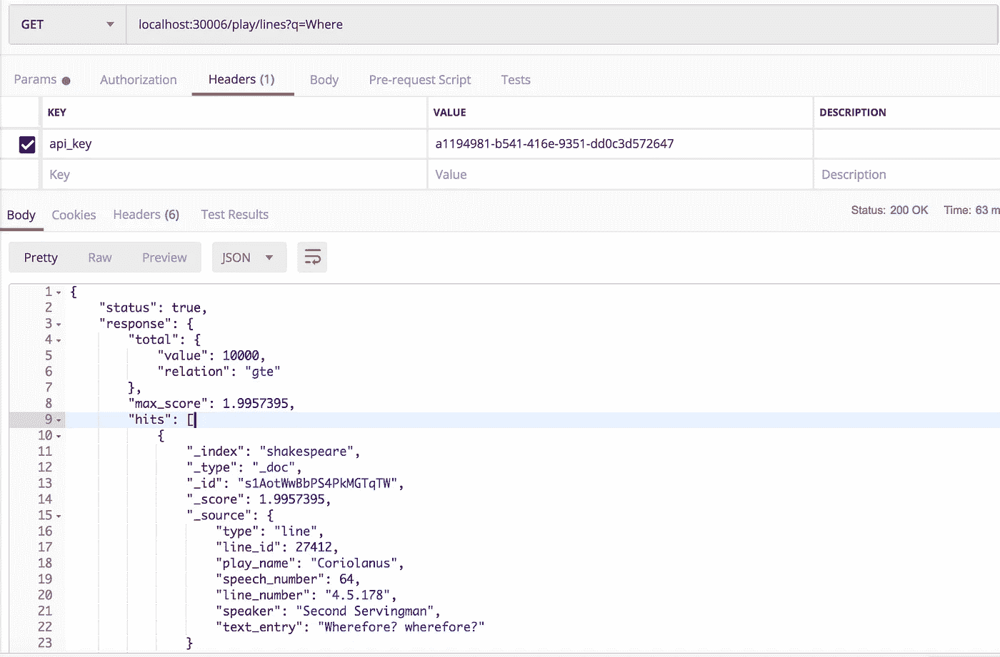

# 使用 Node.js 的 Elasticsearch 简介—第 2 部分

> 原文：<https://betterprogramming.pub/introduction-to-elasticsearch-using-node-js-part-2-4c804427bc94>

## 实际使用:解释和例子


这是[系列](https://medium.com/@pankaj.panigrahi/list-of-node-js-articles-ededa6dd304b)的第 11 篇文章，它将帮助您掌握 Node.js 背后的不同概念，并使您能够创建生产就绪的应用程序。

这篇文章期望读者了解巴别塔。如果您需要知道如何设置，请阅读这篇[文章](https://medium.com/@pankaj.panigrahi/using-babel-and-other-dependencies-in-node-js-18f74973c1f0)。

在阅读本文之前，您必须浏览一下[上一篇文章](https://medium.com/@pankaj.panigrahi/introduction-to-elasticsearch-using-node-js-part-1-164311327557)，因为它涵盖了您需要了解的所有概念。

你可以从[这里](https://www.elastic.co/start)下载 Elastic 和 Kibana 的存档文件并解压。

Kibana 主要用于可视化您的 Elasticsearch 数据和浏览 Elastic 堆栈。但是它也有一个开发控制台，可以用来与弹性数据交互。默认情况下，Elastic 公开一个 REST API。因此，您在 Kibana dev 控制台上执行的每个操作也可以通过一个简单的 curl 请求来完成。

一旦提取了 elastic 和 Kibana 归档文件，就可以通过运行`bin/elasticsearch`和`bin/kibana`来启动它们。

然后，您可以从以下网址访问基巴纳:`htrp://localhost:5601`。

您可以转到 Kibana 的 dev console 选项卡，点击下面的 API 来获得一个详细的输出，显示所有创建的索引的详细信息:`_cat/indices?v`



你也可以通过简单的卷曲来达到弹性效果，如下所示。但是这里，出于明显的原因，您必须明确提到您的弹性实例的主机和端口细节。



让我们首先用自定义映射和分析器创建一个索引。然后我们将文档添加到索引中。我们将储存莎士比亚戏剧中的台词和对话。我们的示例文档如下所示:

将以下请求复制并粘贴到您的 Kibana 开发控制台。

在触及 API 之前，让我们详细分析请求的每个部分。

# **映射**

在映射中，我们为字段`speaker`和`line_number`保留了`keyword`数据类型，因为我们不必为这些字段执行部分字符串搜索。同样，我们将`line_id`和`speech_number`保留为`integer`。

```
"mappings": {
    "properties": {
      "speaker": {
        "type": "keyword"
      },
      "play_name": {
        "type": "text",
        "analyzer": "pk_custom_analyzer"
      },
      "line_id": {
        "type": "integer"
      },
      "speech_number": {
        "type": "integer"
      },
      "line_number": {
        "type": "keyword"
      },
      "text_entry": {
        "type": "text",
        "analyzer": "autocomplete"
      }
    }
  }
```

`playname`和`text_entry`是重要字段。对于这两者，我们都将数据类型保持为`text`。此外，我们还为它们分别附加了不同的定制分析器。

`pk_custom_analyzer`是一个定制分析器的基本版本，就像我们在上一篇文章中创建的一样。但是`autocomplete`分析仪也使用自定义过滤器。让我们看看索引的分析器设置。

# **分析仪设置**

顾名思义`autocomplete`分析器是为文本输入/搜索提供自动完成功能。这可以通过使用令牌化器`edge_ngram`和令牌过滤器`edge_ngram`来实现。我更喜欢使用令牌过滤器，因为我们只能有一个令牌化器，所以最好将它保留下来用于其他目的。`edge_ngram`记号赋予器或过滤器发出每个单词的 N 元语法，其中 N 元语法的开始被锚定到单词的开始。于是 *Quick* 就变成了['Q '，' Qu '，' Qui '，' Quic '，' Quick']。

首先，我们使用`edge_ngram`创建自定义令牌过滤器。`autocomplete_filter`是过滤器名称。`min_gram`定义 edge_ngram 生成的令牌的最小长度，`max_gram`定义最大长度。

```
"filter": {
   "autocomplete_filter": {
      "type": "edge_ngram",
      "min_gram": "1",
      "max_gram": "40"
   }
}
```

然后，我们通过明确提及我们想要使用的过滤器和标记化器来定义我们的定制分析器:

```
 "analyzer": {
        "pk_custom_analyzer": {
          "type":      "custom", 
          "tokenizer": "standard",
          "char_filter": [
            "html_strip"
          ],
          "filter": [
            "lowercase"
          ]
        },
        "autocomplete": {
          "filter": ["lowercase", "autocomplete_filter"],
          "type": "custom",
          "tokenizer": "whitespace"
        }
      }
```

现在让我们点击 Kibana 控制台中的 API。您应该会看到如下所示的响应:



每当您使用 Elasticsearch 时，知道您可以使用任何自定义输入来测试您的分析器是非常有用的。您可以点击以下 API:

```
POST shakespeare/_analyze
{
  "analyzer": "pk_custom_analyzer",
  "text":     "<p>I'm Inevitable</p>"
}
```



它应该在分析给定输入后返回令牌。这非常有帮助，因为我们可以发现我们的分析器对于各种输入是否工作正常(在将文档上传到我们的索引之前)。您也可以对另一个自动完成分析器做同样的事情。

现在，让我们将一些文档上传到我们的索引中。从[这个链接](https://gofile.io/?c=lFaopW)下载样本文件，我也会将相同的文件添加到我的 Git repo 中。

转到下载文件的文件夹。您可以使用一个简单的 curl 请求来访问 ES 给定的 API。API URL 是`/index-name/_bulk?pretty`。你可以点击如下的 API:

```
curl -H 'Content-Type: application/x-ndjson' -XPOST 'localhost:9200/shakespeare/_bulk?pretty' --data-binary [@shakespeare_lines](http://twitter.com/shakespeare_lines).json
```

所有文件上传需要几秒钟时间。您可以使用`_cat/indices?v`再次查看指数详情。

点击我们的自动完成数据的搜索查询如下:

```
GET /shakespeare/_search
{
  "query" : {
    "match":{
      "text_entry" : "Where"
    }
  }
}
```

点击这个 API 将给出类似于下面结构的响应:

```
{
  "took": 6,
  "timed_out": false,
  "_shards": {...},
  "hits": {
    "total": {...},
    "max_score": 1.9957395,
    "hits": [
              {
                "_index" : "shakespeare",
                "_type" : "_doc",
                "_id" : "s1AotWwBbPS4PkMGTqTW",
                "_score" : 1.9957395,
                "_source" : {
                   ...
                   "speaker" : "Second Servingman",
                   "text_entry" : "Wherefore? wherefore?"
                }
              }            
           ...]
  }
}
```

`took`字段将提到执行查询所用的毫秒数。`_shards`将拥有获取数据的碎片细节。`hits.total`将包含可用结果的计数。`hits.hits`将包含匹配文档的数组。`_score`表示文档与搜索词的相关性。`_source`字段保存实际的文档。

现在，要与 Node.js 集成，我们要么使用 Elasticsearch 的官方客户端库，要么使用流行的请求库来命中 Elasticsearch 的 rest APIs。将请求库作为项目的一部分是很常见的，所以我将在本文中使用它。([@ elastic/elastic search](https://www.npmjs.com/package/@elastic/elasticsearch)；[请求](https://www.npmjs.com/package/request)

让我们从我之前创建的样板文件开始。如果您从一开始就关注这个系列，那么样板文件应该非常清楚。安装请求库。

```
npm i request --save
```

创建以下文件:`services/PlayService.js`

在上面的 API 调用中，我们将两个参数传递给 elastic，如下所示:

```
let reqObject = {
   url:"http://localhost:9200/shakespeare/_search?pretty",
   json:queryClause
};
```

`queryClause`将包含查询 DSL 中编写的对象。

现在创建一个路径文件`routes/play.js`，如下所示:

我们在这里定义一个 get 请求，其中路径应该是`/play/line`，应该有查询参数`q`。

打开`app.js`文件，导入播放路径。

```
import play from './routes/play';
```

并在现有用户路径注入下注入播放路径。

```
app.use('/user',user); // Existing code in boiler plate
app.use('/play',play);
```

现在让我们通过运行`node index.js`来启动我们的 API 服务器。你可以在 postman 里打 API，得到结果。



在真实的用例中，您不会像我们在这里一样返回结果。您要么重组和过滤数据，要么根据这些结果执行另一个操作。

弹性搜索是一个庞大的话题。但是我希望我已经给了你一个快速和很好理解的介绍。

# 密码

[](https://github.com/pankaj805/medium-11-es) [## pankaj 805/中型-11-es

### 此时您不能执行该操作。您已使用另一个标签页或窗口登录。您已在另一个选项卡中注销，或者…

github.com](https://github.com/pankaj805/medium-11-es)