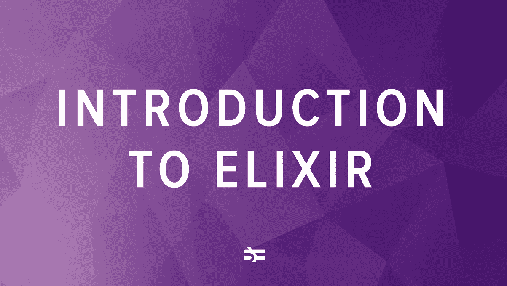
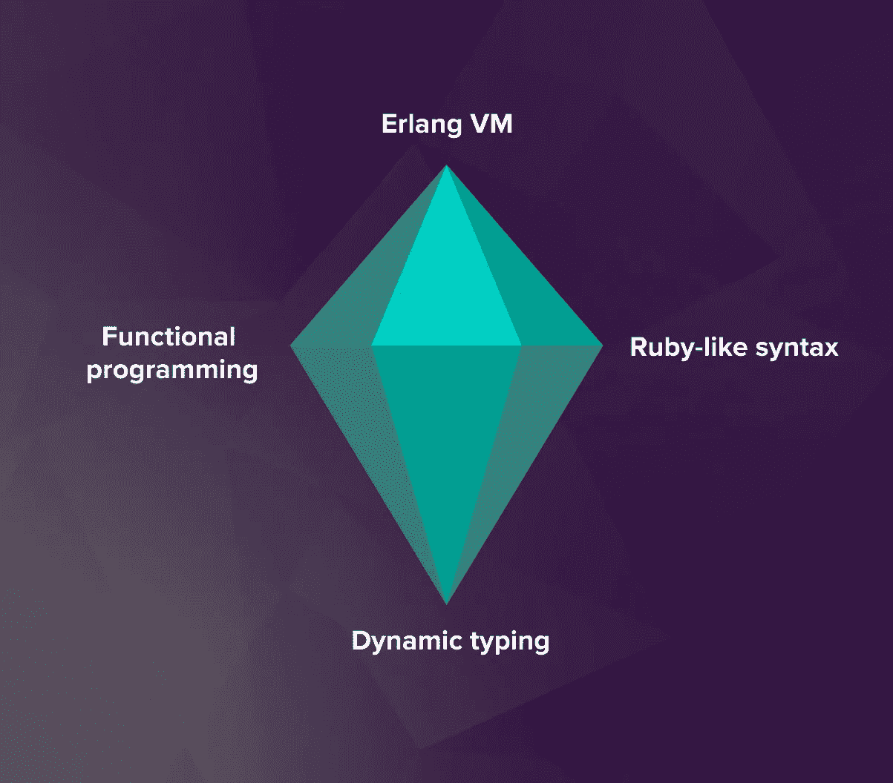
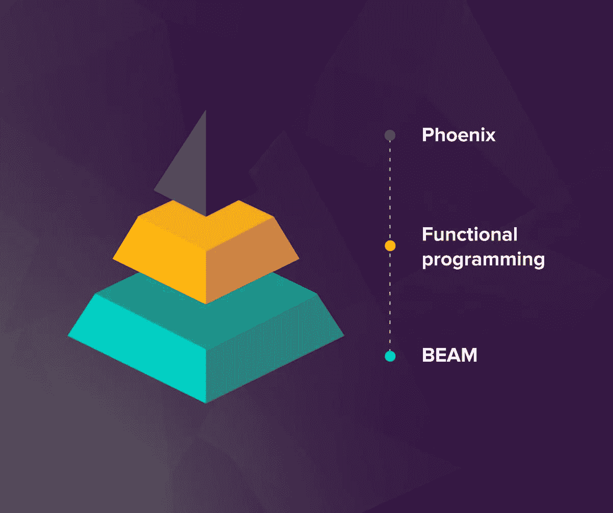
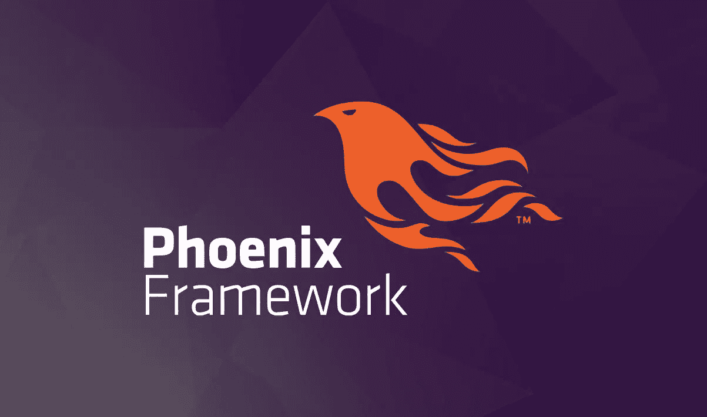

# 什么是长生不老药，为什么要用它？

> 原文：<https://betterprogramming.pub/introduction-to-elixir-9d2a21e3147c>

## 了解现代 web 堆栈中的一个新成员

图片来源:作者

Elixir 是一种功能性的动态类型语言，构建在 Erlang 的 VM 之上，并向下编译为 Erlang 字节码。

根据 [Stack Overflow 开发者调查](https://insights.stackoverflow.com/survey/2019#most-loved-dreaded-and-wanted)，自从 2011 年发布以来，Elixir 已经成为最受欢迎的语言之一，这是有充分理由的。它允许创建非常可伸缩、非常可靠的应用程序，并且语法也非常好。

虽然语言[在高度并发的 web 应用中取得了进展](https://prograils.com/posts/why-discord-pinterest-moz-bleacher-report-use-elixir-case-studies)，但是我们的一些读者可能还不熟悉它。在本文中，我们将简要介绍什么是 Elixir，以及与 Java、Ruby 等技术相比，为什么要在软件项目中使用它。

# 什么是二郎？简史

每一次对仙丹的讨论，都不可避免地要从对二郎的讨论开始。

Erlang 是一种相当古老的语言，创建于 20 世纪 80 年代。它的目的是解决可靠的电话交换问题，这一点它做得几乎完美。Erlang 提供了用于创建代码的工具，这些代码具有高度可伸缩性、并发性、难以置信的正常运行时间和容错能力。

为了让这个奇妙的工具集更容易使用，José Valim 创造了 Elixir。

Elixir 的本意是成为一种类似 Ruby 的语言，让开发人员能够使用 Erlang 为开发人员提供的用于并行和并发计算的所有强大工具。Elixir 将包括 Erlang 中必要但缺少的特性。

从这个意义上说，它成功了。虽然 Erlang 和 Elixir 仍然在各自的领域广泛使用，但是 Elixir 更受欢迎，并且越来越受欢迎。

# 酏剂的主要特点

> “Elixir 编程语言将函数式编程与不可变状态和基于角色的并发方法包装在一个整洁的现代语法中。它运行在工业级的高性能分布式 Erlang 虚拟机上。但这一切意味着什么？”
> 
> *—迪夫·托马斯，* [*编程仙丹*](https://pragprog.com/book/elixir16/programming-elixir-1-6)

图片来源:作者

*   **Elixir 构建在 Erlang VM 之上。** Elixir 可以访问 Erlang 可以访问的所有并发工具，这使得它成为构建可伸缩的分布式系统的最强大的现代语言之一。
*   灵药有类似红宝石的语法。如果你已经用 Ruby 编程了，Elixir 的语法会感觉很熟悉。Ruby 是最简洁和面向生产力的语言之一，但是它在性能和并发性方面有所欠缺。Erlang VM 解决了这两个问题，因此，Elixir 是两全其美的产品。
*   **仙丹是功能性的。**虽然 Elixir 和 Erlang 可以说是自成一组(它们都是面向过程的)，但 Elixir 也拥有现代 FP 语言的所有结构。特别是，不可变的数据结构对并发性帮助很大，模式匹配对于编写声明性代码非常有用。
*   **仙丹有动态分型。与 Haskell 和 Scala 等其他函数式语言相比，Elixir 具有动态类型。这意味着类型是在运行时检查的，而不是在编译期间。虽然在构建关键系统时这可能是一个缺点，但它也提高了简单 web 应用程序的开发速度。静态类型可以通过*类型规范*(类型规范)引入到 Elixir 中。**

# 长生不老药的好处

图片来源:作者

## 光线

Elixir 构建在 BEAM(Erlang VM)之上，它共享的抽象使 Erlang 成为并发、大容量应用程序的最佳选择之一。

对于 Erlang，Elixir 共有以下三个特征:

*   **并发。** Elixir 使用轻量级执行线程(称为进程)。这些是隔离的，运行在所有 CPU 上，并通过消息进行通信。再加上语言的函数性质所带来的数据不变性，这使得用 Elixir 编写并发程序变得不那么困难了。
*   **可扩展性。**这些相同的流程使我们能够轻松地横向(向集群添加更多机器)或纵向(更有效地利用机器的可用资源)扩展系统。
*   **可靠性。** Elixir 和 Erlang 拥有独特的容错方法。虽然在生产中有时不可避免地会失败，但是轻量级流程可以通过管理系统快速重启。这处理了大多数不是由软件开发中的严重错误引起的错误。

从 Erlang，Elixir 也获得了开放的电信平台。OTP 是 Erlang 标准库的一部分，用于在电信系统中实现容错，但现在它的用途要广泛得多——基本上可以用于任何类型的并发编程。

与传统的解决方案相比，OTP 提供了一个很好的基础，因此开发人员可以花时间实现实际的业务逻辑。对于其他语言，很多时间都花在了管道上。

## 函数式编程

此外，Elixir 在很大程度上是一种函数式编程语言。

函数式编程是一种编程范式，它将程序视为数学函数的求值，并避免诸如可变数据和改变状态之类的事情。

与 Java 或 Python 等主流编程语言相比，Elixir 代码是以函数和模块(函数组)的形式构造的，而不是以对象和类的形式。此外，所有数据类型都是不可变的。例如，对变量调用函数将产生一个新的变量，而不是就地改变变量。

函数式编程支持并利用了诸如[模式匹配](https://elixir-lang.org/getting-started/pattern-matching.html)、高阶函数和声明式代码编写风格之类的东西，这带来了多种好处:

*   更好的可维护性
*   更清晰的测试和调试
*   更容易处理并发程序
*   使代码更容易编写和理解的高级抽象

## 凤凰

图片来源:作者

如果你想使用世界上最好的 web 框架，你必须使用 Elixir。

[Phoenix](https://www.phoenixframework.org/) 和任何常规的 MVC web 框架(比如 Rails 和 Django)一样容易使用，但是它也有 BEAM 支持。它使人们能够高效地生产 web 应用程序，同时不牺牲速度或可维护性。

事实证明，Elixir/Erlang 的轻量级进程非常适合解决 web 服务中的并发性和可伸缩性问题。虽然 Phoenix Channels 可以在一台机器上实现[200 万个 WebSocket 连接](http://www.phoenixframework.org/blog/the-road-to-2-million-websocket-connections)，但是通过将流量分配到更多的节点，容量可以成倍增加。

不过，它也有不利的一面。Phoenix 和 Elixir 的生态系统不像 Ruby on Rails 或 Python 的 Django 那样成熟，因此可能会遇到“并非所有电池都包含在内”的问题。但总而言之，利大于弊。

以下是凤凰网上一些有用的资源:

*   [凤凰网一个新网站的网络框架](https://www.youtube.com/watch?v=bk3icU8iIto)
*   [Phoenix 框架简介&其工作原理](https://blog.eduonix.com/web-programming-tutorials/introduction-phoenix-framework-works-action/)
*   [Phoenix:Elixir 的网络框架介绍](https://www.youtube.com/watch?v=F-7MX_Az6_4)

# 如果你想扩大规模，选择灵丹妙药

图片来源:作者

许多公司都在使用长生不老药:

*   Adobe 使用 Elixir 为协作摄影工作流程构建了一个客户端/云应用程序。
*   **Discord** 在他们的大规模信息系统中使用了长生不老药，你可能听说过。500 万并发用户？[无忧无虑。](https://blog.discordapp.com/scaling-elixir-f9b8e1e7c29b?gi=88994ceb8364)
*   Moz 在他们的数字营销和搜索引擎优化工具集 Moz Pro 的后端使用了 Elixir。
*   **金融时报**已经将 Elixir 用于开发多种应用。
*   **摩托罗拉解决方案**将 Erlang 和 Elixir 用于需要可靠和容错的关键任务通信系统。

更多的人也使用 Erlang，如 WhatsApp 和 Heroku。

正如我们从上述公司看到的，Elixir 使我们能够为并发系统编写容错的、可伸缩的代码，因此，它非常适合可能需要高效处理大量用户的消息传递系统和 web 应用程序。所以，如果你计划建造这样的东西，你现在知道该往哪个方向看了。