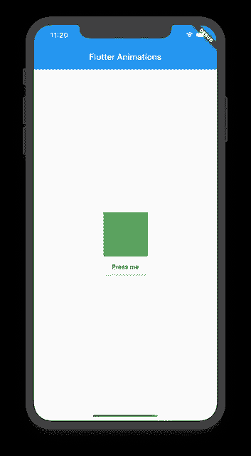
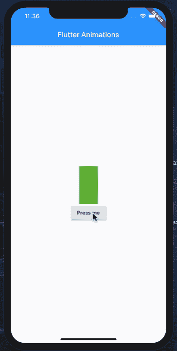
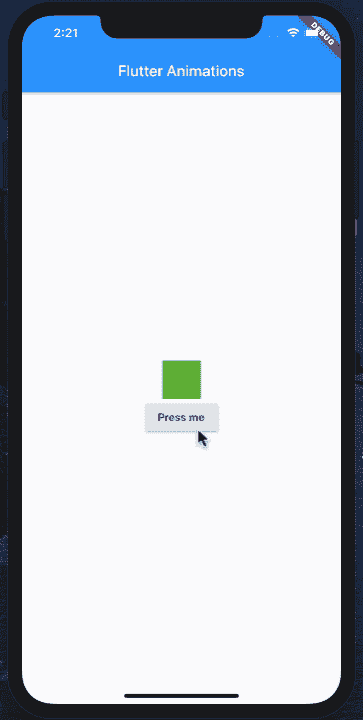
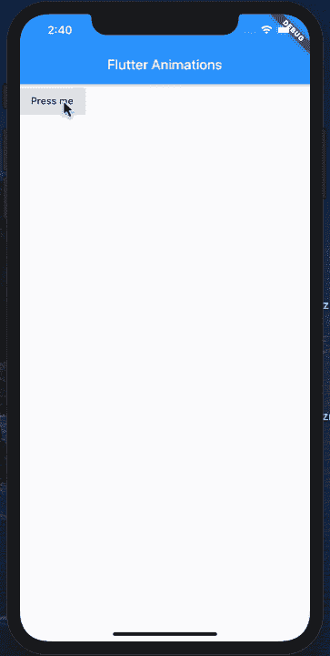

# 使用 AnimatedContainer 的颤动动画简介

> 原文：<https://betterprogramming.pub/introduction-to-flutter-animations-using-animatedcontainer-96a335cad2ca>

## 将您的 Flutter 应用程序带入生活


照片由[兰德尔·鲁伊斯](https://unsplash.com/@ruizra?utm_source=unsplash&utm_medium=referral&utm_content=creditCopyText)在 [Unsplash](https://unsplash.com/s/photos/flutter?utm_source=unsplash&utm_medium=referral&utm_content=creditCopyText) 上拍摄

在这篇文章中，我们将看看`AnimatedContainer`以及它如何被用来在 [Flutter](https://flutter.dev/) 应用中执行动画。

# 动画容器

在 Flutter 中有几种表现动画的方式，但`AnimatedContainer`可能是最简单的一种。

这个想法是将您的小部件包装在一个容器(`AnimatedContainer`)中，并在一段时间内更新`AnimatedContainer`的属性。这些属性包括高度、宽度、颜色、边框半径、边框等。

注意:`AnimatedContainer`的变换和子属性不能被动画化。

虽然这可能感觉受到限制，但实际上您可以组合多个属性并制作动画来创建有趣的动画。

# 入门指南

让我们从创建应用程序的基本布局开始。这将由一个按钮和一个`Container`组成，如下图所示:

这将创建以下界面:



凸起的按钮和容器

为了动画显示容器的宽度或高度，我们将把它包装在一个`AnimatedContainer`小部件中。`AnimatedContainer`还公开了宽度、高度和颜色属性，如下面的代码所示:

您会注意到我们已经移除了`Container`小部件，并用`AnimatedContainer`取而代之。效果是一样的，它只是在屏幕上显示一个绿色的小方块。

为了制作`AnimatedContainer`的宽度和高度的动画，我们将不得不改变这些尺寸。这意味着我们必须为我们的小部件启用状态。

不幸的是，我们的小部件继承了`StatelessWidget`，这意味着它不能维护状态。让我们首先确保更新小部件以使用`StatefulWidget`,如下面的代码所示:

`StatefulWidget`将允许我们改变小部件的状态，这将有助于动画`AnimatedContainer`的某些属性。

现在，创建一个属性`_width`并用值`50.0`初始化它，如下所示:

```
double _width = 50.0; 
```

我们想在按钮被按下时更新`_width`的值。将下面的代码添加到`RaisedButton`的`onPressed`事件中，如下所示:

还要注意，我们已经更新了`AnimatedContainer`，它现在使用`_width`作为其宽度属性的值。这意味着当点击按钮时，它会将`_width`变为`100`。

因为这个变化在`setState`块内部，它将触发小部件的构建功能。这意味着所有的小部件都将重新创建，这一次，`AnimatedContainer`将对其 width 属性执行动画，因为它已经从`50`变成了`100`。

下面的动画展示了这种效果:



动画容器通过改变宽度来制作动画

很酷，对吧？

你甚至可以制作包括颜色在内的多种属性的动画。这显示在下面的实现中:

我们创建了两个名为`_length`和`_color`的全新属性。长度属性将显示容器的大小，颜色属性将显示容器的颜色。最终效果如下图所示:



动画大小和颜色

负责改变一些视觉属性的动画可能看起来不太像，但是当组合在一起时可以产生有趣的结果。

在下一节中，我们将实现一个通知横幅小部件，它将使用`AnimatedContainer`来创建有吸引力的动画。

# az 通知

`AZNotification`是一个通知窗口小部件，用于显示基于横幅的小通知。`AZNotification`小部件的动画如下所示:



az 通知成功动画

`AZNotification`使用[弹起](https://pub.dev/packages/sprung)框架来实现弹性弹起效果。

它还允许开发人员选择横幅的状态，包括成功、警告和错误，分别用绿色、橙色和红色表示。

下面，你可以找到`AZNotification`小部件的基本定义。

这些属性的详细信息如下所示:

*   `isActive` —该属性表示是否显示`AZNotification`。
*   `child` —将在`AZNotification`小工具中显示的子控件。
*   `status` —成功、警告或错误。
*   `completion` —动画完成时触发的完成功能。
*   `maxHeight` —旗帜的最大高度。
*   `borderRadius`—`AZNotification`小工具是否有圆形边框。

`AZNotification` widget 的构建功能实现如下:

差不多就是这样了！

`AZNotification`的用法如下所示:

结果如下所示:


az 通知错误状态

在本文中，您了解了 Flutter 中的`AnimatedController`，以及如何使用它在 Flutter 应用程序中创建动画。

*   [GitHub —颤动动画](https://github.com/azamsharp/AzamSharp-Weekly/blob/master/flutter_animations.zip)

我真的希望你喜欢这篇文章！

快乐编码。