# 镖靶上的颤动介绍

> 原文：<https://betterprogramming.pub/introduction-to-flutter-on-dartpad-413b7680179b>

## 创建、编辑和共享您的 Flutter 项目

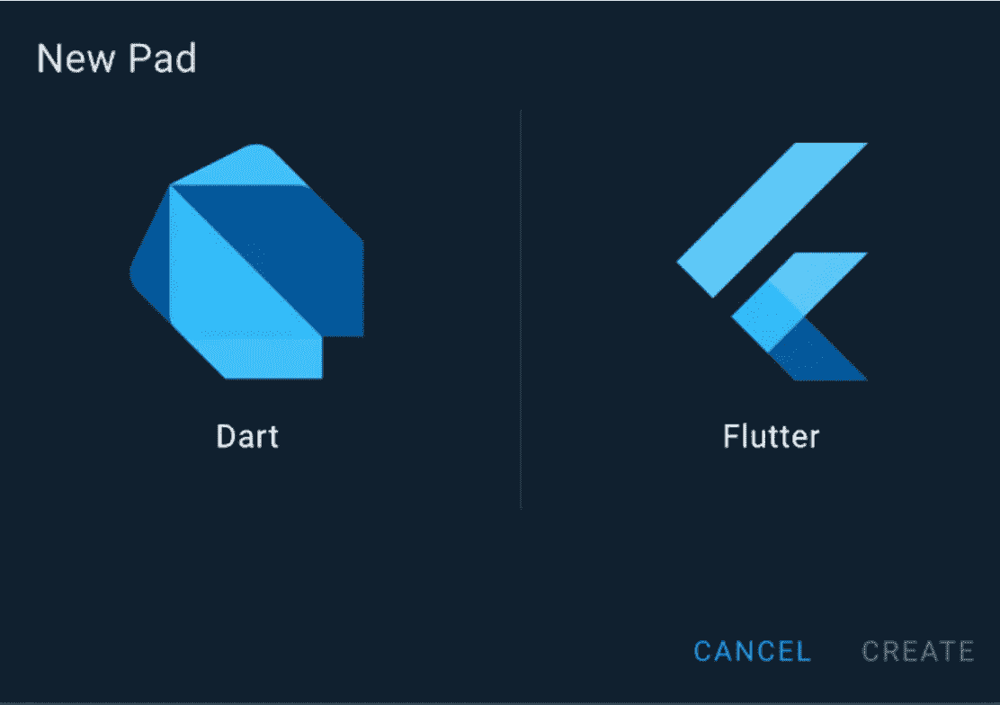

图片来源:aliceyt

我们现在可以在 [DartPad](https://dart.dev/tools/dartpad) 上使用 [Flutter](https://flutter.dev/) toolkit 的最新声明让我激动不已，因为使用它作为一种工具，以最少的设置尝试新的 Flutter widgets 有很大的潜力。

如果你还没有决定是否试用 Flutter toolkit，DartPad 也是一个很好的试水方式，因为你不必投入时间和(计算机的)内存空间来安装所需的应用程序。

现在，我将带您了解如何在 DartPad 上建立一个 Flutter 项目，以及一些您可以与 DartPad 一起使用的学习资源。

# 开始一个新项目

在 DartPad 上开始一个新项目既快速又简单。创建一个新项目大约需要 9 秒钟，就像访问 DartPad 网站并点击 New Pad 创建一个 Flutter 项目一样简单。

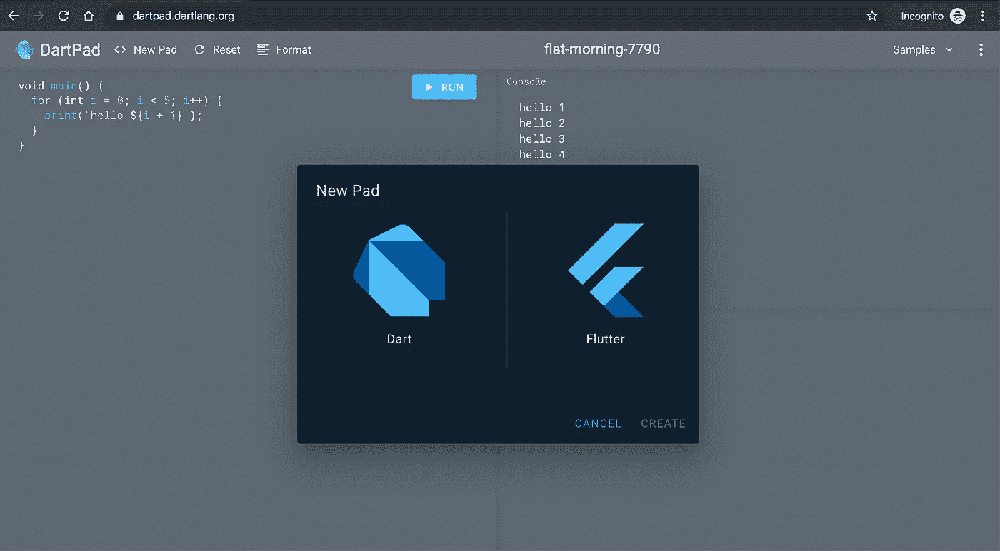

开始一个新的颤振项目需要 9 秒。在 Android Studio 上启动一个项目需要 2 分钟以上。

你在一个新项目中获得的启动代码创建了一个 *Hello，World* 应用程序。

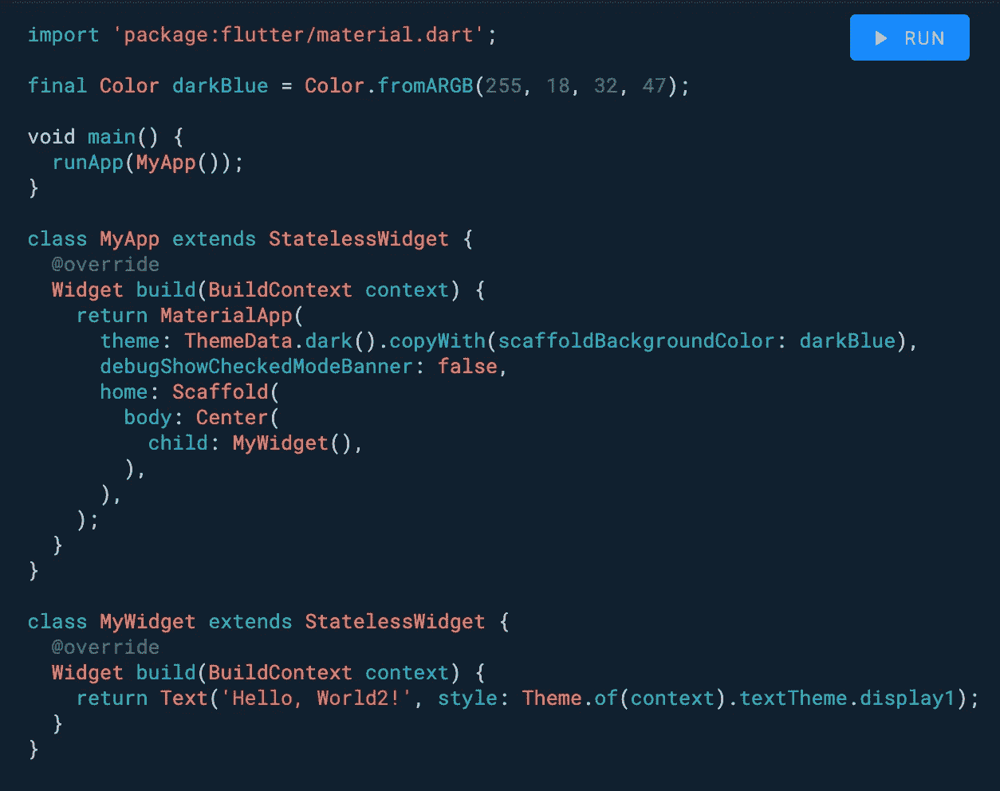

镖靶上的起始代码

DartPad 还提供样本颤振代码，您可以通过点击**样本**来访问。

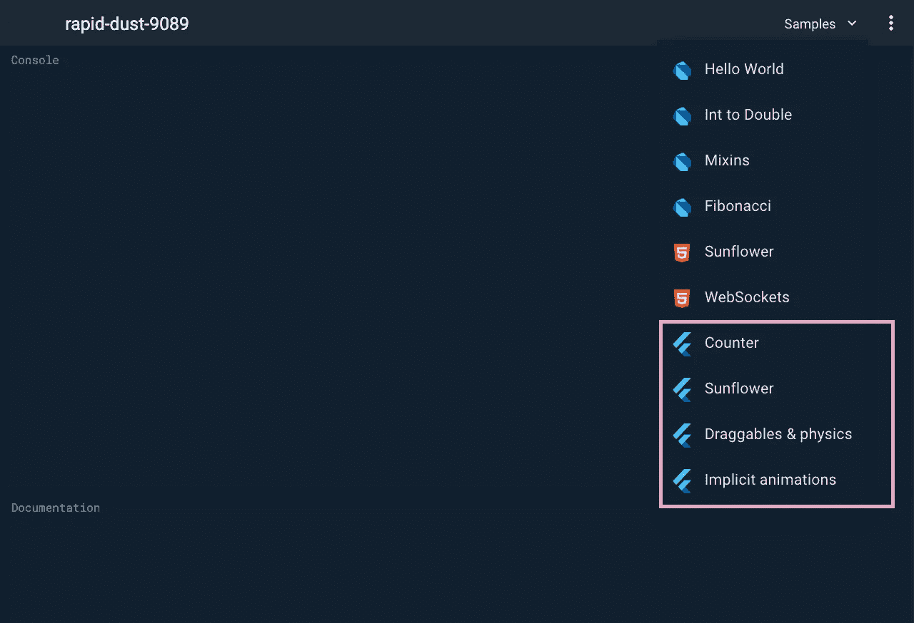

# 运行代码

DartPad 上的单个项目包含一个 Dart 文件。

要运行任何编辑过的代码，点击运行按钮或使用键盘快捷键`[Cmd] + [Enter ]`、`[Ctrl]+ [Enter]`。

没有保存状态的热重新加载，因为每次单击 Run 时项目的状态都会重置。

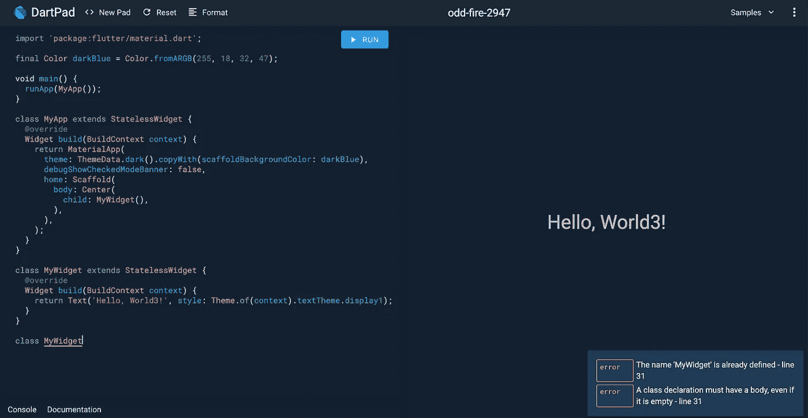

# 编辑码

要编辑代码，您可以在代码编辑器区域输入对代码的更改，然后单击 Run 按钮在显示区域查看更改。

DartPad 包括 Dart 格式化程序，它有助于轻松地格式化代码，而不是必须手动完成，这可能是乏味的。您可以通过单击 format 按钮来格式化您的代码。

编辑代码时，网站上可能会显示错误消息提示。这很有用，因为您可以立即查看它们，而不是在 DartPad 无法运行您的代码时才意识到有问题。

编辑时要记住的有用键盘快捷键有:

*   复制代码:`[Cmd]+ [c]`
*   粘贴代码:`[Cmd] +[v]`
*   注释掉代码:`[Cmd] + [/]`
*   移动到代码的顶部:`[Cmd] + [Up]`
*   移动到代码的顶部:`[Cmd] + [Down]`
*   全选:(点击代码编辑器上的任意位置)`[Cmd] + [A]`

由于 DartPad 不支持模板快捷方式，要从头开始创建`StatelessWidget`和`StatefulWidget`，您必须手动键入它们。您可以通过将代码保存在笔记本中或作为 GitHub 要点，并将其粘贴到 DartPad 中来轻松规避这一点:

```
class  extends StatefulWidget {
  @override
  _State createState() => _State();
}

class _State extends State<> {
  @override
  Widget build(BuildContext context) {
    return Container();
  }
}class  extends StatelessWidget {
  @override
  Widget build(BuildContext context) {
    return Container();
  }
}
```

# 显示结果

虽然您不能模拟项目在设备上的外观，但您可以通过点按并调整代码编辑器和显示之间的分隔线来查看它在不同屏幕尺寸上的外观。

为了达到平板电脑屏幕的宽度，最小化代码编辑器的区域。

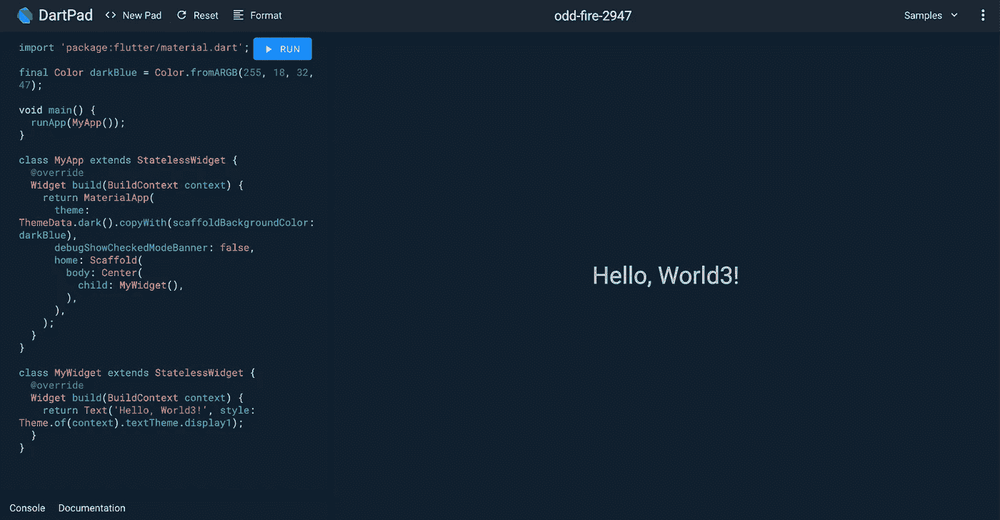

平板显示器

要获得移动屏幕的宽度，最大化代码编辑器的区域。

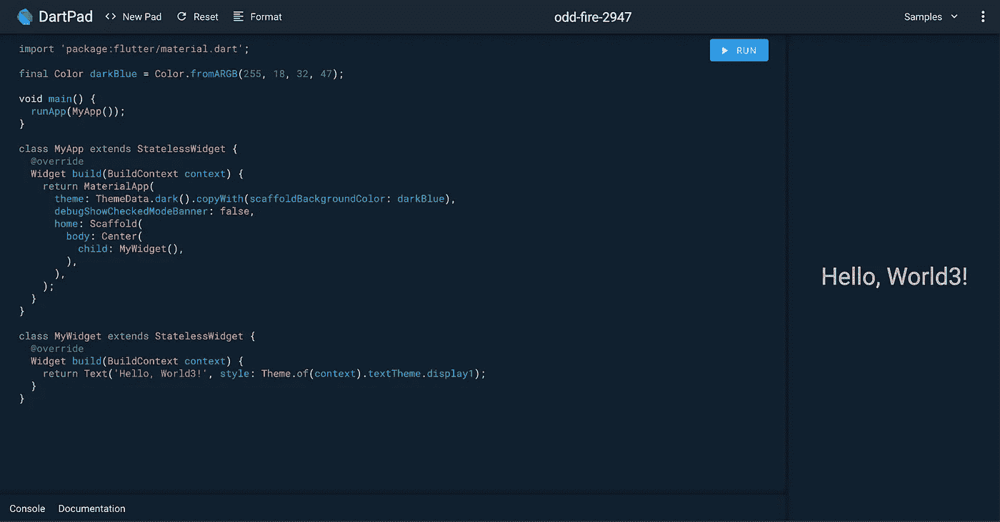

移动显示器

# 导入包

在使用实现[材质设计](https://material.io/design/)的 Flutter 小部件之前，你需要在 DartPad 上包含衬垫`import ‘package: flutter/material.dart`。

你现在不能导入第三方的包，因为很遗憾，包的导入仅限于 Flutter 的核心库。

# 证明文件

我最喜欢的功能是它的文档功能。只需点击页面末尾的 Documentation 选项卡，并选择任何小部件或命名参数来了解更多信息。

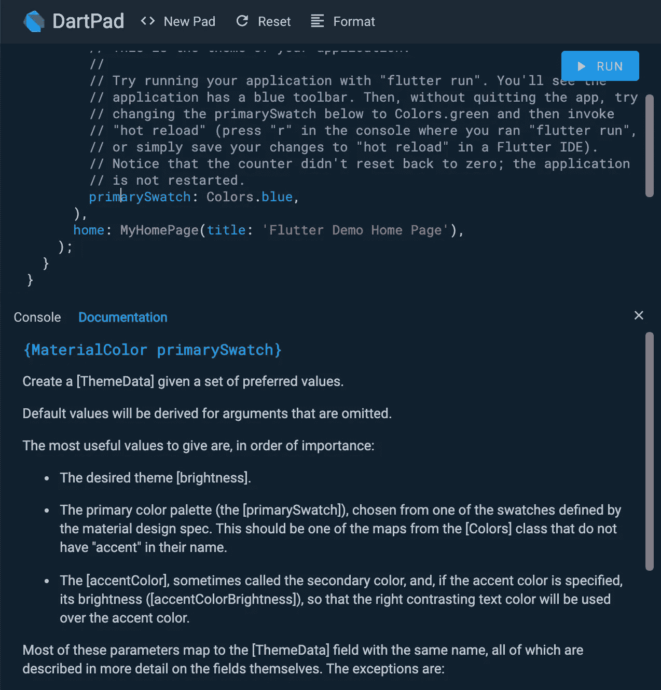

# 快捷键

DartPad 支持一些快捷键。奇怪的是，这些没有显示在它的网站上，但我在 GitHub 的一期杂志上发现了它们。

*   运行代码:`[Cmd] + [Enter]`，`[Ctrl] + [Enter]`
*   显示快速修复:`[Alt] + [Enter]`
*   显示完成:`[Ctrl] + [Space]`
*   注释掉代码:`[Cmd] + [/] , [Ctrl] + [/]`

当我试图使用它时，快速修复和如何完成似乎对 Flutter 项目没有用。

# 保存和共享代码

目前，DartPad 不允许保存代码，如果你是第一次使用 DartPad，共享代码的工作流程并不明显。

要保存或共享代码，需要使用 GitHub gists。

## 保存代码

1.  通过[https://gist.github.com/](https://gist.github.com/)登录你的 GitHub 账户
2.  键入要点的可选描述和名称。
3.  输入要点描述和文件名。将代码从 DartPad 复制并粘贴到主文本框中。
4.  点击创建秘密要点或公开要点，这取决于你是否希望你的要点被公开搜索。请注意，在步骤 4 之后，您不能将要点从公开更改为秘密。

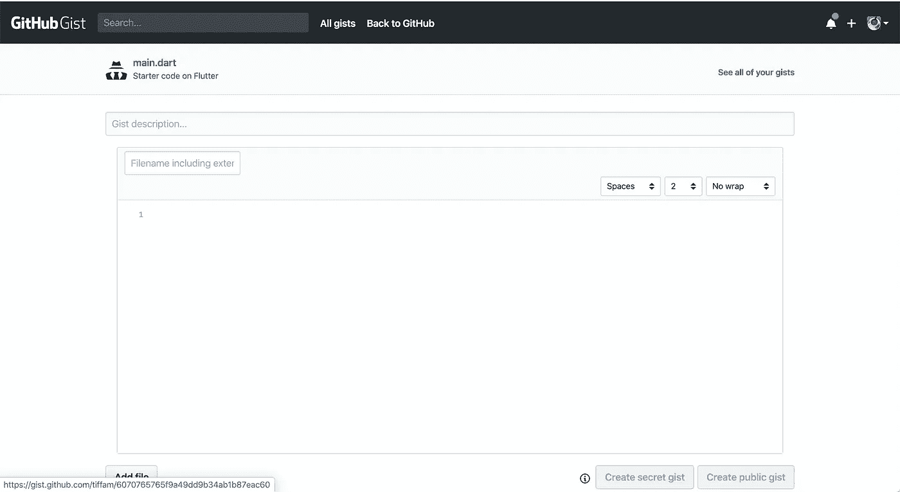

## 共享代码

1.  创建要点后，提取要点 ID 并将其添加到[https://dartpad.dev/](https://dartpad.dev/49bde0c1ed780decc902f3d4d06d8f0c)后面，例如【https://dartpad.dev/6070765765f9a49dd9b34ab1b87eac60】T2

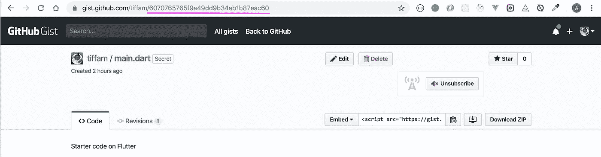

# 概述

现在，您应该知道如何:

*   开始一个新项目
*   编辑和运行代码
*   保存和共享代码
*   使用键盘快捷键

# 附加信息:学习资源

我发现当你浏览 Flutter 的食谱和 Flutter 的本周小工具时，DartPad 真的很有用。

《T4》食谱是 Flutter 团队为了解决编写 Flutter 应用时的常见问题而编写的。

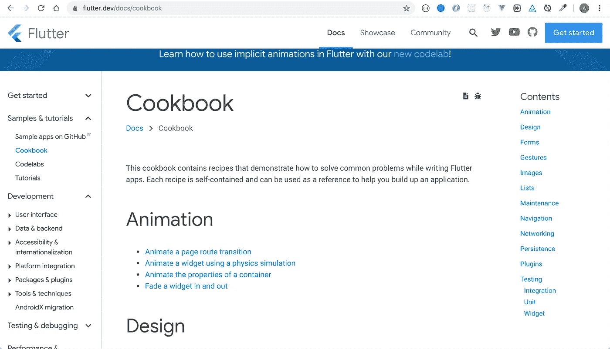

另一个学习 Flutter 的好方法是通过它的[Flutter Widget of the Week](https://www.youtube.com/playlist?list=PLjxrf2q8roU23XGwz3Km7sQZFTdB996iG)playlist。

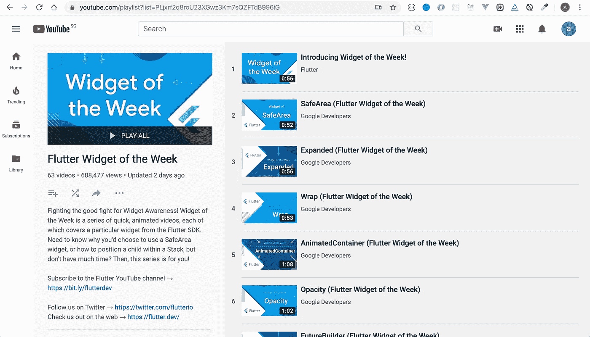

你可以试试 DartPad 里的本周小部件。

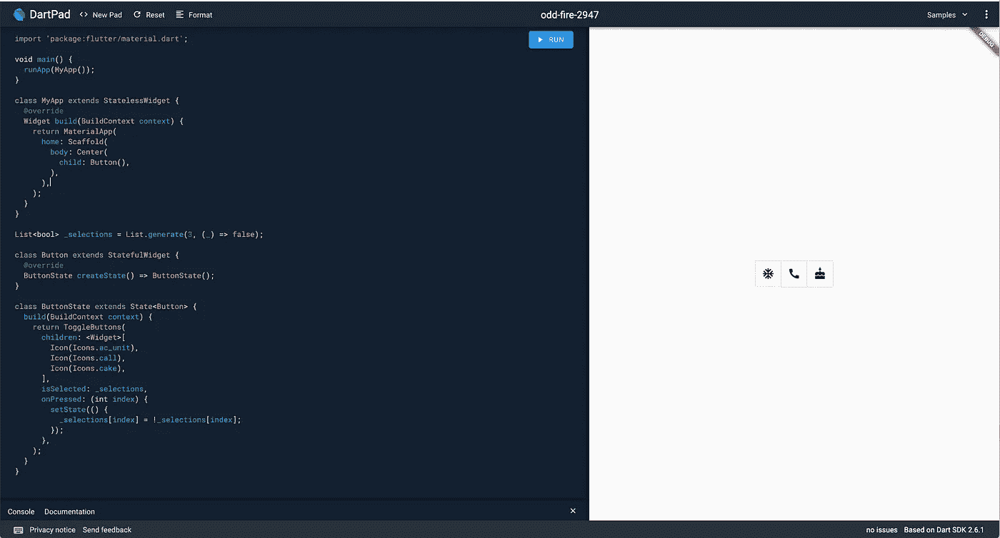

Youtube 上的最新插件(截至 12 月 6 日)