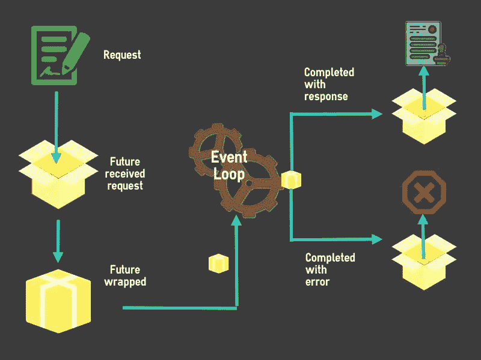

# 飞镖期货:基本面

> 原文：<https://betterprogramming.pub/introduction-to-futures-in-dart-4edf6db3da90>

## 基本概念、著名的构造函数和有用的方法优雅地处理异步任务


按作者分类的标题图像

# 前言

在现实世界中，法律机构在当事人之间签订的合同涉及在特定时期以特定价格将资产或商品从一方转移(通过销售或租赁)到另一方。

这些合同被称为期货。

在 Dart 语言中，`Future`类有一个类似于真实期货合约的工作概念，它存在于现实世界中，因此得名。与现实世界的契约不同，这个契约涉及数据事务。

未来为我们提供了一种以更简洁、更易管理的方式处理异步任务的方法。每当我们利用 async-await 处理我们的异步任务时，Dart 强制返回值为 Future 类型。这使我们能够在不中断程序的情况下解决它。

由于这是一个非常广泛的主题，而且由于它得到了认可和清晰的解释，它也是值得的，因此我决定在这篇文章中介绍基础知识，在另一篇即将发表的文章中介绍一些复杂的概念和实现。

在本文中，我的目标是:

*   提供对`Future`的概念性理解，它如何与事件循环一起处理异步任务以及作为指示器的状态。
*   讨论著名的构造函数及其潜在用途。
*   讨论涉及的关键方法，以及它们如何帮助我们解决异步操作的麻烦。

# 概念理解

Dart 是一种单线程编程语言。它使用事件循环一个接一个地挑选任务，并按顺序执行。这就是 Dart 如何实现后台执行任务的假象，即使没有后台线程。

`Future`为我们提供了访问事件循环和处理异步任务所需的 API。它允许我们执行以下操作:

*   封装任务并发送进行处理
*   确定任务的当前状态及其完成情况
*   如果任务成功，则获取任务的结果
*   获取导致任务失败的错误



图 1:事件循环中未来操作的图示

为了跟踪`Future`的当前状态，我们依赖于三种不同的状态:

*   未完成:任务仍在进行中。
*   有数据完成:任务完成，数据准备好。
*   已完成，但有错误:任务已完成，但有错误。

完成后，我们将使用`then()`获得结果，或者使用`catchError()`获得抛出的错误。它看起来会像这样:

```
var list = coffeeList
               .then((value) => (value)) // Success
               .catchError((error) => (error)); // Failure
```

这些状态使我们能够轻松地处理异步过程中的 UI 转换。我们可以在状态未完成时显示加载 UI，在数据完成时显示数据，或者在完成时显示错误弹出窗口。

这里需要注意的一点是，未来的 API 和方法也与 JavaScript 中的`Promise`对象非常相似。我们可以观察`then()`的用法，以及它是如何通过解析未来来解包数据的。

由于与`Promise`的相似性，有 JavaScript 经验的开发者会发现更容易理解未来的用法和方法。

# 在开始之前

在我们探索各种概念之前，让我们为我们的实验建立一个基础。

假设我们开发了一个应用程序，可以让我们更容易地在街对面的当地咖啡店里看到最新的咖啡。

我们的热咖啡数据将来自这里:`[https://api.sampleapis.com/coffee/hot](https://api.sampleapis.com/coffee/hot)`

这个 API 返回给我们一个热咖啡的数组，单个对象看起来像这样:

```
{
  "title":"Black",
  "description":"Black coffee is as simple as it gets with ground coffee beans steeped in hot water, served warm.",
  "ingredients":[
     "Coffee"
  ],
  "image":"https://upload.wikimedia.org/wikipedia/commons/thumb/4/45/A_small_cup_of_coffee.JPG/640px-A_small_cup_of_coffee.JPG",
  "id":1
}
```

# 著名的建筑商

构造函数是我们用来初始化一个类实例的方法。当创建一个`Future`的实例时，一些构造函数会非常方便，给我们带来一些关键的好处。

# 未来()

在我们继续讨论更复杂的`Future`构造函数的实现之前，让我们先来看看初始化它的一个非常基本的方法。基于上面提到的问题，我们可以创建一个`Future`来获取数据，如下所示:

```
void main() {
  Future<http.Response> coffeeData =
      http.get(Uri.parse('https://api.sampleapis.com/coffee/hot'));
}
```

这个`coffeeData`现在保存了我们需要的数据，我们可以通过使用`then()`很容易地解决这个问题，并且我们可以通过使用`catchError()`来查看是否有错误。就这么简单。

```
coffeeData.then((value) => (value)) // Success
.catchError((error) => (error)); // Failure
```

# Future.delayed()

## 问题陈述

在开发的早期阶段，我们可能没有从中获取数据的 API，因为它可能由后端团队开发。

我们需要开发我们的 coffee 应用程序的 UI，因为设计已经准备好了，并且我们有一组样本数据可用于表示层。

我们如何模拟一个 HTTP 请求和响应的假象来开发 UI，并很好地考虑加载和成功状态？

## 解决办法

这是我们可以利用`Future.delayed()`构造函数的地方。这个构造函数使我们能够创建一个`Future`任务，该任务在我们指定的延迟时间后在其封装内运行。

因此，如果我们想要开发一个加载屏幕，它将在获取发生时显示，然后在没有实际 API 存在的情况下显示 UI，我们可以这样做:

```
void main() {
  List<Coffee> coffeeList = [
    const Coffee(
      id: 1,
      title: 'Black',
      description:
          "If you want to sound fancy, you can call black coffee by its proper name: cafe noir.",
      ingredients: ['Coffee'],
      image:
          "https://upload.wikimedia.org/wikipedia/commons/thumb/4/45/A_small_cup_of_coffee.JPG/640px-A_small_cup_of_coffee.JPG",
    )
  ];

  Future.delayed(const Duration(milliseconds: 2000), () {
   // The code below will be executed after a delay of 2 seconds
      return coffeeList;
   });
}
```

从上面的代码中可以看出，我们使用了`Future.delayed()`将模拟数据的返回延迟了两秒钟。这使我们能够创建一个请求-响应的错觉。

现在，我们可以开发加载屏幕和结果屏幕，并且我们也可以在不依赖 API 的情况下看到它的运行。

# Future.error()

## 问题陈述

我们模拟了这样一个场景:在数据列表返回给我们之前，我们可以有一个加载状态。因此，我们已经完成了咖啡应用程序的开发，有了一个加载 UI 和一个可以显示的咖啡列表。但是`Future.delayed()`总是返回一个正值。

如果我们想要模拟一个请求由于某种原因而失败的场景，会怎么样呢？

## 解决办法

这就是`Future.delayed()`出现的原因。我们可以创建一个`Future`，它将返回一个错误而不是一个正值，并使用它来开发相应的失败场景 UI。我们可以简单地这样做:

```
void main() {  
final Future<Exception> apiErrorTest = Future.delayed(const Duration(milliseconds: 2000), () {
    // The code below will return an error after a delay of 2 seconds
    return Future.error(
      Exception('Failed to fetch data from coffee endpoint.'), // Throw
    );
  });
}
```

从上面的代码中可以看出，我们通过使用`Future.delayed()`来延迟响应，但是这次它返回一个`Future.error()`，其中包含一个异常。利用这一点，我们可以模拟 API fetch 调用的失败。

# 有用的方法

我们将在本节讨论四个主要方法，我认为它们对于作为异步事件处理程序的`Future`的整体功能非常重要。

## 然后()

在本文的几个地方已经给出了这个方法如何工作的例子，但是并没有专门讨论它。`then()`是一个回调方法，它允许我们解析在`Future`中给我们的契约，如果成功的话，就获得`Future`持有的结果。

```
void main() {
  Future<http.Response> coffeeData =
      http.get(Uri.parse('https://api.sampleapis.com/coffee/hot'));

  coffeeData.then((value) => (value));
}
```

在上面的例子中，`then()`为我们提供了从 API 调用中获得的咖啡列表。

但是如果失败了呢？如果我们从表面上看，调用似乎会无声无息地失败，使我们无法捕捉错误。但是如果我们看看底层的实现，它有一个`onError`函数调用:

```
Future<R> then<R>(FutureOr<R> onValue(T value), {Function? onError});
```

这使得`then()`能够通过全局错误处理程序捕获错误，该处理程序在整个应用程序中捕获未被捕获的错误。这种回退的存在是为了确保错误不会无声无息地失败。

## catchError()

我们已经看到了`then()`如何在成功时返回一个值，并且仍然报告一个错误而不让它无声地失败。尽管依靠全局错误处理程序可以做到这一点，但通常建议注册一个单独的错误处理程序来优雅地处理错误。

这就是`catchError()`出现的原因。与`then()`类似，`catchError()`也是一个回调函数。该方法不能单独使用，需要与`then()`配合使用，以提供整体解决方案。但是与`then()`不同的是，`catchError()`抛出了异步操作的错误:

```
void main() {
  Future<http.Response> coffeeData =
      http.get(Uri.parse('https://api.sampleapis.com/coffee/hot'));

  coffeeData.then((value) => (value))
    .catchError((error) => (error));
}
```

在上面的例子中，如果 API 调用失败，我们可以通过`catchError((error) => (error))`代码块来处理错误。

`catchError()`允许我们向它添加测试。下面我们来看看它的实现:

```
Future<T> catchError(Function onError, {bool test(Object error)?});
```

从实现中我们可以看到，我们可以有选择地向`catchError()`添加测试。这使我们能够知道我们面临着什么样的错误。让我们看一个测试的例子:

```
coffeeListFuture.then((value) => (coffeeList = getCoffeeList(value)))
  // Custom error catch block
  .catchError(
  (
    Object error,
    StackTrace stackTrace,
  ) {
    print(error.toString());
  },
  test: (Object error) {
      return error is HttpException;
  }
);
```

在上面的代码块中，我们可以看到一个`catchError()`回调被添加了一个测试来检查它是否是 HTTP 异常类型。如果测试返回一个`true`布尔值，那么我们可以根据 HTTP 异常的特定业务需求来处理这个异常。

## 问题陈述

包含测试的缺点是这个`catchError()`块将只捕捉通过测试的错误。那些不适合这个测试的将作为未捕获的错误被抛出。我们如何捕捉那些不合适的？如果我们需要识别不同类型的错误，而不仅仅是一种错误，会怎么样？

## 解决办法

这就是向同一个`Future`注册多个`catchError()`方法的能力发挥作用的地方。我们可以有不止一个`catchError()`方法，每个方法监听一个特定类型的错误。让我们看看下面的代码是如何做到的:

```
 coffeeListFuture.then((value) => (coffeeList = getCoffeeList(value)))
    // Custom error catch block
    .catchError(
        (
          Object error,
          StackTrace stackTrace,
        ) {
          print(error.toString());
        },
        test: (Object error) => error is CustomException)
    // Http error catch block
    .catchError(
        (
          Object error,
          StackTrace stackTrace,
        ) {
          print(error.toString());
        },
        test: (Object error) => error is HttpException)
```

在上面的例子中，我们可以看到两个`catchError()`方法被绑定到一个`Future`，第一个`catchError()`捕捉我们定义的自定义错误，第二个让我们能够捕捉 HTTPS 异常。

```
coffeeListFuture.then((value) => (coffeeList = getCoffeeList(value)))
    // Http error catch block
    .catchError(
        (
          Object error,
          StackTrace stackTrace,
        ) {
          print(error.toString());
        },
        test: (Object error) => error is HttpException)
    // General error catch block
    .catchError(
        (error) => print(error)
);
```

在上面的例子中，我们创建了一个自动防故障装置来捕获不属于`HttpException`类型的错误，以避免错误被视为未处理的异常。

能够附加多个`catchError()`，允许我们为应用程序定义不同的错误处理方式。它允许我们以不同的方式处理多种错误场景，改善应用程序的整体用户体验。

# 当完成时()

不管单个异步任务的结果如何，应用程序都需要连续性。上面我们已经讨论了两个场景，一个是任务成功的积极场景，一个是任务失败的消极场景，分别使用`then()`和`catchError()`。

## 问题陈述

但是，如果我们想让一段代码运行，而不管异步任务的结果如何呢？假设我们想调用一个方法来获取冷咖啡的列表，而不管端点是否能提供热咖啡的列表，那会怎么样呢？

## 解决办法

这就是`whenComplete()`出现的原因。这个方法允许我们执行代码，不管`Future`完成时是有结果还是有错误，代码都会运行。

对于我们这些来自 JavaScript 背景的人来说，这与`finally()`对`Promise`的作用是一样的。

让我们看看这是如何实现的。我们将创建一个函数，根据端点是`hot`还是`cold`，返回一个包含咖啡列表的 HTTP 响应`Future`。

```
Future<http.Response> fetchCoffeeData({required String coffeeTemp}) async {
  const baseURL = 'https://api.sampleapis.com/';
  final coffeeResponse =
      await http.get(Uri.parse(baseURL + '/coffee/' + coffeeTemp));

  if (coffeeResponse.statusCode == 200) {
    return coffeeResponse;
  } else {
    throw Exception('Failed to fetch coffees');
  }
}
```

现在，让我们创建一个`Future`并将`then()`、`catchError()`和`whenComplete()`附加到它，以演示我们一直在讨论的内容。

```
Future<http.Response> coffeeListFuture = fetchCoffeeData(coffeeTemp: 'hot');

  coffeeListFuture
      .then((value) => value)
      .catchError((error) => error)
      .whenComplete(() => fetchCoffeeData(coffeeTemp: 'cold'));
```

可以看到，我们可以执行一条指令来获取冷咖啡列表，而不管`coffeeListFuture`的结果如何。这让我们清楚地知道在初始`Future`完成后需要立即发生什么。

# 结论

从上面提供的讨论和解释中，我们已经涵盖了围绕`Future`类的关键概念，以及在处理异步任务时它是如何使我们的生活变得更容易的。

我希望现在阅读这篇文章的人能够很好地理解以下内容:

*   `Future`如何在单线程环境下运行，方便我们与事件循环交互。
*   怎么，本质上和 JavaScript 里的`Promise`很像。
*   我们如何使用它来处理异步任务
*   我们如何使用`Future`来模拟 API 加载
*   如何知道异步调用是成功的还是失败的
*   如何使用构造函数模拟 API 调用的加载、成功和错误状态。
*   我们有哪些值得注意的方法，为什么我们需要它们通过期货来处理异步任务。

我将在另一篇文章中讨论使用 Futures 解决更复杂的编程问题的方法。