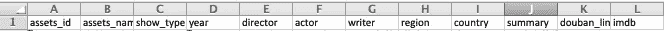

# 用 Gensim 计算文本相似度

> 原文：<https://betterprogramming.pub/introduction-to-gensim-calculating-text-similarity-9e8b55de342d>

## 使用 Genism 工具轻松比较不同的文本


来自 [Maxpixel](https://www.maxpixel.net/Education-Dictionary-Book-Literature-Page-3294946) 的照片

两年前，我构建了我的第一个 Python 项目:一个在多篇文章之间生成相似性得分的工具。当时，我只是使用 Python 字典来存储文本文件的不同属性——比如词频、词干频率、句子长度、标点符号等等。—并以相对高效的方式进行比较。

多亏了这个 Python 项目，我在暑期实习时被分配独自做一个类似的项目。我被告知要建立一个工具来比较大量电影和电视产品的不同属性。该工具应该生成一组字典，其中包含相同或最相似的产品，这些产品以不同的相似性得分成对出现。

我开始用和上次一样的方法做这个项目，但是进展并不顺利。然后，我被介绍到了 [**Gensim**](https://radimrehurek.com/gensim/intro.html) 。

Gensim 官方网站上的内容和它的教程有点太模糊了，所以我想谈谈什么是 Gensim。更重要的是，我想说说我学习和使用 Gensim 的经历。


# 什么是 Gensim？

根据 Gnism 的官方网站:

> Gensim 是一个免费的 Python 库，旨在尽可能高效(对计算机而言)和无痛苦(对人类而言)地从文档中自动提取语义主题。Gensim 旨在处理原始的、非结构化的数字文本(“*纯文本*”)。

# 主要概念

**文集**

语料库用于在 Gensim 中训练机器学习模型，并且模型使用语料库来初始化模型的参数。

**向量空间模型(VSM)**

每个文档都由一系列功能表示，您可以将这些功能看作一个问答对。一个特征的例子可以是如下:**单词“happy”在文本文档中出现了多少次？三个。**

问题由其 id(整数)表示，因此文本文档的表示变成一系列对，例如(2，4.0)、(3，6.0)、(4，5.0)。这个系列可以被认为是一个**向量。**

如果两个文档中的向量相似，那么这两个文档也一定相似。

**稀疏向量**

Gensim 中的文档由稀疏向量表示。Gensim 省略了所有值为 0.0 的向量，每个向量都是一对(feature_id，feature_value)。

**型号**

模型可以被认为是从一个向量空间到另一个向量空间的变换。通过训练语料库，学习这种转换的参数。

# 使用 Gensim 确定文本相似性

下面是一个生成文本相似性的简单代码实现示例:

(这里，`jieba`是一个文本分段 Python 模块，用于将单词切割成分段，以便于将来进行文本相似性分析。)

```
from gensim import corpora, models, similarities
import jiebatexts = ['I love reading Japanese novels. My favorite Japanese writer is Tanizaki Junichiro.', 'Natsume Soseki is a well-known Japanese novelist and his Kokoro is a masterpiece.', 'American modern poetry is good. ']keyword = 'Japan has some great novelists. Who is your favorite Japanese writer?'texts = [jieba.lcut(text) for text in texts]dictionary = corpora.Dictionary(texts)feature_cnt = len(dictionary.token2id)corpus = [dictionary.doc2bow(text) for text in texts]tfidf = models.TfidfModel(corpus) kw_vector = dictionary.doc2bow(jieba.lcut(keyword))index = similarities.SparseMatrixSimilarity(tfidf[corpus], num_features = feature_cnt)sim = index[tfidf[kw_vector]]for i in range(len(sim)):
    print('keyword is similar to text%d: %.2f' % (i + 1, sim[i]))
```

打印结果:

```
keyword is similar to text1: 0.50
keyword is similar to text2: 0.02
keyword is similar to text3: 0.00
```

# 代码解释

## 第一步:使用 Jieba 进行分词

首先，我们来看看`jieba`是如何工作的。我们要从谷崎润一郎的小说 [***中截取一段语录【直美***](https://en.wikipedia.org/wiki/Naomi_(novel)) *:*

```
import jieba text = ‘I wanted to boast to everyone. This woman is mine. Take a look at my treasure. ‘ words = jieba.lcut(text)print(words) 
```

打印结果:

```
[‘I’, ‘wanted’, ‘to’, ‘boast’, ‘to’, ‘everyone’, ‘.’, ‘This’, ‘woman’, ‘is’, ‘mine’, ‘.’, ‘Take’, ‘a’, ‘look’, ‘at’, ‘my’, ‘treasure’, ‘.’]
```

## 第二步:根据`dictionary`获得特征的数量

`corpora.Dictionary`建立字典。

`len(dictionary.token2id)`代表字典中的字数。

**示例**:

```
from gensim import corpora
import jieba text1 = ‘痴人の愛’text2 = ‘よく世間では「女が男を欺す」と云います。’texts = [text1, text2]# Generate a word list for the text settexts = [jieba.lcut(text) for text in texts]print(‘Text set:’, texts) #Build a dictionary based on a text setdictionary = corpora.Dictionary(texts)print(‘dictionary:’, dictionary) # Extract dictionary featuresfeature_cnt = len(dictionary.token2id)print(‘Dictionary feature number: %d’ % feature_cnt)
```

**打印结果:**

```
Text set: [['痴人', 'の', '愛'], ['よ', 'く', '世間', 'で', 'は', '「', '女', 'が', '男', 'を', '欺', 'す', '」', 'と', '云', 'い', 'ま', 'す', '。']]dictionary: Dictionary(21 unique tokens: ['の', '愛', '痴人', '。', '「']...)Dictionary feature number: 21
```

## 第三步:基于词典获取语料库

**举例:**

```
from gensim import corpora
import jiebatext1 = 'I love Tokyo'text2 = 'Tokyo, Tokyo, Tokyo'texts = [text1, text2]texts = [jieba.lcut(text) for text in texts]dictionary = corpora.Dictionary(texts)corpus = [dictionary.doc2bow(text) for text in texts]print('Dictionary (dictionary):', dictionary.token2id)print('Corpus: ', corpus)
```

**打印结果:**

```
Dictionary (dictionary): {' ': 0, 'Come': 1, 'Tokyo': 2, 'cuisine': 3, 'for': 4, 'to': 5, ',': 6}Corpus: [[(0, 5), (1, 1), (2, 2), (3, 1), (4, 1), (5, 1)], [(0, 2), (2, 3), (6, 2)]]
```

这里，`doc2bow`函数生成[稀疏向量](https://stackoverflow.com/questions/31522893/sparse-vector-vs-dense-vector)。

## 第四步:使用 TF-IDF 模型对语料进行处理，获得索引

这里有更多关于 TF-IDF 的信息。

`tfidf = models.TfidfModel(corpus)`

`index = similarities.SparseMatrixSimilarity(tfidf[corpus], num_features = feature_cnt)`

## 步骤 5:将搜索词转换成稀疏向量

**例如:**

```
from gensim import corpora
import jiebatext1 = ‘Tanizaki Junichiro writes good stories’ text2 = ‘Naomi is a story written by Tanizaki’texts = [text1, text2]texts = [jieba.lcut(text) for text in texts]dictionary = corpora.Dictionary(texts)# Use [Dictionary] to convert [search word] to [sparse vector]
keyword = ‘good stories’kw_vector = dictionary.doc2bow(jieba.lcut(keyword))print(kw_vector)
```

**打印结果:**

```
[(0, 1), (3, 1), (4, 1)]
```

## 第五步:把所有东西放在一起:相似度计算

```
texts = [jieba.lcut(text) for text in texts]dictionary = corpora.Dictionary(texts)feature_cnt = len(dictionary.token2id)corpus = [dictionary.doc2bow(text) for text in texts]tfidf = models.TfidfModel(corpus)kw_vector = dictionary.doc2bow(jieba.lcut(keyword))index = similarities.SparseMatrixSimilarity(tfidf[corpus], num_features = feature_cnt)sim = index[tfidf[kw_vector]]for i in range(len(sim)):
    print('keyword is similar to text%d: %.2f' % (i + 1, sim[i]))
```

# Gensim 在电影比较项目中的应用

在了解了 Gensim 的基本用途后，我将 Gensim 融入到我的项目中来比较电影和电视。

首先，最初的输入是包含电影和电视属性的两个 Excel 表。表单的标题如下所示:



名称和摘要是最难比较的资产，因为它们是句子/段落的形式。因此，这里使用 Gensim 和`jieba`。

在使用`[pandas](https://pandas.pydata.org/pandas-docs/stable/reference/api/pandas.read_excel.html)`从两个 Excel 表中提取所有数据并保存在数据框中之后，我们可以将名称和摘要分别存储在字典中。这有助于指示资产的 ID 及其相应的属性。

```
df = pd.read_excel ("YOUR LOCAL FILE ADDRESS", sheetname = 'Sheet1')
df2 = pd.read_excel("YOUR LOCAL FILE ADDRESS", sheetname = "Sheet1")# This is the first excel file
ccms_title = {}
for i in range(len(df[‘assets_id’])):
 name = df[‘assets_name’][i]
 iD = str(df[‘assets_id’][i])
 ccms_title[iD] = name# This is the second excel file
douban_title = {}
for i in range(len(df2[‘assets_id’])):
 name = df2[‘assets_name’][i]
 iD = str(df2[‘assets_id’][i])
 douban_title[iD] = nameccms_summary = {}
for i in range(len(df['assets_id'])):
    name = df['assets_name'][i]
    iD = str(df['summary'][i])
    ccms_summary[iD] = namedouban_summary = {}
for i in range(len(df2['assets_id'])):
    name = df2['assets_name'][i]
    iD = str(df2['summary'][i])
    douban_summary[iD] = name
```

创建一个使用 Gensim 计算标题和摘要之间相似性得分的函数。

```
def gensimCalculation(d1, d2):
  new_dict = {} for x in d1:
    text1 = d1[x]
    texts = [jieba.lcut(d2[y]) for y in d2] 
    dictionary = corpora.Dictionary(texts)
    feature_cnt = len(dictionary.token2id)
    corpus = [dictionary.doc2bow(text) for text in texts]
    tfidf = models.TfidfModel(corpus)
    new_vec = dictionary.doc2bow(jieba.lcut(text1))
    index = similarities.SparseMatrixSimilarity(tfidf[corpus],     num_features = feature_cnt)
    sim = index[tfidf[new_vec]]
    new_dict[x] = max(sim) print(new_dict)
 returnprint(gensimCalculation(ccms_summary, douban_summary)) 
```

该函数将 excel1 中的单个资产摘要与 excel2 中的所有其他摘要进行比较，并找到最相似的摘要。输出是一个字典，包含资产的 ID 和最相似的资产 ID 及其最相似的摘要。

其他的相似性计算，比如比较标题，也可以用这种方式有效地生成。

# 摘要

在接近 Gensim 时，我学会了更加关注每一步的输入和输出。在 Python 中的分词模块`jieba`的帮助下，文本相似度很容易计算。