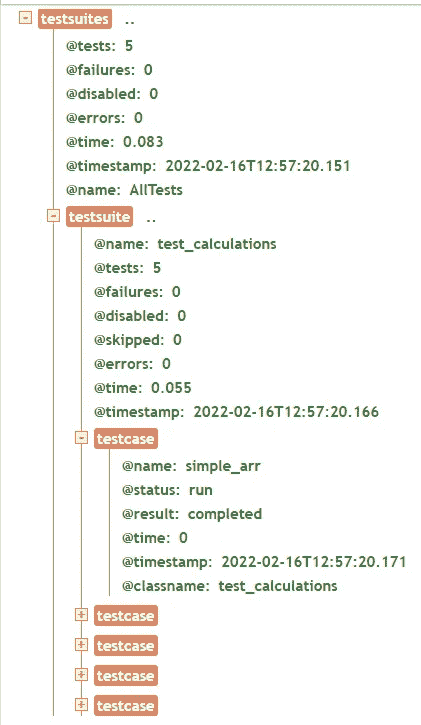

# Google Test 简介:一个开源的 C/C++单元测试框架

> 原文：<https://betterprogramming.pub/introduction-to-google-test-an-open-source-c-c-unit-testing-framework-ec517f4a22d2>

## 在项目中轻松集成单元测试


[米切尔·罗](https://unsplash.com/@mitchel3uo?utm_source=medium&utm_medium=referral)在 [Unsplash](https://unsplash.com?utm_source=medium&utm_medium=referral) 上的照片

单元测试是我们抵御回归代码变更的第一道防线。
它在细粒度级别上为软件开发人员提供关于他们代码的快速反馈。

在本文中，我将展示使用`google test`向 C/C++项目添加单元测试是多么容易。

# 简单的开始

让我们看一个简单的例子，计算一个整数数组的平均值。

`calculate_mean`将整数数组及其长度作为输入；它将数组的平均值(数组的总和除以其长度)作为浮点数返回作为输出。

## 文件结构

```
+ Root
  + modules
    - calculations.c
    - calculations.h
    - CMakeLists.txt
  + tests
    - test_calculations.cpp
    - CMakeLists.txt
  - mainapp.c
  - CMakeLists.txt
  - conanfile.txt
```

注意:这个演示的所有代码都可以在我的 [GitHub 账号](https://github.com/eldaduzman/gtest-demo)上找到。

**模块/计算。c**

这是一个负责计算的模块:

模块/计算

很直白。

它有一个计算数字总和的函数，调用`calculate_mean`函数，然后返回总和与长度之比。

现在让我们在 mainapp 中使用这段代码:

**mainapp.c**

mainapp.c

现在我们需要两个`CMakeLists.txt`文件；一个用于`mainapp`;一个用于模块；

**CMakeLists.txt**

```
cmake_minimum_required(VERSION 3.10.2) 
project(MyProject)

add_subdirectory(modules)

add_executable(${PROJECT_NAME} mainapp.c)
target_link_libraries(${PROJECT_NAME} calculations)
```

**modules/CMakeLists.txt**

```
project(calculations) add_library(calculations calculations.c calculations.h)
```

简而言之，模块 CMakeLists 生成一个名为`calculations`的库，主 CMakeLists 使用这个库并将其链接到主可执行文件。

现在，让我们编译并运行。

编译:

```
cmake --build ./build --config Debug --target MyProject -j 10 --
```

运行:

```
./build/MyProject
```

输出是:

```
Mean=5.78
```

# 介绍谷歌测试

[Google test](https://google.github.io/googletest/) ，或`gtest`是一个开源框架，用于对 C\C++项目进行单元测试。

它很容易与 CMake 集成，具有强大的断言引擎，并生成 XML 报告以供显示，因此它可以与常见的 CI\CD 框架集成。

## 第一步。从柯南安装 gtest

想了解更多关于柯南的知识，请在这里阅读我的文章。

让我们在根目录下创建`conanfile.txt`:

```
[requires]gtest/cci.20210126[generators]cmake
```

运行— `conan install . -pr=myprofile`

## 第二步。将 gtest 添加到 CMakeLists

安装了 gtest 之后，让我们将它作为一个依赖项添加到主 CMakeLists 文件中:

```
cmake_minimum_required(VERSION 3.10.2)project(MyProject)include(${CMAKE_SOURCE_DIR}/conanbuildinfo.cmake)conan_basic_setup()add_subdirectory(modules)add_subdirectory(tests)add_executable(${PROJECT_NAME} mainapp.c)target_link_libraries(${PROJECT_NAME} calculations)
```

我们添加了四行代码，一行包含柯南的配置，两行运行柯南 CMake 设置，一行添加`tests`目录。

## 第三步。编写测试套件

**tests/test _ calculations . CPP**

这是要执行的实际测试用例。

总共有五个测试用例，涵盖了各种可能的场景。

## 第四步。使用 CMake 配置可执行的测试

**tests/CMakeLists.txt**

```
cmake_minimum_required(VERSION 3.10.2)project(tests)add_executable(${PROJECT_NAME} test_calculations.cpp)set(CMAKE_CXX_STANDARD 11)target_link_libraries(${PROJECT_NAME} PUBLICcalculationsgtestgtest_main)
```

这里的指令是创建一个名为`tests`的可执行文件，它有三个链接库，`calculations`(我们想要测试的模块)，`gtest`和`gtest_main`。

## 第五步。运行您的测试

编译:

```
cmake --build ./build --config Debug --target tests -j 10 --
```

运行:

```
build\bin\tests.exe
```

输出:

```
[==========] Running 5 tests from 1 test suite.
[----------] Global test environment set-up.
[----------] 5 tests from test_calculations
[ RUN      ] test_calculations.simple_arr
[       OK ] test_calculations.simple_arr (0 ms)
[ RUN      ] test_calculations.empty_arr
[       OK ] test_calculations.empty_arr (0 ms)
[ RUN      ] test_calculations.all_negatives
[       OK ] test_calculations.all_negatives (0 ms)
[ RUN      ] test_calculations.mix_negative_positive
[       OK ] test_calculations.mix_negative_positive (0 ms)
[ RUN      ] test_calculations.with_zeros
[       OK ] test_calculations.with_zeros (0 ms)
[----------] 5 tests from test_calculations (70 ms total)[----------] Global test environment tear-down
[==========] 5 tests from 1 test suite ran. (107 ms total)
[  PASSED  ] 5 tests.
```

厉害！所有五个测试都被执行并通过了！

现在让我们再次运行它并将结果导出到`output.xml`:

```
build/bin/tests --gtest_output=xml:output.xml
```

XML 输出如下所示:

```
<?xml version="1.0" encoding="UTF-8"?><testsuites tests="5" failures="0" disabled="0" errors="0" time="0.083" timestamp="2022-02-16T12:57:20.151" name="AllTests"><testsuite name="test_calculations" tests="5" failures="0" disabled="0" skipped="0" errors="0" time="0.055" timestamp="2022-02-16T12:57:20.166"><testcase name="simple_arr" status="run" result="completed" time="0" timestamp="2022-02-16T12:57:20.171" classname="test_calculations" /><testcase name="empty_arr" status="run" result="completed" time="0" timestamp="2022-02-16T12:57:20.181" classname="test_calculations" /><testcase name="all_negatives" status="run" result="completed" time="0" timestamp="2022-02-16T12:57:20.192" classname="test_calculations" /><testcase name="mix_negative_positive" status="run" result="completed" time="0" timestamp="2022-02-16T12:57:20.204" classname="test_calculations" /><testcase name="with_zeros" status="run" result="completed" time="0" timestamp="2022-02-16T12:57:20.216" classname="test_calculations" /></testsuite></testsuites>
```

让我们将它加载到[code 美化的 xunit 查看器](https://codebeautify.org/xmlviewer/46c9c8#)中:



xunit 视图

漂亮！

这可以很容易地作为测试结果发布在您的 ci/cd 管道上:)。