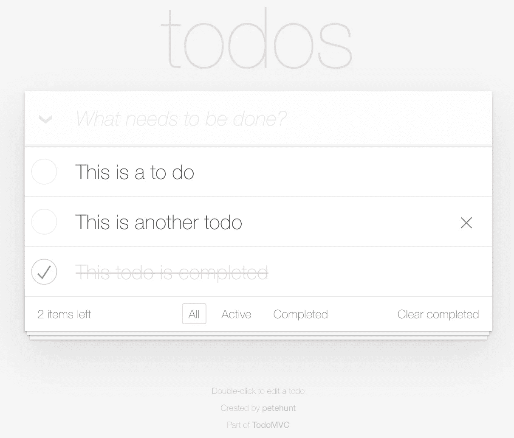

# 用 GraphQL 启动 Django 项目的正确方法(第 2 部分)

> 原文：<https://betterprogramming.pub/introduction-to-graphql-with-django-and-graphene-part-2-5fe08f2d637a>

## 创建一个带身份验证的简单待办应用程序—查询和突变


由[伊利亚·巴甫洛夫](https://unsplash.com/@ilyapavlov?utm_source=unsplash&utm_medium=referral&utm_content=creditCopyText)在 [Unsplash](https://unsplash.com/s/photos/coding?utm_source=unsplash&utm_medium=referral&utm_content=creditCopyText) 上拍摄

*在* [*本系列第一篇*](https://medium.com/better-programming/proper-way-to-start-a-django-project-with-graphql-6e230d4b4d2c) *中，我们谈到了从零开始一个 Django 和 Graphene 项目的正确方式。今天，我们将重点讨论如何创建 GraphQL 端点。本文假设您已经启动并运行了一个基本的应用程序。如果没有，请随时查看第一篇文章。*

GraphQL 是一种强大的语言，用于从后端查询您需要的确切数据。与它的前身 REST 不同，使用 GraphQL APIs，您最终可以通过一个端点(通常称为`/api/graphql/`或简称为`/graphql/`)来批量查询客户端所需的数据。类似地，也可以发送多个突变来操纵数据或触发后端事件。除了用于获取的查询和用于操作的突变之外，还有使服务器能够将数据推送到客户机的订阅。但那是以后的事了。

现在，让我们关注如何用 GraphQL 创建一个简单的 CRUD(创建、读取、更新和删除)后端。大多数人都会同意，开始学习一项新技术的最好方法就是亲自动手。在本文的其余部分，我们将通过一个简单应用程序的 GraphQL 后端进行编码。

# 输入 TodoMVC！

当你开始学习一门新的编程语言时，你要做的第一件事就是编写一个打印出“Hello World”的程序。同样，当你开始学习一个新的 web 栈时，你要做的第一件事就是写一个待办事项 app。这是一个非常流行的想法，以至于有一个非常著名的项目叫做 [TodoMVC](http://todomvc.com/) ，它列出了一堆使用不同框架的相同待办事项应用的参考实现。



上面是应用程序在野外的样子。今天的目标是编写必要的后端代码来支持这样一个应用程序。如您所见，用户可以创建待办事项，删除它们，将它们标记为完成(或未完成)，并根据完成状态过滤待办事项列表。还有一个批量操作，“clear completed”*—*相当简单的东西。好吧，让我们深入代码，好吗？

# 首要任务:新的应用和数据模型

我们将通过创建一个新的 [Django](https://www.djangoproject.com/) 应用程序来开始代码。Django 应用程序是 Django 项目中某种程度上封装的一组代码，它们具有一定的共性*。一个典型的 Django 应用程序通常会有几十个甚至几百个小应用程序。由于我们的应用程序将关注待办事项，所以我们将它称为待办事项。多方便啊！*

```
$ cd mybackend
mybackend $ workon mybackend
(mybackend) mybackend $ cd mybackend
(mybackend) mybackend/mybackend $ django-admin startapp todos
(mybackend) mybackend/mybackend $ cd todos
(mybackend) mybackend/mybackend/todos $ ls -l
    __init__.py
    admin.py
    apps.py
    migrations
    models.py
    tests.py
    views.py
```

如您所见，`django-admin`的`startapp`命令创建了一个应用程序，并用必要的文件填充了应用程序文件夹。这里要意识到的一件有点令人困惑的事情是，我们在项目根目录下的`mybackend`模块中创建了我们的应用程序，而不是将应用程序直接放在根目录下。这样做的好处是确保您的应用程序模块是用您的应用程序模块的名称命名的(在本例中是“mybackend”)。然后我们需要编辑`app.py`并相应地更新它的名称和标签:

我们还需要在`settings.py`将这个新应用程序添加到我们的`INSTALLED_APPS`列表中:

现在我们已经为应用程序做好了基本的设置，我们可以开始考虑我们需要的数据模型了。幸运的是，我们的示例应用程序非常简单。我们只需要一个单一的模型来捕获待办事项，其中一个`text`字段用于实际文本，一个`boolean`字段用于将待办事项标记为完成。在那里，我们还可以添加一些关于`created`和`modified`时间戳的信息。哦，显然，我们需要为数据库中的每个条目设置一个唯一的主键。

有一个非常好的库叫做`django-model-utils`，它为我们提供了在应用程序中使用的有用的模型混合和实用程序。我们将首先通过以下方式安装它:

```
(mybackend) mybackend **$** pip install django-model-utils
(mybackend) mybackend **$** pip freeze > requirements.txt
```

好了，我们准备好实现我们的模型了，在`models.py`:

如您所见，我们有一个名为`text`的`TextField`用于存储待办文本，一个名为`completed`的`BooleanField`用于存储完成信息(默认为`False`)。我们还从`model_utils`(又名`django-model-utils`)提供的两个 mixin:`TimeStampedModel`和`UUIDModel`。正如你可能猜到的，`TimeStampedModel` mixin 增加了两个`DateTimeField`来捕获`created`和`modified`时间戳。并且`UUIDModel` mixin 为我们的模型添加了一个基于 [UUID](https://en.wikipedia.org/wiki/Universally_unique_identifier) 的主键。

好了，模型代码完成了。现在我们需要在数据库上创建这些模型。为此，请使用以下方法:

```
(mybackend) mybackend **$** python manage.py makemigrations
(mybackend) mybackend **$** python manage.py migrate
```

这些命令将首先生成一个迁移文件，描述我们刚刚创建的模型，然后对数据库应用迁移。您应该将迁移文件提交到您的 Git 存储库中。

既然我们在这里，我们也可以为管理员提供一个简单的管理界面，如果他们认为有必要的话，可以随意处理待办事项。为此，我们只需编辑我们的`admin.py`:

现在我们已经有了我们的第一个管理页面，让我们看看它的运行情况。首先，我们需要创建一个超级用户:

```
(mybackend) mybackend **$** python manage.py createsuperuser
```

运行上面的命令，并按照提示进行操作。然后就可以运行`python manage.py runserver`，用刚刚创建的凭证登录[http://127 . 0 . 0 . 1:8000/admin/](http://127.0.0.1:8000/admin/)了。你应该会看到一个 Todos *的链接。”*

# GraphQL 查询和变异

是时候向外界(也就是您的客户)公开这个模型了。为此，我们将在`mybackend/mybackend/todos/`下再创建三个文件，即`mutations.py`、`queries.py`和`types.py`。顾名思义，`mutations.py`是编写突变的模块，`queries.py`是查询模块，`types.py`是从 GraphQL 端点返回的对象类型模块。

先说类型。一般来说，你的每一个模型都会有一个类型。在我们的案例中:

就这么简单，多亏了石墨烯的 Django 集成。`DjangoObjectType`只是期望一个模型元指向我们实际的模型类(即`Todo`)并生成相应的类型。

现在我们已经有了类型，我们可以继续创建返回待办事项的查询。之后我们会处理变异来操纵这些物品。在我们的`queries.py`:

如您所见，我们公开了两个查询:`todos`和`todo`。`todos`查询返回待办事项列表。它接受一个参数`completed`来根据完成状态过滤待办事项。另一方面，`todo`查询返回一个待办事项，给出它的`id`。

现在我们需要将这些查询注册到我们的模式中。为此，我们需要将我们的`schema.py`更新为:

很简单，对吧？我们刚刚创建了一个新的`Query`类，它从`todo`应用程序中的`Query`类扩展而来。这个新的顶级`Query`将从每个应用程序的`Query`开始延伸。如果你愿意，现在你可以回到你的管理界面，添加一些待办事项。然后访问[http://127 . 0 . 0 . 1:8000/graph QL](http://127.0.0.1:8000/graphql)并运行以下查询(在左侧键入并点击播放按钮):

```
{
  todos{
    text
    completed
  }
}
```

您应该在右侧看到作为 JSON 对象的查询结果。

恭喜你！您刚刚在自己创建的后端上运行了第一个 GraphQL 查询。

既然查询已经解决了，我们可以开始研究突变了。至少，我们需要能够创建待办事项，更新待办事项(将它们标记为完成)，以及删除待办事项。继续将以下代码插入您的`mutations.py`:

我认为这里的代码是不言自明的。但是简单描述一下，每一类对应一个单独的突变。在他们的`Arguments`子类中，我们定义了突变期望得到的参数。在他们的`mutate`函数中，我们实现了我们需要的行为。参数集作为位置参数传递给`mutate`函数，正如您在`UpdateTodo`和`DeleteTodo`中看到的。第二个位置参数`info`保存了一些关于突变的元数据，包括上下文(稍后会详细介绍)。然后，这些变异类被注册到一个顶级的`Mutation`，其中每个字段的名称都对应于 GraphQL 接口中变异的公开名称。石墨烯甚至可以方便地为我们自动识别这些字段名。

在我们可以测试我们编写的这些新的突变之前，我们只需要在我们的模式中注册它们。类似于我们注册查询的方式，我们将更新`schema.py`文件:

现在，如果您返回到[http://127 . 0 . 0 . 1:8000/graph QL](http://127.0.0.1:8000/graphql)并运行以下代码，您应该会看到第一次成功变异的结果:

```
mutation {
  createTodo(text:"A new to-do item.", completed:false) {
    todo {
      id
      text
      completed
      created
      modified
    }
  }
}
```

多刺激啊！

如果您注意的话，您会发现我们没有实现“清除完成”的批量操作。我将把它作为一个练习留给你去解决。

# 包扎

这是一个使用 Django 和 Graphene 创建 GraphQL 接口的简单例子。但是不管你的界面有多大或多复杂，你在这里学到的一般思想和模式仍然适用。

在本系列的下一篇文章中，我们将讨论如何借助 JSON Web 令牌在我们的 GraphQL APIs 上启用身份验证。一定要订阅不要错过！