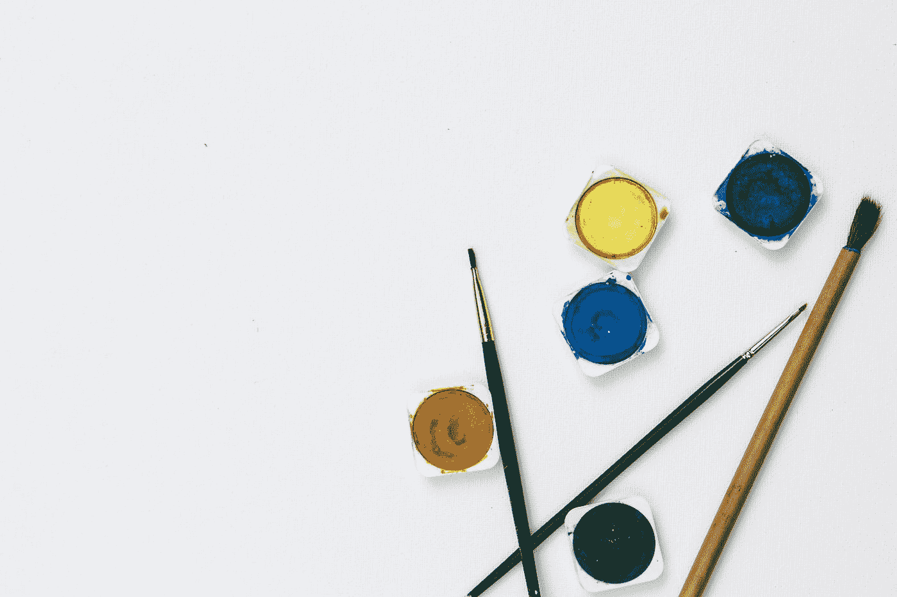
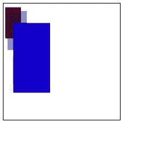

# HTML 画布介绍

> 原文：<https://betterprogramming.pub/introduction-to-html-canvas-1dd24037c13b>

## 开始使用画布



在 [Unsplash](https://unsplash.com?utm_source=medium&utm_medium=referral) 上 [Kelli Tungay](https://unsplash.com/@kellitungay?utm_source=medium&utm_medium=referral) 拍摄的照片

显示图形的一种方法是在 HTML 中使用`img`元素。但是，它只显示带有固定 URL 的静态图像。为了绘制和显示动态图形，我们可以使用 HTML `canvas`元素。

# 创建新画布

创建一个新的`canvas`元素:

```
<canvas style='width: 200px; height: 200px'>
</canvas>
```

它看起来像是`img`元素，但是它没有`src`或`alt`属性。这是因为它不是一个固定的图像元素。

我们可以像上面一样使用 CSS 样式，使用`width`、`height`、`margin`、`border`、`padding`等等。

## 后备内容

对于不支持 canvas 的浏览器，我们可以通过在里面放一些东西来提供后备内容。例如，我们可以写:

```
<canvas style='widthL 200px; height: 200px'>
  Your browser doesn't support canvas.
</canvas>
```

画布元素需要结束标记`</canvas>`。如果不存在，文档的其余部分将被视为后备内容。

# 渲染上下文

canvas 元素创建一个固定大小的绘图表面，该表面公开一个或多个呈现上下文—创建和操作所绘制内容的实体。

最基本的是 2D 渲染上下文。还有一个用于 WebGL 和 OpenGL ES 的 3D 渲染环境。

画布最初是空白的。我们必须访问渲染上下文，并在其上绘制以显示某些内容。为此，我们可以使用`canvas`元素的`getContext()`方法。对于 2D 图形，我们将`'2d'`指定到`getContext()`方法中。

我们按如下方式访问画布渲染上下文:

```
const canvas = document.querySelector('canvas');
const ctx = canvas.getContext('2d');
```

# 检查支持

我们可以通过检查`getContext`方法是否存在来检查对`canvas`元素的支持，如下所示:

```
const canvas = document.querySelector('canvas');
if (canvas.getContext) {
  const ctx = canvas.getContext('2d');
}
```

由于几乎所有的现代浏览器都支持`canvas`元素，这应该不是什么大问题。

# 绝对码

把它们放在一起，我们就有了下面的代码。HTML:

```
<canvas>
  Your browser doesn't support canvas.
</canvas>
```

然后我们可以添加下面的 CSS:

```
canvas {
  width: 200px;
  height: 200px;
  border: 1px solid black;
}
```

最后，我们有这个 JavaScript 代码:

```
const canvas = document.querySelector('canvas');
if (canvas.getContext) {
  const ctx = canvas.getContext('2d');
}
```

# 一幅简单的画

这幅简单的画是由基本的 2D 形状组成的，比如长方形。我们用下面的代码创建了三个不同背景颜色的矩形:

```
const canvas = document.querySelector('canvas');
const ctx = canvas.getContext('2d');
ctx.fillStyle = 'rgb(100, 0, 0)';
ctx.fillRect(5, 5, 40, 40);ctx.fillStyle = 'rgba(0, 20, 100, 0.5)';
ctx.fillRect(10, 10, 50, 50);ctx.fillStyle = 'rgba(20, 0, 200)';
ctx.fillRect(25, 25, 95, 90);
```

它的工作原理如下。在我们获得渲染上下文之后，我们用属性`fillStyle`设置形状的背景颜色，方法是用颜色值为它设置一个字符串。然后我们用左上角的坐标(5，5)和右下角的坐标(40，40)创建一个矩形。

前两个参数是左上角的 x 和 y 坐标，后两个参数是宽度和高度。

第一个矩形是:

```
ctx.fillStyle = 'rgb(100, 0, 0)';
ctx.fillRect(5, 5, 40, 40);
```

颜色值`rgb(100, 0, 0)`代表褐色。

同样，我们也有:

```
ctx.fillStyle = 'rgba(0, 20, 100, 0.5)';
ctx.fillRect(10, 10, 50, 50);
```

这个矩形比第一个矩形靠右下方。它是灰色的。

最后，我们有:

```
ctx.fillStyle = 'rgba(20, 0, 200)';
ctx.fillRect(25, 25, 95, 90);
```

这个也在右边，比第二个蓝色的矩形低。

最后，我们得到以下结果:



一旦加载了带有 canvas 元素的页面，绘图就完成了。坐标可以在矩形的维度之外或之内。如果它超过了维度，我们就看不到画出来的东西了。

画布对于绘制静态或动态图形都很有用。我们可以在 HTML 中创建一个 canvas 元素，然后我们可以在 JavaScript 中获得 canvas 元素，并获得渲染上下文，以便我们可以在其上绘制项目。

我们可以在上面画出基本的形状。我们可以用上下文的`fillStyle`属性改变背景的颜色，然后可以调用它上面的`fillRect`来绘制一个矩形。

它有四个参数:前两个参数左上角的 x，y 坐标，最后两个元素右下角的 x，y 坐标。