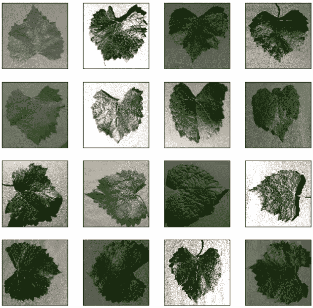
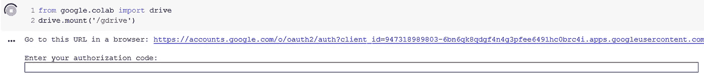
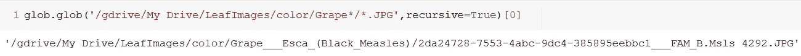
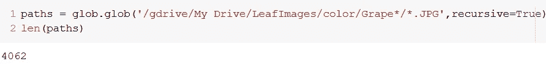
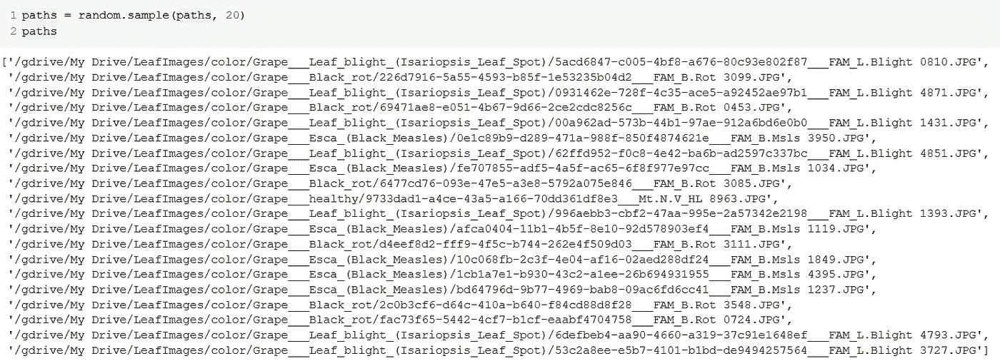
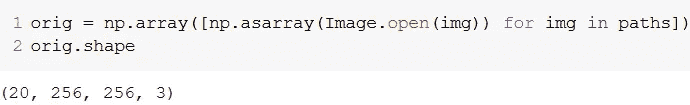
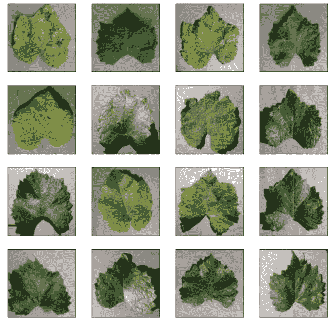
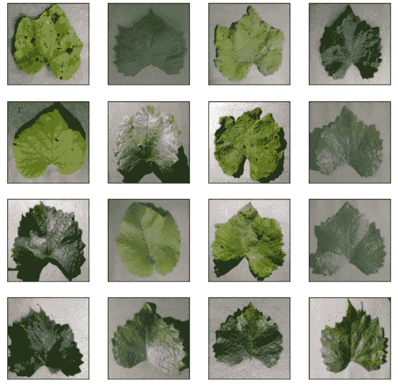
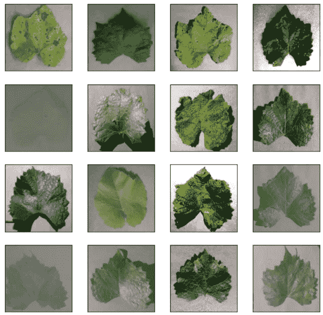
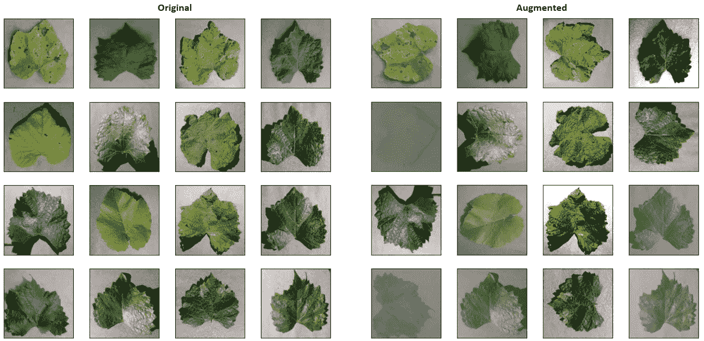

# Python 中的图像增强介绍(第 1 部分)

> 原文：<https://betterprogramming.pub/introduction-to-image-augmentation-in-python-1691cbf8901f>

## 通过扩展训练数据集来防止模型过度拟合



图片来源:作者

*卡在付费墙后面？点击* pd.set_option('display.max_colwidth', None)

最后，我们只需将 Google drive 安装到 Colab:



跟随 URL，选择您用来访问数据集的 Google 帐户，并向您的驱动器授予 Colab 权限。将授权代码粘贴到单元格输出的文本框中，您将得到消息`Mounted at /gdrive`。

我们的笔记本现在设置好了！

# 从驱动器读取图像

让我们看看 Drive 中的文件夹结构:



**注意:**在您的情况下，路径将是:

```
/gdrive/Shared with me/color/Grape___Esca_(Black_Measles)/2da24728-7553-4abc-9dc4-385895eebbc1___FAM_B.Msls 4292.JPG
```

我们将把路径保存到一个列表中。我们总共应该有 4062 条路径:



由于加载和处理 4000 张图像需要一段时间(大约 30 分钟)，即使是在 GPU 上，我也只会随机选取 20 张图像。(如果你想一直坚持到分类部分，我建议你使用整套工具)。



现在，我们将使用`Image.open()`方法打开这些路径中的图像，并将它们保存到 NumPy 数组中:



从`orig.shape`我们可以看到，我们有 20 个尺寸为 256x256 的图像，有三个颜色通道(R，G，B)。

让我们看看这些图像是什么样子的:

```
plt.figure(figsize=(9,9))
i = 0
for img in orig[0:16]:
    plt.subplot(4, 4, i+1)
    plt.xticks([])
    plt.yticks([])
    plt.grid(False)
    plt.imshow(img)
    i += 1
plt.suptitle("Original", fontsize=20)
plt.show()
```



原始图像

# 增强图像

现在我们终于可以开始图像增强了。为此，我们将使用 PIL 的`ImageEnhance`方法。

ImageEnhance 的`Contrast()`、`Brightness()`、`Sharpness()`、`Color()`都加载图像；然后，我们可以使用他们的`enhance()`方法，通过我们选择的任何因素来增强那些属性。我们将使用`np.linspace`来选择 0 到 1.5 之间的因子，并使用`np.random.choice`来随机化这些因子。

为了对比，这样做的一句话是:

```
contrast = [np.asarray(ImageEnhance.Contrast(Image.fromarray(img, 'RGB')).enhance(np.random.choice(np.linspace(0.5, 1.5, 5)))) for img in orig]
```

对于`orig`中的每个`img`，我们首先从`img`数组中加载图像(将颜色通道指定为“RGB”)。然后，用[0，0.5，1，1.25，1.5]中的一个随机值增强对比度(`np.linspace(0.5, 1.5, 5)`将选择 0 到 1.5 之间的五个线性间隔值)。最后，我们将这个图像作为一个数组保存在`contrast`列表中。

让我们看看调整对比度后的图像:

```
plt.figure(figsize=(9,9))
i = 0
for img in contrast[0:16]:
    plt.subplot(4, 4, i+1)
    plt.xticks([])
    plt.yticks([])
    plt.grid(False)
    plt.imshow(img)
    i += 1
plt.show()
```



对比度调整了 0.5 到 1.5 倍

增强因子为< 1 look greyer, while those with a factor > 1 的图像更加饱和。那些因子= 1 的和原来的不会有什么不同。

为了放大随机性的影响，我们依次处理图像的亮度、锐度和颜色，即一个图像的输出是另一个图像的输入:

```
brightness = [np.asarray(ImageEnhance.Contrast(Image.fromarray(img, 'RGB')).enhance(np.random.choice(np.linspace(0.5, 1.5, 5)))) for img in contrast]sharpness = [np.asarray(ImageEnhance.Contrast(Image.fromarray(img, 'RGB')).enhance(np.random.choice(np.linspace(0.5, 1.5, 5)))) for img in brightness]color = [np.asarray(ImageEnhance.Contrast(Image.fromarray(img, 'RGB')).enhance(np.random.choice(np.linspace(0.5, 1.5, 5)))) for img in sharpness]
```

在所有这些操作之后，图像看起来像:



调整亮度、清晰度和颜色后

我们只剩下两个操作——翻转和旋转。

对于翻转，我们将使用`cv2.flip()`。它接受图像和一个介于 0，1 和-1 之间的值。对于 0，垂直翻转；对于 1，它水平翻转；对于-1，它水平和垂直翻转。我们可以随机化这些值来随机化翻转，我们也可以随机化选择图像是否翻转。对此的一句俏皮话是:

```
flip = [cv2.flip(img, np.random.choice([0, 1, -1])) if np.random.choice([0, 1]) else img for img in color]
```

如果`np.random.choice([0, 1])`为 0，我们不翻转返回输入；否则，我们根据`np.random.choice([0, 1, -1])`翻转。

旋转很简单。我们从图像数组中加载图像，并根据需要旋转任意角度。为了避免填充，我们将图像随机旋转 0 度(不旋转)、90 度、180 度或 270 度:

```
rotate = [Image.fromarray(img, 'RGB').rotate(np.random.choice([0, 90, 180, 270])) for img in flip]
```

所有这些操作之后的最终输出(以及原始图像)如下所示:



然后，我们可以将这些图像保存在一个单独的“扩展”文件夹中:

```
import os
for i, image in tqdm(enumerate(rotate)):
    directory = paths[i].rsplit('/', 3)[0] + '/augmented/' + paths[i].rsplit('/', 2)[1]+ '/'
    os.makedirs(directory, exist_ok = True)
    image.save(directory + paths[i].rsplit('/', 2)[2])
```

除了我们讨论的步骤，你也可以添加噪声和模糊到你的图像，作为增强的一部分。这些在我的关于用 Python 生成文本验证码的文章中有描述:

[](https://medium.com/better-programming/how-to-generate-random-text-captchas-using-python-e734dd2d7a51) [## 如何使用 Python 生成随机文本验证码

### 确保你的用户是他们所说的那个人

medium.com](https://medium.com/better-programming/how-to-generate-random-text-captchas-using-python-e734dd2d7a51) 

# 就这样…暂时的

你可以在这里找到我用的[的 Colab 笔记本](https://colab.research.google.com/drive/12HfXtXvm1edwkmT72jq2xC5u0VE9Fj7N)。

这是我将撰写的关于图像增强、分割和分类的系列文章的第一部分。后续文章的链接将在文章发表后添加到这里。

第二部分现已上线:

[](https://medium.com/better-programming/image-segmentation-python-7a838a464a84) [## Python 中的图像分割(下)

### 通过从训练数据集中移除背景来提高模型准确性

medium.com](https://medium.com/better-programming/image-segmentation-python-7a838a464a84) 

既然您现在对图像增强已经驾轻就熟，那么您可能会想探索更多关于其他数据类型(如音频和文本)的增强。这篇文章是获得基础知识的好地方！

[](https://neptune.ai/blog/data-augmentation-in-python) [## Python 中的数据扩充:你需要知道的一切- neptune.ai

### 在机器学习(ML)中，如果模型不能很好地从训练数据归纳到看不见的情况…

海王星. ai](https://neptune.ai/blog/data-augmentation-in-python) 

感谢阅读，花束和砖块欢迎！😄

Medium 仍然不支持向印度以外的作者支付费用。如果你喜欢我的内容，你可以给我买杯咖啡:)

[](https://www.buymeacoffee.com/siddhantsadangi) [## Siddhant Sadangi 正在 Streamlit 上创建 python 网络应用程序

### 嘿👋我刚刚在这里创建了一个页面。你现在可以给我买杯咖啡了！

www.buymeacoffee.com](https://www.buymeacoffee.com/siddhantsadangi)