# k6 浏览器记录器简介

> 原文：<https://betterprogramming.pub/introduction-to-k6-browser-recorder-f7db08ad5b4c>

## 基于用户会话生成 k6 脚本，而不是手工编码

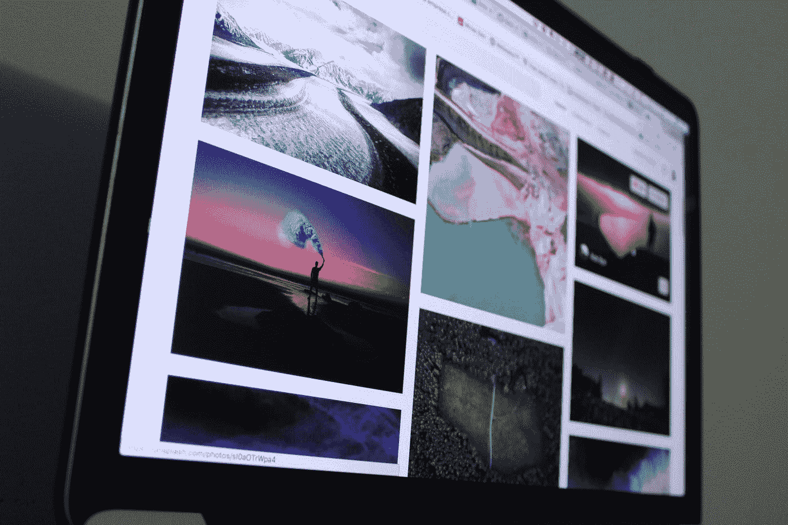

照片由[古伊列梅赛洛斯](https://unsplash.com/@gui_vasconcelos?utm_source=medium&utm_medium=referral)在 [Unsplash](https://unsplash.com?utm_source=medium&utm_medium=referral) 上拍摄

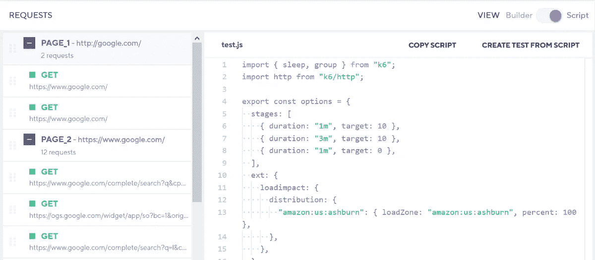

作者图片

如今，使用[记录](https://k6.io/docs/test-authoring/recording-a-session)来测试移动或网络应用程序上的复杂用例是一种常见的做法。记录是指从用户会话的记录中生成测试的过程。

供您参考，k6 提供了两种记录会话的方法:

*   `Browser Recorder extension` —从浏览器会话生成 k6 脚本。
*   `HAR converter` —根据 HTTP 归档文件中包含的请求生成 k6 脚本。

在本教程中，您将学习如何通过 Browser Recorder 扩展基于用户会话生成一个 k6 测试脚本。该扩展允许您捕获您在浏览器上所做的一切，自动为您生成 k6 脚本，并将其链接到您的 k6 云帐户。

当你需要创建复杂的测试脚本时，这对[负载测试网站](https://k6.io/docs/testing-guides/load-testing-websites)来说很方便。你需要做的不是手工编码，而是模拟用户浏览或使用你的网站的方式。通过用户会话使用记录的另一个好处是，当你点击时，它将捕获每一个请求。这包括所有媒体文件，如图像和文档。因此，您的负载或性能测试更加准确，并且反映了实际的用例。

让我们继续下一部分，开始根据您的浏览器设置扩展。

# 设置

首先，进入主注册页面[注册一个新的 k6 云账户](https://app.k6.io/account/register)。它附带一个免费试用帐户，其中包括 50 个免费云测试。您需要激活您的帐户才能使用它。

注册完成后，让我们安装 k6 浏览器记录器扩展。在撰写本文时，k6 支持以下浏览器:

*   [铬合金](https://chrome.google.com/webstore/detail/k6-browser-recorder/phjdhndljphphehjpgbmpocddnnmdbda?hl=en)
*   [火狐](https://addons.mozilla.org/en-US/firefox/addon/k6-browser-recorder/)

您可以通过以下 URL 轻松安装 [k6 浏览器记录器](https://k6.io/docs/test-authoring/recording-a-session/browser-recorder)扩展:

## 铬

 [## k6 浏览器记录器

### 直接从浏览器录制 k6 脚本，自动上传到您的 k6.io 云帐户。

chrome.google.com](https://chrome.google.com/webstore/detail/k6-browser-recorder/phjdhndljphphehjpgbmpocddnnmdbda?hl=en) 

只需点击`Add to Chrome`按钮即可安装。

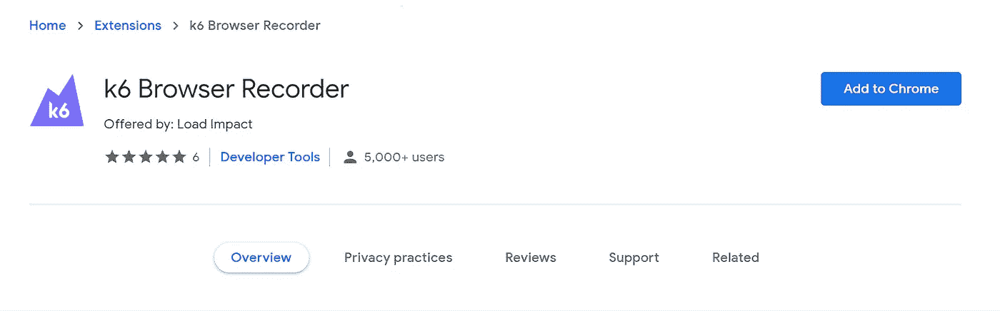

作者图片

## 火狐浏览器

 [## k6 浏览器记录器-获取此扩展🦊火狐浏览器(美国)

### 下载火狐 k6 浏览器记录器。直接从浏览器录制 k6 脚本，自动上传到您的…

addons.mozilla.org](https://addons.mozilla.org/en-US/firefox/addon/k6-browser-recorder/) 

根据您的浏览器，您应该会看到以下用户界面:

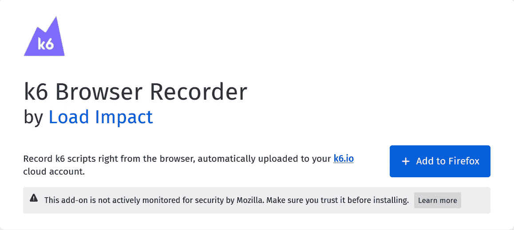

作者图片

# 使用扩展

一旦您安装了扩展，您应该能够在您的浏览器上看到它。如果你用的是 Chrome，记得要钉住。

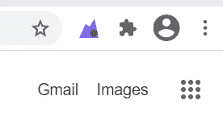

作者图片

单击 Browser Recorder 扩展，您应该会看到以下弹出消息:

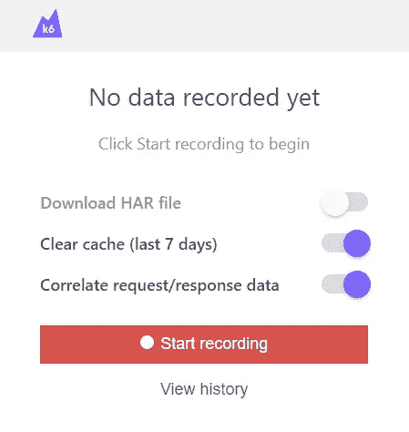

作者图片

此外，k6 浏览器记录器扩展具有以下功能:

*   `Download HAR file` —将`HTTP Archive file`捕获并保存在`Download`文件夹中。
*   `Clear cache (lasts 7 days)` —从浏览器中删除扩展缓存。
*   `Correlate request/response data` —关联请求/响应以使用由先前请求/响应返回的值。这确保了更好的性能测试。仅适用于撰写本文时的 Chrome 扩展。
*   `View history` —重定向至显示录制历史的离线页面

下图显示了点击`View history`时的用户界面。

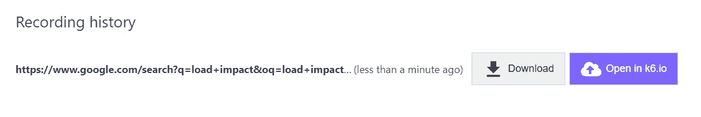

作者图片

*   `Download` —将捕获的`HTTP Archive file`保存在本地的`Download`文件夹中。
*   `Open in k6.io` —将生成的测试脚本链接到 k6 Cloud。

## 开始录音

接下来，点击`Start Recording`按钮开始记录。

弹出窗口将变为以下用户界面:

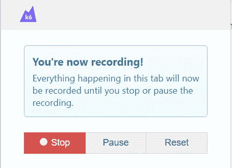

作者图片

只需在录制时正常浏览或访问您的网站。如果你只是想测试它，只需打开`google.com`并搜索一些东西。举个例子，

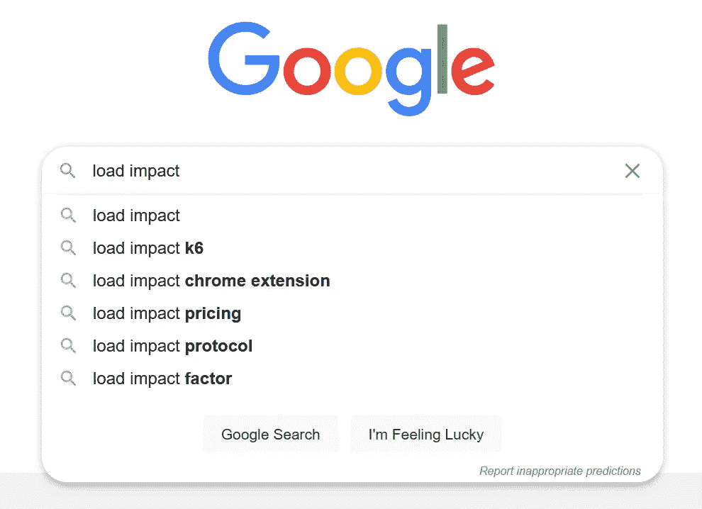

作者图片

点击回车键，您应该会被重定向到搜索结果页面。

## 结束录制

完成后，访问扩展并选择以下选项之一:

*   `Stop` —结束记录，将生成的测试脚本链接到 k6 Cloud。
*   `Pause` —暂时暂停录像，以后可以继续。
*   `Reset` —删除当前活动记录，返回`Start Recording`界面。

点击`Stop`按钮结束记录。它会自动在您的主浏览器中打开一个新页面到 k6 Cloud。如果您尚未登录，您将被重定向到以下网页:

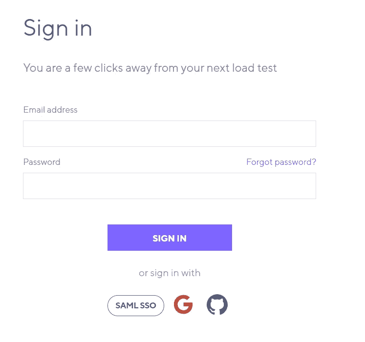

作者图片

## 将测试保存到 k6 云

另一方面，如果您已经登录到 k6 Cloud，您应该会看到以下用户界面:

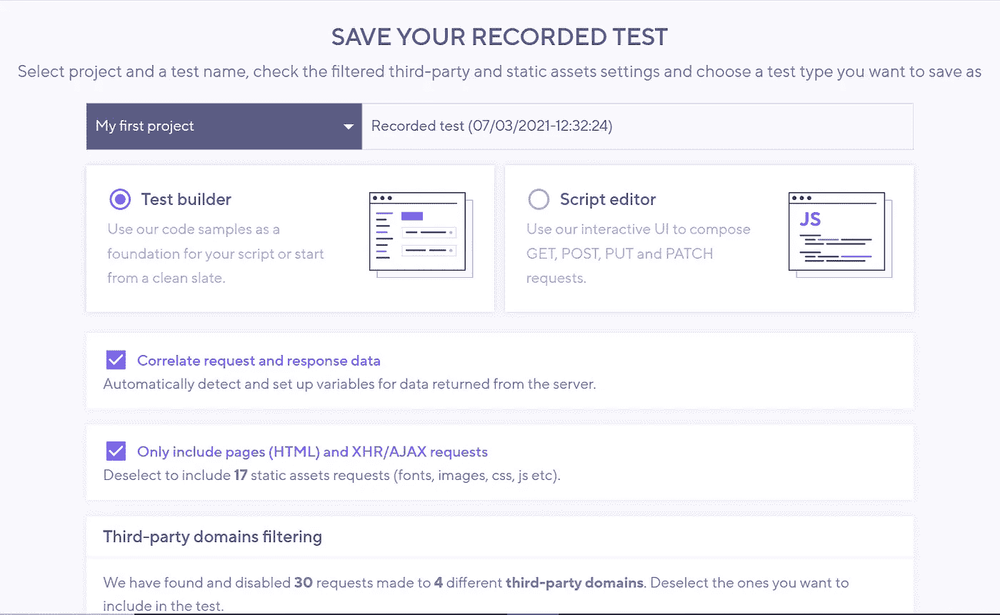

作者图片

您需要将脚本作为测试的一部分保存在 k6 云中。有两个选项可用:

*   测试生成器
*   脚本编辑器

现在，只要使用默认的`Test builder`选项，因为我们总是可以在以后访问代码。

## 配置选项

除此之外，您可以在保存记录的测试之前配置以下选项:

*   关联请求和响应数据:一些应用程序有需要随下一个请求一起提交的动态值。保持选中此项，让记录器为您识别和设置这些。
*   仅包括页面(HTML)和 XHR/AJAX 请求:保持选中状态将仅记录对主页面的请求，而不是该页面上的嵌入资源。当您不想下载 CDN 上托管的资源时，此设置很有用。如果您希望记录器保存所有请求，请取消选择此选项。

## 第三方域过滤

默认情况下，Browser Recorder 会自动检测并禁用对第三方域(如分析工具、社交网络和外部小工具)的所有请求。这主要是因为以下原因:

*   第三方请求对您的后端性能没有影响。
*   第三方可能会抑制请求，扭曲你的结果。
*   第三方给你的测试结果数据增加了很多噪音，这使得理解结果更加困难。
*   对第三方的系统进行测试可能违反了 TOS。

如果您想将它们包含在测试中，可以在`third-party domain filtering`下手动取消选择单个选项。

此外，您应该将您的 CDN 视为第三方提供商，并且不要将您的 CDN 资产包含在您的负载测试中。这仅仅是因为对 CDN 进行负载测试可能会在您这边产生额外的成本。

然后，单击保存。基于您所做的记录，将在 k6 Cloud 上为您创建一个测试。您将被重定向到以下显示测试详细信息的用户界面:

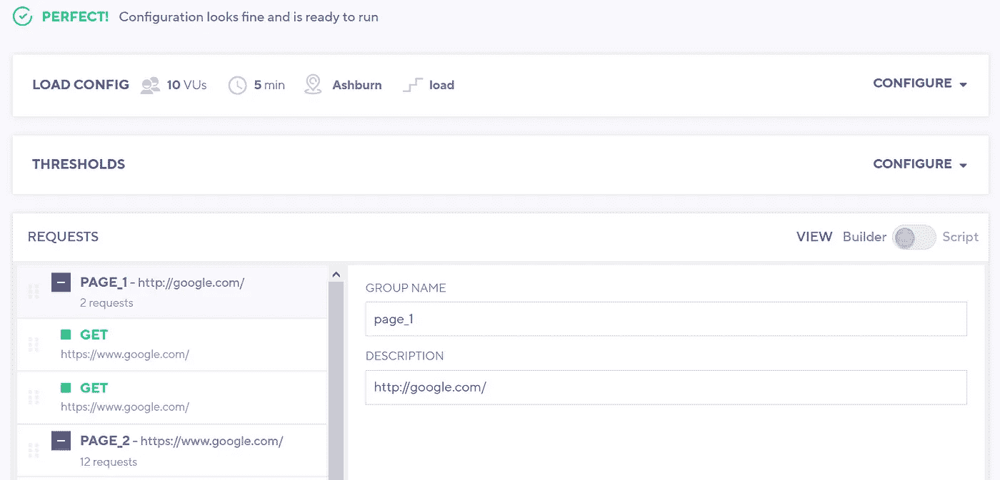

作者图片

在顶部，它会有一个关于你的测试有效性的备注。任何错误的配置都会被反映和显示出来。

## 配置负载

点击`CONFIGURE`按钮将打开手风琴，如下所示:

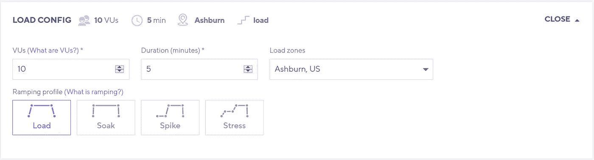

作者图片

您可以配置虚拟用户数量、测试持续时间、地理分布(仅云测试需要)、测试类型:[压力测试](https://k6.io/docs/test-types/stress-testing)、[浸泡测试](https://k6.io/docs/test-types/soak-testing)等。

## 配置阈值

接下来，`Threshold`部分允许您设置负载测试的通过/失败标准。

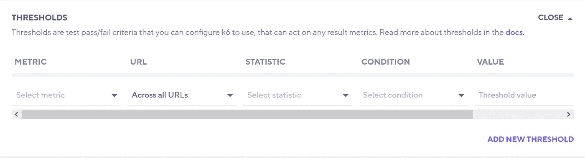

作者图片

如果你想自动化你的测试，阈值 API[是非常灵活和必要的。在](https://k6.io/docs/using-k6/thresholds) [k6 性能测试自动化指南](https://k6.io/docs/testing-guides/automated-performance-testing)上查看关于这个主题的更多信息。

## 从测试中获取代码

在`REQUESTS`块的右侧，您可以在以下选项之间切换:

*   建设者
*   脚本

您可以通过切换到`Script`来轻松查看测试脚本的源代码。

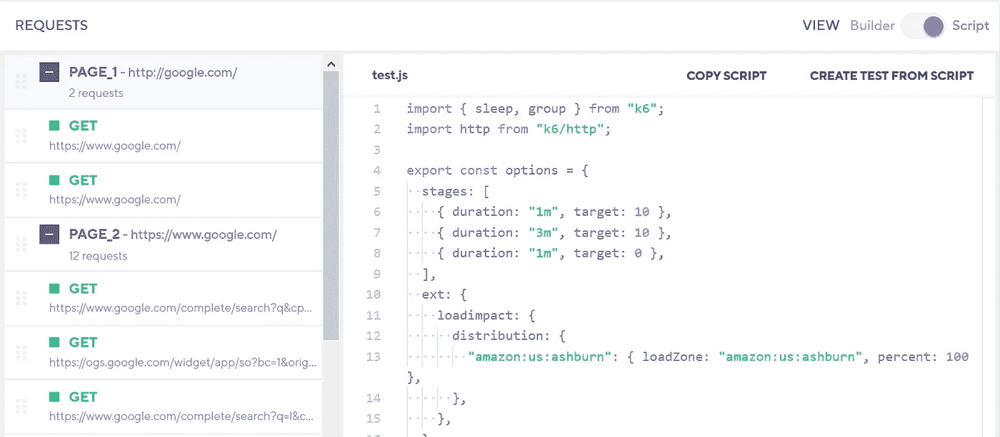

作者图片

然后，您可以复制测试脚本并在本地运行测试，或者简单地点击`Run`按钮开始云测试。

# 结论

让我们回顾一下文章中所涉及的内容。

它首先简要解释了什么是记录及其使用案例。然后，介绍了通过用户会话使用录音的好处。

这篇文章还介绍了在 Chrome 或 Firefox 中设置和安装 k6 Browser Recorder 扩展。

之后，它解释了如何使用扩展并在您的 k6 云帐户上生成测试脚本。最后，您可以复制生成的 k6 脚本，在您的机器上运行负载测试，或者从 UI 触发云测试。

感谢你阅读这篇文章。希望在下一篇文章中再见到你！

# 参考

1.  [k6 —浏览器记录器](https://k6.io/docs/test-authoring/recording-a-session/browser-recorder)
2.  [k6 —记录会话](https://k6.io/docs/test-authoring/recording-a-session)
3.  [k6 —负载测试网站](https://k6.io/docs/testing-guides/load-testing-websites)

# 便签

## (致[乔·格里尔](https://medium.com/u/53814009142b?source=post_page-----f7db08ad5b4c--------------------------------)

很抱歉，我在编辑文章时不小心删除了你的评论。以下是我对你问题的回答:

> 您可以免费使用 k6 浏览器记录器扩展。不要直接在 k6 cloud 上运行测试(免费层限制为 50 个测试)，只需复制测试脚本并保存在本地。
> 
> 然后，您可以使用开源的 K6([https://github.com/loadimpact/k6](https://github.com/loadimpact/k6))测试工具在本地机器上直接测试它。
> 
> 它有助于为您生成一个基础脚本，而无需从头开始编写代码。在运行负载测试之前，您总是可以在代码中修改生成的脚本。
> 
> 如果你需要进一步的澄清，请告诉我。