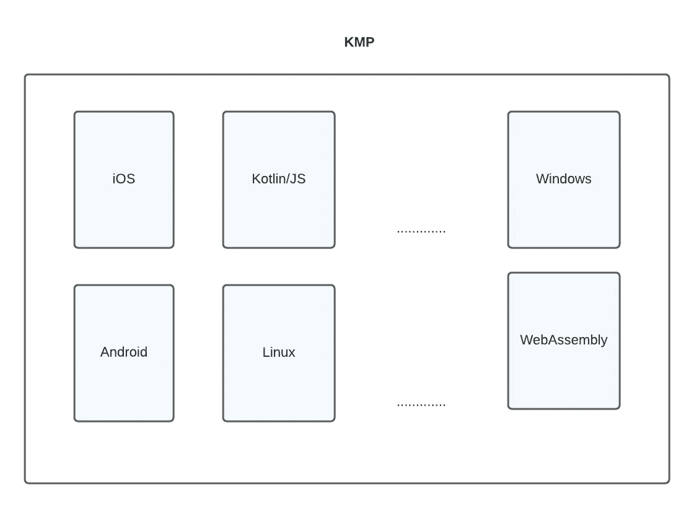
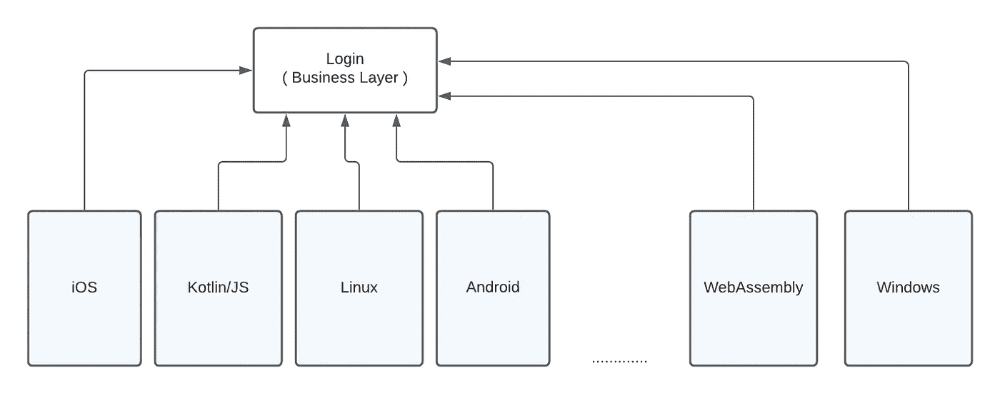
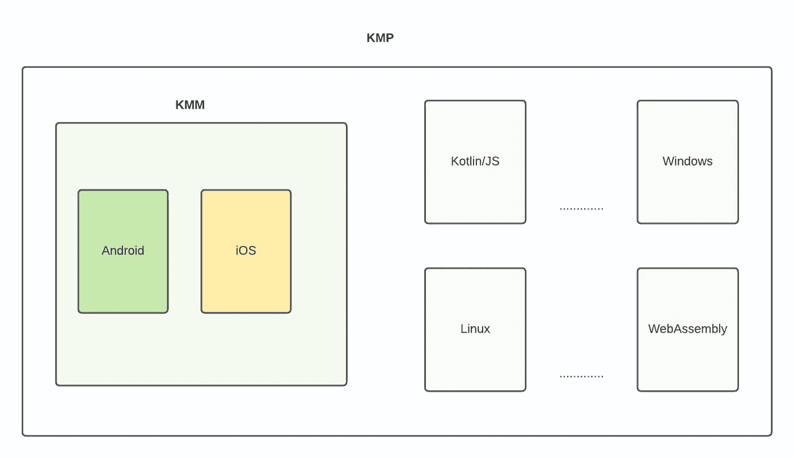
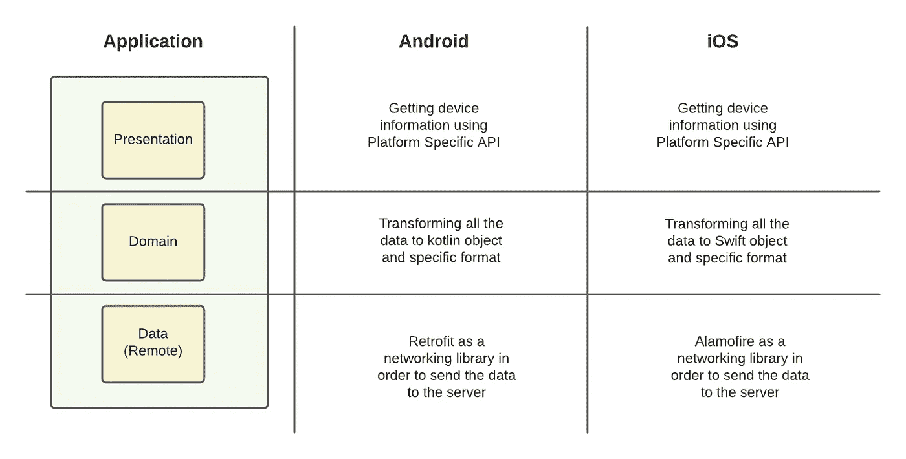
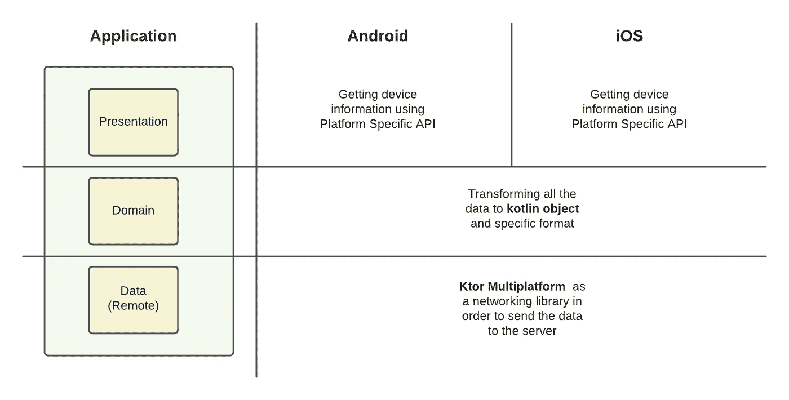
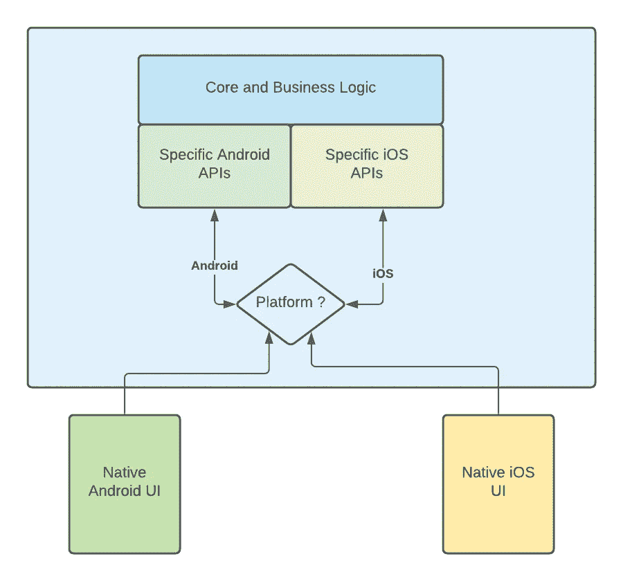
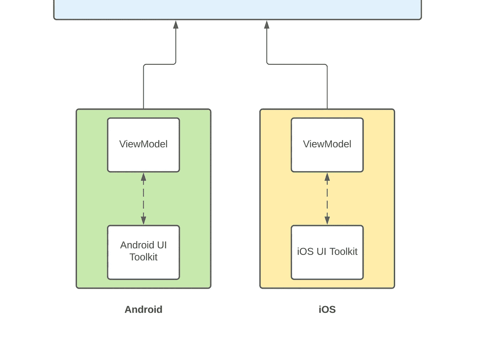
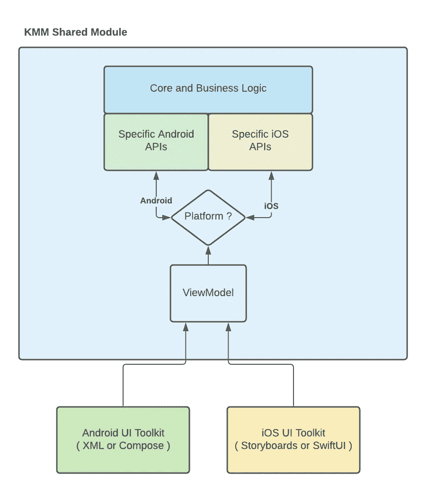

# Kotlin 多平台移动设备简介—入门

> 原文：<https://betterprogramming.pub/introduction-to-kotlin-multiplatform-mobile-part-i-333af55741af>

## 第一部分

来自科特林文件

这是一系列关于 Kotlin 多平台移动(KMM)的文章，如果你想开始使用它，你应该知道。这些分为三个部分:

*   **第一部分:Kotlin 多平台简介**
*   第二部分:KMM 配置
*   第三部分:KMM 样本(缓存+网络)

# 第一部分将涉及的要点

*   什么是科特林多平台(KMP)？
*   KMP 对 KMM
*   KMM 试图解决什么问题？
*   如何使用 KMM 构建代码？
*   使用 KMM 的局限性是什么？
*   结论

# 什么是科特林多平台(KMP)？

它于 17 年 11 月在 Kotlin 1.2 中推出([见 Kotlin 博客](https://blog.jetbrains.com/kotlin/2017/11/kotlin-1-2-released/))，根据 [Kotlin 文档](https://kotlinlang.org/docs/multiplatform.html):

> 对多平台编程的支持是 Kotlin 的主要优势之一。它减少了为不同平台编写和维护相同代码的时间，同时保留了原生编程的灵活性和优势

科特林多平台目标

也就是说，KMP 是一种在业务层、数据层、表示层等平台之间共享代码，只为特定平台编写原生组件的方式。也就是说，您可以编写一个封装了业务逻辑的 KMP 组件(即登录组件)，特定的平台可以使用它。

KMP 登录业务层示例

# **KMP 对 KMM**

可能你听到的第一个术语是 Kotlin 多平台(KMP)，然后是 Kotlin 多平台移动(KMM)。但是两者有区别吗？让我们找到答案！

最简单的理解方法就是看下图。

KMP 对 KMM

如你所见，KMM 是 KMP 的一个专业。这意味着 KMP 可以编译成特定平台的原生二进制代码([参见 kotlin 支持的平台完整列表](https://kotlinlang.org/docs/mpp-supported-platforms.html))，但 KMM 是 KMP 负责移动目标(Android + iOS)的一部分。为了实现这一点，有工具，插件，库等。

# KMM 试图解决什么问题？

由于 KMM 是关于移动目标的，它试图解决的问题是在平台之间共享需要共享的内容，需要共享的部分是开发者的责任。这意味着你可以共享一个特定的模块或者几个模块(包括 UI，稍后会详细介绍)。让我们看一个例子。

比方说，我想开发一个应用程序，将设备信息发送到任何远程服务器。没有 KMM，看起来像是:

没有 KMM 的 Android 和 iOS 应用程序

从上一张图来看，表示层正在使用来自 Android 和 iOS 的特定 API，以便从设备获取信息。

然后，`domain`层使用来自表示层的信息，以便创建具有特定格式的对象，并在需要时添加额外的业务规则(即，为某些属性添加特定格式，或者如果某些传感器不可用，我们可能应该发送空数据)。

最后，`data`层负责将信息发送到服务器。在 Android 的情况下，我们可以使用[改进](https://github.com/square/retrofit)，对于 iOS，我们可以使用 [Alamofire](https://github.com/Alamofire/Alamofire) 。也许你开始在这个应用程序中看到一些常见的模式，特别是对于领域和数据层。

现在让我们看一下同一个应用程序，但是现在使用 KMM

使用 KMM 的 Android 和 iOS 应用程序

如您所见，使用 KMM，我们避免了在域和数据层重复代码。这两层可以用 Kotlin 编写和共享，在`domain`的情况下，它可以是一个纯 Kotlin 模块，对于`data`层，它可以用 Kotlin 编写，并使用`Ktor`客户端库，以便向服务器发送信息。

回答最初的问题。KMM 试图使用可以在特定平台上使用的共享模块来解决重复代码的问题。

# 如何使用 KMM 构建代码？

构建代码/模块是每个开发人员的责任。但是，在互联网上搜索例子时，我看到了一些在 KMM 背景下可以分享的常见模式。所以，我们开始吧！

# **共享业务逻辑+具体平台目标**

使用 KMM 共享业务逻辑

对于 KMM 来说，这可能是最常见和最流行的用例。通过使用这种结构，您可以使用每个平台的原生工具包(即 Android 中的 Jetpack Compose 和 iOS 中的 SwiftUI)构建原生 UI 组件，并且共享模块可以使用称为 [actual/expect](https://kotlinlang.org/docs/kmm-connect-to-platform-specific-apis.html) 的功能添加基于平台的特定功能。

它看起来类似于为每个平台创建一个接口并构建一个特定的实现，KMM 共享模块负责根据您正在执行的目标选择特定的实现。这种结构的一些例子:

*   [https://github.com/Kotlin/kmm-basic-sample](https://github.com/Kotlin/kmm-basic-sample)
*   [https://github.com/mitchtabian/Food2Fork-KMM](https://github.com/mitchtabian/Food2Fork-KMM)
*   [https://github.com/Kotlin/kmm-production-sample](https://github.com/Kotlin/kmm-production-sample)

# 共享业务逻辑+视图模型(表示层)

就表示层而言，有不同的架构模式(MVVM、MVC、MVP 等)可以用来构建你的代码。让我们使用 MVVM 在这种情况下，看看下面的图片。

Android / iOS 中的表示层

如你所见，`ViewModel`是两个平台上的通用类。一般来说，这个类负责向 UI 发送事件/动作，保存一些属性，并在需要时从外部源获取额外的数据。

看到整个画面，因为我们在 KMM 的上下文中，我们可以将这个类包含到我们共享的 KMM 模块中，并将 UI 的实现留给本机。让我们看看它是什么样子的:

KMM 与 ViewModel 共享模块

使用这种结构，您只需要担心本机 UI 组件，KMM 共享模块将负责管理业务逻辑并通知 UI 更新。让我们看一些例子:

*   [https://github.com/icerockdev/moko-template](https://github.com/icerockdev/moko-template)
*   [https://github.com/dbaroncelli/D-KMP-sample](https://github.com/dbaroncelli/D-KMP-sample)

这些是使用 KMM 的最常见的模式，但是还有更多，也可以根据用例进行定制。

*   **使用小工具共享 UI**:[https://github.com/dbaroncelli/D-KMP-sample](https://github.com/dbaroncelli/D-KMP-sample)
*   **KMM+React Native:**[https://shopify . engineering/managing-Native-code-React-Native](https://shopify.engineering/managing-native-code-react-native)
*   **来自科特林网站的例子:**[https://kotlinlang.org/docs/kmm-samples.html](https://kotlinlang.org/docs/kmm-samples.html)

# 使用 KMM 的局限性是什么？

*   **ViewModel:** 原生来说，Android 中的一个 ViewModel 应该是从`[ViewModel](https://developer.android.com/reference/androidx/lifecycle/ViewModel)`扩展而来，对于 iOS，我们应该使用协议`[ObservableObject](https://developer.apple.com/documentation/combine/observableobject)`。如果这些视图模型被移动到一个共享模块。很可能你不能在一个视图模型中同时实现两者(`[ViewModel](https://developer.android.com/reference/androidx/lifecycle/ViewModel)`和`[ObservableObject](https://developer.apple.com/documentation/combine/observableobject)`)。所以为了共享视图模型，你可以实现一个设计模式(观察者、发布订阅者等等)或者使用另一个封装了这个功能的库(例如[https://github.com/dbaroncelli/D-KMP-sample](https://github.com/dbaroncelli/D-KMP-sample)
*   **观察属性变化**:在`ViewModel`内部，通常有不断变化的属性，被 UI 观察到。在 Android 的情况下，可以使用`[LiveData](https://developer.android.com/reference/android/arch/lifecycle/LiveData)`来实现，而对于 iOS，则是通过用`[@Published](https://developer.apple.com/documentation/combine/published)`标记属性来实现，问题与上一个相同。在一个共享模块中，可能没有办法在同一个属性中同时使用两者，解决方案将是使用另一个库或实现一个设计模式。
*   **协程:**让我们想一想**`ViewModel`不是共享的。因此，我们可以在每个平台上本地实现它。但在大多数情况下，应用程序需要在 UI 线程之外做一些工作，将它委托给一些关于后台工作的机制。在 Android 中，现在最常见的可能是[协程](https://kotlinlang.org/docs/coroutines-overview.html)，在 iOS 中是`[Actors](https://developer.apple.com/videos/play/wwdc2021/10133/)`。由于共享模块使用 Kotlin 作为主要语言，在 Android 中我们可以安全地使用协程或流，但 iOS 不知道流和协程。好的一面是，我们可以在 iOS 中使用回调，并且还有一篇由`@joreilly`撰写的名为[的文章，介绍了一种可能的强大解决方案，该解决方案通过 KMP-本地例程](https://johnoreilly.dev/posts/kmp-native-coroutines/)弥合了 Swift 5.5 并发性和 Kotlin 协同例程之间的差距。**
*   ****iOS 中的模块化问题:**显然当一个 iOS 应用试图在不同的模块中使用同一个共享模块时会出现问题。基本上，KMM 多次创建同一个模块，而不是只共享一个。更多细节，你可以阅读这篇[文章](https://medium.com/xorum-io/three-framework-problem-with-kotlin-multiplatform-mobile-16267c5afa53)作者[耶夫·卡尼维茨](https://medium.com/u/1ed4e1d57aec?source=post_page-----333af55741af--------------------------------)。**

# **结论**

**暂时就这样了。如果有一些东西需要在不同的移动平台上共享，KMM 是一个很好的选择，因为新的选项存在一些限制，这些限制将会逐步得到解决。**

**此外，还有一些大型项目在生产中使用 KMM(即[网飞](https://netflixtechblog.com/netflix-android-and-ios-studio-apps-kotlin-multiplatform-d6d4d8d25d23)、[菲利普](https://kotlinlang.org/lp/mobile/case-studies/philips)和[莫尔](https://kotlinlang.org/lp/mobile/case-studies/))，可能没有提到，但是使用 KMM 也可以进行单元测试。**

**基本上可以把 KMM 看作是一个在平台间共享代码的新选择，Kotlin 社区将对其进行改进，你可以控制什么需要共享，什么不需要共享。**

# **参考**

*   **[https://johnoreilly . dev/posts/swift _ async _ await _ kot Lin _ coroutines/](https://johnoreilly.dev/posts/swift_async_await_kotlin_coroutines/)**
*   **[https://www . techyourchance . com/kot Lin-multi platform-expert-opinion/](https://www.techyourchance.com/kotlin-multiplatform-expert-opinion/)**
*   **【https://kotlinlang.org/docs/multiplatform.html **