# C 语言中的链表介绍

> 原文：<https://betterprogramming.pub/introduction-to-linked-lists-in-c-80fc426a6a2f>

## 链表的可视化指南

链表是一种数据结构。数据结构就是我们如何组织和存储内存中的数据。

链表由各个节点组成，每个节点包含两样东西:一个是数据，一个是指针，将指向下一个节点。一个链表基本上可以有 *n* 个节点，每个节点通过指针连接到下一个节点。有两种类型的链表:单向链表(SLL)和双向链表(DLL)。

在 SLL 中，我们有一个指向下一个节点的指针，因此，它被称为单链表。在 DLL 中，我们有两个指针:一个指针指向下一个节点，另一个指向前一个节点。这就是为什么我们称之为双向链表。

在 C 编程中，我们使用结构来创建一个链表。结构是一种数据类型，在结构中我们可以定义不同数据类型的变量(如`int`、`char`、`pointer`等)。).

为了创建一个链表，我们将定义链表的结构(使用`struct`数据类型)，它将表示链表中单个节点的样子。然后我们将通过使用`malloc()`函数分配内存来创建一个链表。

## **链表的结构:**

上面的代码代表了我们的链表结构，它包含两个东西。首先是一个变量`data`，它将在其中保存整数值。第二个是`struct node *p`，它是一个指向链表中下一个节点的指针。这里，`struct`表示结构数据类型，`node`是该结构的名称。你可以给这个结构取任何你想要的名字。

现在，你可能会有一个问题:为什么指针和结构有相同的数据类型？这背后的原因是链表中的节点是自引用的，这仅仅意味着一个节点中的指针将指向另一个相同类型的节点(在本例中是`struct`节点)。

注意，写完上面的代码后，不会创建链表——也不会给它分配任何内存。这只是一个模板，它将定义我们的链表的结构(我们的链表看起来会是什么样子)。

现在，让我们编写一个代码，通过使用`malloc()`函数分配一些内存来创建一个链表。

上面的代码行将在内存中创建一个节点，后跟一个名为`new`的指针，它将指向新创建的节点。

之前，在为我们的节点创建模板时，我们将其命名为`struct node`。因此，要分配内存，首先我们必须找出该数据类型的大小，然后将其传递给 malloc 函数来为其分配内存。

之后，我们可以创建一个名为`*new` 的新指针，并使用类型转换将 malloc 函数的输出分配给该指针。malloc 函数默认返回`void`，但是我们的指针`new`属于`struct node`类型；因此，我们必须对其进行定型。

这就是它看起来的样子。

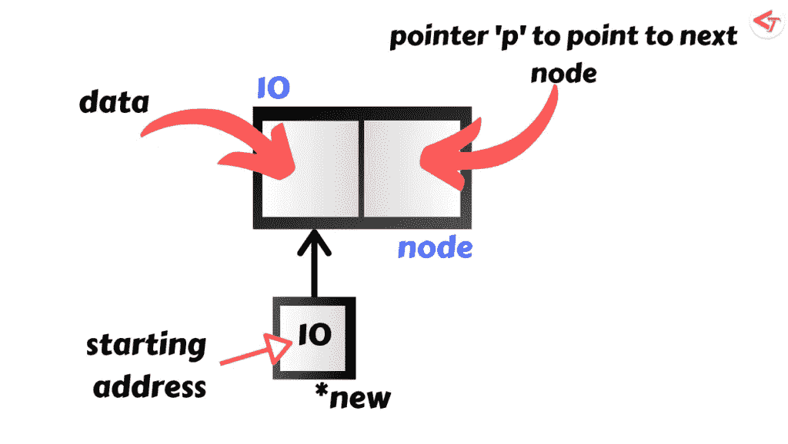

链表中的单个节点

# 在 SLL 上执行的操作

## 1.在链接列表中插入元素

*   在将一个节点(元素)插入一个链表之前，首先必须使用`malloc`创建一个节点。
*   同样，在插入一个节点(元素)之前，你首先要检查`head`是否指向`NULL`**——否则，它会给出一个分段错误。**

*   **考虑下面的例子:**

**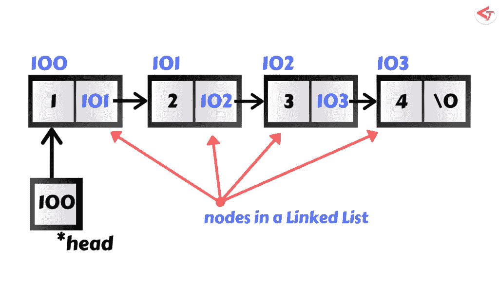**

**链接列表的示例**

*   **现在，有三种方法可以将这个节点插入到上面的链表中**

****a .在开头插入节点****

**为了在链表的开头插入一个我们创建的节点，这个节点由一个名为`new`的指针指向，我们必须编写下面的代码。**

**这样做的目的是:它首先将由`**pointer head**`指向的节点的起始地址存储到由`pointer new`指向的节点中。然后把`new pointer`的地址分配给`head pointer`。**

**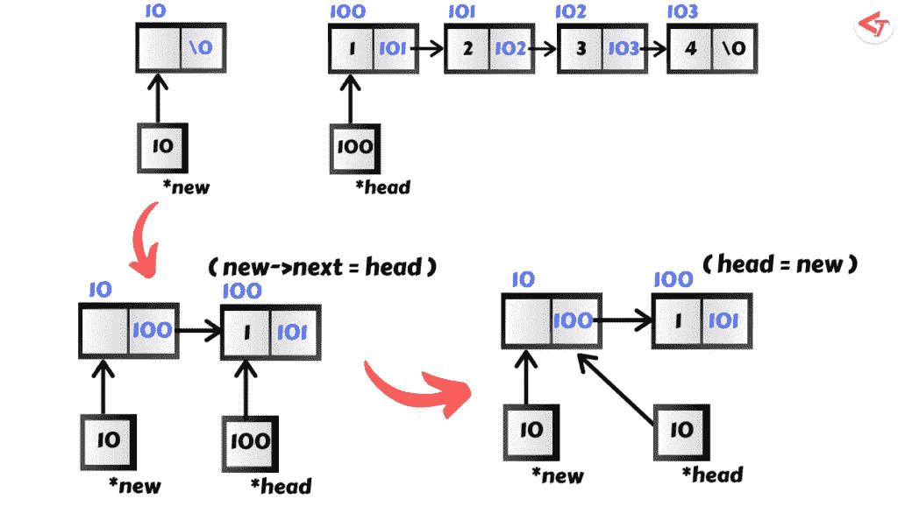**

**在开头插入节点**

**如果在将`head pointer`的地址存储到`new pointer`之前，直接将`new pointer`的地址分配给`head pointer`以在开头插入节点，那么整个链表将会丢失，因为在这种情况下，没有指针指向链表起始节点所在的内存位置。**

**一开始理解起来可能有些混乱，所以我建议你多读几遍，试着从视觉上理解它。**

****b .在中间插入节点****

**现在要在中间插入节点，我们首先要考虑在哪里插入新节点。**

**假设我们想在上述链表中的第二个节点之后插入新创建的节点。为此，我们必须到达第二个节点，然后将第二个节点指向的内容存储到`new->link`中。然后，我们将在该位置插入节点。**

**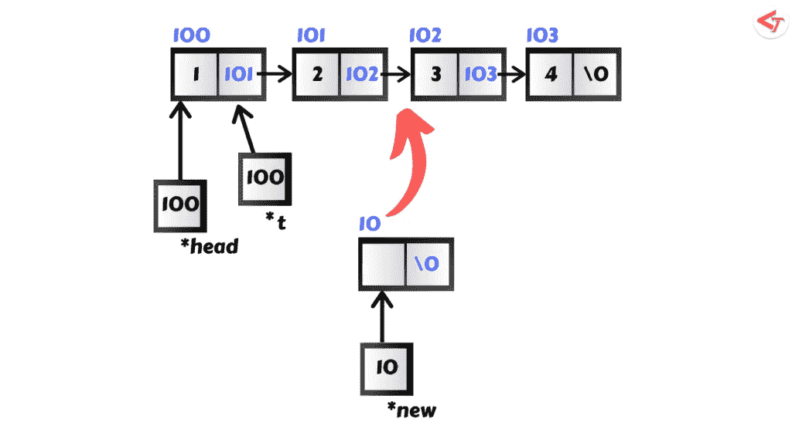****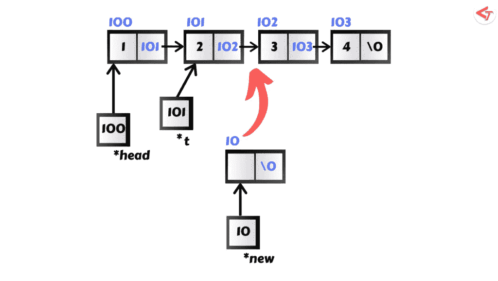****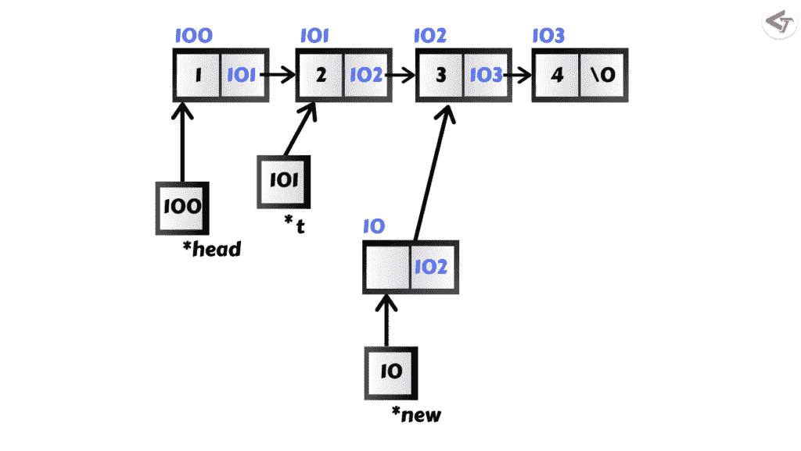****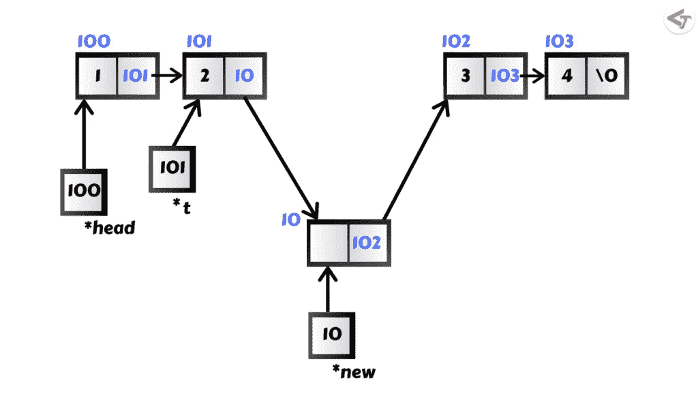**

**在中间插入节点**

****c .在末尾插入节点****

**为了在末尾插入一个节点，我们首先要找到链表的末尾。链表中的结束节点或最后一个节点在下一部分总是有一个`NULL` (也表示为`\0`)。从上面的链表中，我们可以说值为 5 的节点是最后一个节点，因为它的下一个节点是`NULL`。**

**为了达到目的，我们首先必须检查`t->next`是否为空。如果为空，那么我们可以在该位置插入节点。否则，继续前进，直到到达`t-> next`为空。**

**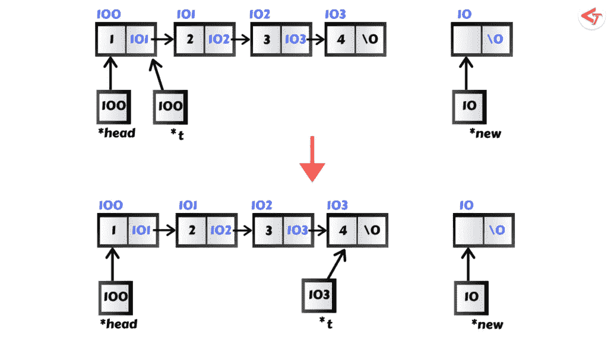****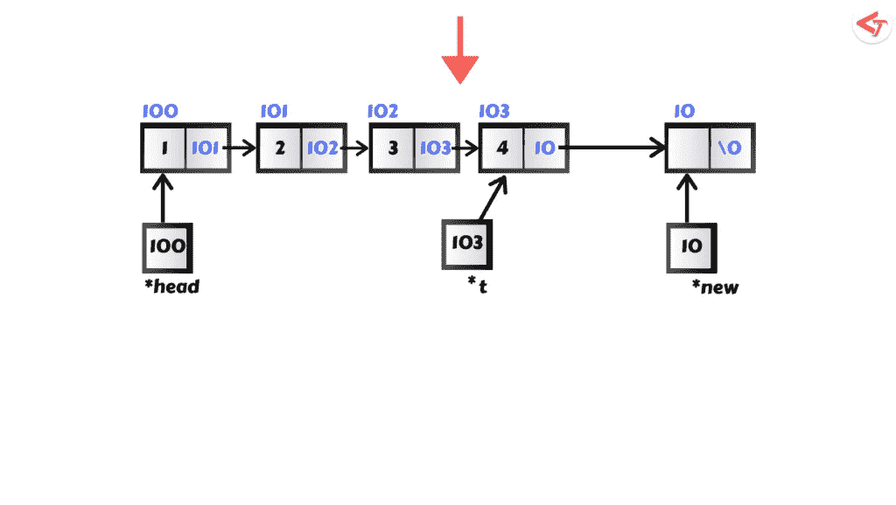**

**在末尾插入节点**

## ****2。遍历链表****

*   **遍历意味着访问链表中的每个节点。**
*   **对于遍历，我们不使用当前指向链表的实际指针，而是创建另一个指针(比如，`t`)。通过使用它，我们可以遍历列表。因为如果我们移动当前指针，那么有可能会丢失链表中的一些节点。**
*   **我们用一个例子来理解这个。假设我们有一个链表，如下所示。所以让我们穿越它。**

****

**链接列表的示例**

****遍历上述链表的代码:****

****输出:****

**首先，我们有一个节点模板，它定义了链表中的内容。其次，我们在里面有 main 函数，为此我们创建了一个类型为`struct node`的新指针`t`(一个我们将用来遍历列表的指针)和一个 while 循环，它将打印列表中的数据，然后递增指针。**

**在这种情况下，我们现在触摸`head`指针。如果我们这样做，那么我们可能会丢失链表中的一些节点，因为我们在链表的起始位置没有指针。**

**创建另一个指针后——比如说，`t`——你有一个选择。您可以移动`t`或`head`。哪个都没关系，因为现在在链表的起始位置有两个指针。**

## ****3。从链表中删除一个元素****

*   **在删除一个节点(元素)之前，首先要检查`head`是否指向`NULL`。否则，它会给出一个分段错误。**
*   **每当你从使用`malloc()`函数创建的链表中删除一个元素时，你也必须使用`free()`函数释放它。删除一个元素后释放空间并不是强制性的，但是这样做是一个好习惯。**
*   **另外，创建一个临时指针——比方说，`t` —来保存您想要删除的节点，然后执行其他操作。否则，您要删除的节点将会丢失。**

****检查条件:****

**有三种方法可以像插入一样删除节点。**

****a .删除开头的节点****

**要删除开头的节点，创建一个新指针`t`，并使其指向头部。现在，我们必须使用`head = head->next`将头部指针的位置向前移动一步。然后释放`t`删除链表中的第一个元素。**

**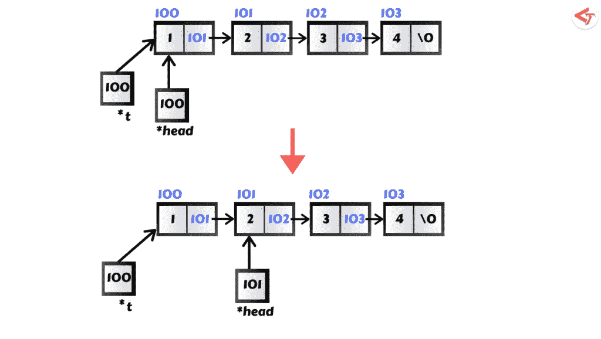****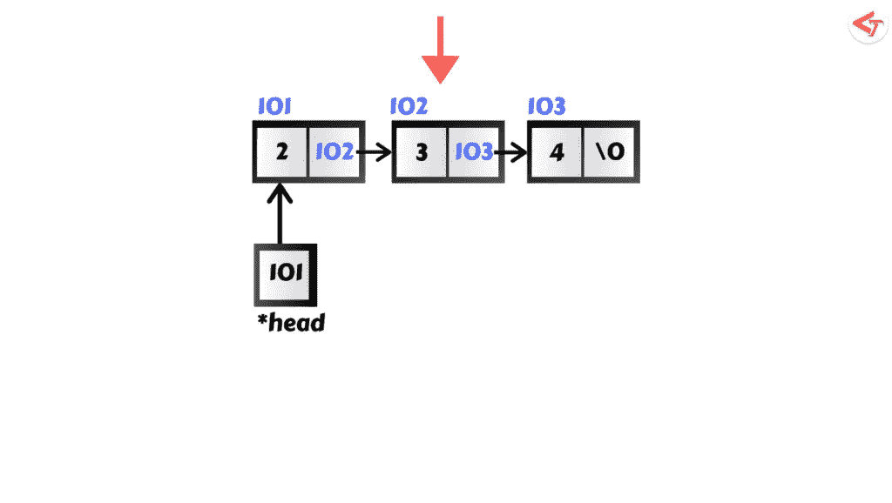**

**删除开头的节点**

****b .删除中间的节点****

**这里，我们必须确定要删除哪个节点。之后，创建一个新的指针，并使其指向头部指针所指向的位置。**

**假设我们想要删除一个数据部分的值为 3 的节点。然后，检查`t->next->data`是否为`3` 。如果数据部分的值为 3，那么创建另一个指针—比方说，`p`—**—**来保存值为 3 的节点的下一部分。之后，释放`t`指针当前指向的位置，然后将`p`指针的地址赋给`t->next`。**

**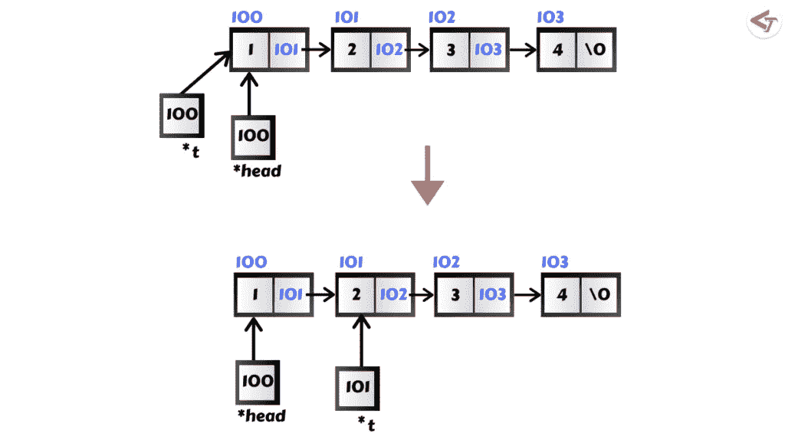****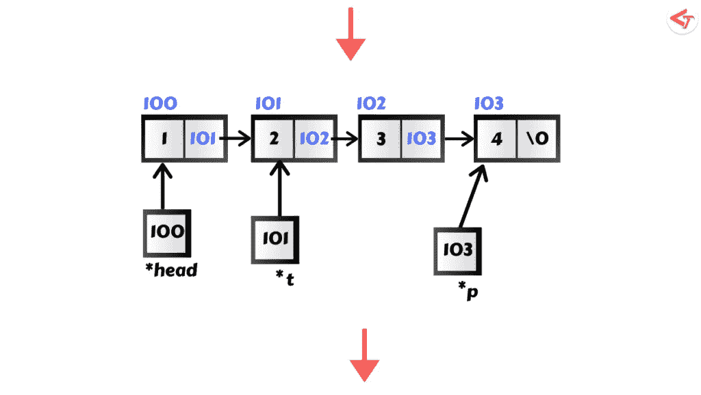****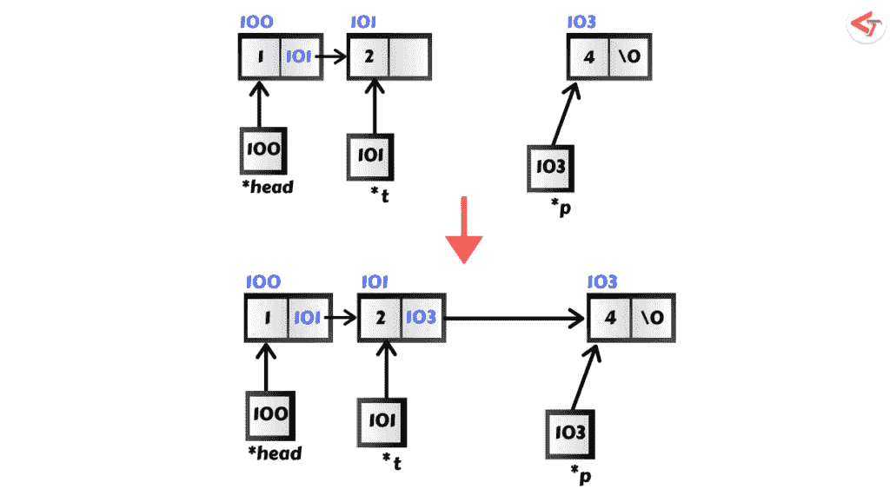**

**删除中间的节点**

****c .删除最后的节点****

**当我们删除最后一个节点时，我们必须后退两步，检查第二个元素是否为空。**

**下图解释了上面的代码:**

**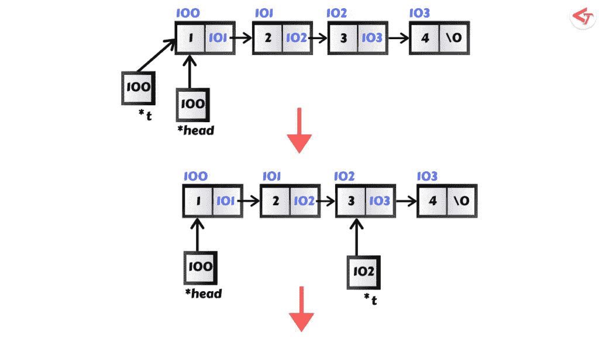****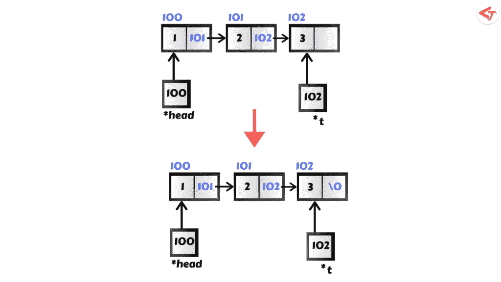**

**删除末尾的节点**

**在链表中搜索一个元素需要更长的时间 O(n) 因为在最坏的情况下，我们要遍历*n* 个元素。而在最好的情况下，我们可以在第一次尝试中找到元素，所以时间复杂度会是 O(1)。**

**在数组中搜索一个元素时，需要 O(1)次(考虑到数组是排序的)；否则，只需要 O(n)次。**

**更多此类博客请访问 [LionGuest 工作室](https://liongueststudios.com/)。**

**感谢阅读。**