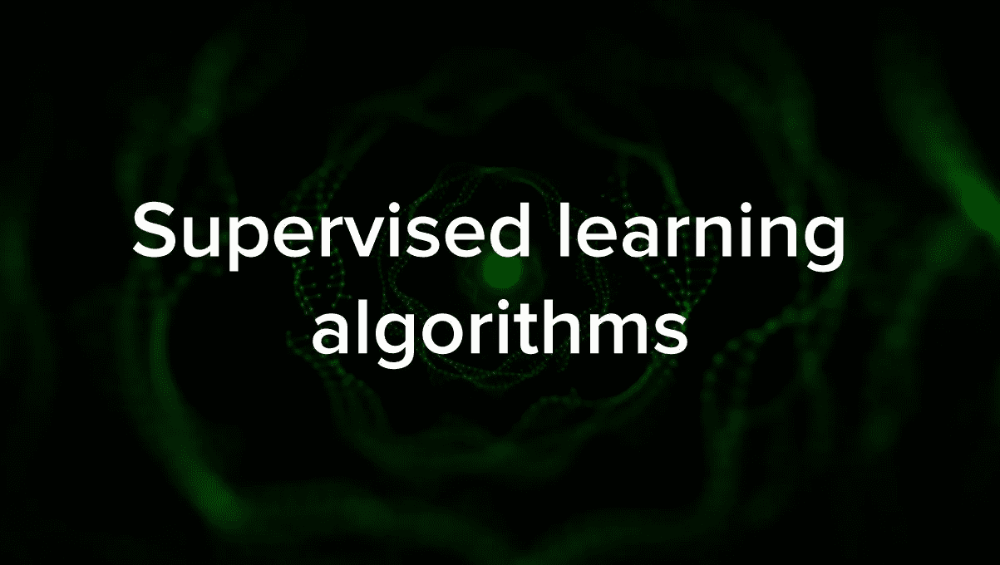
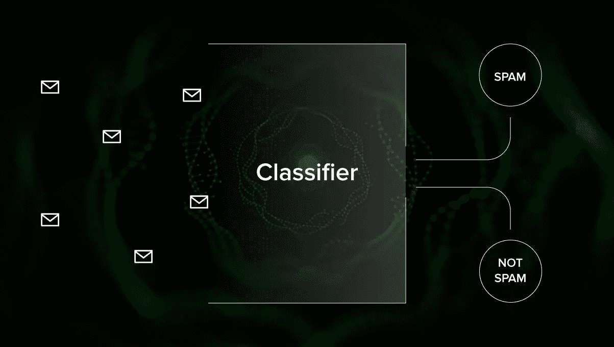
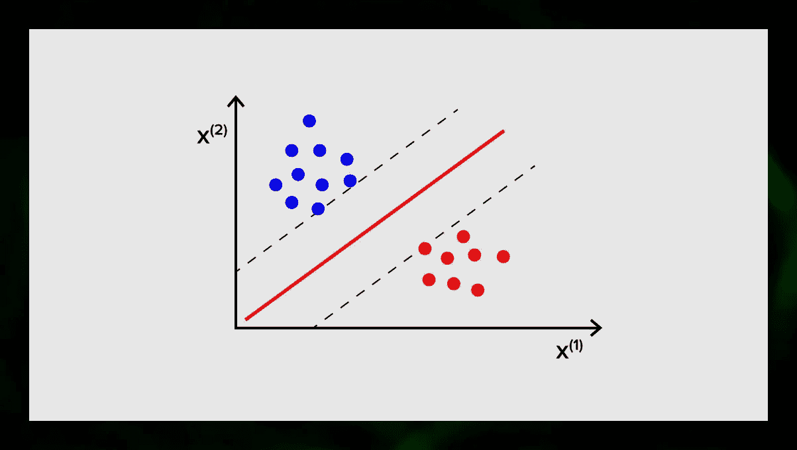
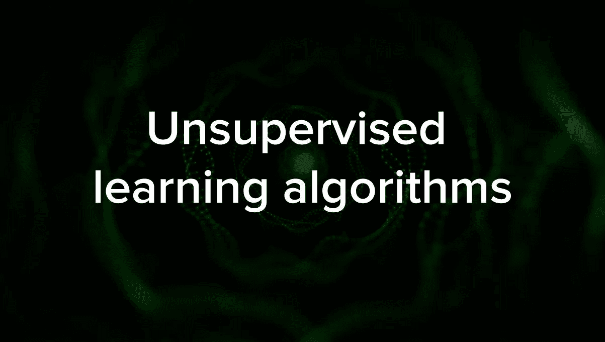
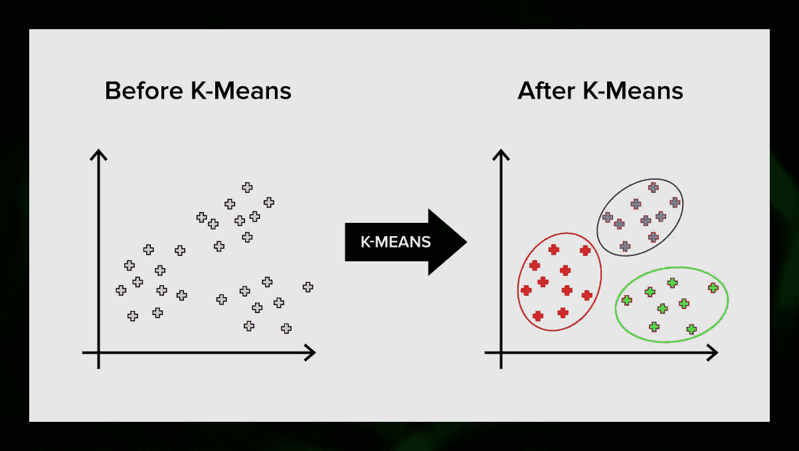
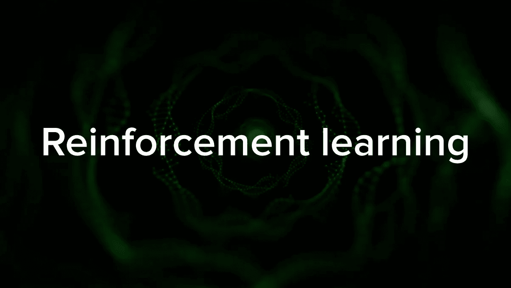
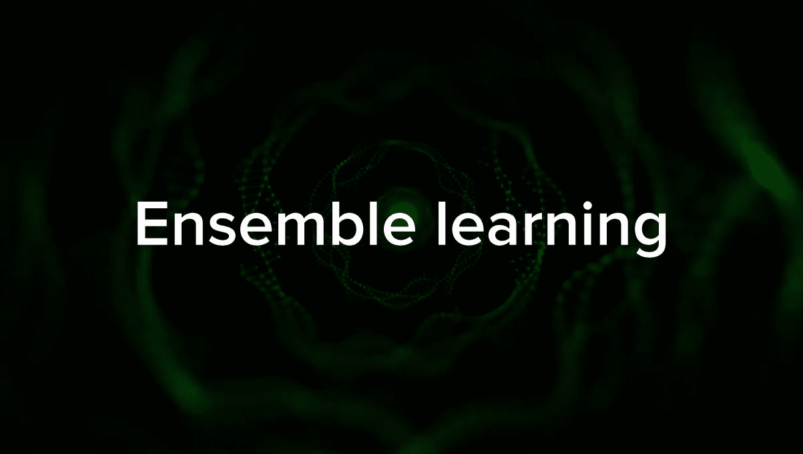
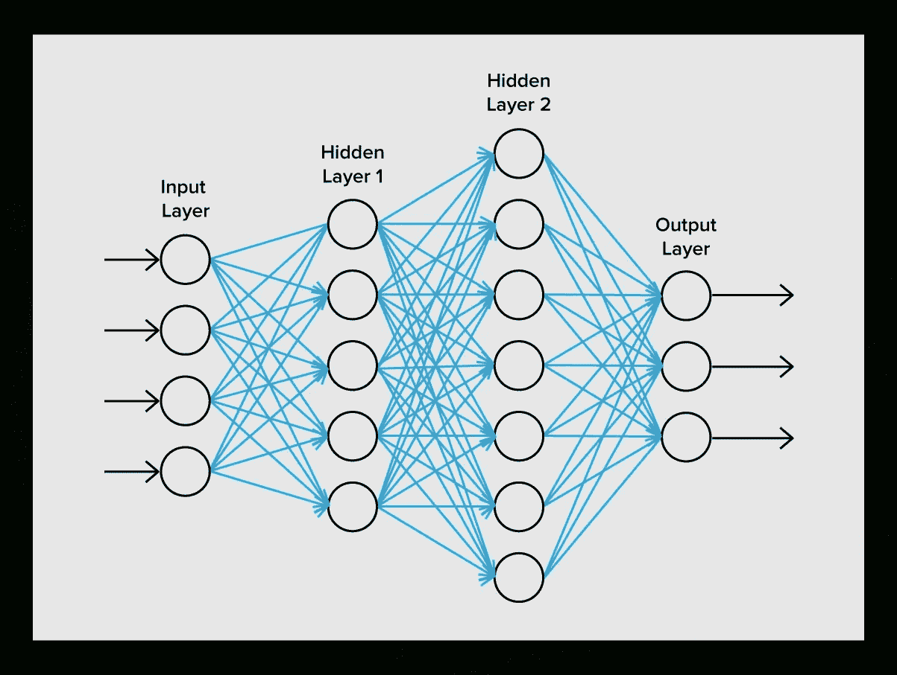
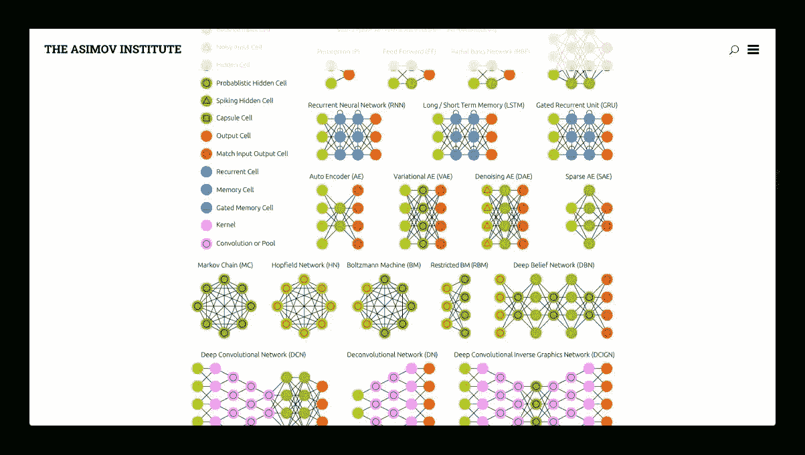

# 机器学习导论——初学者算法

> 原文：<https://betterprogramming.pub/introduction-to-machine-learning-algorithms-for-beginners-b2851739c11e>

## 了解最常见的机器学习算法、它们的用例以及对它们进行分组的方法

照片由 [Unsplash](https://unsplash.com/s/photos/machine-learning?utm_source=unsplash&utm_medium=referral&utm_content=creditCopyText) 上的 [h heyerlein](https://unsplash.com/@heyerlein?utm_source=unsplash&utm_medium=referral&utm_content=creditCopyText) 拍摄

在这篇文章中，我们将看看最广泛使用的机器学习算法。它们种类繁多，当你听到诸如*基于实例的学习算法*和*感知器*这样的术语时，很容易感到困惑。

通常，所有机器学习算法都根据它们的学习风格、功能或它们解决的问题进行分组。在这篇文章中，你会发现一个基于学习风格的分类。我还将提到这些算法帮助解决的常见任务。

今天使用的机器学习算法的数量很大，我不会百分之百地提到它们。然而，我想提供一个最常用的概述。

# 监督学习算法

图片来源:作者

如果你不熟悉诸如*监督学习*和*非监督学习*等术语，请查看我们的[人工智能与机器学习帖子](https://serokell.io/blog/ai-ml-dl-difference)，其中详细讨论了这个主题。现在，让我们熟悉一下算法。

## 1.分类算法

**朴素贝叶斯**

贝叶斯算法是基于应用贝叶斯定理在机器学习中使用的概率分类器家族。

朴素贝叶斯分类器是最早用于机器学习的算法之一。它适用于二元和多类分类，并允许根据历史结果进行预测和预测数据。一个经典的例子是垃圾邮件过滤系统，它使用朴素贝叶斯直到 2010 年，并显示出令人满意的结果。然而，当[贝叶斯中毒](https://en.wikipedia.org/wiki/Bayesian_poisoning)被发明出来后，程序员开始想其他方法过滤数据。

使用贝叶斯定理，可以判断一个事件[的发生如何影响另一个事件](https://www.youtube.com/watch?v=R13BD8qKeTg)的概率。

例如，该算法根据使用的典型单词来计算某封电子邮件是不是垃圾邮件的概率。常见的垃圾词语有*报价*、*现在下单*、*额外收入*。如果算法检测到这些单词，则该电子邮件很有可能是垃圾邮件。

[朴素贝叶斯](https://dataaspirant.com/2017/02/06/naive-bayes-classifier-machine-learning/#:~:text=Naive%20Bayes%20Classifier,belongs%20to%20a%20particular%20class.)假设特征是独立的。所以算法叫幼稚。

[朴素贝叶斯分类器——有趣且简单的机器学习](https://www.youtube.com/watch?reload=9&v=CPqOCI0ahss)

**多项式朴素贝叶斯**

除了朴素贝叶斯分类器，这一组中还有其他算法。例如，还有多项式朴素贝叶斯，它通常应用于基于文档中出现的某些单词的频率的文档分类。

贝叶斯算法仍然用于文本分类和欺诈检测。它们还可以应用于机器视觉(例如，人脸检测)、市场细分和生物信息学。

**逻辑回归**

尽管这个名字可能看起来违反直觉，[逻辑回归](https://en.wikipedia.org/wiki/Logistic_regression)实际上是一种分类算法。

逻辑回归是一种模型，它使用逻辑函数进行预测，找出输出和输入变量之间的依赖关系。 [Statquest](https://www.youtube.com/watch?v=yIYKR4sgzI8) 制作了一个很棒的视频，他们以肥胖小鼠为例解释了线性回归和逻辑回归之间的差异。

**决策树**

决策树是一种以树的形式可视化决策模型的简单方法。决策树的优势在于它们易于理解、解释和可视化。此外，它们不需要太多的数据准备工作。

然而，它们也有一个很大的缺点。即使是数据中最小的变化(方差),树也可能是不稳定的。也有可能创建过于复杂的树，不能很好地概括。这叫做[过拟合](https://en.wikipedia.org/wiki/Overfitting)。打包、助推和正规化有助于解决这个问题。我们将在文章的后面讨论它们。

每个决策树的元素是:

*   询问主问题的根节点。它有向下的箭头，但没有指向它的箭头。例如，想象你正在建造一棵树来决定你晚餐应该吃哪种面食。
*   树枝。树的一部分被称为分支，有时被称为子树。
*   决策节点。这些是根节点的子节点，也可以拆分成更多的节点。你的决策节点可以是“carbonara？”或者“配蘑菇？”
*   叶或终端节点。这些节点不会分裂。它们代表最终的决定或预测。

还有，提一提分裂也很重要。这是将一个节点划分为子节点的过程。例如，如果你不是素食主义者，carbonara 是可以的。但是如果你是，吃蘑菇通心粉。还有一个节点移除的过程叫做[剪枝](https://en.wikipedia.org/wiki/Decision_tree_pruning)。

决策树算法被称为 CART(分类和回归树)。决策树可以处理分类数据或数字数据。

*   当变量有数值时，使用回归树。
*   当数据是分类的(类)时，可以应用分类树。

决策树理解和使用起来非常直观。这就是为什么树形图被广泛应用于各种行业和学科的原因。 [GreyAtom](https://medium.com/greyatom/decision-trees-a-simple-way-to-visualize-a-decision-dc506a403aeb) 提供了不同类型决策树及其实际应用的广泛概述。

[StatQuest 决策树](https://www.youtube.com/watch?v=7VeUPuFGJHk&vl=en)

**SVM(支持向量机)**

支持向量机是另一组用于分类的算法，有时也用于回归任务。SVM 是伟大的，因为它用最小的计算能力给出了相当准确的结果。

SVM 的目标是在 N 维空间中找到一个超平面(其中 N 对应于特征的数量),该超平面对数据点进行清晰的分类。结果的准确性与我们选择的超平面直接相关。我们应该找到两类数据点之间距离最大的平面。

这个超平面用图形表示为一条将一个类与另一个类分开的线。落在超平面不同侧的数据点属于不同的类别。

图片来源:作者

注意，超平面的维数取决于特征的数量。如果输入特征的数量是 2，那么超平面只是一条线。如果输入特征的数量是三，则超平面变成二维平面。当特征的数量超过三个时，就很难在图上画出一个模型。因此，在这种情况下，您将使用[内核类型](https://simple.wikipedia.org/wiki/Kernel_(computer_science))将其转换到三维空间。

这为什么叫支持向量机？支持向量是最接近超平面的数据点。它们直接影响超平面的位置和方向，并允许我们最大化分类器的余量。删除支持向量将改变超平面的位置。这些是帮助我们建设 SVM 的要点。

支持向量机现在被积极地用于医学诊断以发现异常，用于空气质量控制系统，用于股票市场的金融分析和预测，以及用于工业中的机器故障控制。

## 2.回归算法

回归算法在分析中非常有用，例如，当您试图预测特定时间特定产品的证券或销售成本时。

**线性回归**

线性回归试图通过将线性方程拟合到观察到的数据来模拟变量之间的关系。

有解释变量和因变量。因变量是我们想要解释或预测的东西。解释性的，就像它的名字一样，解释一些事情。如果你想建立线性回归，你假设因变量和自变量之间存在线性关系。例如，一所房子的平方米数和它的价格或该地区的人口密度和烤肉店之间存在相关性。

一旦你做了这样的假设，你接下来需要找出具体的线性关系。你需要为一组数据找到一个[线性回归方程](https://www.statisticshowto.com/probability-and-statistics/regression-analysis/find-a-linear-regression-equation/)。最后一步是计算残差。

**注:**回归画直线的时候叫线性，曲线的时候叫多项式。

# 无监督学习算法

现在让我们来谈谈能够在未标记数据中发现隐藏模式的算法。

## 1.使聚集

聚类意味着我们根据输入彼此的相似程度将它们分成不同的组。聚类通常是构建更复杂算法的步骤之一。更简单的方法是分别研究每个群体，并根据他们的特征建立一个模型，而不是一次研究所有的东西。营销和销售中也经常使用同样的技巧，将所有潜在客户分组。

非常常见的聚类算法有 k 均值聚类和 k 近邻。

**K-均值聚类**

[K 均值聚类](https://towardsdatascience.com/understanding-k-means-clustering-in-machine-learning-6a6e67336aa1)将向量空间的元素集划分为预定义数量的 K 个聚类。然而，不正确的聚类数量将使整个过程无效，因此尝试不同数量的聚类非常重要。k-means 算法的主要思想是将数据随机分成聚类，之后，对上一步得到的每个聚类的中心进行迭代重新计算。然后向量再次被分成簇。当在迭代后的某个点上聚类没有变化时，该算法停止。

这种方法可以应用于解决当聚类是不同的或者可以容易地彼此分离而没有重叠数据时的问题。

**K-最近邻**

kNN 代表 k-最近邻。这是回归任务中有时使用的最简单的分类算法之一。

要训练分类器，必须有一组带有预定义类的数据。标记由研究领域的专家手工完成。使用这种算法，可以处理多个类或清除输入属于多个类的情况。

该方法基于相似标签对应于属性向量空间中的接近对象的假设。

现代软件系统使用 kNN 进行视觉模式识别，例如，在结账时扫描并检测购物车底部的隐藏包裹(例如， [AmazonGo](https://www.amazon.com/b?ie=UTF8&node=16008589011) )。k-最近邻在银行业中也用于检测信用卡使用模式。kNN 算法分析所有的数据，并发现指示可疑活动的异常模式。

## 2.降维

主成分分析(PCA)是为了有效地解决 ML 相关问题而需要理解的重要技术。

想象你有很多变量要考虑。例如，您需要将城市分为三组:适合居住、不适合居住和一般。你要考虑多少变量？可能很多。你了解它们之间的关系吗？不完全是。那么，你怎么能把你收集到的所有变量集中在其中最重要的几个上呢？

用专业术语来说，你想要“减少你的特征空间的维数”通过减少特征空间的维度，您可以减少要考虑的变量之间的关系，并且不太可能过度拟合您的模型。

有许多方法可以实现降维，但这些技术大多属于以下两类之一:

*   特征消除
*   特征抽出

特征消除意味着通过消除一些特征来减少特征的数量。这种方法的优点是简单并且保持了变量的可解释性。但是，作为一个缺点，你从你决定放弃的变量中得不到任何信息。

[特征提取](https://en.wikipedia.org/wiki/Feature_extraction)避免了这个问题。应用此方法的目标是从给定的数据集中提取一组要素。要素提取旨在通过基于现有要素创建新要素(然后丢弃原始要素)来减少数据集中的要素数量。新的缩减特征集必须以能够概括包含在原始特征集中的大部分信息的方式来创建。

主成分分析是一种特征提取算法。它以特定的方式组合输入变量，然后有可能丢弃最不重要的变量，同时仍然保留所有变量中最有价值的部分。

PCA 的一个可能用途是当数据集中的图像太大时。简化的特征表示有助于快速处理图像匹配和检索等任务。

[StatQuest: PCA 主思路仅 5 分钟](https://www.youtube.com/watch?v=HMOI_lkzW08)

## 3.关联规则学习

[Apriori](https://en.wikipedia.org/wiki/Apriori_algorithm) 是最流行的关联规则搜索算法之一。它能够在相对较短的时间内处理大量数据。

事情是，今天许多项目的数据库非常大，达到千兆字节和兆兆字节。而且还会继续增长。因此，需要一种有效的、可扩展的算法来在短时间内找到关联规则。Apriori 就是这些算法中的一种。

为了能够应用该算法，有必要准备数据，将其全部转换为二进制形式并改变其数据结构。

通常，在包含大量事务的数据库上运行此算法，例如，在包含客户在超市购买的所有商品的信息的数据库上。

# 强化学习

强化学习是机器学习的方法之一，有助于教会机器如何与特定环境进行交互。在这种情况下，环境(例如，在视频游戏中)充当老师。它为计算机做出的决定提供反馈。基于这个奖励，机器学习采取最佳的行动。它提醒了孩子们学习不要触摸热煎锅的方式——通过尝试和感受疼痛。

分解这个过程，它包括以下简单的步骤:

*   计算机观察环境
*   选择一些策略
*   根据这个策略行动
*   接受奖励或惩罚
*   从这一经验中学习并完善战略
*   重复直到找到最佳策略

[AI 学会停车](https://www.youtube.com/watch?v=VMp6pq6_QjI)

## q 学习

有几种算法可以用于强化学习。其中最常见的是 Q-learning。

Q-learning 是一种[无模型强化学习算法](https://en.wikipedia.org/wiki/Model-free_(reinforcement_learning))。q-学习是基于从环境中获得的报酬。主体形成效用函数 Q，该效用函数 Q 随后给予主体选择行为策略的机会，并考虑先前与环境交互的经验。

Q-learning 的一个优点是，它能够在不形成环境模型的情况下比较可用行动的预期有用性。

# 集成学习

集成学习是通过建立多个 ML 模型并组合它们来解决问题的方法。集成学习主要用于提高分类、预测和函数逼近模型的性能。集成学习的其他应用包括检查模型做出的决策、选择用于构建模型的最佳特征、增量学习和非平稳学习。

下面是一些比较常见的集成学习算法。

## 制袋材料

Bagging 代表引导聚集。它是最早的集成算法之一，具有令人惊讶的良好性能。为了保证分类器的多样性，可以使用训练数据的自举副本。这意味着不同的训练数据子集是从训练数据集中随机抽取的，并进行替换。每个训练数据子集用于训练同一类型的不同分类器。然后，可以组合单个分类器。为此，你需要对他们的决定进行简单多数投票。由大多数分类器分配的类别是集成决策。

## 助推

这组集成算法类似于 bagging。 [Boosting](http://www.scholarpedia.org/article/Ensemble_learning#Boosting) 同样使用多种分类器对数据进行重采样，然后通过多数投票选择最优版本。在 boosting 中，您迭代地训练弱分类器，以将它们组合成强分类器。当分类器被添加时，它们通常被归属于一些权重，这些权重描述了它们的预测的准确性。在将弱分类器添加到集成之后，重新计算权重。错误分类的输入会增加更多权重，而正确分类的实例会减少权重。因此，该系统更关注获得错误分类的例子。

## 随机森林

[随机森林](https://en.wikipedia.org/wiki/Random_forest#:~:text=Random%20forests%20or%20random%20decision,prediction%20(regression)%20of%20the%20individual)或随机决策森林是一种用于分类、回归和其他任务的集成学习方法。要构建随机森林，您需要根据训练数据的随机样本训练大量决策树。随机森林的输出是单棵树中最常见的结果。由于算法的随机性，随机决策森林成功地对抗过拟合。

## 堆垛

[堆叠](https://www.geeksforgeeks.org/stacking-in-machine-learning/)是一种集成学习技术，通过元分类器或元回归器将多个分类或回归模型结合起来。基于完整的训练集训练基础级模型，然后在基础级模型的输出上训练元模型作为特征。

# 神经网络

神经网络是由突触连接的神经元序列，这让人想起了人脑的结构。然而，人类的大脑更加复杂。

神经网络的伟大之处在于，从垃圾邮件过滤到计算机视觉，它们基本上可以用于任何任务。然而，它们通常应用于机器翻译、异常检测和风险管理、语音识别和语言生成、人脸识别等等。

神经网络由神经元或节点组成。这些神经元中的每一个都接收数据，处理数据，然后将数据传输到另一个神经元。

图片来源:作者

每个神经元都以同样的方式处理信号。但是我们如何得到不同的结果呢？连接神经元的突触负责这一点。每个神经元能够有许多突触来减弱或放大信号。此外，神经元能够随着时间的推移改变它们的特征。通过选择正确的突触参数，我们将能够在输出端获得输入信息转换的正确结果。

但是什么是神经网络呢？深度学习第一章

有许多不同类型的神经网络:

*   前馈神经网络(FF 或 FFNN)和感知器非常简单。网络中没有环路或循环。在实践中，这种网络很少使用，但它们经常与其他类型的网络相结合以获得新的网络。
*   Hopfield 网络(HN)是具有对称链接矩阵的全连接神经网络。这种网络通常被称为联想记忆网络。就像一个人看到桌子的一半，可以想象另一半，这个网络，接收到一个嘈杂的桌子，恢复到完整。
*   卷积神经网络(CNN)和深度卷积神经网络(DCNN)与其他类型的网络非常不同。它们通常用于图像处理、音频或视频相关的任务。应用 CNN 的典型方法是对图像进行分类。

观察许多不同类型的神经网络是很有趣的。在 [NN 动物园](https://www.asimovinstitute.org/neural-network-zoo/)可以做到这一点。

图片来源:阿西莫夫研究所

# 结论

这篇文章是对不同的 ML 算法的一个广泛的概述，但是仍然有很多要说的。