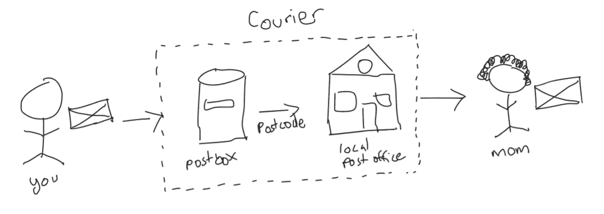
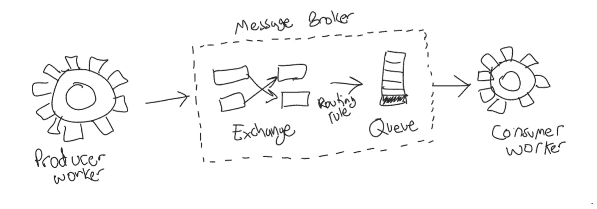
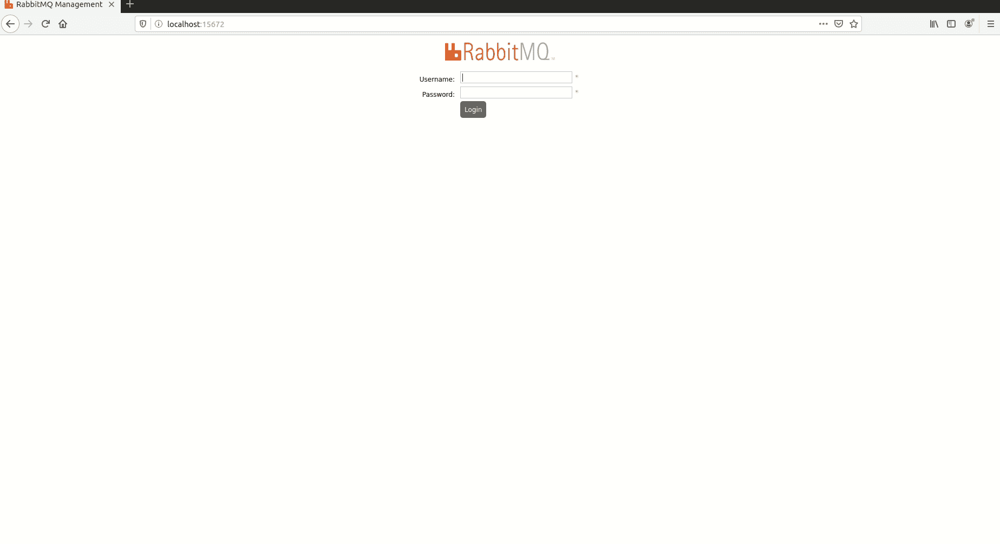
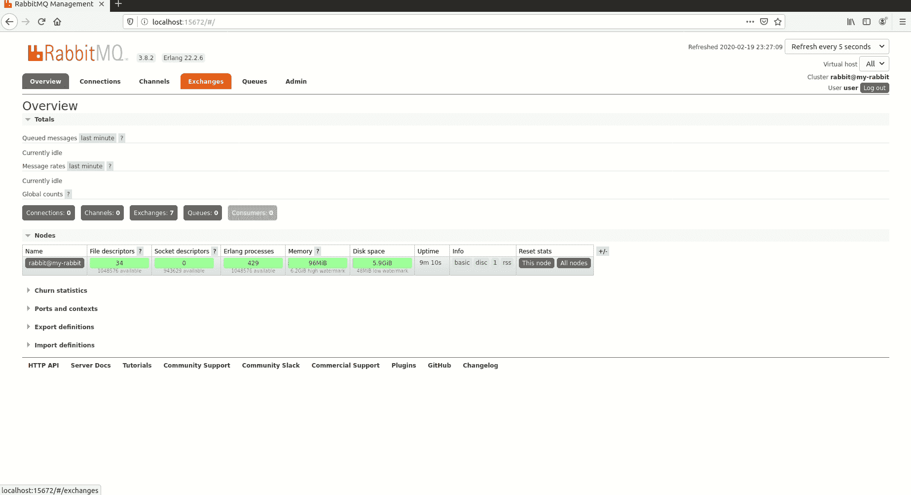
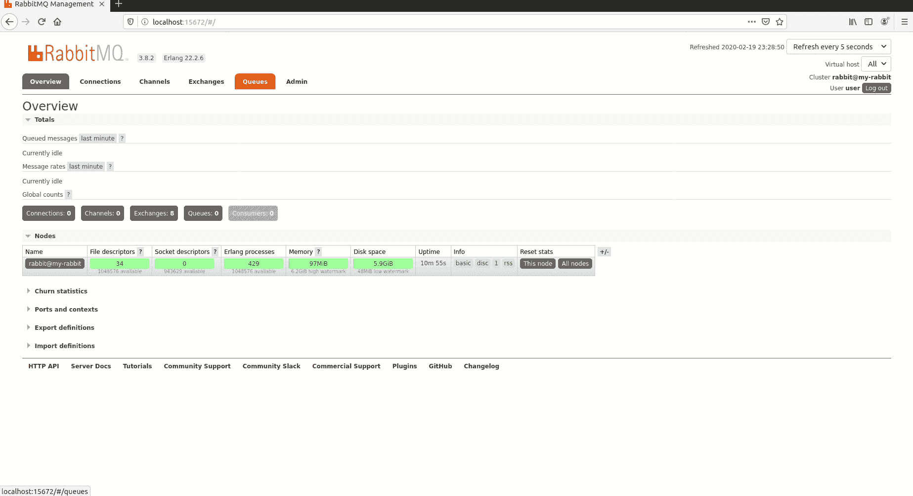
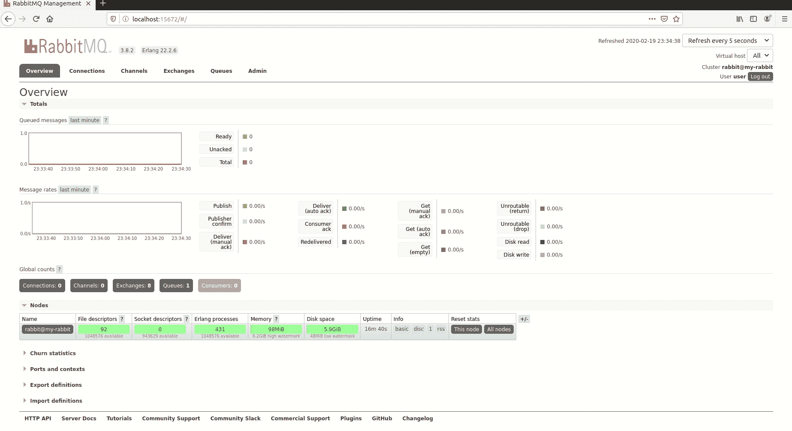
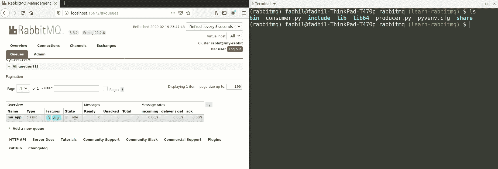
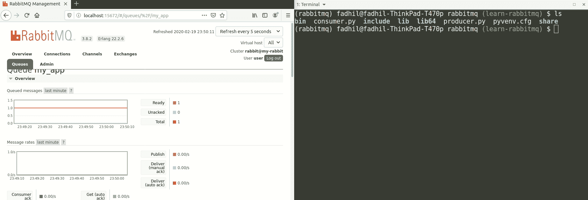

# RabbitMQ 和 Python 消息队列简介

> 原文：<https://betterprogramming.pub/introduction-to-message-queue-with-rabbitmq-python-639e397cb668>

## 编写您的第一个事件驱动工人

这篇文章最初发表在我的个人博客上。


由[哈尔·盖特伍德](https://unsplash.com/@halgatewood?utm_source=medium&utm_medium=referral)在 [Unsplash](https://unsplash.com?utm_source=medium&utm_medium=referral) 上拍摄。

# 首先，什么是消息队列？

消息队列(MQ)是编程和软件开发中的一个基本概念。在分布式系统中，消息队列是系统的主干。消息队列允许系统中服务/应用程序之间的进程间通信(例如，服务 A 可以与服务 B 对话)。

在 MQ 术语中，发出消息的服务被称为*生产者* 工作者，而监听消息并对消息做出反应的服务被称为*消费者* 工作者。这就是服务之间的通信方式。

您可以根据生产者和消费者的工作量来增加或减少他们的数量。例如，您可能有两个生产者在两个虚拟机上运行，十个消费者在 10 个虚拟机上运行 CPU 密集型任务。您还可以在白天增加工作线程的数量，在晚上关闭工作线程(前提是您的应用程序流量是昼夜模式)。

# 想象一个没有消息队列的世界

如果没有消息队列，您的系统将同步运行。尽管同步编程很容易实现，但对于最终用户体验来说并不方便。让我们举一个注册在线服务的例子。一旦你完成填写你的详细资料，并按下“注册”按钮，系统将向你发送一封电子邮件，并为你创建一个数据库行。假设你输入了一个错误的，无法到达的电子邮件地址。系统将在大约十秒钟后重试向您发送激活电子邮件。作为新用户，在你被重定向到下一页之前，你必须等待至少十秒钟，让系统完成发送电子邮件的尝试。这不是很糟糕的用户体验吗？等待对于一个 web 应用来说是非常重要的！

这里的理想场景是:你按下“注册”按钮，你被重定向到主页，你等待激活邮件到达你的收件箱。在这种情况下，您不必等待系统成功向您发送电子邮件。这是因为有一个邮件工作者正在使用 MQ 消息，等待向您发送电子邮件。作为新用户，在被重定向到下一个页面之前，您不必等待很长时间(10 秒是一段很长的时间)。大家都很开心。

# 用类比理解消息队列

当我第一次处理消息队列并且不知道它们是什么的时候，我的前团队经理 [Sian Lerk](https://www.linkedin.com/in/sianlerk/) 用这个绝妙的类比向我解释了这个概念。想象一下，你正在通过当地的邮政服务给你的母亲寄一封信。你要这么做:

1.  写这封信。
2.  去最近的邮箱把信寄出去。
3.  邮局人员将根据邮政编码对信件进行分类。
4.  邮递员会把信送给你妈妈。
5.  邮局证实这封信已成功投递。



看起来很自然，对吧？现在让我们看看消息队列(特别是 RabbitMQ)是如何工作的:

1.  发布者工作人员构造消息(通常以 JSON 格式)。
2.  发布者工作器将消息发布到 MQ 交换。
3.  MQ broker 将根据预定义的路由规则将消息路由到指定的队列。
4.  该消息由消费者工作者消费和处理。
5.  消费者通过消息队列确认消息已成功传递。



通常，生产者工作人员会向消息代理发布一条 JSON 消息，如下所示:

```
{"action": "delete_user", "userId": "john_doe"}
```

消费者将使用该消息并执行如下操作:

*   删除数据库中的用户数据
*   从 S3 对象存储中删除他们的资产
*   向用户发送告别电子邮件
*   多得多…

# RabbitMQ 简介

RabbitMQ 是由 Pivotal Software 开发的一个开源消息代理，它提供了我们在上一节中看到的内容。它使用 AMQP 进行服务间的通信。你可以在维基百科上阅读更多关于 RabbitMQ [的内容。](https://en.wikipedia.org/wiki/RabbitMQ)

市场上有许多 RabbitMQ 的替代品。开源解决方案包括 ActiveMQ、ZeroMQ、Redis、NATS 和 KubeMQ。还有由主要云提供商提供的托管消息队列解决方案:托管 AWS MQ 服务以及专有队列解决方案，如 AWS SQS 和 GCP 发布/订阅。

## 这个什么时候有用？

消息队列的好处如下:

*   **消息可以按正确的顺序传递。**这对于一个实体的状态改变来说是很棒的。例如，用户错误地将他的生日列为 7 月 17 日。然后同一个用户更新他的生日为 7 月 18 日。如果消息没有以正确的顺序到达，您的应用程序可能会认为最终值是 7 月 17 日，而不是 7 月 18 日。这对一致性非常重要。
*   **如果消费者此刻不在，数据可以被持久化。这一点很重要，这样您就不会在停机期间丢失任何数据和状态变化。假设您的消费者工作人员有停机时间，并且消息没有被消费。RabbitMQ 服务器将保留该消息，直到它被使用或达到其最大队列长度。**
*   **系统分布式**。您的系统没有单点故障(SPOF ),并且能够根据其负载进行伸缩。然而，保持 RabbitMQ 服务器的健康是非常重要的。否则，您可能会丢失数据和状态更改。

## 等等，阿帕奇卡夫卡呢？

相比 RabbitMQ，我个人对 Apache Kafka 的体验很少。据我所知，卡夫卡和 RabbitMQ 最显著的区别是:

*   RabbitMQ 中的消息可以基于路由规则进行路由，而 Kafka 中的生产者和消费者可以发布和订阅主题。卡夫卡中没有消息路由的概念。
*   RabbitMQ 中的消息保证以有序的顺序传递，而 Kafka 中的消息不能保证以有序的顺序传递——特别是因为它的数据分区。
*   RabbitMQ 是一个基于推的代理，RabbitMQ 服务器将消息推送给它的消费者。另一方面，Kafka 是一个基于拉的工人，消费者总是从服务器拉新消息。

更多信息，请参考 Eran Stiller 写的这篇优秀的文章。

然而，卡夫卡和 RabbitMQ 都是为了解决不同的问题而构建的。您应该能够区分哪一个最适合您的用例。明智地选择。

# 在 Docker 中设置 RabbitMQ

Docker 是让你接触新软件的最快方式。下面是让 RabbitMQ 3 运行管理 UI 并暴露端口 5672 和 15672 的命令:

```
$ docker run -d --hostname my-rabbit -p 15672:15672 -p 5672:5672 --name rabbit-server -e RABBITMQ_DEFAULT_USER=user -e RABBITMQ_DEFAULT_PASS=password rabbitmq:3-management
```

现在在浏览器中打开`localhost:15672`。用户名是`user`，密码是`password`。



## 创建交换和队列

让我们创建一个交换:

*   名称:`my_exchange`
*   类型:默认



接下来，让我们创建一个队列和队列绑定:

*   姓名:`my_app`
*   类型:经典
*   绑定:From: `my_exchange`，路由键:`test`



让我们检查一下我们的交换和队列是否真的在工作。我们将向 exchange 发布一条消息，并检查队列中是否有该消息。



# 构建 Python 生产者工人

## 步骤 1:创建一个 Python 虚拟环境

每次开始一个新项目时，总是建议创建一个新的 Python 环境。在本教程中，我一直使用 Python 3.7.3。

```
# Create our working directory
$ mkdir rabbitmq-python
$ cd rabbitmq-python# Create a virtual environment
$ python3 -m venv .# Activate virtual environment
$ source bin/activate# Install python-pika package
$ pip install pika
```

## 第二步:实际代码

将下面的代码作为`producer.py`保存在您的目录中。

代码的第六行显示了如何建立到 RabbitMQ 服务器的连接。我在这里使用了一个`BlockingConnection`适配器，它建立了到 RabbitMQ 服务器的同步连接。您可以使用一个`SelectConnection`适配器作为异步连接，但是您需要小心处理 Python 中出现的异步问题(我说的是 [GIL](https://realpython.com/python-gil/) )。在 GitHub 上阅读更多关于适配器[的信息。](https://github.com/pika/pika#pika-provides-the-following-adapters)

第九行代码展示了如何使用`'Test!'`的`test`路由键和消息体向`my_exchange` RabbitMQ 交换发布消息。

## 步骤 3:测试您的 Python 脚本

运行脚本并观察队列。



## 敞开心扉的话语

这段代码很好地演示了如何将消息发布到 RabbitMQ 交换中。实际上，您可以将 Flask 用作应用程序的 API 服务器，并在它接收到 HTTP 请求时发布消息。现实就是这样。

# 构建 Python 消费者工作器

现在我们让我们的生产者工人。该消息将一直保留在队列中，直到一个消费者工作者使用了该队列。这是我们的 Python 代码的样子:

在第 8 行，我定义了回调函数，每当消费者从 RabbitMQ 队列接收到新的 MQ 消息时，都会调用这个函数。这是你写消费者应该做什么操作的地方。在本教程中，消费者工作者只是打印出它收到的消息。但实际上，工人应该在这里做所有的大量操作(例如，调整图像大小、发送注册电子邮件、执行 AI/ML 操作、编码视频、启动 EC2 实例等。).这完全取决于你的想象力。

我设置了`auto_ack=True`，这意味着一旦消息被消费，它将立即确认该消息。或者，您可以在程序执行完与所使用的消息相关的流程后，手动确认该消息。一旦消息被确认，RabbitMQ 服务器将使消息出列并删除它。

## 让我们测试脚本

再次运行脚本，观察队列被消耗的情况。



# 干得好！


恭喜你，你已经使用 RabbitMQ 构建了一个分布式系统。我希望这篇教程能让你大开眼界，有所启发。我相信，把这个 MQ 概念和你现有的技能结合起来，你可以做更多的事情。

## 下一步是什么？

如果您希望了解更多关于消息队列和 RabbitMQ 的知识，我建议尝试不同类型的交换和队列、身份验证、以异步方式运行 MQ 生产者和消费者工作者等。

# 警告:消息队列警告

老实说，消息队列不是一个容易操作和维护的系统。尤其是在集群和故障转移方面，它们需要系统管理员的大量关注。如果你正在从事一个单独的项目或一个开发团队，我个人建议使用由主要云提供商提供的托管服务来减轻痛苦，直到你足够大(在团队规模和容量规模上)能够在内部处理它们。