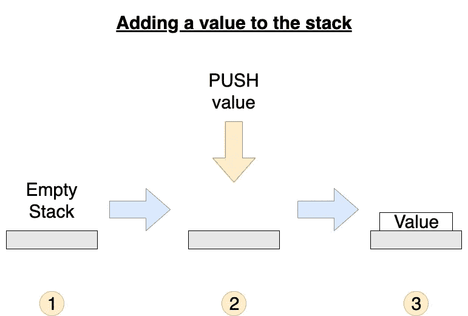
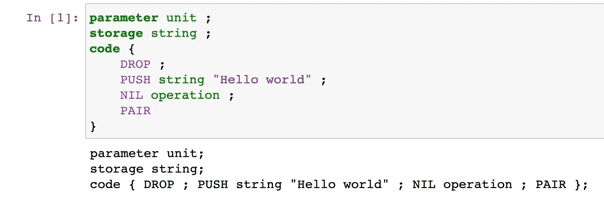
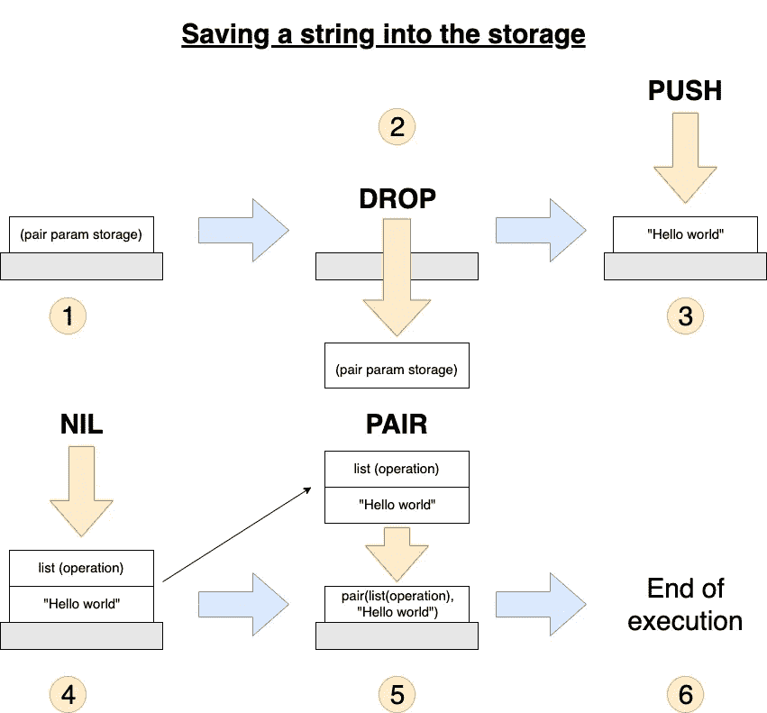
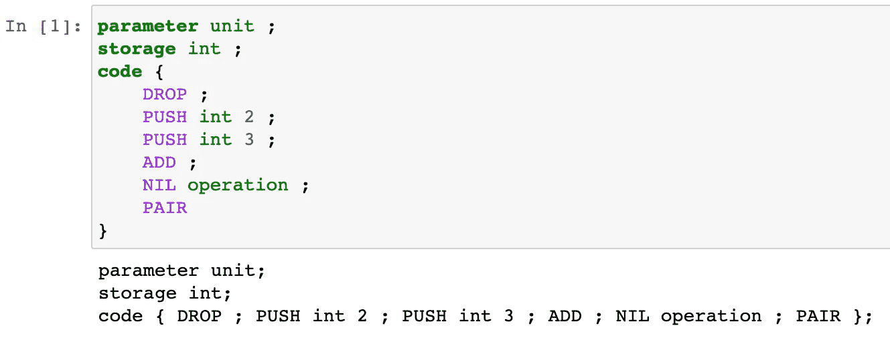
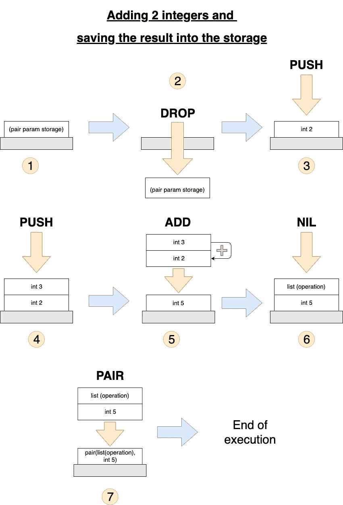

# Michelson 简介:Tezos 的脚本语言(第 1 部分)

> 原文：<https://betterprogramming.pub/introduction-to-michelson-the-language-of-tezos-part-1-374c03394cc3>

## 了解如何使用 Michelson 编程语言并在 Tezos 上编写智能合同


[来源:Pixabay](https://pixabay.com/illustrations/matrix-code-data-networking-1735640/)

迈克尔逊一定是目前智能合约最令人兴奋的编程语言之一。这是一种基于堆栈的、严格类型化的语言，用它来编写智能合约以确保 Tezos 区块链的安全。迈克尔逊类似于以太坊智能合约的字节码，但它更可读、更安全、更健壮。你可以用来为 Tezos 编写智能合同的所有高级语言——如 SmartPy、Ligo 或 Lorentz——最终都会编译成 Michelson。

在第一篇文章中，我们将尝试迈克尔逊语言，理解“基于堆栈”的含义，并编写一些非常简单的智能契约。这篇文章主要是为编程和/或 Tezos 开发的初学者写的，但是想要了解更多关于 Michelson 的中级程序员也可以在这里找到有用的信息。我们要用烤坏开发的 [Jupyter 内核在 Jupyter 笔记本上写迈克尔逊代码。如果您想查看工作中的代码，可以在每个部分找到一个链接。](https://github.com/baking-bad/michelson-kernel)

我们写点代码吧！

# 堆栈

为了理解迈克尔逊是如何工作的，需要正确理解的一个主要概念是*栈*。每一份迈克尔逊合同都是一系列相互关联的指令。这些指令有精确的顺序，并按照它们被写入的顺序执行。

每条指令都会以某种方式操纵堆栈。把它想象成一堆数据。您编写的指令将对堆中的数据产生影响。例如，您可以将两个数据放在一起，移除上面的一个数据，将另一个数据放在上面，转移一些令牌，等等。栈的工作基于*后进先出*的原则:如果你想访问一个不在栈顶的数据，你必须首先处理它上面的数据。

用迈克尔逊编码时，你必须记住三个主要概念:

*   新数据放在栈顶。
*   只有当堆栈中的数据位于堆栈顶部时(或者对于某些操作而言位于第二个位置，如下所述)，它们才变得可访问。
*   数据处理的顺序是从堆栈的顶部到底部。

让我们看一个例子。

# 推送操作

如果要在栈顶添加一段数据，就要调用 PUSH 操作。它是这样工作的:



请注意，堆栈中可能已经有数据，在这种情况下，新值将放在它们的顶部。这是你在迈克尔逊推新数据的方式:

```
PUSH value-type value
```

比如要推一个整数就写`PUSH int 2`，对于一个字符串就写`PUSH string "Tezos"`。

# 迈克尔逊智能合同结构

迈克尔逊的智能合约展示了一个由三个部分组成的简单结构:

*   预期参数的类型。
*   存储的类型。
*   迈克尔逊密码。

这转化为以下代码:

```
**parameter** *parameter-type* ;
**storage** *storage-type* ;
**code** {
  ...
}
```

除了这种结构之外，在 Michelson 中编写智能合同时，您还必须记住两条规则:

*   当代码被执行时，包含参数和存储`(pair parameter storage)`的一对总是被自动推入堆栈。记住——如果没有参数，就用`Unit`来代替。
*   代码必须总是返回一个包含操作列表和(更新的)存储`(pair list(operation) storage)`的对。当这种类型的对是堆栈中最后剩下的东西时，执行将停止。

# 一份简单的迈克尔逊智能合同

现在我们已经知道了 Michelson 中的推送和智能合约的结构，让我们编写一个吧！

对于此契约，我们将编写一个“Hello world”契约，并将一个字符串保存到存储中:



[Michelson tutorial-demo 1 . ipynb](https://mybinder.org/v2/gh/claudebarde/michelson-kernel/binder)

下面是执行这段代码时发生的情况:



*   `parameter unit`表示传递的参数类型为`unit`(基本上没有参数)。
*   `storage string`表示合同有类型为`string`的存储。
*   `DROP`是移除栈顶所有东西的操作码。请记住，我们之前说过，带参数和存储的对在开始时会自动包含在堆栈的顶部，我们不会使用它，我们可以直接删除它。
*   `PUSH`将一个值放在栈顶，这里是字符串“Hello world”。
*   `NIL`是一个操作码，在栈顶添加一个指定类型的空列表(这里是`operation`)。
*   `PAIR`获取堆栈顶部的两个元素，创建一个包含这两个元素的新对，并将该对推回堆栈。

注意:每条指令都以分号结束(尽管最后一条指令是可选的)。

# 添加整数并保存结果

下面介绍一个新的操作:`ADD`。你可能已经猜到了它的作用——将两个数值相加。

这里有一个简单的合同来演示它是如何工作的:



[Michelson tutorial-demo 2 . ipynb](https://mybinder.org/v2/gh/claudebarde/michelson-kernel/binder)

让我们仔细检查每个操作，以了解堆栈内部发生了什么:



*   `parameter unit` —同样，我们没有使用任何参数，所以我们传递一个`unit`。
*   `storage int` —这一次，我们将整型值保存到存储器中。
*   `DROP` —我们不需要初始对，所以我们可以去掉它，为我们实际需要的值腾出空间。
*   `PUSH int 2 ; PUSH int 3 ;`——注意顺序至关重要。按下`int 3`后，`int 2`将位于堆栈底部。在加法的情况下，顺序并不太重要，但如果你减去两个数字，例如，这是至关重要的推动他们在正确的顺序。
*   `ADD`的工作原理与`PAIR`相同。您将前两个元素放在堆栈的顶部，并从中获取一个值，然后将其推回堆栈。`ADD`将两个数相加。请注意，这两个数字必须是相同的数字类型(例如，不能将整数和 nat 相加)。
*   `NIL` —和之前的合约一样，我们推一个空的操作列表。
*   `PAIR` —创建包含操作列表和新存储的对，我们需要它来停止契约的执行。

# 结论

迈克尔逊语言的复杂性经常被高估。这可能是因为没有适合初学者的教程，而且网上难得一见的文档非常专业，新手很难读懂。这就是为什么我决定亲自经历学习迈克尔逊的过程，使用困难的文档创建一系列教程，我希望这些教程更容易理解。

理解迈克尔逊是理解和欣赏 Tezos 区块链的独特性以及使其更安全、更有用的关键。

在下一部分，我们将继续深入迈克尔逊。我们将编写一些简单的智能合同，并探索由 Baking Bad 团队创建的令人惊叹的 [Jupyter 笔记本，这些笔记本将允许我们编写迈克尔逊代码，并准确理解正在发生的事情。](https://mybinder.org/v2/gh/baking-bad/michelson-kernel/binder?filepath=michelson_quickstart.ipynb)

敬请期待！