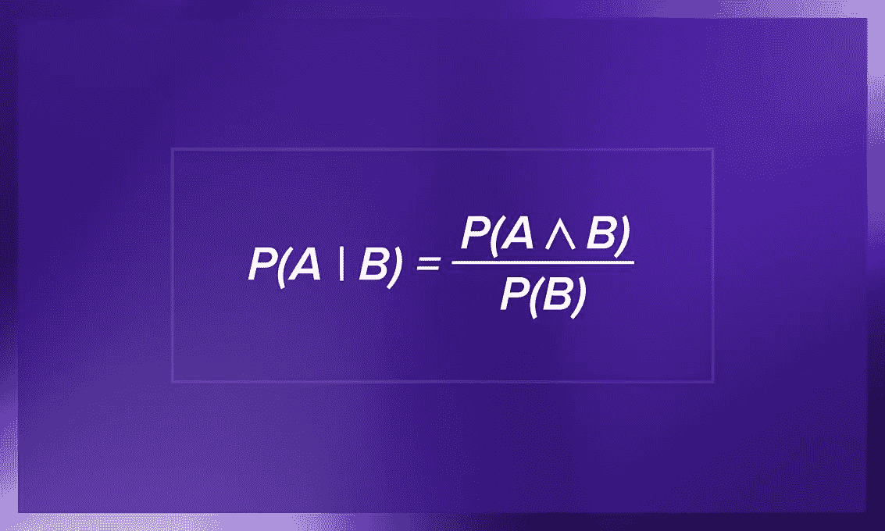
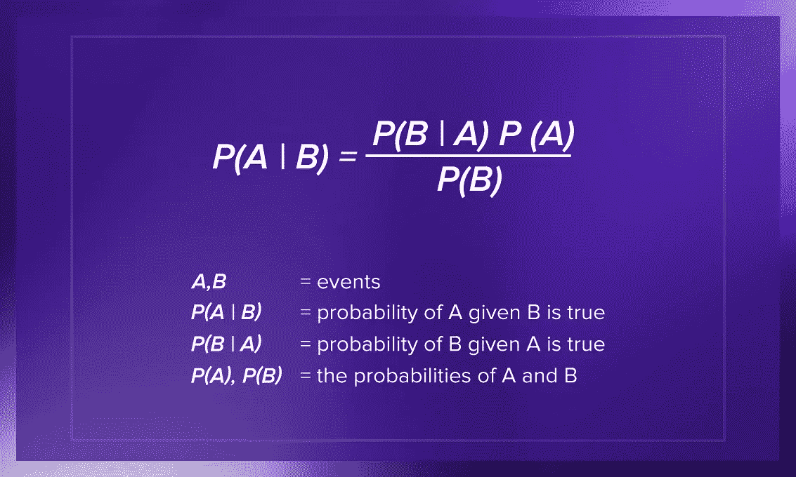

# 朴素贝叶斯分类器简介

> 原文：<https://betterprogramming.pub/introduction-to-naive-bayes-classifiers-70b2aa073377>

## 让我们了解一种流行的 ML 算法

在 [Unsplash](https://unsplash.com/s/photos/variation?utm_source=unsplash&utm_medium=referral&utm_content=creditCopyText) 上由 [Pritesh Sudra](https://unsplash.com/@pritesh557?utm_source=unsplash&utm_medium=referral&utm_content=creditCopyText) 拍摄的照片。

当你开始学习人工智能时，你首先遇到的是朴素贝叶斯。为什么朴素贝叶斯分类器对 AI 和 ML 如此重要？让我们找出答案。

# 机器学习中的不确定性和概率

人工智能必须处理数据，在许多情况下，这些数据很大但不完整。就像人类一样，计算机必须承担风险，思考不确定的未来。

不确定性是人类难以承受的。但是在机器学习中，有某些算法可以帮助你找到绕过这个限制的方法。朴素贝叶斯机器学习算法是借助概率方法处理不确定性的工具之一。

概率是一个数学领域，它使我们能够对不确定性进行推理，并评估某些结果或事件的可能性。当你使用预测最大似然建模时，你必须预测一个不确定的未来。例如，你可能试图根据过去的成绩预测一个奥运冠军在下一届奥运会上的表现。即使他们以前赢过，也不意味着他们这次会赢。不可预测的因素，如与伴侣的争吵或没有时间吃早餐，可能会影响他们的结果。

因此，不确定性对于机器学习建模是不可或缺的，因为生活是复杂的，没有什么是完美的。机器学习中不确定性的三个[主要来源](https://machinelearningmastery.com/uncertainty-in-machine-learning/)是嘈杂的数据、问题的不完全覆盖和不完美的模型。

# 计算概率

在机器学习中，我们对条件概率感兴趣。我们感兴趣的不是某件事发生的总概率，而是在其他事情发生的情况下它发生的可能性。例如，通过使用条件概率，我们可以根据运动员过去十年的成绩来确定他们赢得比赛的概率。

条件概率是这样定义的:给定 *b* 的情况下 *a* 的概率=发生 *a* 和 *b* 的联合概率除以 *b* 的概率。

作者照片。

稍微摆弄一下条件概率方程，你就可以得到另一个方程，也就是众所周知的贝叶斯定理。

作者照片。

# 贝叶斯概率

贝叶斯定理允许我们计算条件概率。它非常方便，因为它使我们能够使用一些我们已经拥有的知识(称为先验知识)来计算相关事件的概率。它用于开发分类模型和预测建模问题，如朴素贝叶斯。

贝叶斯规则通常用于概率论中计算条件概率。

例如，假设我们正在咨询一名运动员的赛前饮食，他们提供了以下数据:

*   80%的情况下，如果他们赢了比赛，他们会吃一顿丰盛的早餐。这是 *P(早餐|赢)*。
*   60%的时候，他们会吃一顿丰盛的早餐。 *P(早餐)*。这是我们的 *b* 。
*   20%的情况下，他们会赢得比赛。 *P(赢)*。这是我们的*一*。

通过应用贝叶斯法则，我们可以计算出 *P(win|breakfast)* 为 0.2 乘以 0.8 除以 0.6 = 0.26。换句话说，给他们一顿丰盛的早餐，他们赢得比赛的概率是 26%。显然，额外的碳水化合物让他们在比赛中保持耐力。

重要的是，我们不仅可以发现证据如何影响一个事件的概率，还可以发现影响的程度。

# 朴素贝叶斯

朴素贝叶斯是一种简单的监督机器学习算法，它使用贝叶斯定理，在特征之间进行强独立性假设来获得结果。这意味着算法只是假设每个输入变量是独立的。

对真实世界的数据做出这样的假设实在是太天真了。

例如，如果您使用朴素贝叶斯进行情感分析，给定句子“我喜欢哈利波特”，算法将查看单个单词，而不是整个句子。在一个句子中，相邻而立的单词影响着彼此的意思，单词在句子中的位置也很重要。然而，对于算法来说，类似“我喜欢哈利波特”、“哈利波特喜欢我”、“波特我喜欢哈利”这样的短语是相同的。

事实证明，该算法能够有效地解决许多复杂问题。例如，使用朴素贝叶斯构建文本分类器要比使用诸如神经网络等更受欢迎的算法容易得多。即使在数据不足或错误标注的情况下，该模型也能很好地工作，因此您不必“喂”它成千上万的例子，然后才能从中获得合理的东西。即使朴素贝叶斯最多能走 50 行，也是很有效的。

# 朴素贝叶斯的缺点

至于朴素贝叶斯的弱点，它用分类比用数值表现得更好。它自动假定钟形曲线分布，但这并不总是正确的。此外，如果分类变量在测试数据集中有一个不包括在训练数据集中的类别，那么模型将为其分配一个 *0* 概率，并且将无法进行预测。这就是所谓的[零频率问题](https://towardsdatascience.com/continuous-data-and-zero-frequency-problem-in-naive-bayes-classifier-7784f4066b51)。

为了解决这个问题，我们将不得不使用平滑技术。当然，它的主要缺点是在现实生活中很少有事件是完全独立的。你必须应用其他算法来追踪因果依赖。

如果你想开始编写你的第一个朴素分类器，我推荐这个[名字性别分类器](https://www.kaggle.com/springboardroger/naive-bayes-name-gender-classifier)。笔记本会逐步引导您完成该过程，并为您提供训练和测试模型所需的数据。

# 朴素贝叶斯分类器的类型

作者照片。

有几种类型的朴素贝叶斯分类器。

## 最优朴素贝叶斯

该分类器选择具有最大后验发生概率的类别(所谓的最大后验估计或[图](https://en.wikipedia.org/wiki/Maximum_a_posteriori_estimation))。顾名思义，它确实是最佳的，但是遍历所有可能的选项是相当缓慢和耗时的。

## 高斯朴素贝叶斯

高斯贝叶斯基于高斯(或[正态](https://en.wikipedia.org/wiki/Normal_distribution))分布。它显著地加快了搜索速度，并且在一些非严格条件下，误差仅比最优 Bayes 高两倍。那就好！

## 多项式朴素贝叶斯

这通常适用于文档分类问题。它的决策基于离散的特征(整数)，例如，文档中出现的单词的频率。

## 伯努利朴素贝叶斯

伯努利类似于前一种类型，但预测器是布尔变量。因此，用于预测类变量的参数只能有 yes 或 no 值(例如，单词是否出现在文本中)。

# 可以使用朴素贝叶斯算法的地方

下面是朴素贝叶斯在现实生活任务中的一些常见应用:

*   文档分类—该算法可以帮助您确定给定文档属于哪个类别。它可以用于将文本分类为不同的语言、流派或主题(通过关键词的存在)。
*   垃圾邮件过滤——朴素贝叶斯使用关键字轻松筛选出垃圾邮件。例如，在垃圾邮件中，你可以比在普通邮件中更频繁地看到“伟哥”这个词。必须训练该算法来识别这种概率，然后它可以有效地将它们应用于垃圾邮件过滤。
*   情感分析——基于文本中的单词所表达的情感，朴素贝叶斯可以计算出它是积极的还是消极的概率。例如，在顾客评论中，“好”或“不贵”通常意味着顾客满意。然而，朴素贝叶斯对讽刺并不敏感。
*   图像分类-出于个人和研究目的，很容易建立一个朴素贝叶斯分类器。它可以被训练识别手写数字，或者通过监督机器学习将图像分类。

# 贝叶斯中毒

贝叶斯中毒是垃圾邮件发送者使用的一种技术，旨在降低使用贝叶斯规则的垃圾邮件过滤器的效率。他们希望通过将贝叶斯数据库中以前无害的单词变成垃圾单词来增加垃圾邮件过滤器的误报率。添加更有可能出现在非垃圾邮件中的单词可以有效抵御朴素贝叶斯过滤器，并允许垃圾邮件漏网。

但是，重新训练过滤器可以有效地防止所有类型的攻击。这就是为什么朴素贝叶斯仍然与某些启发式方法(如黑名单)一起用于垃圾邮件检测。

# 结论

朴素贝叶斯可用于许多使用分类器的领域，如垃圾邮件检测、图像分类等。现在您已经知道了算法的优点和缺点，您可以在自己的项目中尝试它了。祝你好运！

*原载于***。**