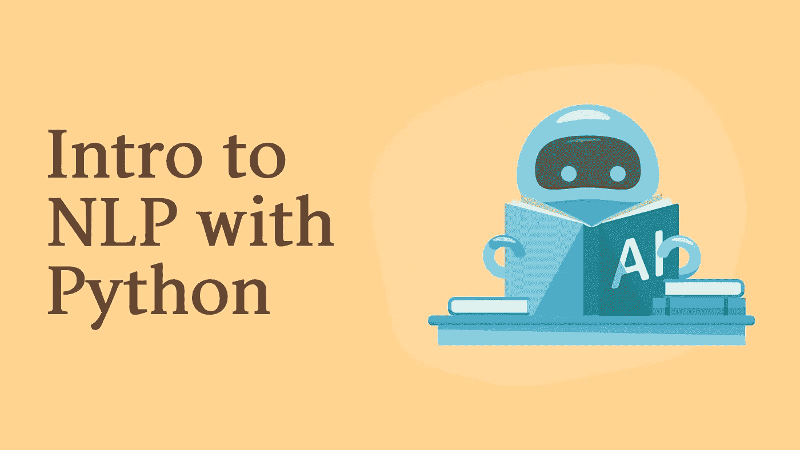
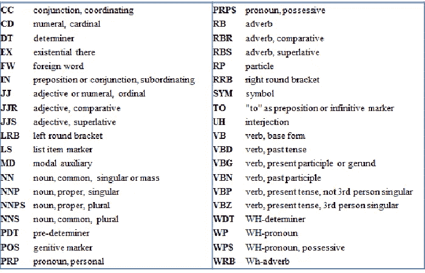

# Python 自然语言处理简介

> 原文：<https://betterprogramming.pub/introduction-to-natural-language-processing-with-python-913f618021a>

## 使用 Python 学习 NLP 的基础知识，并赋予文本意义



图片由作者提供。

> *“我语言的极限意味着我世界的极限。”——*[](https://www.azquotes.com/quote/319126)

*计算机说自己的语言:二进制语言。因此，它们与我们人类互动的方式受到了限制。扩展他们的语言和理解我们自己的语言对于让他们从他们的边界中解放出来是至关重要的。*

*NLP 是自然语言处理的缩写，它包括一组计算机可以用来处理和理解人类交流的工具、例程和技术。不要与语音识别混淆，NLP 处理的是理解单词的含义，而不仅仅是解释来自这些单词的音频信号。*

*如果你认为 NLP 只是一个未来的想法，你可能会震惊地知道，当我们在谷歌中执行查询时，我们很可能每天都要与 NLP 进行交互(例如，当我们在与谷歌助理或 Siri 交谈时使用在线翻译器)。NLP 无处不在，由于 NLTK 等库提供了对复杂性的巨大抽象，现在在您的项目中实现它是非常容易的。*

*在本文中，我们将讨论如何通过 Python 使用 [NLTK](https://www.nltk.org/) 库来处理 NLP。*

# *设置环境*

*为了方便起见，我们将使用 [Jupyter 笔记本](https://jupyter.org/)和 [Google Colab](https://colab.research.google.com/) 。您可以通过访问补充源代码来遵循每个步骤:*

*[](https://colab.research.google.com/drive/1JlyzJEXCeoFgt52cBoNd77lrDSrj8ISi?usp=sharing) [## 谷歌联合实验室

### 使用 python colab.research.google.com 的自然语言处理](https://colab.research.google.com/drive/1JlyzJEXCeoFgt52cBoNd77lrDSrj8ISi?usp=sharing) 

一旦设置了 Jupyter 笔记本或您选择的任何环境，请确保使用以下命令安装 NLTK 库:

```
!pip3 install nltk
```

*注意:如果你不是在 Jupyter 笔记本环境下，一开始就不需要* `*!*` *。** 

# *标记化*

*NLTK 是一个巨大的库，它提供了许多不同的工具来处理语言。虽然库本身提供了一些功能，但有些模块需要额外下载。`punkt`是一个处理标记化的模块，标记化是将一个段落分成组块或单词的过程。这通常是文本分析过程的第一步。开始之前，请确保下载了该模块:*

```
*import nltk
nltk.download('punkt')*
```

*现在，让我们来看看它的运行情况:*

```
*from nltk.tokenize import word_tokenize
Text = "Good morning, How you doing? Are you coming tonight?"
Tokenized = word_tokenize(Text)
print(Tokenized)*
```

*输出:*

```
*['Good', 'morning', ',', 'How', 'you', 'doing', '?', 'Are', 'you', 'coming', 'tonight', '?']*
```

*第一个函数`word_tokenize`，将把一个文本分割成单词和符号。然而，你可以用`punkt`做更多的事情，比如把一个段落分成句子。*

```
*from nltk.tokenize import sent_tokenize
Text = "Good morning, How you doing? Are you coming tonight?"
Tokenized = sent_tokenize(Text)
print(Tokenized)*
```

*输出:*

```
*['Good morning, How you doing?', 'Are you coming tonight?']*
```

*如果第一个例子不是很令人印象深刻，这个例子肯定是。在这里，我们开始看到一种更智能的方法，试图将文本分割成更简单、更有意义的块。*

# *停止言语*

*停用词是搜索引擎已经被编程忽略的常用词(例如“the”、“a”、“an”、“in”)，无论是在为搜索建立条目索引时还是在作为搜索查询的结果检索它们时。在某些情况下，忽略这些单词是很重要的，因此拥有一本关于它们的字典会变得非常方便——尤其是当我们需要处理多种语言时。*

*NLTK 提供了一个处理停用词的模块。接下来我们来下载一下:*

```
*import nltk
nltk.download('stopwords')*
```

*停用词由简单的单词列表组成，所以我们可以很容易地使用它们。例如，我们可以编写一个小的路由来获得一个没有停用词的单词列表:*

*输出:*

```
*Good
morning
How
Are
coming
tonight*
```

*由于我们得到了一个简单的单词列表，我们可以简单地打印它来查看特定语言的所有单词:*

```
*from nltk.corpus import stopwords
stopwords = stopwords.words("english")
print(stopwords)*
```

# *词干*

*词干是单词的基础或词根形式。例如，“爱”这个词来源于“爱”词干提取是我们将一个给定的单词转换成它的词干的过程。这是一项非常复杂的任务。单词可以有多种写法，不同的单词有不同的取词干方式。*

*谢天谢地，NLTK 让我们很容易实现这一点。让我们看看如何:*

```
*from nltk.stem import PorterStemmer
ps = PorterStemmer()
words = ["Loving", "Chocolate", "Retrieved", "Being"]
for i in words:
   print(ps.stem(i))*
```

*输出:*

```
*love
chocol
retriev
be*
```

*单词的这种简化在搜索引擎中非常有用，可以防止相同单词的不同写法在搜索标准中被忽略。*

# *计数单词*

*计算每个单词出现的次数在文本分析中非常有用。NLTK 为我们提供了一种简洁的方法来计算名为`FreqDist`的文本中的单词频率。*

```
*import nltk
words = ["men", "teacher", "men", "woman"]
FreqDist = nltk.FreqDist(words)
for i,j in FreqDist.items():
   print(i, "---", j)*
```

*输出:*

```
*men --- 2
teacher --- 1
woman --- 1*
```

# *单词组*

*我们经常会看到一些词被一起使用来表达特定的意思(例如，“我们走吧”、“最佳表现”等)。).在文本分析中，将这些单词成对捕获是很重要的，因为将它们放在一起看会对文本的理解产生很大的影响。*

## *二元模型*

*NLTK 提供了一些方法来做到这一点，我们将从二元模型开始。这是一种提取成对连接单词的方法:*

```
*words = "Learning python was such an amazing experience for me"
word_tokenize = nltk.word_tokenize(words)
print(list(nltk.bigrams(word_tokenize)))*
```

*输出:*

```
*[('Learning', 'python'), ('python', 'was'), ('was', 'such'), ('such', 'an'), ('an', 'amazing'), ('amazing', 'experience'), ('experience', 'for'), ('for', 'me')]*
```

*我们可以对三个或更多的单词做同样的事情。*

## *三元模型*

*当两个词总是一起出现时，就构成了双字。三元模型和二元模型一样，但是有三个单词。代码几乎没有区别:*

```
*words = "Learning python was such an amazing experience for me"
print(list(nltk.trigrams(word_tokenize)))*
```

*输出:*

```
*[('Learning', 'python', 'was'), ('python', 'was', 'such'), ('was', 'such', 'an'), ('such', 'an', 'amazing'), ('an', 'amazing', 'experience'), ('amazing', 'experience', 'for'), ('experience', 'for', 'me')]*
```

## *Ngrams*

*Ngrams 也是一些在单个短语或文档中一起出现的单词、字母或符号，但是您可以指定词频。让我们看一个例子:*

```
*print(list(nltk.ngrams(word_tokenize, 4)))*
```

*输出:*

```
*[('Learning', 'python', 'was', 'such'), ('python', 'was', 'such', 'an'), ('was', 'such', 'an', 'amazing'), ('such', 'an', 'amazing', 'experience'), ('an', 'amazing', 'experience', 'for'), ('amazing', 'experience', 'for', 'me')]*
```

*虽然这个特定文本的结果可能不太令人印象深刻，但有许多用例可以有效地使用 Ngrams(例如，用于垃圾邮件检测)。*

# *词汇化*

*词汇化的概念非常类似于词干化。但后者只是去掉了单词的前缀或后缀，有时会出现一些拼写错误。词汇化将它转换成真正的基本词。让我们看一个例子，但是在此之前，我们需要使用 NLTK 下载 WordNet 包:*

```
*nltk.download('wordnet')
from nltk.stem import WordNetLemmatizer
Lem = WordNetLemmatizer()
print(Lem.lemmatize("believes"))
print(Lem.lemmatize("stripes"))*
```

*输出:*

```
*belief
stripe*
```

*当您运行代码时，它会将每个单词转换为它的基本单词(例如，“相信”转换为“信念”，“条纹”转换为“条纹”)。这个名为 WordNetLemmatizer 的包的好处是它有一个名为`pos`的参数，代表“词性”，你可以指定你是否想要获得单词的动词或形容词。*

*让我们看一个例子:*

```
*from nltk.stem import WordNetLemmatizer
Lem = WordNetLemmatizer()
print(Lem.lemmatize("believes", pos="v"))
print(Lem.lemmatize("stripes", pos="v"))*
```

*输出:*

```
*believe
strip*
```

*注意到结果的不同了吗？*

# *POS 标签*

*当你在学校的时候，你可能学会了将单词分为动词、名词、形容词等。今天，这个任务对于我们人类来说是相当琐碎的，但是如果计算机想要理解人类语言，它们需要理解这些概念。他们需要区分动作和目标，动词和名词。NLTK 为我们提供了 POS(词性)来对单词进行分类。*

*它非常容易使用，所以让我们看看代码:*

```
*nltk.download('averaged_perceptron_tagger')
words = "Learning python was such an amazing experience for me"
word_tokenize = nltk.word_tokenize(words)
print(nltk.pos_tag(word_tokenize))*
```

*输出:*

```
*[('Learning', 'VBG'), ('python', 'NN'), ('was', 'VBD'), ('such', 'JJ'), ('an', 'DT'), ('amazing', 'JJ'), ('experience', 'NN'), ('for', 'IN'), ('me', 'PRP')]*
```

*结果是一个单词列表以及与每个单词相关联的 POS 标签。标签是首字母缩写，您可以在下表中找到完整的参考资料:*

**

*POS 标签列表(来源:[https://www . research gate . net/figure/POS-tagging-categories _ fig 2 _ 234753173](https://www.researchgate.net/figure/POS-tagging-categories_fig2_234753173))*

# *命名实体识别*

*现在我们可以开始使用更强大的功能了。NER(命名实体识别)用于捕获命名实体的所有文本提及。命名实体可以是任何东西，从一个地方或一个人到一个组织、金钱等等。*

*这种方法与其他方法相结合，可以非常有效地回答诸如“谁是美国总统？”直接来自文本源，而没有结构化格式的答案。如果你经常使用谷歌，你会看到很多这样的例子。*

*输出:*

```
*(S
  The/DT
  russian/JJ
  president/NN
  (PERSON Vladimir/NNP Putin/NNP)
  is/VBZ
  in/IN
  the/DT
  (FACILITY Kremlin/NNP))*
```

*我们现在已经开始组合我们所学的函数来收集更多关于文本的信息。通过识别文本中的结构和实体，我们可以赋予文本更多的意义。*

# *情感分析*

*到目前为止，我们已经将文本分解成了更小的单元，然后可以用于处理。情感分析与此不同，因为它是一个确定文本的情感或情绪成分的过程。例如，它以对应用程序、电影等的正面和负面评论进行分类而闻名。*

*尽管可以通过使用我们已经学习过的函数直接使用 NLTK 进行情感分析，但这仍然是一个不必要的、乏味的过程。幸运的是，Python 提供了 [TextBlob](https://textblob.readthedocs.io/en/dev/) ，这是一个构建在 NLTK 之上的文本处理库，可以为我们处理所有复杂的情感分析。*

*它非常容易使用，接下来我们将通过分析美国第 46 任总统乔·拜登的一条推特来展示:*

*输出:*

```
*Sentiment(polarity=0.0625, subjectivity=0.26666666666666666)*
```

*情感分析产生两个变量:极性和主观性。极性是一个介于 *-1* 和 *1* 之间的值，其中 *-1* 为非常负， *1* 为非常正。主观性的范围在 *0* 和 *1* 之间，指的是人的观点、情感，甚至是判断。数字越高，文本越主观。*

# *拼写纠正*

*我们提到 TextBlob 有多种用途，拼写纠正是其中的另一种。TextBlob 可以帮助我们消除文本中的拼写错误。让我们来看看它的实际应用:*

```
*from textblob import TextBlob
Text = "Smalle businesses neede relief"
spelling_mistakes = TextBlob(Text)
print(spelling_mistakes.correct())*
```

*输出:*

```
*Small business need relief*
```

*不出所料，TextBlob 发现了我们的错误，并在结果文本中进行了更正。*

# *结论*

*NLP 是一个复杂而迷人的世界。今天，我们介绍了几个概念和一些代码，但是我们仅仅触及了可以做的事情的表面。*

*NLTK 是一个巨大的库，有大量的用例及潜力，值得详细阅读。在接下来的文章中，我们将继续学习 NLP，新趋势，新算法，以及人工智能如何让我们生产出可以与人类无缝交互的机器。*

*感谢阅读！*