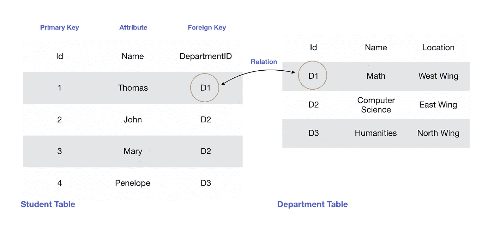
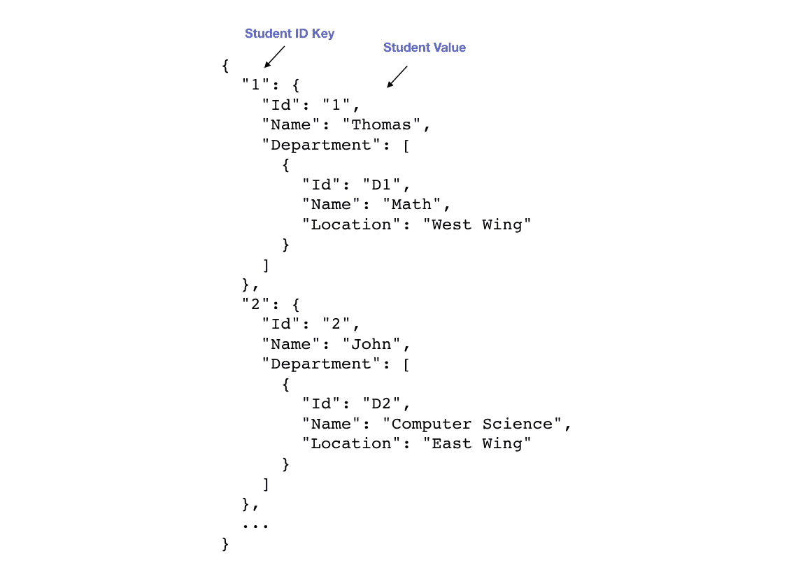
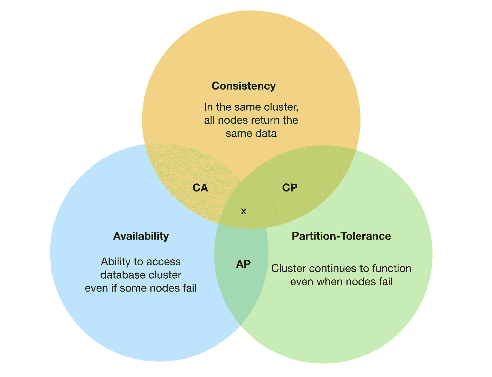

# NoSQL 数据库介绍

> 原文：<https://betterprogramming.pub/introduction-to-nosql-databases-7f6ed6e055c5>

## SQL/NoSQL、酸碱一致性模型和 CAP 定理的高级概述

照片由[法比奥](https://unsplash.com/@fabioha?utm_source=medium&utm_medium=referral)在 [Unsplash](https://unsplash.com?utm_source=medium&utm_medium=referral) 上拍摄

# 内容概述

1.  SQL 与 NoSQL 数据库概述
2.  酸碱一致性模型
3.  CAP 定理
4.  NoSQL 的优势与劣势

# SQL 数据库

SQL 代表结构化查询语言。当人们提到 SQL 数据库时，他们实际上指的是关系数据库管理系统(RDBMS)。

数据以表格的形式存储。每一行都由一个主键唯一标识，并且每一行还可以有一个外键**、**，这是另一个表的主键。通过外键，与另一个表形成一种关系——因此有了关系数据库的概念。

SQL 数据库的例子包括 MySQL、PostgreSQL 和 Oracle 数据库。

学生表和系表之间的关系

# NoSQL 数据库

NoSQL 被称为“没有 SQL”，或者有时“不只是 SQL”当数据库可以支持 SQL 类型查询时，使用后一个术语。

有四种类型的 NoSQL 数据库:

*   文档(例如 Firestore)。
*   图形(如 Neo4j)。
*   键值(如 Riak、Berkeley DB)。
*   宽栏(如 Cassandra、HBase)。

这四种类型的数据库支持不同的数据存储方式，而不是将数据存储在 SQL 数据库的表中。

考虑 NoSQL 的一个简单方法是想象一个 JSON 结构。您需要一个键来检索值。

NoSQL 数据库的 JSON 示意图

现在，您已经对这两种类型的数据库有了较高的了解，让我们来看看一致性模型，这将有助于我们理解这两种数据库之间的权衡。

# SQL 数据库的 ACID 模型

## **原子数**

当一个事务(读/写)发生时，它应该同时发生，或者根本不发生。如果事务中止，数据库应该不会受到影响。同样，如果一个事务通过，数据库的状态应该反映这种变化。本质上，要么全有，要么全无。

## 一致性

当事务完成时，数据库实例(例如副本)应该同时反映相同的状态。

## 隔离

每个事务都应该独立执行。这意味着没有两个事务会导致争用情况。数据库对该行加锁，以确保事务按顺序发生。

## 持久性

提交事务后，修改将是永久的，即使在系统崩溃的情况下也是如此。

ACID 属性确保在事务完成时，数据始终是一致的。然而，这是以锁定数据库为代价的。

# NoSQL 数据库的基本模型

NoSQL 数据库的设计考虑到了规模，因此坚持碱属性，而不是酸。

## 基本可用性

数据库更喜欢数据的可用性，而不是数据的正确性。

## 软状态

数据库存储(例如副本)不必总是一致的。

## 最终一致性

一段时间后，数据库存储最终将相互一致。

NoSQL 数据库面向可伸缩性，因此容错能力更强。换句话说，当副本崩溃时，NoSQL 数据库仍然能够返回数据，尽管不是最准确的版本。

# CAP 定理

有了这两个一致性模型，我们就可以很好地转到 CAP 定理，该定理指出:

> 一个分布式数据库系统只能有三个中的两个:一致性、可用性和分区容忍度。

CAP 定理图

## 容许分区

在讨论酸和碱时，我们已经讨论了一致性和可用性。我们还知道，SQL 数据库更注重一致性，而 NoSQL 数据库则更注重可用性。那么，什么是分区容差呢？

让我们想象一下，在我们的集群中，我们有两个节点，X 和 Y，采用主-主设置。当我们将请求定向到这些节点时，X 和 Y 之间的连接断开，所以我们有一个问题:X 和 Y 上的数据不一定同步，我们不知道哪个节点有正确的数据。节点应该如何响应请求？

*   给个回应。可用性是优先考虑的因素，但由于数据不一定准确，因此牺牲了一致性(AP)。
*   不要回应。一致性是优先考虑的，因为如果数据不准确，节点不应作出响应，但在此过程中会牺牲可用性(CP)。

第三种组合是 CA，它尊重一致性和可用性，但不能有分区(节点之间的分解)。

# NoSQL 的优势

## 1.更快的插入/检索

规范化是将数据隔离到单独的表中以减少数据冗余和重复的过程。SQL 数据库通常采用这种模式。在前面的例子中，我们看到`Student`表引用了`Department`表中一行的 ID。如果部门中的位置发生变化，我们可以简单地对`Department`表进行修改，而不会影响`Student`表。

相反，NoSQL 数据库通常支持反规范化，即数据可以跨记录复制。我们看到`Department`数据实际上在所有记录中被复制。有了包含在单个记录中的`Student`和`Department`数据，检索会更快，因为不需要表连接，而这在 SQL 数据库中可能是必需的。

此外，由于所有数据都存储在一条记录中，因此对 NoSQL 数据库的插入可以在一次调用中完成，而不是多次调用来更新 SQL 数据库的不同表。

## 2.灵活模式

向 SQL 数据库中的表添加新属性是一项开销很大的操作。每一行都需要添加一个新列，为了保持一致性(副本之间)，在添加新列时需要锁定存储。

另一方面，NoSQL 数据库不需要严格的模式，每个记录可以有它想要的任何键/值对。

## 3.专为可扩展性而设计

SQL 数据库不是为水平伸缩而设计的。虽然水平分区(分片)是可能的，但它们不是为这样做而设计的。事实上，扩展 SQL 数据库可能会导致它失去一些一致性。另一方面，NoSQL 数据库在设计时考虑了水平分区。

## 4.聚集

聚合数据是作为一个单元存储的数据集合。众所周知，NoSQL 将其所有数据存储在一个记录中，这是一个面向聚合的数据库。

# NoSQL 的缺点

## 1.不是为更新设计的

NoSQL 数据库不保证其副本之间的一致性，因为它们保持软状态。当有大量的更新/删除操作时，虽然数据可能是可用的，但它们并不相互一致。

另一方面，SQL 数据库可以更好地处理大量的更新/删除操作，因为它们锁定行以确保事务是独立的，因此在每个事务之后都是一致的。鉴于这些特性，我认为像 Robinhood 这样的股票交易应用程序会更喜欢 SQL 而不是 NoSQL。

另一方面，由于 SQL 中的关系，一个表中的记录可以很容易地引用另一个表中某一行的 ID。例如，如果要改变一个部门的位置，修改可以局限于`Department`表。另一方面，NoSQL 数据库必须遍历所有记录，改变每条记录的位置。

## 2.未针对过滤进行优化

等等，读起来不是更快吗？是的，当您查询整个记录时，它们会更快，因为记录中的所有数据都可用。但是，如果您想使用一些过滤器来查询一条记录，那么对于 NoSQL 数据库来说，它的成本会相对更高，因为必须首先获取所有记录，然后在返回之前对每条记录应用过滤器。另一方面，SQL 数据库通过对列进行检查来进行更有效的过滤。

## 3.连接是昂贵的

因为 NoSQL 表之间没有隐含的关系，所以解析记录并通过键连接它们的开销很大。SQL 数据库可以通过引用另一个表的行 ID 来轻松做到这一点。

# 最后的话

当使用分布式系统时，我们必须明白通常没有单一的最佳解决方案。相反，我们需要了解我们的需求，并找出最适合我们情况的折衷方案。

我仍在学习这些话题。希望分享这些内容能强化我自己的知识。如果有什么可以解释得更好的，请随时发表评论。

如果你做到了这一步，感谢你的阅读！

# 资源

*   [NoSQL 数据库简介](https://www.youtube.com/watch?v=xQnIN9bW0og)

 [## 初学者的图形数据库:酸与碱解释

### 当涉及到 NoSQL 数据库时，数据一致性模型有时会与…

neo4j.com](https://neo4j.com/blog/acid-vs-base-consistency-models-explained/)  [## 什么是正常化？网络百科定义

### (1)在关系数据库设计中，组织数据以减少冗余的过程。正常化通常…

www.webopedia.com](https://www.webopedia.com/TERM/N/normalization.html)  [## SQL 与 NoSQL:有什么区别？

### 什么是 SQL？发音为“S-Q-L”或有时发音为“See-Quel”的结构化查询语言(SQL)是标准语言…

www.guru99.com](https://www.guru99.com/sql-vs-nosql.html)  [## 四种类型的 NoSql 数据库(KeyValue Store…

### 回答(第 1 题，共 7 题):对于这些数据库分类中的每一种，实际的实现都会因供应商而异…

www.quora.com](https://www.quora.com/What-are-the-main-differences-between-the-four-types-of-NoSql-databases-KeyValue-Store-Column-Oriented-Store-Document-Oriented-Graph-Database)  [## 上限定理——可用性和分区容差

### 这是我讨论 CAP 的方式，特别是关于 P。CA 只有在您接受单片、单个…

stackoverflow.com](https://stackoverflow.com/questions/12346326/cap-theorem-availability-and-partition-tolerance)