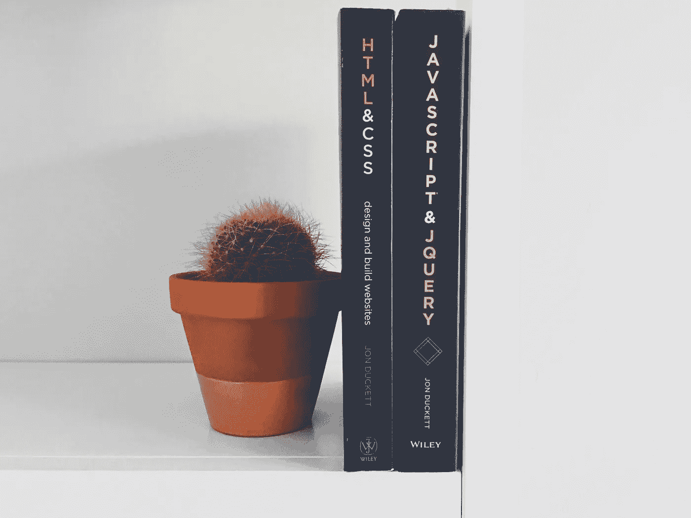
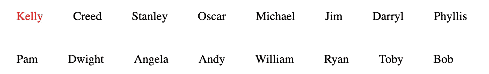
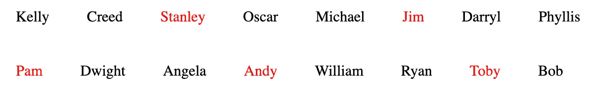
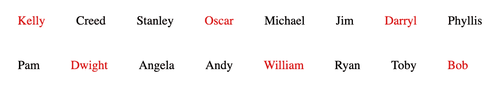
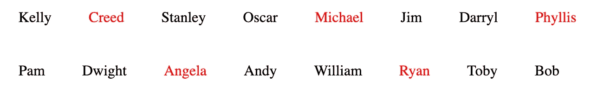
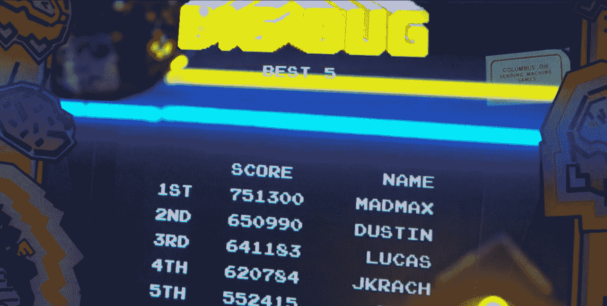
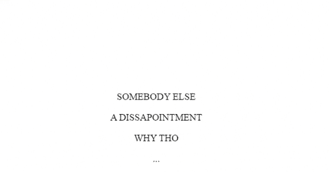
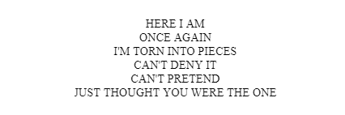
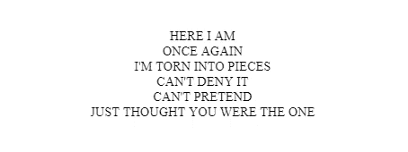

# n 子 CSS 选择器简介

> 原文：<https://betterprogramming.pub/introduction-to-nth-child-css-selector-9a94c9f00268>

## 如何间隔查找列表中的特定项目



照片由[格雷格·拉科齐](https://unsplash.com/@grakozy?utm_source=unsplash&utm_medium=referral&utm_content=creditCopyText)在 [Unsplash](https://unsplash.com/search/photos/css?utm_source=unsplash&utm_medium=referral&utm_content=creditCopyText) 上拍摄

`[nth-child](https://www.w3schools.com/cssref/sel_nth-child.asp)`是匹配其父元素的每第 n 个子元素的选择器。假设您只想将 CSS 应用于特定数量的`p`元素。`nth-child`正是你所需要的。

```
#nameContainer p {
    color: black;
}#nameContainer:hover p:nth-child(1) {
    color: red;
}
```

当用户悬停在`nameContainer`上时，上面的 CSS 将只改变第一个`p`的颜色。



# 可以传递到`nth-child`的其他选项

## **古怪的**

通过使用`nth-child(odd)`，您可以将 CSS 应用于每个奇数子元素。如果你重写上面的 CSS 来影响每一个奇怪的元素，Kelly，Stanley，Michael 等等的 p 标签会变成红色。

## 甚至

相反，`nth-child(even)`将 CSS 应用于 Creed、Oscar、Jim 等。

## 公式(*安* + *乙*)

除了值 *n* 可以是任意数字之外，还可以使用公式。`nth-child(3n)`会影响每三个子元素。`nth-child(3n+1)`适用于从第一个元素开始的每第三个元素。`nth-child(n)`公式不支持乘法和除法。我们来分解一下这个公式格式，看看每个部分对`nth-child`意味着什么。

*a* 代表循环大小。如果 *a* 等于 3，这意味着 CSS 应用于每第三个元素。`p:nth-child(3n)`见下图。



*n* 是用于确定组中哪个兄弟元素受到影响的计数器。它本身引用每个子元素。`p:nth-child(n)`会选择每一个`p`。这有点多余，因为你可以简单地单独使用`p`。

*b* 代表偏移值。如果你回头看前面的例子`nth-child(3n+1)`，CSS 将被应用到每三个元素，最初偏移一。因此对于`p:nth-child(3n + 1)`来说，第一个`p`标签将受到影响，然后是每三个标签中的。见下文。



可以看到，每三个 p 标签就有一个受到影响；迭代从第一个开始。

也可以用减法。在`nth-child(3n-1)`中，周期是 3， *n* 是计数器，这意味着每三个`p`标签中有一个会受到影响。但是，当偏移量为-1 时，实际上是`3n+(-1)`，您将从第一个`p`标记之前的一个元素开始循环。见下文。



由于-1 偏移，从第二个开始，每隔一个 p 标记

现在你已经理解了`nth-child`的公式化选项，让我们来看看相反的操作，**负子范围**。

# 负子范围

当您想要以相反的顺序完成公式化的`nth-child`时，负子范围是有用的。你只需在一个`nth-child`公式前加一个减号。见下文。

```
p:nth-child(-2n+5){
  color: red;
}
```

给定我们的“Office”字符列表，这个`nth-child`负范围将对名字应用 CSS，从 Michael 开始，因为它是列表中的第五个名字，然后向后工作，选择每隔一个名字。上面的 CSS 会让迈克尔、斯坦利和凯利变红。这个负范围选择的工作方式类似于名为`nth-last-child(n)`的子元素的第 n 个选择。

# 组合子范围

通过组合子范围，您可以将多个`nth-child`选择器应用于一组同级。假设您想要获取第一个和第五个之间的所有子元素。您可以通过编写一个组合的`nth-child`选择来实现这一点。见下文。

```
p:nth-child(n+5):nth-child(-n+10){
  color: red;
}
```

这里我们组合了两个`nth-child`选择器来抓取第五个和第十个标签之间的所有`p`标签。第一个选择器将从第五个标签 Michael 开始抓取所有的`p`标签，因为 5 是偏移量。然后我们加上一个负的子范围，从第十个开始往回算，德怀特。以上将使从迈克尔到德怀特的名字变红。通过以这种格式编写负的子范围，您可以复制与另一个子选择器相同的行为，`nth-last-child`。

# 最后一个孩子

`nth-last-child(n)`与`nth-child(n)`的作用相同，只是它是从一组兄弟姐妹的末尾开始，而不是开头。`nth-last-child(n)`可以接受和上面一样的选项(偶数，奇数，公式)；它只是以相反的顺序执行它们。就拿我们之前用的公式选项来说，`nth-child(3n-1)`。如果我们要写`nth-last-child(3n-1)`，CSS 应用程序将从鲍勃前面的`p`标签开始，然后以相反的顺序继续到每三个兄弟姐妹。受影响的名字有托比、安迪、帕姆等等。除了根据标签是哪个子标签来选择特定的`p`标签之外，您还可以使用`nth-of-type(n)`来选择与其他元素相关的标签。

# 第 n 种类型

这个子选择器将根据类型选择子元素。假设我们有两个`div`标签，每个标签包含八个字符名称。我们想给两个`div`标签中的名字一个更大的字体。我们可以编写类似下面的代码。

```
p:nth-of-type(1){
  font-size: 50px;
}
```

这将使 Kelly 和 Pam 比其他名字更大。假设你想反过来，用更大的文本显示每组中最差的一组；可以用`[nth-last-of-type(n)](https://www.w3schools.com/cssref/sel_nth-last-of-type.asp)`。它的工作原理与`nth-last-child(n)`选择器相同，从每个`div`中每组的末尾开始。

# 应用

`nth-child`的一个用例是当你想强调表格中连续行的差异时。参见这个关于 [W3 学校](https://www.w3schools.com/html/tryit.asp?filename=tryhtml_table_intro)的例子。

另一个用例是突出显示一个范围。假设您正在渲染一个游戏玩家列表以及他们在一个视频游戏中的高分，比如说，MADMAX 和 DUSTIN 在 Dig Dug 中排名前五。



要是 80 年代有第 n 个孩子选择器就好了。

我们可以应用一个组合的`nth-child`和一个负范围来确保每个人都能比其他人更明显地看到前四名。

```
p:nth-child(n):nth-child(-n+4){
  animation: pulsate 0.5s ease-in-out;
}@keyframes pulsate{
     0% { 
         transform: scale(1);
     } 50% {
         transform: scale(1.1);
     } 100% {
         transform: scale(1);
     }
}
```

上面看起来会像这样。



如果你不是第一名，你就是最后一名。

`nth-child`对于使用[动画延迟](https://developer.mozilla.org/en-US/docs/Web/CSS/animation-delay)的定时 CSS 动画也很有用。参见下面的代码，它在 LESS 中使用了一个[混音循环。](http://lesscss.org/features/#mixins-feature)

```
@iterations: 15;

.mixin-loop (@i) when (@i > 0) {
  &:nth-child(@{i}) {
    animation-delay:  @i * 0.2**s**;
  }
  .mixin-loop(@i - 1);
}p{
   animation: ScaleIn 0.5**s linear**; 
   animation-fill-mode: **both**;
   transform-origin: **bottom left**;
   .mixin-loop(@iterations);
}
```

下面是没有动画延迟时的动画效果。



打哈欠。

这是延迟后的样子。



你几乎可以听到永恒的歌词。

更多的`nth-child`用例，请看[这些 CSS 技巧](https://css-tricks.com/useful-nth-child-recipies/)。

[*在此处将您的免费媒体会员升级为付费会员*](https://matt-croak.medium.com/membership) *，每月只需 5 美元，您就可以收到各种出版物上数千名作家的无限量无广告故事。这是一个附属链接，你的会员资格的一部分帮助我为我创造的内容获得奖励。谢谢大家！*

# 参考

*   [CSS:n-child()选择器](https://www.w3schools.com/cssref/sel_nth-child.asp)
*   [试用编辑器 3.6 版](https://www.w3schools.com/html/tryit.asp?filename=tryhtml_table_intro)
*   [特色深入| Less.js](http://lesscss.org/features/#mixins-feature)
*   [有用:第 n 个孩子的食谱| CSS-Tricks](https://css-tricks.com/useful-nth-child-recipies/)
*   [CSS:n-last-of-type()选择器](https://www.w3schools.com/cssref/sel_nth-last-of-type.asp)