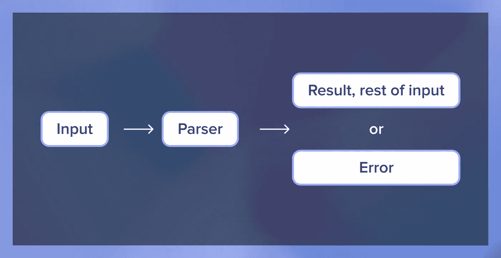
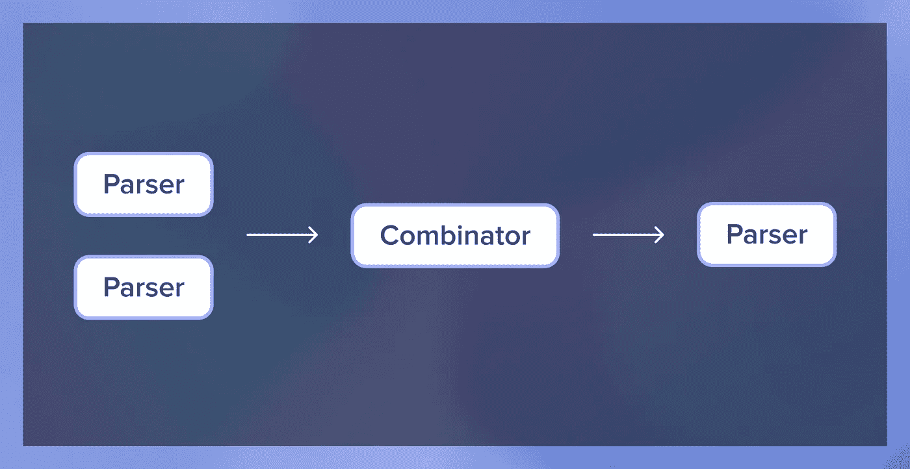
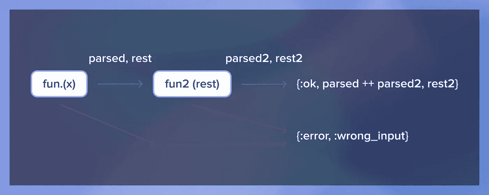

# Elixir 中解析器组合子的介绍

> 原文：<https://betterprogramming.pub/introduction-to-parser-combinators-in-elixir-f867fc3b502e>

## 了解解析器组合子是如何工作的

由[克里斯汀·图曼扬](https://unsplash.com/@krstne?utm_source=unsplash&utm_medium=referral&utm_content=creditCopyText)在 [Unsplash](https://unsplash.com/s/photos/lego?utm_source=unsplash&utm_medium=referral&utm_content=creditCopyText) 拍摄。

解析器组合子是最有用的解析工具之一。与正则表达式相比，它们更具可读性和可维护性，这使它们成为更复杂任务的绝佳选择。

在本文中，我将解释解析器组合子是如何工作的，以及它们是由什么组成的。我们将尝试从头开始构建函数解析器组合子。我们要做的组合子将是低级的，比用简单的正则表达式得到的还要差。他们只是为了说明这一点。

如果您想看看解析器组合子的运行，我写了一篇关于用 [NimbleParsec](https://serokell.io/blog/parser-combinators-in-elixir#create-your-own-csv-parser-with-nimbleparsec) 构建 CSV 解析器的教程。我强烈建议去看看。

# 什么是解析器组合子？

在编程时，我们经常需要将输入(如字符串)解析成一种更便于计算机使用的数据结构(如树或列表)。

一种快速的方法是编写一个 regex 表达式来捕获我们需要的一切。但是这些可能会变得非常冗长和复杂，从而导致难看的代码。

如果我们可以编写将输入中的语义单元一一映射的解析器，并将它们组合成一个用于该输入的解析器，会怎么样呢？

归根结底，解析器组合子就是这样:一种组合简单解析器来创建更复杂解析器的方法。

# 分析器

那么解析器到底是做什么的呢？解析器的主要目标是将一串文本解析成一个不同的、更结构化的对象——比如一个列表或一棵树。

例如，我们可以接受一个整数列表作为一个字符串(`"3, 1, 4, 1"`)，并将该字符串转换成一个列表，以更好地表示该字符串(`[3, 1, 4, 1]`)中固有的结构。

但是如果我们遇到类似`"3, 1, 4, 1 -- Monday, December 28th"`或`"oops, I'm sorry"`的字符串呢？为了与其他解析器组合并处理可能的失败，我们还需要在解析器成功时返回输入的其余部分，如果解析器失败则返回一个错误。

下面是一个低级解析器的例子，它解析 Elixir 中的一个十进制数字:

如果你问我们能用它做什么，答案是“不太多”为了释放解析器组合子的威力，我们需要找到一种方法将不同的解析器组合在一起。

# 组合子

解析器组合器是将两个或更多解析器组合成另一个解析器的函数。

让我们考虑一下组合解析器的方法。最直接的组合是将两者联系在一起——让解析器一个接一个地解析两个十进制数字。

这里，结果解析器将第一个函数应用于输入，然后将第二个函数应用于第一个函数返回的输入的其余部分。我们将解析后的条目作为一个列表返回，并返回第二个函数没有使用的输入。如果有错误，它只是被进一步传递。

现在我们可以重复使用组合子来创建一个解析器，它可以连续解析两个、三个、甚至四个或更多的整数！但这只是开始。

还有其他多种组合子的可能性。一个常见的例子是`choice`，它的一个简单版本可能是这样的:

在这里，它将尝试逐个解析两个不同的解析器，并选择首先成功的解析器或返回错误。

我们简单的组合子可以创建一个解析器，解析两个或三个数字。

例如，通过组合不同的解析器，您可以构建大型、复杂的解析器来表示 JSON 或 XML 等语言的规则。

真正的解析器组合子库通常提供各种不同的组合子，使得以可读的方式表示解析器成为可能。

# 解析器组合子中的错误处理

我们的初步错误处理相当幼稚，我被告知有一种误解，认为解析器组合子处理错误很糟糕。让我们看看如何轻松地扩展我们的解析器来显示意外输入的位置。

首先，让我们改变`parse_digit`处理错误的方式:

除了输入错误之外，EOS 错误也很容易发生，所以我确保涵盖了这一点。

现在我们可以修改我们的`concat`组合子，以便在输入错误发生时跟踪它的位置:

`choice`组合器已经很好地处理了这些错误。你可以在这个要点中看到最终的结果[。](https://gist.github.com/NaeosPsy/254f80bd730d139cfdf92c08cbd03060)

现在，当我们尝试做`two_or_three_digits.("5a")`，我们会得到`{:error, {:unexpected_input, "a", 2}}`。如果我们将代码公开为一个库，我们可以很容易地生成漂亮的错误消息。

当然，这段代码只是为了演示，但是在`megaparsec`中使用了类似的方法，这是一个 Haskell 解析器组合子库，以其良好的错误报告而闻名。

# 哪里可以使用解析器组合子？

因为解析器组合子比 regex 强大得多，所以可以用它们来解析具有复杂递归结构的项。但是它们也可以用于简单的解析器，例如，一个项目可以有许多不同的选择。

但是，它们不能取代正则表达式。每种工具都有其优势。对于简单的脚本，我会使用正则表达式；对于大多数其他解析需求，我会使用一行程序和解析器组合子。

如果你想看看解析器组合子如何在现实生活中使用的例子，你可以查看我的教程关于用 Elixir 编写 CSV 解析器。

*最初发表于*[*https://sero Kell . io*](https://serokell.io/blog/parser-combinators-in-elixir)*。*