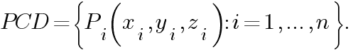
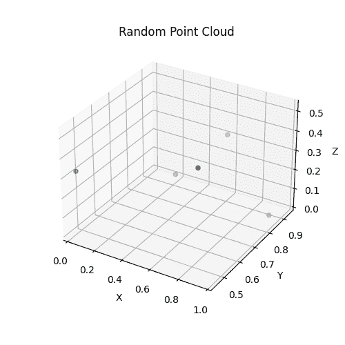
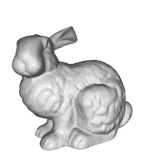
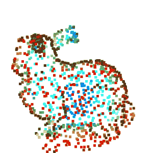
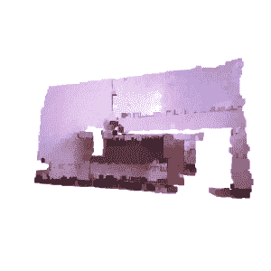
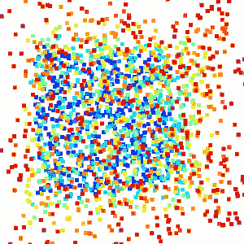
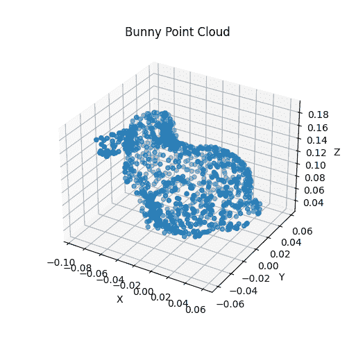

# 点云处理简介

> 原文：<https://betterprogramming.pub/introduction-to-point-cloud-processing-dbda9b167534>

## 如何创建和可视化点云


照片由[亨利·贝](https://unsplash.com/@henry_be?utm_source=medium&utm_medium=referral)在 [Unsplash](https://unsplash.com?utm_source=medium&utm_medium=referral)

这是我的“点云处理”教程的第一篇文章。

“点云处理”教程是初学者友好的，其中我们将简单介绍从数据准备到数据分割和分类的点云处理流水线。

*   [第一篇:点云处理简介](https://medium.com/@chimso1994/introduction-to-point-cloud-processing-dbda9b167534)
*   [文章 2:用 Python 从深度图像中估计点云](https://medium.com/better-programming/point-cloud-computing-from-rgb-d-images-918414d57e80)
*   [第三篇:理解点云:使用 Python 实现地面检测](/understand-point-clouds-a-simple-ground-detection-algorithm-71aaa0dd2b2d)
*   [第 4 篇:Python 中的点云过滤](https://medium.com/@chimso1994/point-cloud-filtering-in-python-e8a06bbbcee5)
*   [第五篇:Python 中点云分割](https://medium.com/@chimso1994/point-cloud-segmentation-in-python-2fdbf5ea0617)

在本教程中，我们将介绍点云，看看他们是如何创建和可视化的。

```
**Table of contents:**
· [1\. Introduction](#db44)
· [2\. Point cloud generation](#a5a8)
 ∘ [2.1 Random point cloud](#f448)
 ∘ [2.2 Sampled point cloud](#024e)
 ∘ [2.3 Point clouds from RGB-D data](#c654)
· [3\. Open3D and NumPy](#94d6)
 ∘ [3.1 From NumPy to Open3D](#a9a0)
 ∘ [3.2 From Open3D to NumPy](#4c7b)
· [4\. Conclusion](#c440)
```

# 1.介绍

点云应用无处不在:机器人、自动驾驶汽车、辅助系统、医疗保健等。点云是一种适用于处理真实世界数据的 3D 表示，尤其是当需要场景/对象的几何形状时，例如距离、形状和对象的大小。

点云是表示真实世界中的场景或空间中的对象的一组点。它是几何对象和场景的离散表示。更正式地说，点云 *PCD* 是一组 *n* 点，其中每个点 *Pi* 由其 3D 坐标表示:



请注意，可以添加一些其他特征来描述点云，如 RGB 颜色、法线等。例如，可以添加 RGB 颜色来提供颜色信息。

# 2.点云生成

点云通常使用 3D 扫描仪(激光扫描仪、飞行时间扫描仪和结构光扫描仪)或从计算机辅助设计(CAD)模型生成。在本教程中，我们将首先创建随机点云，并将其可视化。然后，我们将通过使用 Open3D 库从 3D 表面采样点来从 3D 模型中生成它。最后，我们将了解如何从 RGB-D 数据中创建它们。

让我们从导入库开始:

## 2.1 随机点云

最简单的方法是随机创建一个点云。请注意，我们通常不创建随机点进行处理，除了为 GANs(生成敌对网络)创建噪声。

一般点云用 *(n × 3)* 数组表示，其中 *n* 为点数。让我们用 5 个随机点创建一个点云:

我们可以只打印这些点，但效率不高，尤其是在大多数应用中，如果点的数量很大。更好的方法是在 3D 空间中显示它们。让我们使用 Matplotlib 库将其可视化:



随机点云可视化

## 2.2 采样点云

有时直接处理 3D 模型需要时间和内存。因此，从点云的 3D 表面采样点云是一种潜在的解决方案。让我们从 Open3D 数据集导入兔子模型:

或者从[下载后导入此链接:](http://graphics.im.ntu.edu.tw/~robin/courses/cg03/model/)

接下来，显示 3D 模型以查看其外观。您可以移动鼠标从不同的视角进行查看。



兔子 3D 模型

要对点云进行采样，有几种方法。在本例中，我们从导入的网格中均匀采样 1000 个点，并将其可视化:



兔子点云

我们可以将创建的点云保存在。层片格式如下:

## 2.3 来自 RGB-D 数据的点云

使用同时提供 RGB 图像和深度图像的 RGB-D 传感器(如 Microsoft Kinect)来收集 RGB-D 数据。RGB-D 传感器涉及许多应用，例如室内导航、避障等。由于 RGB 图像提供了像素颜色，因此深度图像的每个像素都指示了它与相机的距离。

Open3D 提供了一组用于 RGB-D 图像处理的函数。要使用 Open3D 函数从 RGB-D 数据创建点云，只需导入两幅图像，创建一个 RGB-D 图像对象，最后按如下方式计算点云:



由 RGB-D 图像生成的彩色点云

# 3.Open3D 和 NumPy

有时您需要在 Open3D 和 NumPy 表示之间切换。例如，假设我们要将 NumPy 点云转换为`Open3D.PointCloud`对象进行可视化，并使用 Matplotlib 可视化兔子的 3D 模型。

## 3.1 从 NumPy 到 Open3D

在本例中，我们使用`NumPy.random.rand()`函数创建了 2000 个随机点，该函数从`[0,1[`上的均匀分布中创建随机样本。然后我们创建一个`Open3D.PointCloud`对象，并使用`Open3D.utility.Vector3dVector()`函数将其`Open3D.PointCloud.points`特征设置为随机点。



随机点云的 Open3D 可视化

## 3.2 从 Open3D 到 NumPy

这里，我们首先使用返回一个`Open3D.PointCloud`对象的`Open3D.io.read_point_cloud()`函数从一个. ply 文件中读取点云。之后，我们只需使用`NumPy.asarray()`函数将代表点的`Open3D.PointCloud.points`特征转换成一个 NumPy 数组。最后，我们像上面一样显示获得的数组。



使用 Matplotlib 显示的兔子点云

# 4.结论

在本教程中，我们学习了如何创建和可视化点云。在接下来的教程中，我们将学习如何处理它们。在[的下一个教程](https://medium.com/@chimso1994/point-cloud-computing-from-rgb-d-images-918414d57e80)中，我们将看到如何在不使用 Open3D 函数的情况下，从深度图像和 RGB-D 数据中详细计算点云。

谢谢，我希望你喜欢读这篇文章。你可以在我的 [GitHub 库](https://github.com/Chim-SO/pointcloudprocessing)中找到例子。如果你有任何问题或建议，欢迎在下面给我留言。

[](https://medium.com/@chimso1994/point-cloud-computing-from-rgb-d-images-918414d57e80) [## 基于 RGB-D 图像的点云计算

### 这是我的“点云处理”教程的第二篇文章。“点云处理”教程是初学者友好的…

medium.com](https://medium.com/@chimso1994/point-cloud-computing-from-rgb-d-images-918414d57e80) 

# 参考

*   [http://www.open3d.org/docs/release/introduction.html](http://www.open3d.org/docs/release/introduction.html)

# 图像制作者名单

本文中所有图片和数字的来源未在标题中提及，均由作者提供。