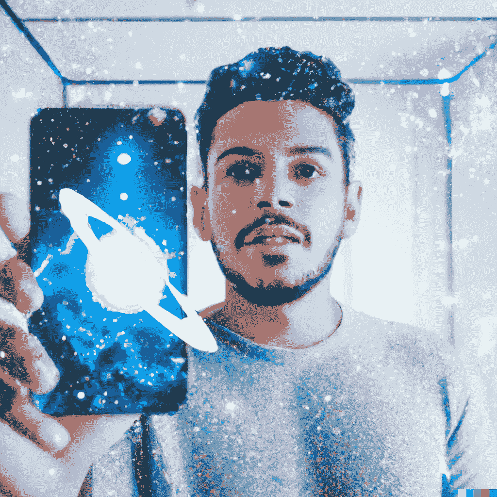
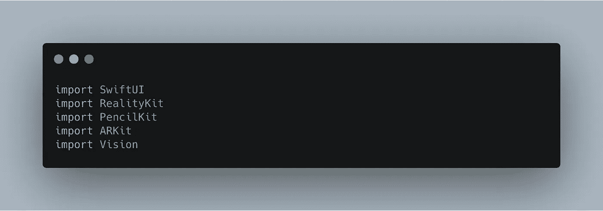
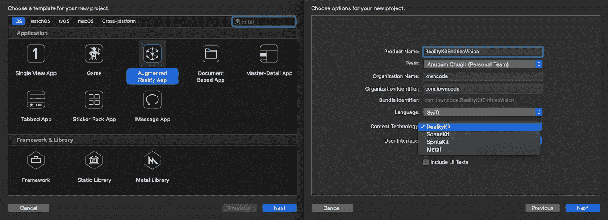
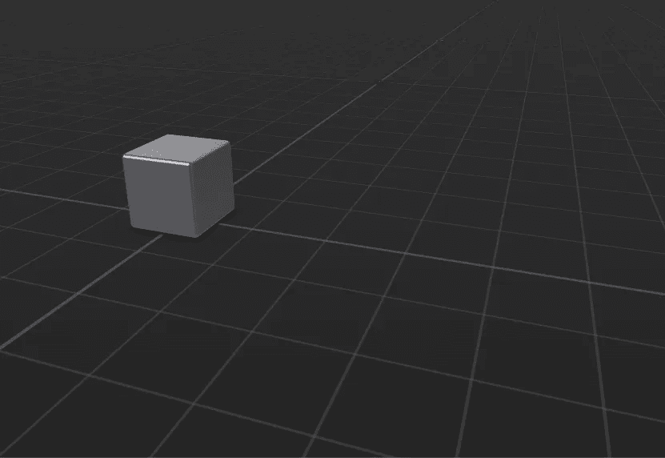
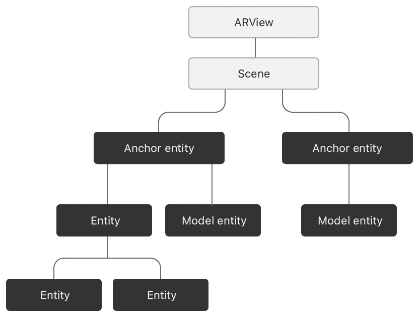
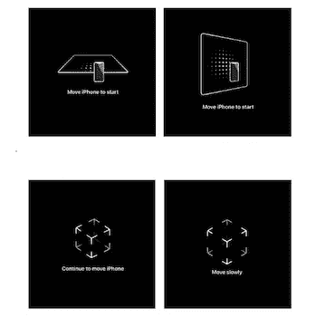
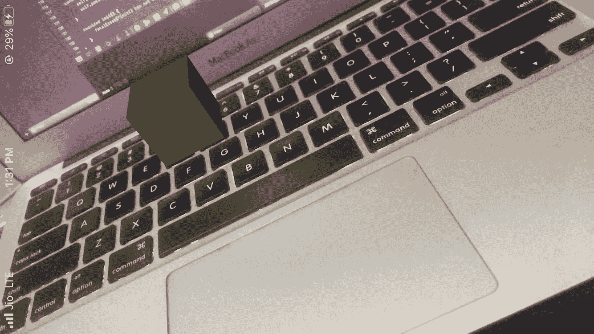
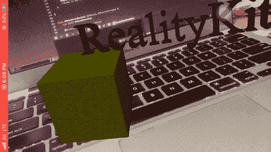
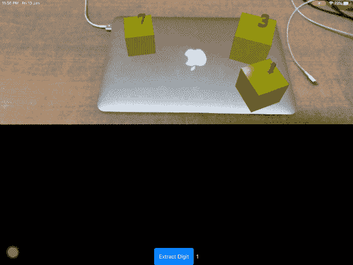

# iOS 上的 RealityKit 简介—实体、手势和光线投射

> 原文：<https://betterprogramming.pub/introduction-to-realitykit-on-ios-entities-gestures-and-ray-casting-8f6633c11877>

## 利用现实工具包、愿景和铅笔工具包框架。是时候和 SceneKit 说再见了？



由 DALL-E 2 绘制

iOS 13 的推出为苹果的增强现实框架带来了重大升级。ARKit 3 带来了许多有趣的新功能——人物遮挡、运动跟踪、前后摄像头同步以及协作支持。ARKit 的这些增强强烈表明了苹果进一步推动 AR 沉浸的雄心。

在 iOS 12 之前，我们有 SceneKit、SpriteKit 和 Metal 作为主要的渲染框架。其中，3D 图形框架 SceneKit 是构建 ARKit 应用程序最合理的选择。

虽然 SceneKit 框架的许多增强功能预计将在 2019 年 WWDC 大会上宣布，但苹果公司推出了一个全新的独立 3D 引擎框架，让我们大吃一惊——**reality kit**，它允许开发人员比以往任何时候都更容易地创建 AR 体验和场景。此外，它还附带了一个实用程序 Reality Composer，允许我们创建自己的 3D 对象和定制。

# 我们的目标

本文的目的是让您开始使用 RealityKit，并开始构建令人惊叹的基于增强现实的应用程序。我们将首先为基于 AR 的 iOS 应用程序设置一个 Xcode 项目，然后简单浏览一下 RealityKit 框架的各个关键组件。

在我们学习本教程的过程中，我们将把各个部分放在一起，最终形成一个非常酷的 AR 应用程序，让用户可以将 3D 模型和结构添加到 RealityKit 的虚拟场景中，并通过使用手势与它们进行交互。

此外，我们将设置一个绘图画布视图来处理用户输入。在这种情况下，用户输入将包括使用 [MNIST](https://developer.apple.com/machine-learning/models/) 核心 ML 模型推断的数字，这些数字然后将被转换成 3D 文本，最终被放置在虚拟场景中。

除了`RealityKit`和`ARKit`，我们将在应用中使用以下 iOS 框架:

*   **PencilKit** —这是 iOS 13 中引入的一个绘图框架，允许我们创建自定义的、基于画布的应用程序。我们将利用这个框架来处理输入。
*   **SwiftUI 和 Vision** — SwiftUI 是流行的新声明式 UI 框架，而 [Vision](https://heartbeat.fritz.ai/advancements-in-apples-vision-framework-2019-year-in-review-4c9d3ad5b138) 用一个易于使用的 API 抽象了复杂的计算机视觉算法。



我们应用程序的主要参与者

# 项目设置

首先，打开 Xcode 11 或更高版本，然后创建一个新项目。转到 iOS 选项卡，选择*增强现实应用*模板。在向导中，确保选择 RealityKit 作为技术，SwiftUI 作为用户界面，如下所示:



SwiftUI 支持不适用于 SceneKit。苹果倾向于 RealityKit 的另一个迹象。

如果你在 Xcode 中查看左侧面板，你会看到一个名为`Experience.rcproject`的文件。这是一个现实作曲家文件。默认情况下，它带有一个由一个钢箱组成的单一场景。您可以使用自定义模型、3D 资源和效果创建自己的场景。

您刚刚创建的 starter 项目由一个`ARView`组成，在这个项目中，box 实体被加载并添加到`ARView`的锚中。在构建项目时，以下框将显示在 AR 应用程序屏幕的中间:



Reality Composer 场景文件中默认框的一瞥。

起始项目没有任何手势和与虚拟场景的交互。随着我们的进行，我们将不再使用 Reality Composer 来构建场景和结构，而是以编程方式创建我们自己的 3D 实体。但在我们这样做之前，让我们谈谈构建 RealityKit 场景的核心组件，并解决一些花哨的术语——场景、实体、锚点等。

# 现实解剖工具包

RealityKit 的`ARView`是负责处理 AR 体验的视图。从设置 onboarding 体验(稍后将详细介绍)到配置 ARKit 配置、相机和交互，一切都要经过`ARView`。

每个`ARView`都包含一个`scene`——一个只读实例，我们在其上添加了`AnchorEntities`。



来自[苹果文档](https://developer.apple.com/documentation/realitykit/entity)

An `Entity`是 RealityKit 最重要的组成部分。RealityKit `scene`中的所有对象都是实体。An `AnchorEntity`是所有实体的根。与 ARKit 的`ARAnchor`类似，它负责保存实体及其子实体。

我们可以给一个实体添加`[Components](https://developer.apple.com/documentation/realitykit/component)`来进一步定制它。一个`ModelComponent`让我们定义 3D 对象的几何图形，一个`CollisionComponent`让我们处理对象之间的碰撞。

RealityKit 使生成简单的 3D 形状变得非常容易，如盒子、球体、平面和文本。

下面的代码展示了如何创建一个代表立方体的`ModelEntity`:

```
let box = MeshResource.generateBox(size: 0.3) // size in metreslet material = SimpleMaterial(color: .green, isMetallic: true)
let entity = ModelEntity(mesh: box, materials: [material])
```

`Material`协议用于设置实体的颜色和纹理。目前，RealityKit 提供的三种内置类型的`Material`为:

*   `SimpleMaterial` —用于设置颜色和实体是否是金属的。
*   `OcclusionMaterial` —一种隐藏其背后渲染对象的不可见材质。
*   `UnlitMaterial` —这种实体对 AR 场景中的灯光没有反应。

通过以下方式将实体添加到场景中:

```
let anchor = AnchorEntity(plane: .horizontal)
anchor.addChild(entity)
arView.scene.addAnchor(anchor)
```

为了将实体添加到虚拟场景中，我们需要确保它符合`HasAnchoring`协议，或者作为子元素添加到具有该属性的锚点中，正如我们上面所做的那样。

由于`ModelEntity`不符合`HasAnchoring`协议，因此以下内容不起作用:

```
arView.scene.anchors.append(entity) //**this would not work**
```

在我们创建第一个自定义实体并将其添加到场景中之前，让我们看看`ARCoachingOverlay`是什么以及如何将其集成到我们的`ARView`中。

# 配置 ARCoachingOverlay

`ARCoachingOverlayView`用于向用户提供视觉指示，以便于 ARKit 的世界跟踪。为此，我们需要将该视图添加为`ARView`的子视图，并设置`goal`属性，该属性指定了跟踪需求— `horizontalPlane`、`verticalPlane`、`anyPlane`或`tracking`(跟踪特征点)。一旦目标确定，则`ARCoachingOverlayView`解除。



教练覆盖视图一瞥

```
extension ARView: ARCoachingOverlayViewDelegate {
    func addCoaching() {

        let coachingOverlay = ARCoachingOverlayView()
        coachingOverlay.delegate = self
        coachingOverlay.session = self.session
        coachingOverlay.autoresizingMask = [.flexibleWidth, .flexibleHeight]

        coachingOverlay.goal = .anyPlane
        self.addSubview(coachingOverlay)
    }

    public func coachingOverlayViewDidDeactivate(_ coachingOverlayView: ARCoachingOverlayView) {
        //Ready to add entities next?
    }
}
```

一旦目标达到，代表的`coachingOverlayViewDidDeactivate`功能就会被触发。默认情况下`ARCoachingOverlay`是自动的。这意味着，如果在场景中，特征点或平面丢失，登机将重新开始。您可以通过将其设置为一次性操作来防止这种情况，并通过设置`coachingOverlayView.activatesAutomatically = false`来禁用自动行为。

接下来，只需在`ARView`实例上执行上面的`addCoaching`功能，如下所示:

```
struct ARViewContainer: UIViewRepresentable {

    func makeUIView(context: Context) -> ARView {

        let arView = ARView(frame: .zero)
        arView.addCoaching()

        let config = ARWorldTrackingConfiguration()
        config.planeDetection = .horizontal
        arView.session.run(config, options: [])

        return arView
    }
    func updateUIView(_ uiView: ARView, context: Context) {}
}
```

接下来，我们将创建一个自定义实体，并在`ARCoachingOverlayView`消失后将其添加到场景中。

# 创建自定义框实体

通过遵循`[HasModel](https://developer.apple.com/documentation/realitykit/hasmodel)`和`[HasAnchoring](https://developer.apple.com/documentation/realitykit/hasanchoring)`协议，我们可以创建自己的自定义形状和大小的`Entity`子类。此外，`[HasCollision](https://developer.apple.com/documentation/realitykit/hascollision)`协议用于实现与实体的交互——光线投射(稍后将详细介绍)、手势处理(缩放、平移、旋转)等。

以下代码显示了如何创建自定义实体框结构:

```
class CustomBox: Entity, HasModel, HasAnchoring, HasCollision {

    required init(color: UIColor) {
        super.init()
        self.components[ModelComponent] = ModelComponent(
            mesh: .**generateBox**(size: 0.1),
            materials: [SimpleMaterial(
                color: color,
                isMetallic: false)
            ]
        )
    }

    convenience init(color: UIColor, position: SIMD3<Float>) {
        self.init(color: color)
        self.position = position
    }

    required init() {
        fatalError("init() has not been implemented")
    }
}
```

还有一个方便的初始化器，允许我们指定实体在场景中相对于摄像机的位置:

```
let box = CustomBox(color: .yellow)
//or
let box = CustomBox(color: .yellow, **position**: [-0.6, -1, -2])self.scene.anchors.append(box) //self is arView
```



放在离摄像机一定距离的盒子

现在我们已经在 AR 场景中添加了一个实体，但是我们还不能与它进行任何交互！要做到这一点，我们需要添加手势，这将是我们接下来要探讨的。

# 实体手势和子实体

RealityKit 为我们提供了一堆内置的手势交互。具体来说，它允许缩放、旋转和平移 AR 场景中的实体。要在一个实体上启用手势，我们需要确保它符合`HasCollision`协议(我们在上一节中已经这么做了)。

此外，我们需要通过以下方式在实体上“安装”相关的手势(`scale`、`translate`、`rotate`或`all`):

```
let box = CustomBox(color: .yellow, position: [-0.6, -1, -2])
**self.installGestures(.all, for: box)
box.generateCollisionShapes(recursive: true)**
self.scene.anchors.append(box)
```

函数`generateCollisionShapes`生成与实体模型组件尺寸相同的实体碰撞组件的形状。碰撞组件负责与实体交互。

为了安装多个手势，我们使用数组中的手势列表调用方法，如下所示:

```
arView.installGestures(.init(arrayLiteral: [.rotate, .scale]), for: box)
```

这样，我们的实体就可以在 AR 场景中进行交互和玩耍了。

## 将实体添加到另一个实体

我们还可以向当前实体添加子实体，并相对于当前实体定位它们。让我们通过在盒子顶部添加 3D 文本网格来扩展我们当前的案例，如下所示:

```
let mesh = MeshResource.generateText(
            "RealityKit",
            extrusionDepth: 0.1,
            font: .systemFont(ofSize: 2),
            containerFrame: .zero,
            alignment: .left,
            lineBreakMode: .byTruncatingTail)

        let material = SimpleMaterial(color: .red, isMetallic: false)
        let entity = ModelEntity(mesh: mesh, materials: [material])
        entity.**scale** = SIMD3<Float>(0.03, 0.03, 0.1)

        **box.addChild(entity)**

        entity.**setPosition**(SIMD3<Float>(0, 0.05, 0), relativeTo: box)
```

下面是我们的 RealityKit 应用程序的一瞥，文本放在框的上方:



注意，世界环境对实体的照明有影响。上图中看起来呈淡黄色的同一个盒子在不同的环境下会看起来更亮。

现在，我们已经为实体添加了交互性并创建了一个 3D 文本网格，让我们继续 RealityKit 的最后一部分——光线投射。

# 光线投射

光线投射，很像命中测试，帮助我们从你的屏幕点找到一个 AR 场景中的 3D 点。它负责通过使用光线相交来查找真实世界表面上的点，将触摸屏上的 2D 点转换为真实的 3D 坐标。

虽然`[hitTest](https://developer.apple.com/documentation/realitykit/arview/3243230-hittest)`出于兼容性原因在 RealityKit 中可用，但光线投射是首选方法，因为它不断完善场景中跟踪表面的结果。

我们将扩展上面的应用程序，以允许 SwiftUI 中的`ARView`中的触摸手势被转换为 3D 点，我们最终将在那里定位实体。

目前，SwiftUI 中的`TapGesture`方法不返回视图的位置——它被按下的位置。所以我们将依靠 UIKit 框架来帮助我们找到点击手势的 2D 位置。

在下面的代码中，我们在`ARView`中设置了我们的`UITapGestureRecognizer`，如下所示:

*   注意`findEntities`功能——这有助于我们根据 2D 屏幕点在 3D 空间中找到附近的实体。
*   将在我们的`ARView`实例上调用`setupGestures`方法。
*   `makeRaycastQuery`创建了一个`[ARRaycastQuery](https://developer.apple.com/documentation/arkit/arraycastquery)`，其中我们已经通过了屏幕上的点。或者，如果您打算每次只将实体添加到屏幕的中心，则可以通过屏幕的中心点。此外，平面`type`(精确或估计)和`orientation`(您可以在`horizontal`、`vertical`或`any`中选择设置)。
*   光线投射返回的结果用于创建一个`AnchorEntity`,我们在上面添加了带有文本的框实体。
*   `overlayText`是我们将从用户输入中接收到的 3D 文本标签(稍后将详细介绍)。

在我们跳到`PencilKit`来创建输入数字之前，让我们修改一下`ARViewContainer`，它用我们到目前为止所做的修改来加载`ARView`。

# 使用 SwiftUI 协调器配置 ARView

在下面的代码中，`Coordinator`类被添加到`ARViewContainer`中，以允许数据从`PencilKitView`流向`ARView`。

`overlayText`由`ARView`场景从`Coordinator`类中选取。接下来，PencilKit 符合愿景框架。

# 使用 PencilKit 处理输入

PencilKit 是 iOS 13 中引入的新绘图框架。在我们的应用程序中，我们将让用户在 PencilKit 的画布上绘制数字，并通过将核心 ML MNIST 模型馈送到视觉框架来对这些手写数字进行分类。

以下代码设置 SwiftUI 中的 PencilKit 视图(`PKCanvasView`):

```
struct PKCanvasRepresentation : UIViewRepresentable {

    let canvasView = PKCanvasView()

    func makeUIView(context: Context) -> PKCanvasView {

        canvasView.tool = PKInkingTool(.pen, color: .secondarySystemBackground, width: 40)
        return canvasView
    }

    func updateUIView(_ uiView: PKCanvasView, context: Context) {
    }
}
```

# 内容视图

现在是时候将`ARView`和`PKCanvasView`合并到我们的`ContentView`中了。默认情况下，SwiftUI 视图占用最大的可用空间。因此，这两个视图几乎占据了屏幕的一半。

`ContentView.swift`文件的代码如下所示:

以下代码为 SwiftUI 按钮设计样式:

```
struct MyButtonStyle: ButtonStyle {
    var color: Color = .green

    public func makeBody(configuration: MyButtonStyle.Configuration) -> some View {

        configuration.label
            .foregroundColor(.white)
            .padding(15)
            .background(RoundedRectangle(cornerRadius: 5).fill(color))
            .compositingGroup()
            .shadow(color: .black, radius: 3)
            .opacity(configuration.isPressed ? 0.5 : 1.0)
            .scaleEffect(configuration.isPressed ? 0.8 : 1.0)
    }
}
```

终于，我们的 app 做好了！下面是 RealityKit + PencilKit iOS 应用程序的示例:



iPad 的输出

从 PencilKit 绘图中提取数字后，我们所做的就是从屏幕上触摸`ARView`的点投射光线，在平面上创建一个实体。目前，这些实体不支持碰撞，并且可以相互拖动。我们将在后续教程中处理碰撞和更多的交互，敬请关注！

# 结论

RealityKit 在这里抽象了很多样板代码，让开发者专注于构建更加沉浸式的 AR 体验。它完全用 Swift 编写，是 SceneKit 的替代品。

在这里，我们也很好地了解了 RealityKit 的实体和组件，并了解了如何设置教练层。此外，我们创建了自己的自定义实体和子实体。随后，我们深入研究了 RealityKit 当前支持的 3D 手势，并将它们集成到实体上，然后探索了光线投射。最后，我们集成了 PencilKit 来处理用户输入，并使用 Vision 框架来预测手绘数字。

完整的源代码以及 MNIST 核心 ML 模型可以在这个 [GitHub 库](https://github.com/anupamchugh/iowncode/tree/master/RealityKitEntitiesVision)中找到。

从这里开始，我们将探索 RealityKit 中其他有趣的功能。加载不同种类的对象，添加声音，以及执行和检测碰撞的能力将是下一个目标。

这一次到此为止。感谢阅读。