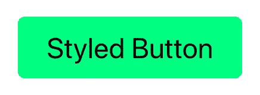
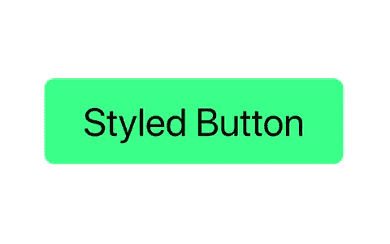
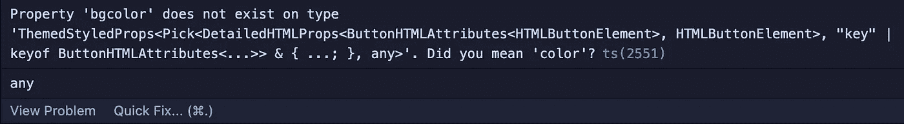

# React 中的样式化组件介绍

> 原文：<https://betterprogramming.pub/introduction-to-styled-components-in-react-d84583c28dde>

## 了解如何创建样式组件、全局主题和通行证道具


照片由[元素 5 数码](https://unsplash.com/@element5digital?utm_source=medium&utm_medium=referral)在 [Unsplash](https://unsplash.com?utm_source=medium&utm_medium=referral) 上拍摄

Styled-components 是一个流行的库，用于对 React 应用程序进行样式化。它允许您通过在 JavaScript 中编写实际的 CSS 来构建自定义组件。

在本文中，我们将了解如何在 React 应用程序中使用样式化组件。

在本文结束时，您应该对如何执行以下操作有所了解:

*   创建样式化组件
*   将属性传递给样式化的组件
*   创建和使用主题

在我们深入研究代码之前，让我们先快速概述一下样式组件库，并理解使用它的好处。

# 什么是样式组件？

在设计 React 应用程序的样式时，有许多选项可供选择。传统的方法是创建一个外部 CSS 文件，然后将属性作为字符串传递给`className` prop。

您还可以使用 CSS-in-JS 技术，在 JavaScript 文件中编写 CSS。样式化组件采用这种方法。

> "使用 ES6 和 CSS 的精华来设计你的应用，没有压力."—风格化组件网站

## 使用样式化组件的好处

*   **自动关键 CSS** —样式化组件跟踪页面上呈现的组件，并且只添加它们的样式
*   **没有类名错误** —样式化组件为样式生成唯一的类名
*   **更容易删除 CSS** —样式绑定到特定的组件，而不是作为类名添加
*   **简单的动态样式** —可以基于道具或主题向组件添加样式
*   **轻松维护** —添加到组件的样式在一个地方完成，而不是跨越多个文件
*   **自动供应商前缀**——样式化组件处理所有这些

# 创建样式化组件

首先，让我们创建第一个样式化的组件。我将在一个基本的`create-react-app`项目上工作，支持 TypeScript。您可以跟随或不跟随 TypeScript。

使用样式化组件命名文件的传统方式是`*componentName*.styled.ts`。其中“*组件名”*替换为组件名。

例如，我将创建一个名为`/src/components/styles/Button.styled.ts`的新文件。这是我将创建我的`<Button>`组件的地方。

在这个文件中，首先是`import styled from 'styled-components';`。然后，您可以使用`styled`来创建一个样式化的组件。

> "样式化组件利用标记的模板文字来样式化你的组件."—风格化组件网站

换句话说，当您定义样式时，您实际上是在创建一个组件，该组件使用模板文字附加了样式。

首先，键入`styled.`，后跟一个有效的 React 组件或标记名，如 *'div'* 。对于这个例子，我们将创建一个样式化的按钮组件。

我们现在可以像应用程序中任何普通的`<button>`元素一样使用这个`Button`组件。

```
<Button>Styled Button</Button>
```

当我们呈现按钮时，它现在将包含所有的样式。



您还可以嵌套规则、添加媒体查询和添加伪类来指定元素的特定状态。例如，在我的`Button`组件中，我将添加一个悬停伪类，如下所示:

现在，当我们悬停在按钮上时，我们可以看到背景颜色和文本颜色相应地改变。



# 将属性传递给样式化的组件

我们也可以在样式组件中传递道具。您可以向`Button`组件传递任何属性，然后在样式化的组件中访问它。

比如我会把一个叫`bgcolor="springGreen"`的道具传给我的`Button`。然后，在`Button.styled.ts`文件中，我可以访问这个道具。

```
background-color: ${props => props.bgcolor};
```

如果你使用的是 JavaScript，这就很好了。但是如果你使用 TypeScript，你会遇到一个错误。



要修复这个错误，您需要为这个`Button`组件创建一个接口。在这个界面中，您可以定义您将传递给`Button`的道具。

```
interface ButtonProps {
  bgcolor: string;
}
```

然后我们可以将这个接口传递给`Button`组件。现在我们可以访问`bgcolor` prop，TypeScript 不会显示错误。

```
export const Button = styled.button**<ButtonProps>**`
  **background-color: ${props => props.bgcolor};** ...other styles`;
```

我们也可以使用析构来使它变得更简洁。

```
export const Button = styled.button**<ButtonProps>**`
  **background-color: ${({ bgcolor }) => bgcolor};** ...other styles`;
```

# 创建和使用主题

您还可以创建一个带有样式组件的全局主题。在这个主题中，我们可以在任何样式的组件中存储我们想要访问的不同值。

例如，在我们的`Button`组件中，我们从主题中访问值，而不是向我们使用的每个按钮传递一个道具。

要使用主题，我们首先需要用`<ThemeProvider>`包装我们的应用程序。

在`App.tsx`文件中，`import { ThemeProvider } from 'styled-components'`。然后用`ThemeProvider`包装整个应用程序。这个`ThemeProvider`需要一个叫做主题的道具。

`theme`道具将接受一个定义`props.theme`外观的对象。

对于这个例子，我创建了一个单独的文件`src/styles/theme.ts`。在这个文件中，我创建了一个`theme`对象。

```
export const theme = {
  color: {
    primary: 'springGreen',
  },
};
```

然后，回到我的`Button.styled.ts`组件，我可以更新我的`Button`组件。我可以从主题中获取颜色，而不是使用我们之前传递的`bgcolor`道具。

```
export const Button = styled.button`
  **background-color: ${props => props.theme.color.primary};** ...other styles`;
```

同样，我也可以在这里使用析构来使它看起来更干净一点。

```
export const Button = styled.button`
  **background-color: ${({ theme }) => theme.color.primary};**
  ...other styles
`;
```

现在我们可以在我们创建的任何样式化组件中使用这个`theme.color.primary`值。如果我们决定以后改变我们的原色，我们只需要更新主题。

# 结论

感谢阅读！我希望这篇文章有助于您开始使用 React 的样式化组件。Styled-components 是对 React 项目进行样式化的一个很好的选择，因为它易于使用并且能够创建可重用的组件。

如果您想了解另一种设计 React 应用程序样式的方法，请查看下面这篇关于 Tailwind CSS 的文章。

[](https://javascript.plainenglish.io/introduction-to-using-tailwind-css-with-next-js-d609be5b6e91) [## 将 Tailwind CSS 用于 Next.js 的介绍

### 为什么应该在 Next.js 应用程序中使用 Tailwind CSS

javascript.plainenglish.io](https://javascript.plainenglish.io/introduction-to-using-tailwind-css-with-next-js-d609be5b6e91) 

# **资源**

*   [https://styled-components.com/](https://styled-components.com/)