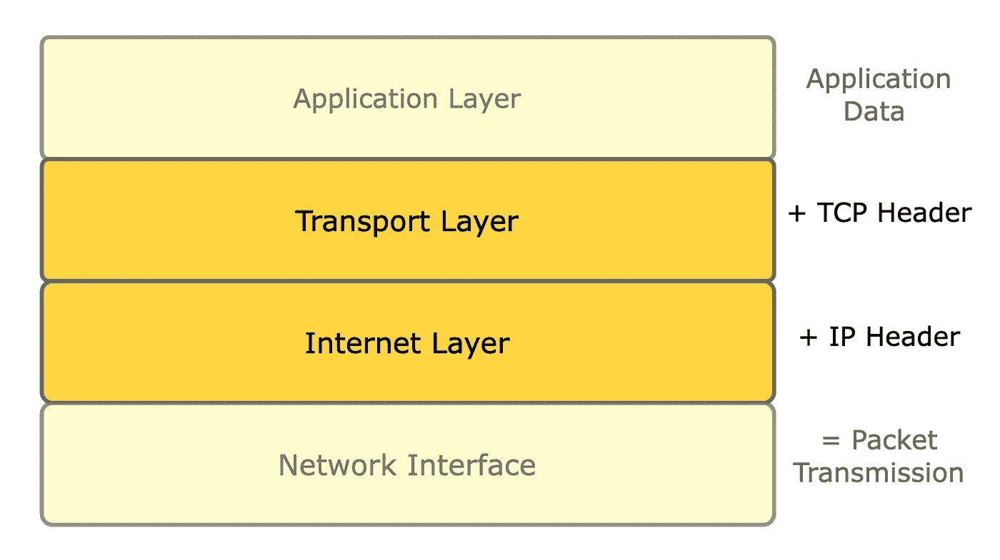
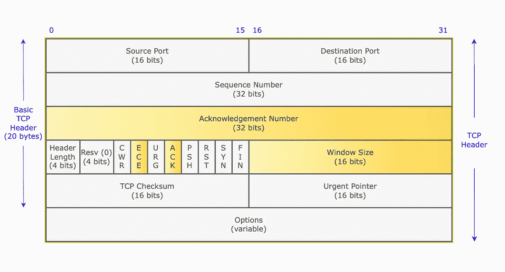
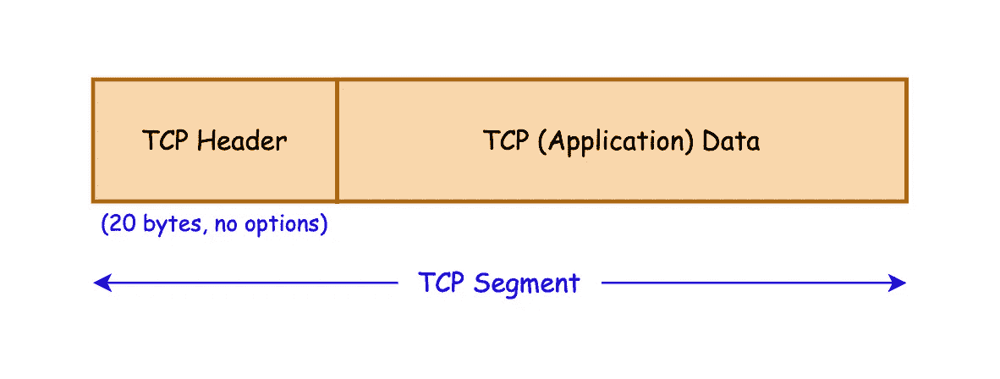
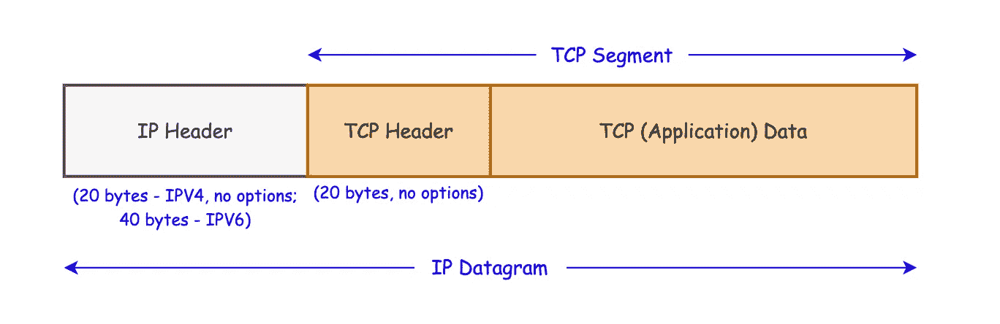
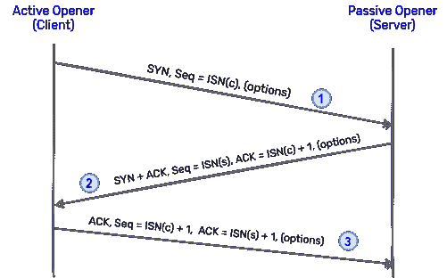
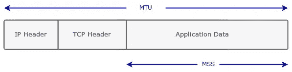
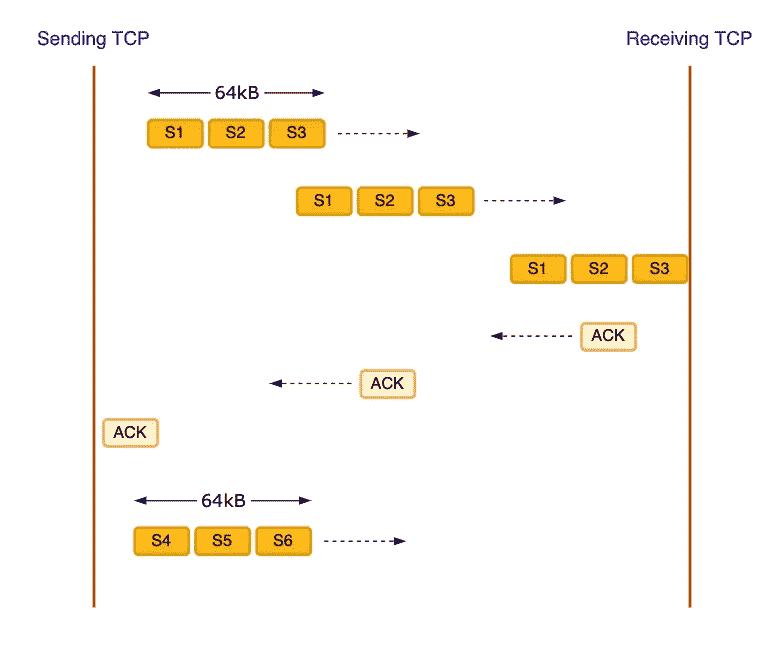
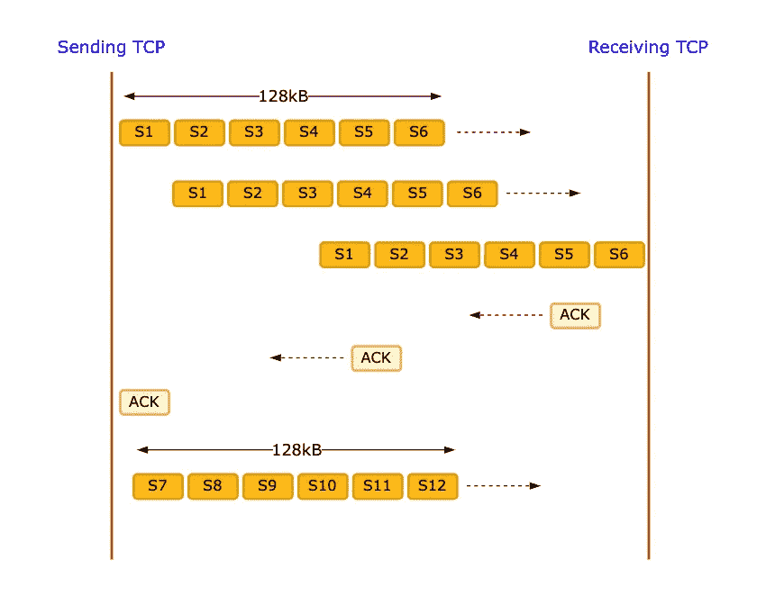
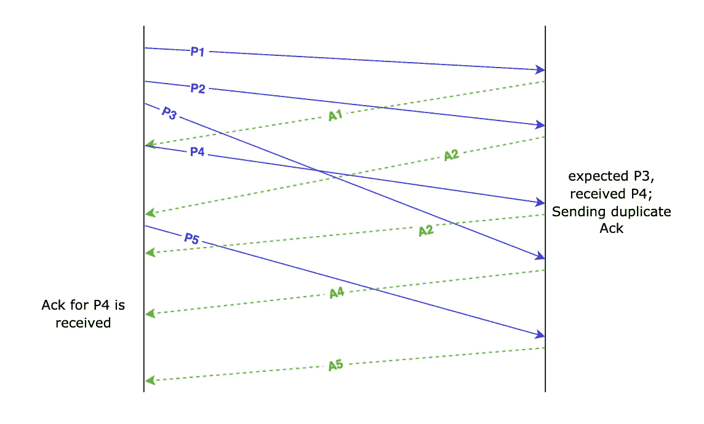

# 面向软件开发人员的 TCP 连接建立介绍

> 原文：<https://betterprogramming.pub/introduction-to-tcp-connection-establishment-for-software-developers-233878c5143d>

## 关于 TCP 你绝对应该知道的事情

传输控制协议(TCP)提供可靠的、面向连接的字节流传输层服务。它的实现非常有趣。

在本文中，我们将探索 TCP 连接建立是如何工作的，它如何通过维护连接状态来确保可靠性，以及它是否适合每一个用例。

在进入握手的内部之前，我们先来看看 TCP。

# 了解 TCP

TCP 连接被定义为由两个 IP 地址和两个端口号组成的四元组。每个 IP 地址端口号对代表一个端点。

这意味着，如果客户端的 IP 地址和/或端口号是唯一的，一台服务器可以连接到许多客户端。

# TCP 适合哪里？

传输控制协议(TCP)是我们可用的传输层协议之一，它被广泛使用是有原因的。

为了理解为什么需要它，让我们看一下 TCP/IP 模型中的协议栈:



TCP/IP 模型

来自应用层(例如，您的浏览器)的 HTTP 请求会通过所有层在互联网上发送。互联网层处理发送小块数据，也称为 IP 数据报。数据报充当 TCP 数据段的信封，IP 层的工作是通过互联网发送它们。

因为 IP 层不知道 TCP 连接，所以对应于同一连接的两个数据包经常通过不同的路由发送。这使得互联网上的数据传输不可靠，并引起各种问题，如重复分组、无序分组、分组丢失等。

TCP 提供对所有这些情况的处理，并在接收端提供有保证的、无丢失的、有序的数据包传送。

***注意:****TCP 的可靠性方面只适用于一个连接的两端。数据包在传输过程中不断被打乱、丢失、复制。*

# TCP 报头和 IP 数据报

TCP 数据段在报头中携带有关连接的所有元信息。基本 TCP 报头为 20 字节(无选项)；这意味着任何数据包的传输都需要 20 字节的数据开销。

让我们了解一下 TCP 报头是由什么组成的:



TCP 报头

*确认号、窗口大小、ECE 和 ACK 位携带相对于发送方以相反方向流动的数据。*

1.源端口和目的端口。

2.`Sequence Number`:标识发送给接收 TCP 的数据段的第一个字节。

3.`Acknowledgement Number`:包含确认发送方期望接收的下一个`Sequence Number`；即，

`Acknowledgement Number = Sequence Number + 1`

4.窗口大小:这是接收 TCP 愿意接收的字节数。它是一个 16 位字段，将窗口大小限制为 65，535 字节。我们使用`Window Scaling`来解决这个瓶颈。

5.TCP 校验和:由发送 TCP 强制发送，并由接收端验证，以检测数据损坏。

6.紧急指针(urgent Pointer):TCP 中的这种机制用于向另一端发送一些特定的紧急数据。仅当设置了 URG 字段时，它才有效。

7.其他位字段:在连接建立过程中主要使用两个字段:

*   SYN:在连接建立阶段开始时，该位在第一个数据段中打开。
*   ACK:当需要发出确认时使用。始终开启，除了第一个和最后一个(连接拆除)数据包。

所有这些关于连接的信息都存储在 TCP 报头中。将此报头与应用程序数据相结合，我们就得到 TCP 数据段，如下所示:



TCP 数据段由报头和应用数据组成

但是到目前为止，我们只知道源端口和目的端口。我们还需要源 IP 地址和目的 IP 地址，以便唯一地标识 TCP 连接(还记得吗？).并且这发生在传输期间的下一层(即，IP 层)。



TCP/IP 数据报在 TCP 报头的顶部包含 IP 报头

IP 层只是在收到的 TCP 数据段上添加自己的报头，使其成为 IP 数据报。这些报头在接收端以相反的顺序被逐渐剥离。

因此，TCP 和 IP 层共同构成了一个唯一的 TCP 连接。我们得到了 TCP/IP 协议套件。

# 让我们握手吧

*我推荐打开 Chris Greer 旁边的这个* [*包跟踪文件*](https://www.cloudshark.org/captures/98ad8cdd3082) *。下面讨论的所有字段都可以在每个数据包的 TCP 层找到。只有前三个数据包对应于握手过程。*

连接建立由一个想要连接到一个被动开启器(通常是一个服务器)的[主动开启器](https://stackoverflow.com/questions/29335144/what-are-the-difference-between-an-active-open-and-a-passive-open-in-a-tcp-socke)(通常是客户端)启动，在此过程中总共传输了三个 TCP 段。

本练习的目标是让连接的每一端都知道连接正在启动，共享一些重要的配置(也称为 TCP 选项)，并交换初始序列号(ISN)。

主动开启者在发起连接时决定 ISN。ISN 的不可预测性对于连接的安全性至关重要。一个局外人可以欺骗接收主机(或被动开启)，并假装是实际的发送者，如果他们可以预测的 ISN。

让我们更仔细地看一下每个步骤:



TCP 三次握手

## **【段 1】:客户端发送一个 SYN 段**

主动开启者(或客户端)发送的第一个 TCP 数据段包含以下内容:

1.存储在目标端口中的服务器端口

2.TCP 标志中设置的 SYN 位

3.是存储在`Sequence Number`中的客户端

***注*** *:跟踪文件显示* `*Sequence Number*` *的相对值，使其可读，其真实值以十六进制显示在右边。*

4.存储在 TCP 选项中的一些配置选项(我们将在接下来处理它们)

## [段 2]:服务器用 SYN-ACK 段进行响应

服务器发送自己的 SYN 数据段。它还会确认从客户端收到的数据段。它发送包含以下内容的数据段:

1.SYN 位开启

2.`Sequence Number = ISN(server)`

3.ACK 位打开(以确认从对等方收到的数据段)

4.`Acknowledgement Number = ISN(client) + 1`

## [段 3]:客户端发送最后一个 ACK 段

最后，客户机用 ACK 确认从服务器收到的 SYN。本质上:

1.它设置 ACK 位来确认服务器的 SYN 段

2.`Sequence Number = ISN(client) + 1`

3.`Acknowledgement Number = ISN(server) + 1`

如果 SYN 数据段丢失，它将被重新传输，直到收到它的 ACK。

# TCP 选项

有一些附加的配置设置有助于 TCP 连接中的高效数据流。其中一些选项在连接建立过程中只能设置一次，而其他选项可以在连接生命周期中的任何时间点使用。

让我们来看看一些最常用的 TCP 选项。

## 最大段大小(MSS)

它是 TCP 愿意从其对等方接收的最大数据段，因此也是其对等方在发送时应该使用的最大数据段。



最大段尺寸

这里需要注意的重要一点是，MSS 只计算应用程序数据，而不计算 TCP 和 IP 报头。另一方面，最大可传输单元(MTU)查看整个数据包，包括 TCP 和 IP 报头。

MSS 和 MTU 的大小是可配置的，但它必须低于承载这些数据包的以太网帧的最大容量。MTU 大小可以设置为大于帧的容量，但这样数据包就需要经过分段才能传送。

## 窗口缩放

窗口大小告诉连接中的对等方它已经为该特定连接分配或剩余了多少接收缓冲区。此选项在连接建立阶段设置，在连接生存期内不能更改。

TCP 报头中的窗口大小为 16 位，这使得最大值仅为 65536 字节(2 ⁶)。在高延迟网络的情况下，64KB 的窗口大小会使往返时间更长，往返时间(RTT)也更长。

窗口缩放 TCP 选项是一个 14 位字段，用于左移窗口大小值，使其显著变大，最大值可达 1GB (65，535 字节* 2 ⁴).这在处理高延迟、大带宽的情况时非常有用。

让我们借助这里的图示来理解:



缩放前的原始窗口大小

这里，发送方在收到任何确认之前可以发送的最大数据包大小是 64KB。我们可以观察到，发送方在发送了最大可能字节的数据后处于空闲状态，并且正在等待确认，以便可以发送更多的数据。

现在，让我们看看引入窗口缩放后的数据包传输:



缩放后增加了窗口大小

设置窗口缩放后，发送方能够发送两倍的数据量，并减少了发送端的空闲时间。因此，更好的利用。

同样，使用更大的窗口缩放因子将进一步增加有效窗口大小。窗口越大，发送 TCP 在没有收到任何确认的情况下可以发送的数据就越多。

## 选择性确认

通过网络发送的数据包经常丢失，导致确认号突然跳跃，并使字节流不连续。这在接收的数据中产生了漏洞，发送 TCP 不知道哪些包需要重传。

由于 SACK 在两端都得到支持(在连接建立期间协商)，接收方能够在间隙之后传送它接收到的数据包。两个字段有助于找出丢失的数据包:

1.`Acknowledgement Number`设置为间隙前收到的最后一个数据包偏移量。

2.TCP 选项中的 SACK 块，包含它在间隙后接收的数据块。

发送 TCP 采用间隙之后的第一个数据包和间隙之前的最后一个数据包之间的偏移差。这使得发送 TCP 很容易识别它需要重新传输的数据块。

因此，举例来说，如果接收 TCP 发送 1，000 的([重复](https://www.youtube.com/watch?v=KWiHAMDbrng))确认，并且 SACK 块包含 1100–1500 的范围，显然发送 TCP 只需要重新传输 1，000 到 1，100 的数据包。

## nototherwiseprovided（for）除非另有规定

当实际数据不符合大小限制时，这有助于 TCP 将字段填充为四个字节的倍数。

## 寿命终止

它指示“选项结束”列表，并显示不需要对选项列表进行进一步处理。

# 为什么我们需要三次握手？

如果我们仔细观察握手过程中发生的事情，双方都在跟踪他们用来发送和接收数据的偏移值(`sequence number`)。两端保持连接状态。

跟踪偏移值使连接双方能够确定发送和接收的数据包是否有问题。它有助于确定重复的数据包，纠正无序的数据包，并在数据包丢失的情况下重新传输。

*出现这些问题是因为 IP 层的工作方式。它没有 TCP 连接的上下文。在路由器级别，它根据一些路径计算发送数据包，这意味着对应于同一 TCP 连接的两个数据包可能会通过不同的路由到达同一目的地。这就是 TCP 必须处理这些场景的原因。*

下面是一个温和的数据包重新排序示例:

## 纠正无序数据包

由于对应于同一 TCP 连接的数据包通常在不同的路由上传输，因此它们到达接收 TCP 的顺序是混乱的。由于 TCP 保证按顺序传送，它将无序的数据包存储在其接收方缓冲区中，并等待丢失的数据包来填充字节流中的“洞”。



可以观察到轻微的分组重新排序

1.  接收端在收到 P3 之前收到了 P4 数据包。因此，它将 P4 保存在其接收缓冲区中，并发送一个(重复的)收到的最后一个数据包的确认。然后，它等待 P3 进来。
2.  一旦 P3 到达，它就发送与成功接收的最后一个数据包(即 P4)相对应的确认信息。

***注*** *:由于 TCP 确认在本质上是累积的，发送 P4 的确认也意味着 P3 的成功接收。*

因此，`Sequence Number`在跟踪丢失的数据包、无序的数据包，甚至重复的数据包中起着至关重要的作用。这就需要在两端建立连接并保持连接状态。

# 为什么选择 UDP 而不是 TCP？

在一些情况下，UDP 优于 TCP。造成这种情况的一些因素有:

1.服务负担不起 TCP 握手的开销，或者握手开销相对于实际发送的数据来说相当大。

2.偶尔丢包是可以接受的(取决于使用情况)。

UDP 优于 TCP 的一些例子有[多人游戏](https://gafferongames.com/post/udp_vs_tcp/)、天气数据、视频流等。

# 结论

我们已经了解了 TCP 连接的必要性及其作用，并研究了各种配置选项以满足各种需求。

看到 TCP 提供了多少抽象是很有趣的。在应用程序级别工作的开发人员从来不需要考虑这个问题。

如果你想探索更多，一个好的起点是 Chris Greer 在 TCP 上的[播放列表](https://www.youtube.com/playlist?list=PLW8bTPfXNGdAZIKv-y9v_XLXtEqrPtntm)。

如果你想深入研究 TCP/IP，我强烈推荐 TCP/IP 图文并茂的第一卷书。它非常深入地涵盖了这个主题。

本文原载于 rrawat.com[。](https://rrawat.com/blog/three-way-handshake)

```
**Want more such articles?**You can join my newsletter [here](https://buttondown.email/rishabh570).I write about my learnings and experiences related to web development technologies biweekly.
```