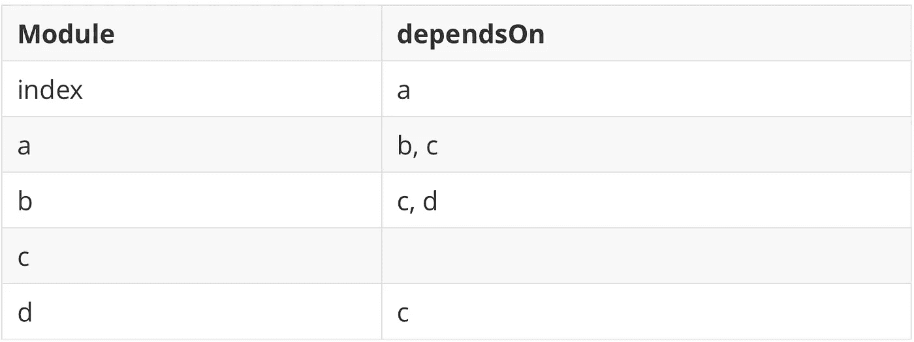
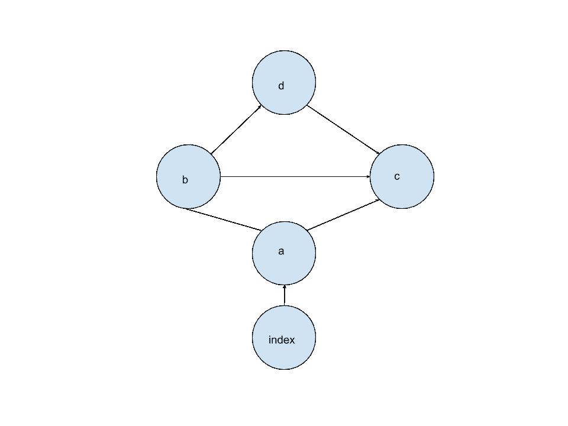
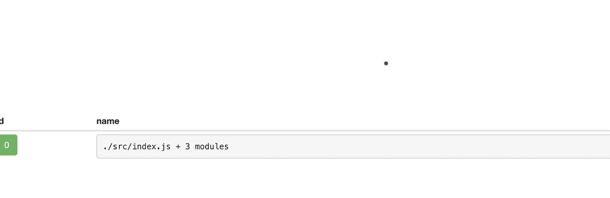
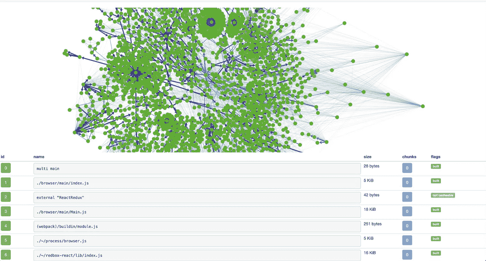
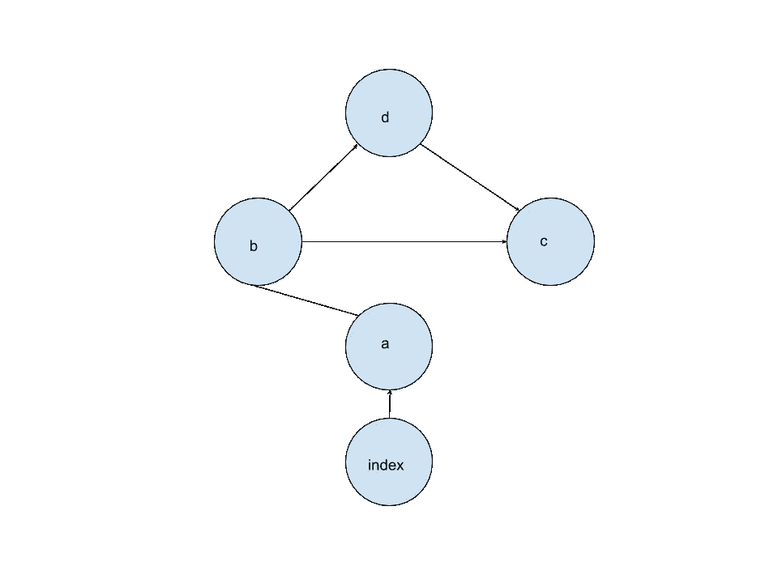
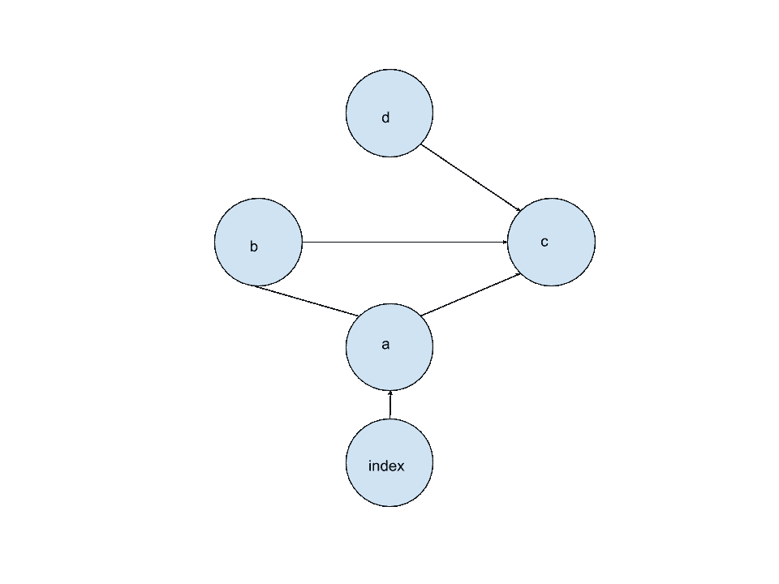
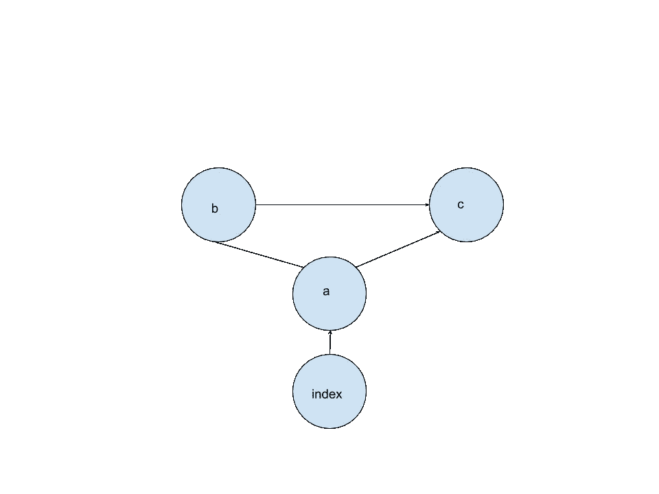
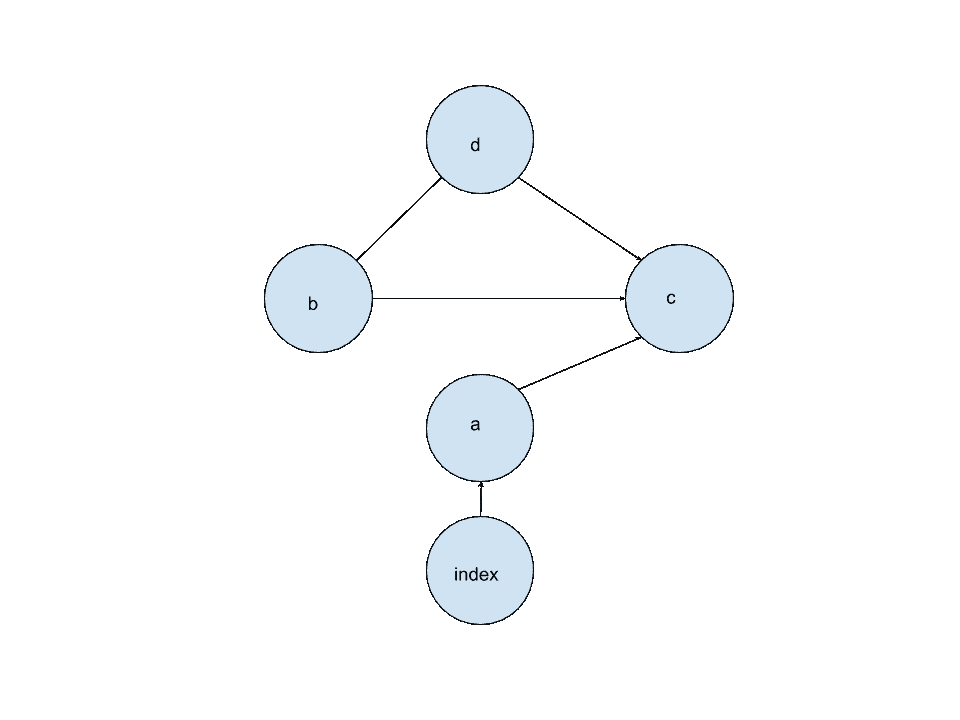
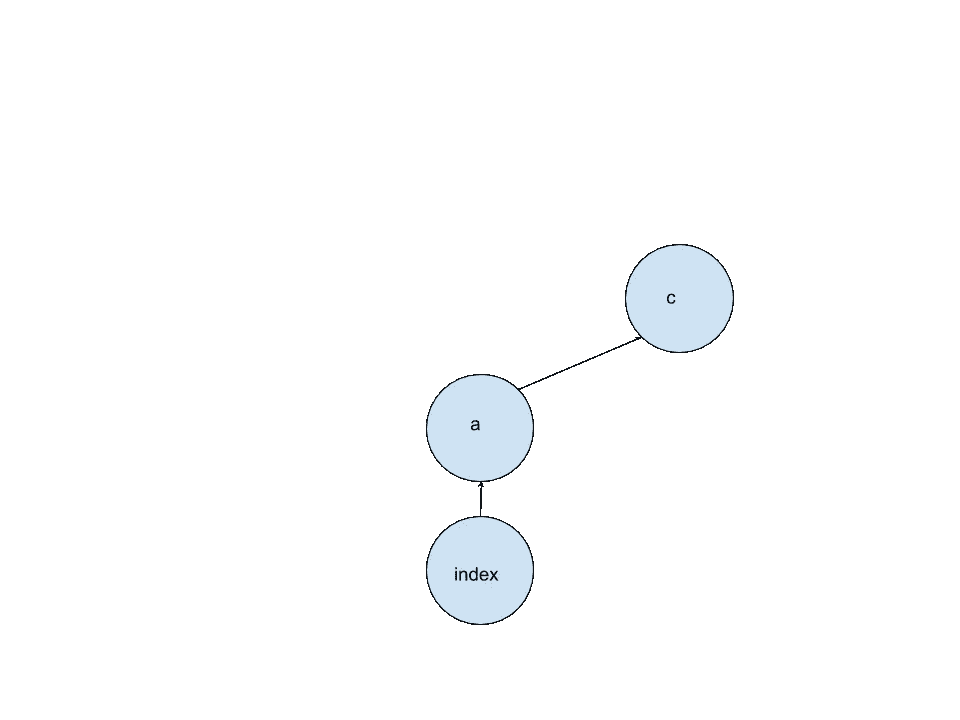

# 摇树入门

> 原文：<https://betterprogramming.pub/introduction-to-tree-shaking-e94e57db081e>

## 通过静态分析在编译时删除未使用或不可访问的代码。

[约翰·西门子](https://unsplash.com/@johannsiemens?utm_source=medium&utm_medium=referral)在 [Unsplash](https://unsplash.com?utm_source=medium&utm_medium=referral) 上的照片

# 介绍

今天我们来看看最容易被误解的减小体积的方法之一，摇晃树木。树的晃动引起了很多议论，所以值得研究。

> *注意:要获得更多关于束尺寸的帮助，请查看* [*测量*](https://medium.com/better-programming/reducing-js-bundle-size-58dc39c10f9c) *和* [*死代码消除*](https://medium.com/better-programming/reducing-js-bundle-size-a6533c183296) *！*

我们将研究树抖动意味着什么，它是如何工作的，它如何帮助消除死代码和模块依赖性，最后，我们应该从它那里得到什么。让我们首先回顾一下死代码消除。

# 死代码消除概述

在本系列的上一篇文章中，我们深入探讨了什么是[死代码消除](https://medium.com/better-programming/reducing-js-bundle-size-a6533c183296) (DCE)。尽管如此，让我们快速回顾一下 DCE 是什么，因为它对于理解树摇动是至关重要的，因为树摇动使用相同的技术。

DCE 是删除未使用或不可访问的代码的过程。像 [Terser](https://github.com/terser-js/terser) 这样的工具通常与 Webpack 这样的构建系统一起处理 DCE。以下是 DCE 的一个例子:

在上面的例子中，不可能返回到`type: hat`。那是因为事先有 else，使得代码不可访问。Terser 将尝试确定这一点，并删除这些未使用的示例。

类似地，`selectAccessory`函数在这段代码中从未执行过，因此也可以删除。但是如果我们对文件运行 Terser，您会注意到它没有被删除。

为什么这个没有被移除？因为 Terser 不是正数，所以这个函数不会在其他地方使用，也不会进行那个调用。它只删除它能保证不会被使用的代码。如果有任何歧义，它将不会采取任何行动。

我们需要的是将这个文件隔离为一个模块。封装一个文件可以用几种不同的模块风格来完成，但是 [CommonJS](https://nodejs.org/docs/latest/api/modules.html) (CJS)和 [ECMAScript 模块](https://exploringjs.com/es6/ch_modules.html) (ESM)无疑是最受欢迎的，ESM 是前端的标准，CJS 仍然普遍用于 [NodeJS](https://nodejs.org/en/) 。

不管怎样，在这一点上，你甚至不需要知道这是什么风格。通过使用 [Webpack](https://webpack.js.org/) 运行构建，我们可以看到不同之处。

> *对于所有的 Webpack 示例，我将保持代码不变。那是因为我想给出这段代码的样子。我已经用* `*console.log(name)*` *为我们提供了狩猎的地点。*

Webpack 做了很多优化，所以代码读起来可能有点棘手，但是请注意，现在已经没有`type:ring`的实例了。它意识到这个函数从来没有在模块内部调用过，并消除了它。

> *注意:接下来，我们将按照 ESM 风格调用这些*模块，*。假设这些都是封装的部分，会让他们想起来更舒服。我们将很快讨论为什么要使用 ESM。*

# 那么什么是树摇动呢？

我发现考虑这个问题的最简单的方法是把它想象成跨模块的死代码消除。到目前为止，我们的死代码消除只对给定的模块内部有效。它将检查代码是否不可访问或被调用，并从该模块中删除它。

但是如果我们有一个永远不会被调用的模块呢？还是只有一小部分是？那么我们可以从我们的代码库中移除它或者未使用模块中未使用的部分吗？

答案是“是的”，其中一些可能已经在 you⁠发生了——只是你不知道而已。让我们来看看这是如何实现的，以及这对您有何用处。我们将遵循以下步骤来实现这一目标:

*   理解为什么称之为摇树，这样我们就能从根本上理解我们的目标是什么
*   如何以一种允许最佳树抖动的方式编码
*   查看这种风格的代码示例
*   调查什么样的场景最有利于树摇动的应用

# 为什么叫树摇？

让我们停下来思考一下模块依赖是如何工作的。您告诉 Webpack 它应该查找的第一个文件，通常类似于`src/index.js`。从那里，Webpack 将打开该文件，并可能注意到您正在导入`a.js`。然后它会注意到`index`依赖于`a.js`。在`index`之后，Webpack 将查看`a.js`并扫描它的依赖性。

> *注意:根据模块系统的不同，会有一些异步加载，但为了简单起见，我们还是同步讨论一下。*

为了更好地理解这一点，让我们添加一些文件到我们的小项目中，并导入一些文件。既然我们已经有了`index.js`，让我们再做四个文件，分别命名为`a.js`、`b.js`、`c.js`和`d.js`。然后按照下面每个文件的步骤操作:

**a.js**

**b.js**

**c.js**

**戴杰**

**index.js**

很好，所以看上面的代码，我们可以映射出依赖关系。每个模块可以依赖于`0...n`模块。让我们将这些依赖关系放在一个表中。

完成简单的依赖关系表后，让我们将其绘制成图表。一个圆圈代表每个模块，一条线代表一个依赖关系。箭头表示它是 dependee 模块。在我们的例子中，图表应该是这样的:

看起来有点像树，不是吗？我们的模块集仍然很小，并且依赖关系有些连锁。在我们前进之前，看到一些更重要的项目，获得更好的视觉表现，将是很方便的。有一个很棒的工具可以做到这一点:Webpack Analyzer。它将为我们构建这些依赖图。首先，在我们项目运行的根中:

上述命令将创建一个`webpack-state.json`文件。现在，我们可以在分析器网站[这里](https://webpack.github.io/analyse/#home)上传这个。但是如果您导航到 modules 选项卡，您会注意到它看起来有点乏味:

嗯，我们的 Webpack 将这些捆绑在一起作为一个单独的块。因此，我们只把它看作一个点。但是我们现在知道了这个过程，所以我们在一个更重要的项目上尝试一下怎么样？我准备在 [Boostnote](https://github.com/BoostIO/Boostnote) 上试试，一个用 [React](https://reactjs.org/) 写的跨平台 markdown 编辑器。

首先，我们将用以下代码克隆 Boostnote:

如果我们将`webpack-stats`上传到 Webpack 分析器，我们会得到类似这样的结果:

这是一棵树。不幸的是，`main.js`实际上位于所有这些中间，将它创建为一个向外的网络是对空间的最佳利用。但是如果我们把它想象成基础，一切都会以一种更经典的树的形式向外扩展，有一组节点和叶子节点。

那么这和树摇晃有什么关系呢？好了，现在我们知道我们的模块结构本质上是由节点树组成的，如果我们不使用一些依赖，会发生什么呢？再次给出我们上面的项目:

如果我们不再依赖`a -> c`，会发生什么？我们的依赖图现在看起来像这样:

虽然`a -> c`之间的依赖现在已经不存在了，但是所有的模块仍然以某种方式被需要。当 Webpack 运行所有模块时，它会识别出每个模块都是在某个点导入的，并将它们添加到我们的捆绑块中。

让我们返回我们的`a -> c`依赖项，但是现在移除我们的`b -> d`依赖项。现在会有什么不同？

这就是晃动树木开始发挥作用的地方。当我们构建这些树和它们的包时，我们必须认识到一个重要的关系。

我们从`index`开始(或者我们告诉 Webpack 的任何东西都是我们的起始模块)。图中的每一步都是一个`dependsOn`关系。在上面的例子中，虽然`d`确实依赖于`c`，但是没有依赖于`d`的模块。因此，树会晃动，我们实际的树会是:

发生了树抖动，我们从依赖关系中移除了一个不需要的模块。这是一个简单的例子，那么多重依赖呢？让我们添加回我们的`b -> d`依赖项，并移除我们的`a -> b`依赖项。

就像上次一样，让我们浏览一下模块，看看它们的依赖项现在在哪里。除了`b`之外，每个模块都有一个`dependsOn`关系。因此，树会发生晃动，我们得到下面的树:

我们的`d`模块怎么了？好吧，既然没有模块依赖`b`，就把它去掉了。一旦`b`被移除，从我们的基地(`index`)到`d`模块就再也没有路径了。因此，正如你所看到的，当我们“摇动”这棵树时，我们从代码库中移除了未使用的模块。

现在这里有一个重要的免责声明:上面的例子并不完全是“树摇动”从技术意义上来说，这是树摇动，但不是我们通常所说的树摇动。相反，我一直在向您展示[模块依赖](https://en.wikipedia.org/wiki/Dependency_graph)以及您的模块捆绑器将如何从这些模块构建依赖图(和最终捆绑包)。但是我们很接近了，上面的过程是树摇动的基础。我们刚刚跳过了摇树过程中的一个步骤，以便在较高层次上更容易理解。

在讨论最后一步之前，我们需要了解什么是静态分析，以及 ESM 如何在其中发挥作用。

# CJS 对欧洲稳定机制

JavaScript 生态系统中的模块系统有相当长且详细的历史: [UMD](https://github.com/umdjs/umd) 、 [AMD](https://requirejs.org/docs/whyamd.html) 、CJS、ESM 等等。其中一些系统，如 AMD，在前端非常突出，像 [RequireJS](https://requirejs.org/docs/whyamd.html) 这样的实现非常流行。

同时，随着 Node 越来越受欢迎，它的模块系统 CommonJS 也越来越受欢迎。CommonJS 最初被指定严格用于 NodeJS。但是正如 [NPM](https://www.npmjs.com/) 在吞噬[鲍尔](https://bower.io/)之前最初是一个 NodeJS 包管理系统，CJS 也是这样走到了前端。

曾几何时，CJS 通常是构建前端应用程序和库的实际方式。像 Webpack 这样的模块捆绑商经常假设 CJS 将会是被使用的规范。但是 CJS 不是静态可分析的，因为它没有静态结构。那是什么意思？

让我们来看一些 CJS 代码的例子:

在运行之前，我们无法确定`y`将会是什么，以及它会导入什么。它有一个[动态结构](https://exploringjs.com/es6/ch_modules.html#static-module-structure)。我们导出代码的时候呢？

同样，代码是动态构造的；因此，我们可以在运行时更改我们的导出。我们无法肯定进口或出口的是什么，使用的是什么。这些值都可以在运行时改变。

然后我们来看 ECMAScript 模块。ESM 是已经工作了一段时间的最新规范，是 ECMAScript 的官方提案。ESM 是静态结构化的，这意味着所有的导入和导出都必须在编译时(而不是运行时)定义。

因此，我们可以保证导入和导出哪些模块。静态结构有几个积极的好处，但它也意味着我们可以分析代码，并确定在编译时使用哪些导出。

> *注意:ESM 有很多这里没有提到的好处，比如异步加载、更快的查找等。我们将在以后的文章中深入探讨这些问题。*

# 这在代码中是什么样子的？

让我们跳回到我们之前的例子`a.js`、`b.js`、`c.js`和`d.js`。就像我刚才说的，我们还没有完全做到摇树。我们遵循一个模块依赖链。但是，让我们把我们的例子更进一步。假设我们回到了最初的依赖关系，就像这样:

我们来看看`b.js`代码。

一切都是正常的，我们的依赖图准确地表示了模块。但是，如果我们没有使用`d`并且没有移除`import`，会发生什么呢？像这样:

如果这是 CJS，我们仍然会有和上面一样的图表；因为我们不能保证在运行时，它会以某种方式被调用。但是我们可以确定它不是在编译时用 ESM 调用的，因此可以充分地对它进行树抖动。

这是我们在 Webpack 中捆绑后的例子。注意没有`console.log("This is d!")`。

最后，我们来看最后一个树抖动的例子:树抖动一个有多个导出的模块。由于树抖动也是死代码消除的一部分，并且我们可以静态地分析我们的代码，所以它不仅可以帮助处理模块依赖性，还可以帮助发现哪些代码可以被消除。我们将回到最初的结构，但会稍作改动:

**b.js**

让我们更新我们的`d.js` API 来匹配:

**d.js**

现在，我们的死代码消除不能删除导出的函数，因为它们可以在这个模块之外使用。当人们使用 CJS 时，我们的代码不是静态结构化的；因此，我们无法确定代码是否被使用过，尤其是在编译之前。

但是有了 ESM，Webpack(或大多数模块捆绑器)可以检查这些代码，并确定这些函数是否被导入或使用过。如果它们没有被使用，就像上面的`multiply`一样，树抖动发生，导出语法被删除。死代码消除照常接管，并注意到该函数没有被使用，并将它从代码库中删除。让我们通过运行下面的命令来看看它的运行情况:

注意上面的`console.log('multiply')`并不存在。摇树为我们移除了代码。依赖图是什么样子的？嗯，它看起来像我们的原始图，只是从`d`模块中删除了死代码:

# 作为一种优化，要小心摇晃采油树

现在你明白了什么是摇树，以及它对我们有什么帮助，我想开始说它对你的用法会有很大的不同。根据你正在构建的东西，你如何设置你的包以及设置树抖动的效果会有所不同。

这是因为树抖动可以方便地删除未使用的模块和代码。

取决于你在构建什么，这可能非常方便，或者对你几乎没有价值。摇树已经成为 web 开发社区的一个时髦词汇，作为一种几乎神奇的方式来减少包的大小。而且，在某些领域，这可能是不可思议的。但是我想早点设定预期，你可能不会这样。

## 一个小小的警示故事

我和我的同事决定减少应用程序的包大小。

我们有几个计划，但摇树无疑是我们的首要任务之一。问题是，我们的代码是 CJS 和 ESM 的混合。因此，我们构建了几个代码模块来将我们的系统迁移到 ESM。

在迁移之前，我们通过强制 Babel 构建到 ESM 中，测试了可能的包大小缩减。看来我们可以减少近 20%的捆绑销售。这是巨大的。

我们完成了迁移并重新运行了分析器。我们将核心产品包减少了 3%到 5%。仍然有用，但远没有达到我们希望的水平。

那么，为什么我们的数字相差如此之远呢？好吧，在我们早期的测试中，当我们强迫 CJS 进入 ESM 时，在两个规格之间导入工作是不同的(即默认)。当 Webpack 分析代码时，它确定导入位置没有任何东西，并将删除该模块，尽管我们需要它，这大大增加了树抖动效应。

> *构建从 CJS 迁移的代码模块- > ESM 花费了相当多的时间和精力。两种规格之间存在一些意想不到的边缘情况。我期待开源我们所做的工作，并希望很快写一个博客详细介绍这个过程！*

# 摇树 Web App vs .库代码

要了解树抖动对你有多大用处，首先要确定你的代码库中目前有多少未使用的代码？

如果您正在构建一个 web 应用程序，树抖动仍然会派上用场，但是您从中获得的实际代码优化将是最小的。如果您的代码库中有大量未使用的代码，这种情况会有所不同，但假设您的大部分代码都以某种方式执行，您可能不会看到这种情况的显著减少。

一个更有可能让你受益的途径是你使用的库。有些库，尤其是 UI 库，会被你树摇。举一个项目的例子，它意味着你可以摇动树， [react-dnd](https://github.com/react-dnd/react-dnd) 没有以任何方式捆绑，而是完全构建在 ESM 中。将项目导入你的 web app 后，如果你的应用是用树摇制作的，自然会树摇`react-dnd`。

这也意味着，如果你正在开发一个库，以这样一种方式设置它是必要的，用户可以树摇他们不使用的元素。这就是为什么你会经常看到一些这样的库不捆绑他们的库，而只是通过 Babel 传递它，并允许用户自己动摇它。

# 结束语

尽管我在上面提出了警告，但是树抖动、模块依赖和死代码消除是您的必备工具。它们是理解尝试减少 JavaScript 包大小的方法的基础。

我们将采取的下一步实际上是我相信你可以帮助你的客户减少[交互](https://developers.google.com/web/tools/lighthouse/audits/time-to-interactive)时间的核心方法，那就是代码分割。我们将很快对此进行深入研究，并总结一下 *Reducing JS Bundles* 系列。

# 参考资料和进一步阅读

 [## 摇树|网络包

### webpack 是一个模块捆绑器。它的主要目的是捆绑 JavaScript 文件以便在浏览器中使用，但它也…

webpack.js.org](https://webpack.js.org/guides/tree-shaking/)  [## 减小 JS 包的大小

### 第一部分:策略的度量和高级视图

medium.com](https://medium.com/better-programming/reducing-js-bundle-size-58dc39c10f9c)  [## 减小 JS 包的大小

### 第二部分:精简和死码消除

medium.com](https://medium.com/better-programming/reducing-js-bundle-size-a6533c183296)  [## 特塞尔-js/特塞尔

### 🗜 JavaScript 解析器、代码转换器、优化器和漂亮的 ES6 工具包

github.com](https://github.com/terser-js/terser)  [## Node.js v12.9.0 文档

### 在 Node.js 模块系统中，每个文件都被视为一个单独的模块。例如，考虑一个名为 foo.js 的文件…

nodejs.org](https://nodejs.org/docs/latest/api/modules.html)  [## 16.模块

### 编辑描述

exploringjs.com](https://exploringjs.com/es6/ch_modules.html)  [## 节点. js

### Node.js 是基于 Chrome 的 V8 JavaScript 引擎构建的 JavaScript 运行时。

nodejs.org](https://nodejs.org/en/)  [## 网络包

### webpack 是一个模块捆绑器。它的主要目的是捆绑 JavaScript 文件以便在浏览器中使用，但它也…

webpack.js.org](https://webpack.js.org/)  [## 检查 Webpack 包的三种简单方法

### Webpack 是一个模块捆绑器，这意味着它将所有的 JavaScript 文件捆绑到一个或多个文件中…

medium.com](https://medium.com/@joeclever/three-simple-ways-to-inspect-a-webpack-bundle-7f6a8fe7195d)  [## BoostIO/Boostnote

### 📣Boostnote 团队将 IssueHunt 用于可持续的开源生态系统。面向程序员的笔记应用。应用程序…

github.com](https://github.com/BoostIO/Boostnote)  [## react——用于构建用户界面的 JavaScript 库

### React 使得创建交互式 ui 变得不那么痛苦。为应用程序中的每个状态设计简单的视图，并反应…

reactjs.org](https://reactjs.org/)  [## 依赖图

### 在数学、计算机科学和数字电子学中，依赖图是一种有向图，表示…

en.wikipedia.org](https://en.wikipedia.org/wiki/Dependency_graph)  [## umdjs/umd

### 适用于任何地方的 JavaScript 模块的 UMD(通用模块定义)模式。- umdjs/umd

github.com](https://github.com/umdjs/umd)  [## 为什么是 AMD？

### 什么是 JavaScript 模块？他们的目的是什么？定义:如何将一段代码封装成一个有用的单元…

requirejs.org](https://requirejs.org/docs/whyamd.html)  [## npm

### JavaScript。企业级。将您的开发放在一个屋檐下，并处理您公司的开源…

www.npmjs.com](https://www.npmjs.com/)  [## 凉亭

### 网站由很多东西组成——框架、库、资产和实用程序。鲍尔为…管理所有这些事情

bower.io](https://bower.io/)  [## 16.模块

### 编辑描述

exploringjs.com](https://exploringjs.com/es6/ch_modules.html#static-module-structure)  [## 真实世界中的摇树:会出什么问题？

### TL；速度三角形定位法(dead reckoning)

medium.com](https://medium.com/@lawliet29/tree-shaking-in-real-world-what-could-go-wrong-b398c2b2ebbb)  [## 通过摇晃树来减少 JavaScript 负载|网络基础|谷歌开发者

### 今天的 web 应用程序可以变得非常大，尤其是其中的 JavaScript 部分。截至 2018 年年中，HTTP Archive 将…

developers.google.com](https://developers.google.com/web/fundamentals/performance/optimizing-javascript/tree-shaking/)  [## 下一代 JavaScript 的编译器

### 通过我们的入门指南了解更多关于巴别塔的信息，或者查看一些关于它背后的人和概念的视频…

babeljs.io](https://babeljs.io/)  [## 互动时间|网络开发者工具|谷歌开发者

### 负载不是时间上的一个瞬间——它是一种没有一个指标可以完全捕捉到的体验。有多个…

developers.google.com](https://developers.google.com/web/tools/lighthouse/audits/time-to-interactive) 

[https://webpack.github.io/analyse/](https://webpack.github.io/analyse/)